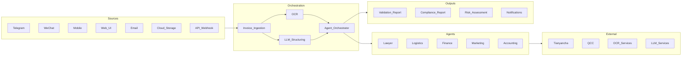

# Sinoptics AI — experience knowledge base

**Role (canonical):** DataOps / AI Platform Engineer — Sinoptics AI  
**Period:** March 2025 — October 2025 (remote)  
**Product context:** AI-assisted **invoice / document** workflows, **OCR**, **LLM** extraction, **n8n** orchestration, **Dify**-style deployments, **Yandex Cloud** automation, **Kubernetes** (**K3S**/**Rancher**) and hybrid **CI/CD**.

**Architecture reference (full text):** [system-architecture.md](repos/system-architecture.md) (copy of `D:\_sinoptics_git\system-architecture.md`)

**Companion resume template:** [Backend_Engineer_Constructor_RetailMedia_EN.md](../backend%20engineer/Backend_Engineer_Constructor_RetailMedia_EN.md)

---

## 1. Architecture poster (from system-architecture narrative)

---

## 2. Stack matrix (repo-derived)

| Area | Technologies (see per-repo manifests) |
|------|----------------------------------------|
| **Orchestration** | n8n workflows, Dify installs, Hatchet/K8s notes in resume baseline |
| **Runtime** | FastAPI, Celery, Redis, PostgreSQL, nginx, Let's Encrypt |
| **Cloud (Russia / hybrid)** | Yandex Cloud (functions, DB, Keycloak, VM Postgres), Hostinger VPS |
| **Frontend** | React/Vite-style repos (`frontend-sinoptics-ai`, `frontend-sipoptics-ru`) |
| **AI / OCR** | Dify, OCR forms pipelines, LLM connectors per `system-architecture.md` |
| **K8s** | k3s-fastapi-app, Helm-style packaging where documented |

---

## 3. Metrics and scale

- Treat **quantitative** claims (requests/day, cluster size, cost) as **unknown** unless present in a repo README or your own runbook copied into `repos/*.md`.
- The **system-architecture** document describes **qualitative** scalability (horizontal scaling, queues, caching, monitoring) — safe to discuss as **design intent**, not measured production KPIs.

---

## 4. Bullet bank (reuse per JD)

| Tags | Bullet |
|------|--------|
| `#k8s` `#aws` | Migrated **FastAPI + Celery + Redis** to **K3S (Rancher)** on **bare-metal EC2** (AWS China); hybrid **GitHub Actions → CodeCommit → CodeBuild → ECR → kubectl rollout**; secrets in **Secrets Manager**. |
| `#dify` `#postgres` | Ran **on-prem AI stack** (**Dify**, **PostgreSQL**, **nginx**, **Let's Encrypt**) with documented install automation repos. |
| `#k8s` `#ocr` | Operated **Hatchet** workflow engine on **Kubernetes** for **OCR / LLM** workloads. |
| `#architecture` | Implemented **layered microservice architecture** (orchestrator → agents → aggregator) with **RBAC**, encryption, audit logs, **GDPR / CN** compliance awareness. |
| `#n8n` | Built and maintained **n8n** workflow exports and **Codex**-assisted flow prototypes (`n8n-codex`, `n8n-flow`, `n8n-workflow-cursor`). |
| `#yandex` | Automated **Yandex Cloud** infrastructure: **Cloud Functions**, managed **PostgreSQL**, **Keycloak**, environment bundles. |
| `#frontend` | Delivered **customer-facing frontends** for AI product surfaces (`frontend-sinoptics-ai`, `frontend-sipoptics-ru`). |
| `#ocr` | Owned **OCR forms** ingestion/processing repository for structured extraction. |
| `#invoice` | Shipped **invoice bot** environment integration for **Yandex**-hosted workloads (`checkinvoice-bot-yandex-env`). |

---

## 5. Do-not-fabricate boundary

- Do not claim **Alibaba Cloud** or specific **SOC2 audit results** unless you have evidence beyond the architecture markdown narrative.
- Do not paste **live API keys**, **webhook secrets**, or **customer PII** from local `.env` files into resumes or this knowledge base.
- Distinguish **design document** (`system-architecture.md`) from **production as-built** — when uncertain, phrase as "architecture specified" not "we ran X in prod."

---

## 6. Per-repository deep dives

- [checkinvoice-bot-yandex-env.md](repos/checkinvoice-bot-yandex-env.md)
- [dify-local-install.md](repos/dify-local-install.md)
- [dify-vm-ubuntu.md](repos/dify-vm-ubuntu.md)
- [dify-workflow.md](repos/dify-workflow.md)
- [frontend-sinoptics-ai.md](repos/frontend-sinoptics-ai.md)
- [frontend-sipoptics-ru.md](repos/frontend-sipoptics-ru.md)
- [hostingervps_hermes.md](repos/hostingervps_hermes.md)
- [k3s-fastapi-app.md](repos/k3s-fastapi-app.md)
- [n8n-codex.md](repos/n8n-codex.md)
- [n8n-flow.md](repos/n8n-flow.md)
- [n8n-workflow-cursor.md](repos/n8n-workflow-cursor.md)
- [ocr_forms.md](repos/ocr_forms.md)
- [postgresql-yandex-vm.md](repos/postgresql-yandex-vm.md)
- [yandex-cloud-env.md](repos/yandex-cloud-env.md)
- [yandex-cloud-functions.md](repos/yandex-cloud-functions.md)
- [yandex-db.md](repos/yandex-db.md)
- [yandex-keycloak.md](repos/yandex-keycloak.md)
- [hh_tasks.md](repos/hh_tasks.md) — `_hh_tasks` on disk
- [system-architecture.md](repos/system-architecture.md)

---

## 7. Regenerating scans

`python resume/expirience/_generate_repo_docs.py`
