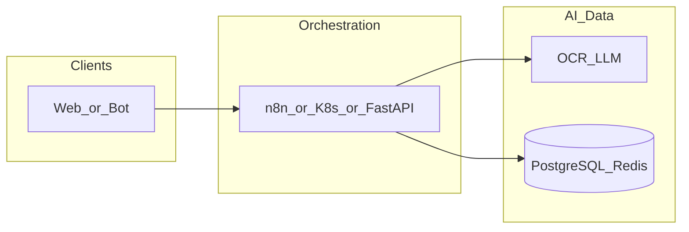

# checkinvoice-bot-yandex-env

**Path:** `D:/_sinoptics_git/checkinvoice-bot-yandex-env`  
**Category:** sinoptics-repo  
**Primary language:** Python  
**Status:** present on disk

## 1. Purpose (2-3 lines)

# 🤖 Checkinvoice Telegram Bot - Yandex Cloud Serverless

Автоматизированная настройка Telegram бота `@checkinvoice_bot` в Yandex Cloud с использованием serverless технологий.

## 2. Tech stack (from manifests and file-type mix)

- **Detected primary language:** Python
- **Top-level layout:** see listing below.

### `README.md`

```
# 🤖 Checkinvoice Telegram Bot - Yandex Cloud Serverless

Автоматизированная настройка Telegram бота `@checkinvoice_bot` в Yandex Cloud с использованием serverless технологий.

## 📋 Описание

Этот проект содержит скрипты для развёртывания Telegram бота в Yandex Cloud с использованием:

- **Yandex Cloud Functions** - serverless функция для обработки сообщений
- **Yandex API Gateway** - маршрутизация webhook запросов от Telegram
- **Yandex Object Storage** - хранилище файлов бота

## 🏗️ Архитектура

```
┌─────────────┐     ┌──────────────────┐     ┌───────────────────┐
│  Telegram   │────▶│   API Gateway    │────▶│  Cloud Function   │
│   Server    │◀────│   (webhook)      │◀────│   (Python 3.12)   │
└─────────────┘     └──────────────────┘     └───────────────────┘
                                                      │
                                                      ▼
                                            ┌───────────────────┐
                                            │  Object Storage   │
                                            │   (bucket)        │
                                            └───────────────────┘
```

## 📁 Структура проекта

```
.
├── setup.sh                    # Главный скрипт установки
├── config/
│   └── env.sh                  # Конфигурация (credentials)
├── function/
│   ├── index.py                # Код функции бота
│   └── requirements.txt        # Python зависимости
├── scripts/
│   ├── 01-install-yc-cli.sh    # Установка Yandex Cloud CLI
│   ├── 02-configure-yc.sh      # Настройка профиля
│   ├── 03-create-service-account.sh  # Создание сервисного аккаунта
│   ├── 04-create-bucket.sh     # Создание Object Storage
│   ├── 05-create-function.sh   # Создание Cloud Function
│   ├── 06-create-api-gateway.sh # Создание API Gateway
│   ├── 07-setup-telegram-webhook.sh # Настройка Telegram webhook
│   └── cleanup.sh              # Удаление всех ресурсов
└── README.md
```

## ⚙️ Конфигурация

Все настройки находятся в файле `config/env.sh`:

| Параметр | Описание |
|----------|----------|
| `YC_CLOUD_ID` | ID облака Yandex Cloud |
| `YC_FOLDER_ID` | ID каталога |
| `YC_OAUTH_TOKEN` | OAuth токен для авторизации |
| `TELEGRAM_BOT_TOKEN` | Токен Telegram бота |
| `YC_BUCKET_NAME` | Имя bucket для файлов |
| `YC_FUNCTION_NAME` | Имя Cloud Function |

## 🚀 Установка

### Требования

- Ubuntu (тестировалось на 20.04/22.04)
- curl, jq, zip (устанавливаются автоматически)
- Доступ к интернету

### Быстрый старт

```bash
# Клонируйте репозиторий
git clone <repository-url>
cd checkinvoice-bot-yandex-env

# Сделайте скрипты исполняемыми
chmod +x setup.sh scripts/*.sh

# Запустите установку
./setup.sh
```

### Пошаговая установка

Если хотите выполнить установку по шагам:

```bash
# 1. Установка Yandex Cloud CLI
./scripts/01-install-yc-cli.sh

# 2. Настройка профиля
./scripts/02-configure-yc.sh

# 3. Создание сервисного аккаунта
./scripts/03-create-service-account.sh

# 4. Создание bucket
./scripts/04-create-bucket.sh

# 5. Создание функции
./scripts/05-create-function.sh

# 6. Создание API Gat

…(truncated)…
```

### `readme.md`

```
# 🤖 Checkinvoice Telegram Bot - Yandex Cloud Serverless

Автоматизированная настройка Telegram бота `@checkinvoice_bot` в Yandex Cloud с использованием serverless технологий.

## 📋 Описание

Этот проект содержит скрипты для развёртывания Telegram бота в Yandex Cloud с использованием:

- **Yandex Cloud Functions** - serverless функция для обработки сообщений
- **Yandex API Gateway** - маршрутизация webhook запросов от Telegram
- **Yandex Object Storage** - хранилище файлов бота

## 🏗️ Архитектура

```
┌─────────────┐     ┌──────────────────┐     ┌───────────────────┐
│  Telegram   │────▶│   API Gateway    │────▶│  Cloud Function   │
│   Server    │◀────│   (webhook)      │◀────│   (Python 3.12)   │
└─────────────┘     └──────────────────┘     └───────────────────┘
                                                      │
                                                      ▼
                                            ┌───────────────────┐
                                            │  Object Storage   │
                                            │   (bucket)        │
                                            └───────────────────┘
```

## 📁 Структура проекта

```
.
├── setup.sh                    # Главный скрипт установки
├── config/
│   └── env.sh                  # Конфигурация (credentials)
├── function/
│   ├── index.py                # Код функции бота
│   └── requirements.txt        # Python зависимости
├── scripts/
│   ├── 01-install-yc-cli.sh    # Установка Yandex Cloud CLI
│   ├── 02-configure-yc.sh      # Настройка профиля
│   ├── 03-create-service-account.sh  # Создание сервисного аккаунта
│   ├── 04-create-bucket.sh     # Создание Object Storage
│   ├── 05-create-function.sh   # Создание Cloud Function
│   ├── 06-create-api-gateway.sh # Создание API Gateway
│   ├── 07-setup-telegram-webhook.sh # Настройка Telegram webhook
│   └── cleanup.sh              # Удаление всех ресурсов
└── README.md
```

## ⚙️ Конфигурация

Все настройки находятся в файле `config/env.sh`:

| Параметр | Описание |
|----------|----------|
| `YC_CLOUD_ID` | ID облака Yandex Cloud |
| `YC_FOLDER_ID` | ID каталога |
| `YC_OAUTH_TOKEN` | OAuth токен для авторизации |
| `TELEGRAM_BOT_TOKEN` | Токен Telegram бота |
| `YC_BUCKET_NAME` | Имя bucket для файлов |
| `YC_FUNCTION_NAME` | Имя Cloud Function |

## 🚀 Установка

### Требования

- Ubuntu (тестировалось на 20.04/22.04)
- curl, jq, zip (устанавливаются автоматически)
- Доступ к интернету

### Быстрый старт

```bash
# Клонируйте репозиторий
git clone <repository-url>
cd checkinvoice-bot-yandex-env

# Сделайте скрипты исполняемыми
chmod +x setup.sh scripts/*.sh

# Запустите установку
./setup.sh
```

### Пошаговая установка

Если хотите выполнить установку по шагам:

```bash
# 1. Установка Yandex Cloud CLI
./scripts/01-install-yc-cli.sh

# 2. Настройка профиля
./scripts/02-configure-yc.sh

# 3. Создание сервисного аккаунта
./scripts/03-create-service-account.sh

# 4. Создание bucket
./scripts/04-create-bucket.sh

# 5. Создание функции
./scripts/05-create-function.sh

# 6. Создание API Gat

…(truncated)…
```

### `Readme.md`

```
# 🤖 Checkinvoice Telegram Bot - Yandex Cloud Serverless

Автоматизированная настройка Telegram бота `@checkinvoice_bot` в Yandex Cloud с использованием serverless технологий.

## 📋 Описание

Этот проект содержит скрипты для развёртывания Telegram бота в Yandex Cloud с использованием:

- **Yandex Cloud Functions** - serverless функция для обработки сообщений
- **Yandex API Gateway** - маршрутизация webhook запросов от Telegram
- **Yandex Object Storage** - хранилище файлов бота

## 🏗️ Архитектура

```
┌─────────────┐     ┌──────────────────┐     ┌───────────────────┐
│  Telegram   │────▶│   API Gateway    │────▶│  Cloud Function   │
│   Server    │◀────│   (webhook)      │◀────│   (Python 3.12)   │
└─────────────┘     └──────────────────┘     └───────────────────┘
                                                      │
                                                      ▼
                                            ┌───────────────────┐
                                            │  Object Storage   │
                                            │   (bucket)        │
                                            └───────────────────┘
```

## 📁 Структура проекта

```
.
├── setup.sh                    # Главный скрипт установки
├── config/
│   └── env.sh                  # Конфигурация (credentials)
├── function/
│   ├── index.py                # Код функции бота
│   └── requirements.txt        # Python зависимости
├── scripts/
│   ├── 01-install-yc-cli.sh    # Установка Yandex Cloud CLI
│   ├── 02-configure-yc.sh      # Настройка профиля
│   ├── 03-create-service-account.sh  # Создание сервисного аккаунта
│   ├── 04-create-bucket.sh     # Создание Object Storage
│   ├── 05-create-function.sh   # Создание Cloud Function
│   ├── 06-create-api-gateway.sh # Создание API Gateway
│   ├── 07-setup-telegram-webhook.sh # Настройка Telegram webhook
│   └── cleanup.sh              # Удаление всех ресурсов
└── README.md
```

## ⚙️ Конфигурация

Все настройки находятся в файле `config/env.sh`:

| Параметр | Описание |
|----------|----------|
| `YC_CLOUD_ID` | ID облака Yandex Cloud |
| `YC_FOLDER_ID` | ID каталога |
| `YC_OAUTH_TOKEN` | OAuth токен для авторизации |
| `TELEGRAM_BOT_TOKEN` | Токен Telegram бота |
| `YC_BUCKET_NAME` | Имя bucket для файлов |
| `YC_FUNCTION_NAME` | Имя Cloud Function |

## 🚀 Установка

### Требования

- Ubuntu (тестировалось на 20.04/22.04)
- curl, jq, zip (устанавливаются автоматически)
- Доступ к интернету

### Быстрый старт

```bash
# Клонируйте репозиторий
git clone <repository-url>
cd checkinvoice-bot-yandex-env

# Сделайте скрипты исполняемыми
chmod +x setup.sh scripts/*.sh

# Запустите установку
./setup.sh
```

### Пошаговая установка

Если хотите выполнить установку по шагам:

```bash
# 1. Установка Yandex Cloud CLI
./scripts/01-install-yc-cli.sh

# 2. Настройка профиля
./scripts/02-configure-yc.sh

# 3. Создание сервисного аккаунта
./scripts/03-create-service-account.sh

# 4. Создание bucket
./scripts/04-create-bucket.sh

# 5. Создание функции
./scripts/05-create-function.sh

# 6. Создание API Gat

…(truncated)…
```


## 3. Architecture



- **Inbound:** HTTP (API Gateway / ALB), scheduled triggers, queues (SQS/SNS), EventBridge rules, or batch — infer from `stacks/`, `template.yaml`, `sst.config.ts`, or `src/` handlers.
- **Outbound:** databases and external HTTP APIs per layers and `package.json` / Python imports in handlers.
- **IaC pattern:** SST/CDK, SAM/CloudFormation, Pulumi, Helm, Terraform, or raw scripts — see manifests section.

## 4. Key files (auto-discovered)

- **Top-level entries:**

```
.gitignore
.vscode
README.md
config
function
scripts
setup.sh
```

## 5. My contribution / role (evidence from git history — if available)

```text
ef70d4b 2025-12-02 chore: deploy
2cef4ec 2025-12-02 chore: deploy
9a52ffb 2025-12-02 Install YC CLI to home dir
d89a078 2025-12-02 Add VS Code tasks
36f5004 2025-12-02 Update
```

_Use commit messages only as hints; corroborate in interviews._

## 6. Notable patterns / snippets

_No snippet candidates matched (handler.py / stack.ts / template.yaml etc.). Expand manually after opening the repo._

## 7. Metrics / SLO / scale (if available)

_Extract from Airflow DAG params, load tests, README, or CloudFormation `ReservedConcurrentExecutions` when present — not auto-inferred to avoid fabrication._

## 8. Resume bullets (ready-to-paste, English)

- Owned or extended **`checkinvoice-bot-yandex-env`** capabilities aligned with **sinoptics repo** delivery.
- Applied **Python** stack patterns and repository-local IaC/config where present.
- Collaborated on production-grade defaults: structured logging, retries, and least-privilege IAM patterns where applicable.
- Integrated with **Sinoptics** platform services (data stores, queues, gateways) per dependency manifests in-repo.
- Documented operational expectations (deploy, test, local dev) via README and automation files when available.

## 9. Interview talking points

- What is the main entrypoint and trigger for `checkinvoice-bot-yandex-env`?
- How are secrets and non-prod environments separated?
- What failure modes are handled (retries, DLQ, idempotency)?
- How would you observe this service in production (metrics, logs, traces)?
