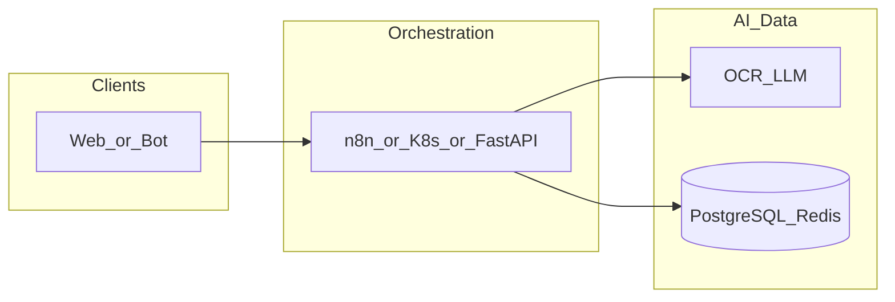

# dify-local-install

**Path:** `D:/_sinoptics_git/dify-local-install`  
**Category:** sinoptics-repo  
**Primary language:** YAML  
**Status:** present on disk

## 1. Purpose (2-3 lines)

# Dify Local Install (Windows 11)

This repository packages the official [Dify](https://github.com/langgenius/dify) Docker stack so it can be run locally on Windows 11 with Docker Desktop and WSL2. Follow the steps below to bring the platform up, sign in, and keep it running.

## 2. Tech stack (from manifests and file-type mix)

- **Detected primary language:** YAML
- **Top-level layout:** see listing below.

### `README.md`

```
# Dify Local Install (Windows 11)

This repository packages the official [Dify](https://github.com/langgenius/dify) Docker stack so it can be run locally on Windows 11 with Docker Desktop and WSL2. Follow the steps below to bring the platform up, sign in, and keep it running.

## Prerequisites

- Windows 11 with administrator access
- Windows Subsystem for Linux 2 (WSL2) with Ubuntu 22.04 installed (`wsl --install -d Ubuntu-22.04`), and the distribution configured for Docker Desktop integration
- Docker Desktop for Windows (WSL 2 based engine enabled, at least 4 CPU / 8 GB RAM allocated)
- Git for cloning/pulling this repo
- PowerShell 7+ (recommended) or Windows Terminal

## 1. Clone the repository

```powershell
cd D:\_sinoptics_git
git clone git@github-sinoptics:SinopticsAI/dify-local-install.git
cd dify-local-install
```

If Git warns about "dubious ownership" you can mark the directory as trusted:

```powershell
git config --global --add safe.directory D:/_sinoptics_git/dify-local-install
```

## 2. Configure environment variables

All runtime settings live in `docker/.env`. Start from the template:

```powershell
Copy-Item docker/.env.example docker/.env -Force
```

Then set the required secrets. Two critical values are:

- `SECRET_KEY` – 64+ random characters; you can generate one with PowerShell:
  ```powershell
  $secret = [Convert]::ToBase64String((1..48 | ForEach-Object { Get-Random -Maximum 256 }))
  (Get-Content docker/.env) -replace '^SECRET_KEY=.*', "SECRET_KEY=$secret" | Set-Content docker/.env
  ```
- `INIT_PASSWORD` – this becomes the bootstrap admin password you will use on first login. Choose a strong one and update the `INIT_PASSWORD=` line.

While editing `docker/.env` you can also set the public URLs the stack should advertise. For a pure localhost setup the following values work well:

```
CONSOLE_WEB_URL=http://localhost:3000
CONSOLE_API_URL=http://localhost:3000
SERVICE_API_URL=http://localhost:5001
APP_WEB_URL=http://localhost
APP_API_URL=http://localhost/v1
FILES_URL=http://localhost
INTERNAL_FILES_URL=http://api:5001
```

If you plan to expose Dify through ngrok or another reverse proxy, come back later and adjust these URLs to the external endpoint before restarting the stack.

> ⚠️ Do not commit `docker/.env`. It contains secrets and machine-specific settings.

## 3. Prepare persistent volume folders (optional)

The compose file mounts `docker/volumes/**` to persist PostgreSQL, Redis, uploaded files, sandbox dependencies, etc. These directories are created automatically on first start, but you can create them up front if you prefer predictable permissions:

```powershell
New-Item -ItemType Directory -Force -Path `
  docker/volumes/app/storage, `
  docker/volumes/db/data, `
  docker/volumes/redis/data, `
  docker/volumes/sandbox/dependencies, `
  docker/volumes/sandbox/conf, `
  docker/volumes/plugin_daemon, `
  docker/volumes/certbot/conf, `
  docker/volumes/certbot/logs, `
  docker/volumes/certbot/www
```

The repository already includes the sandbox configuration file in `docker/volumes/sandbox/conf/config.yaml`, so 

…(truncated)…
```

### `readme.md`

```
# Dify Local Install (Windows 11)

This repository packages the official [Dify](https://github.com/langgenius/dify) Docker stack so it can be run locally on Windows 11 with Docker Desktop and WSL2. Follow the steps below to bring the platform up, sign in, and keep it running.

## Prerequisites

- Windows 11 with administrator access
- Windows Subsystem for Linux 2 (WSL2) with Ubuntu 22.04 installed (`wsl --install -d Ubuntu-22.04`), and the distribution configured for Docker Desktop integration
- Docker Desktop for Windows (WSL 2 based engine enabled, at least 4 CPU / 8 GB RAM allocated)
- Git for cloning/pulling this repo
- PowerShell 7+ (recommended) or Windows Terminal

## 1. Clone the repository

```powershell
cd D:\_sinoptics_git
git clone git@github-sinoptics:SinopticsAI/dify-local-install.git
cd dify-local-install
```

If Git warns about "dubious ownership" you can mark the directory as trusted:

```powershell
git config --global --add safe.directory D:/_sinoptics_git/dify-local-install
```

## 2. Configure environment variables

All runtime settings live in `docker/.env`. Start from the template:

```powershell
Copy-Item docker/.env.example docker/.env -Force
```

Then set the required secrets. Two critical values are:

- `SECRET_KEY` – 64+ random characters; you can generate one with PowerShell:
  ```powershell
  $secret = [Convert]::ToBase64String((1..48 | ForEach-Object { Get-Random -Maximum 256 }))
  (Get-Content docker/.env) -replace '^SECRET_KEY=.*', "SECRET_KEY=$secret" | Set-Content docker/.env
  ```
- `INIT_PASSWORD` – this becomes the bootstrap admin password you will use on first login. Choose a strong one and update the `INIT_PASSWORD=` line.

While editing `docker/.env` you can also set the public URLs the stack should advertise. For a pure localhost setup the following values work well:

```
CONSOLE_WEB_URL=http://localhost:3000
CONSOLE_API_URL=http://localhost:3000
SERVICE_API_URL=http://localhost:5001
APP_WEB_URL=http://localhost
APP_API_URL=http://localhost/v1
FILES_URL=http://localhost
INTERNAL_FILES_URL=http://api:5001
```

If you plan to expose Dify through ngrok or another reverse proxy, come back later and adjust these URLs to the external endpoint before restarting the stack.

> ⚠️ Do not commit `docker/.env`. It contains secrets and machine-specific settings.

## 3. Prepare persistent volume folders (optional)

The compose file mounts `docker/volumes/**` to persist PostgreSQL, Redis, uploaded files, sandbox dependencies, etc. These directories are created automatically on first start, but you can create them up front if you prefer predictable permissions:

```powershell
New-Item -ItemType Directory -Force -Path `
  docker/volumes/app/storage, `
  docker/volumes/db/data, `
  docker/volumes/redis/data, `
  docker/volumes/sandbox/dependencies, `
  docker/volumes/sandbox/conf, `
  docker/volumes/plugin_daemon, `
  docker/volumes/certbot/conf, `
  docker/volumes/certbot/logs, `
  docker/volumes/certbot/www
```

The repository already includes the sandbox configuration file in `docker/volumes/sandbox/conf/config.yaml`, so 

…(truncated)…
```

### `Readme.md`

```
# Dify Local Install (Windows 11)

This repository packages the official [Dify](https://github.com/langgenius/dify) Docker stack so it can be run locally on Windows 11 with Docker Desktop and WSL2. Follow the steps below to bring the platform up, sign in, and keep it running.

## Prerequisites

- Windows 11 with administrator access
- Windows Subsystem for Linux 2 (WSL2) with Ubuntu 22.04 installed (`wsl --install -d Ubuntu-22.04`), and the distribution configured for Docker Desktop integration
- Docker Desktop for Windows (WSL 2 based engine enabled, at least 4 CPU / 8 GB RAM allocated)
- Git for cloning/pulling this repo
- PowerShell 7+ (recommended) or Windows Terminal

## 1. Clone the repository

```powershell
cd D:\_sinoptics_git
git clone git@github-sinoptics:SinopticsAI/dify-local-install.git
cd dify-local-install
```

If Git warns about "dubious ownership" you can mark the directory as trusted:

```powershell
git config --global --add safe.directory D:/_sinoptics_git/dify-local-install
```

## 2. Configure environment variables

All runtime settings live in `docker/.env`. Start from the template:

```powershell
Copy-Item docker/.env.example docker/.env -Force
```

Then set the required secrets. Two critical values are:

- `SECRET_KEY` – 64+ random characters; you can generate one with PowerShell:
  ```powershell
  $secret = [Convert]::ToBase64String((1..48 | ForEach-Object { Get-Random -Maximum 256 }))
  (Get-Content docker/.env) -replace '^SECRET_KEY=.*', "SECRET_KEY=$secret" | Set-Content docker/.env
  ```
- `INIT_PASSWORD` – this becomes the bootstrap admin password you will use on first login. Choose a strong one and update the `INIT_PASSWORD=` line.

While editing `docker/.env` you can also set the public URLs the stack should advertise. For a pure localhost setup the following values work well:

```
CONSOLE_WEB_URL=http://localhost:3000
CONSOLE_API_URL=http://localhost:3000
SERVICE_API_URL=http://localhost:5001
APP_WEB_URL=http://localhost
APP_API_URL=http://localhost/v1
FILES_URL=http://localhost
INTERNAL_FILES_URL=http://api:5001
```

If you plan to expose Dify through ngrok or another reverse proxy, come back later and adjust these URLs to the external endpoint before restarting the stack.

> ⚠️ Do not commit `docker/.env`. It contains secrets and machine-specific settings.

## 3. Prepare persistent volume folders (optional)

The compose file mounts `docker/volumes/**` to persist PostgreSQL, Redis, uploaded files, sandbox dependencies, etc. These directories are created automatically on first start, but you can create them up front if you prefer predictable permissions:

```powershell
New-Item -ItemType Directory -Force -Path `
  docker/volumes/app/storage, `
  docker/volumes/db/data, `
  docker/volumes/redis/data, `
  docker/volumes/sandbox/dependencies, `
  docker/volumes/sandbox/conf, `
  docker/volumes/plugin_daemon, `
  docker/volumes/certbot/conf, `
  docker/volumes/certbot/logs, `
  docker/volumes/certbot/www
```

The repository already includes the sandbox configuration file in `docker/volumes/sandbox/conf/config.yaml`, so 

…(truncated)…
```


## 3. Architecture



- **Inbound:** HTTP (API Gateway / ALB), scheduled triggers, queues (SQS/SNS), EventBridge rules, or batch — infer from `stacks/`, `template.yaml`, `sst.config.ts`, or `src/` handlers.
- **Outbound:** databases and external HTTP APIs per layers and `package.json` / Python imports in handlers.
- **IaC pattern:** SST/CDK, SAM/CloudFormation, Pulumi, Helm, Terraform, or raw scripts — see manifests section.

## 4. Key files (auto-discovered)

- **Top-level entries:**

```
.gitignore
INSTALL-PLUGIN-README.md
MANUAL-NGROK-BYPASS.md
README.md
RESTART-GUIDE.md
check-ngrok-status.ps1
diagnose-docker.ps1
docker
fix-docker-wsl.ps1
fix-localhost-80.ps1
fix-ngrok-3004-error.ps1
fix-ngrok-warning.ps1
install-plugin.bat
install-webhook-plugin.ps1
remove-ngrok-warning.ps1
restart-all.bat
restart-all.ps1
restart-dify.bat
restart-dify.ps1
restart-ngrok-with-bypass.ps1
restart-ngrok.ps1
setup-telegram-webhook.ps1
start-docker-and-dify.bat
start-docker-and-dify.ps1
start-ngrok-with-bypass.bat
token
update-dify-urls.ps1
webhook-0.5.1-telegram.difypkg
```

## 5. My contribution / role (evidence from git history — if available)

```text
2412079 2025-11-11 restart docker
7004686 2025-11-06 telegram middleware
d2a9777 2025-11-05 add telegram webhook middleware
2c94eae 2025-11-04 webhook plugin
5d8ca99 2025-11-04 second
65eae2b 2025-11-04 first
```

_Use commit messages only as hints; corroborate in interviews._

## 6. Notable patterns / snippets

_No snippet candidates matched (handler.py / stack.ts / template.yaml etc.). Expand manually after opening the repo._

## 7. Metrics / SLO / scale (if available)

_Extract from Airflow DAG params, load tests, README, or CloudFormation `ReservedConcurrentExecutions` when present — not auto-inferred to avoid fabrication._

## 8. Resume bullets (ready-to-paste, English)

- Owned or extended **`dify-local-install`** capabilities aligned with **sinoptics repo** delivery.
- Applied **YAML** stack patterns and repository-local IaC/config where present.
- Collaborated on production-grade defaults: structured logging, retries, and least-privilege IAM patterns where applicable.
- Integrated with **Sinoptics** platform services (data stores, queues, gateways) per dependency manifests in-repo.
- Documented operational expectations (deploy, test, local dev) via README and automation files when available.

## 9. Interview talking points

- What is the main entrypoint and trigger for `dify-local-install`?
- How are secrets and non-prod environments separated?
- What failure modes are handled (retries, DLQ, idempotency)?
- How would you observe this service in production (metrics, logs, traces)?
