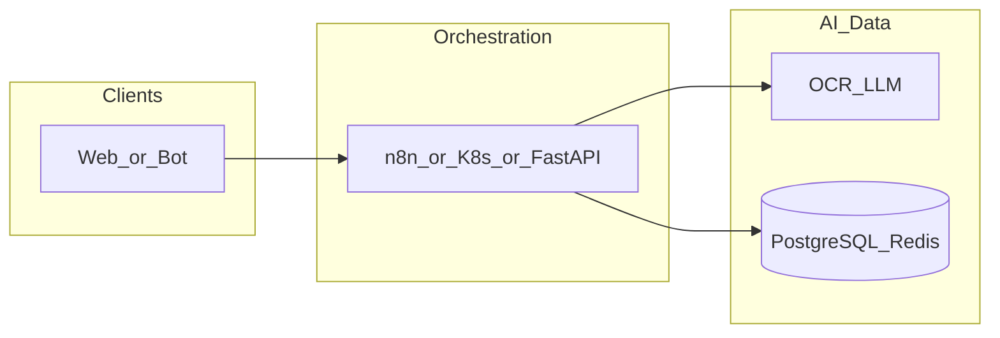

# dify-vm-ubuntu

**Path:** `D:/_sinoptics_git/dify-vm-ubuntu`  
**Category:** sinoptics-repo  
**Primary language:** Unknown  
**Status:** present on disk

## 1. Purpose (2-3 lines)

# Dify VM Ubuntu Installer

This repository ships a single entrypoint script, `install-dify.sh`, which prepares an Ubuntu-based virtual machine with the latest Dify release (`v1.10.1 – Multi-Database Era Begins`) announced on 26 Nov 2025 and starts the full Docker stack in one pass. See the [official release notes](https://github.com/langgenius/dify/releases) for the full changelog.

## 2. Tech stack (from manifests and file-type mix)

- **Detected primary language:** Unknown
- **Top-level layout:** see listing below.

### `README.md`

```
# Dify VM Ubuntu Installer

This repository ships a single entrypoint script, `install-dify.sh`, which prepares an Ubuntu-based virtual machine with the latest Dify release (`v1.10.1 – Multi-Database Era Begins`) announced on 26 Nov 2025 and starts the full Docker stack in one pass. See the [official release notes](https://github.com/langgenius/dify/releases) for the full changelog.

## Prerequisites

- Ubuntu 22.04 LTS or newer (root or sudo access required).
- Outbound internet access to GitHub and Docker Hub.
- At least 4 vCPUs, 8 GB RAM, and 40 GB free disk space for containers and volumes.

## Quick start

```bash
chmod +x install-dify.sh
sudo ./install-dify.sh
```

The defaults install into `/opt/dify`, keep PostgreSQL as the application database, and immediately run `docker compose up -d`. Once the containers finish booting, Dify will be available at `http://<server-ip>:3000`.

### Useful flags

| Flag | Description |
| --- | --- |
| `-d, --dir` | Override install directory (default `/opt/dify`). |
| `-v, --version` | Deploy a different git tag or branch (default `v1.10.1`). |
| `-b, --db` | Choose `postgresql`, `mysql`, or `oceanbase` to update `docker/.env`. |
| `--skip-docker` | Reuse an existing Docker Engine installation. |
| `--skip-stack` | Prepare files but defer `docker compose up -d`. |

When switching to MySQL or OceanBase, be sure to set the corresponding connection details in `docker/.env` before starting the stack; the script only updates the `DB_TYPE` key.

## Public domain configuration

After the stack is running, execute `configure-dify-domain.sh` to bind it to `dify.sinoptics.ru` (or any other FQDN) and provision a Let's Encrypt certificate through the bundled certbot profile:

```bash
sudo ./configure-dify-domain.sh \
  --domain dify.sinoptics.ru \
  --email admin@sinoptics.ru
```

What the helper does:

- Writes all required URLs, cookie domains, and nginx options into `docker/.env`.
- Enables the ACME challenge location, recreates the nginx container, and (optionally) requests/renews the certificate.
- Re-runs nginx with HTTPS enabled once the certificate is present.

If you skip the `--email` flag, add `--skip-certbot` and handle TLS yourself by placing the cert/key under `docker/nginx/ssl` or `docker/volumes/certbot/conf/live/<domain>`.

## Data directories

The Docker Compose project stores persistent volumes under `docker/volumes` inside the install directory. Back up this path before re-running the installer or destroying the VM to keep your data.

## Troubleshooting

1. **Docker group membership** – If you run the installer via `sudo`, your user is added to the `docker` group automatically. Log out and back in to refresh permissions.
2. **Ports already in use** – Stop conflicting services that bind to 3000 (web) or 5001 (API) before launching the stack.
3. **Re-running the script** – Subsequent runs will `git fetch` and `checkout` the specified tag without deleting existing volumes, so it is safe to upgrade within the same VM.

For issues directly related to the Dify application, consult the upstream documentation or open an issue

…(truncated)…
```

### `readme.md`

```
# Dify VM Ubuntu Installer

This repository ships a single entrypoint script, `install-dify.sh`, which prepares an Ubuntu-based virtual machine with the latest Dify release (`v1.10.1 – Multi-Database Era Begins`) announced on 26 Nov 2025 and starts the full Docker stack in one pass. See the [official release notes](https://github.com/langgenius/dify/releases) for the full changelog.

## Prerequisites

- Ubuntu 22.04 LTS or newer (root or sudo access required).
- Outbound internet access to GitHub and Docker Hub.
- At least 4 vCPUs, 8 GB RAM, and 40 GB free disk space for containers and volumes.

## Quick start

```bash
chmod +x install-dify.sh
sudo ./install-dify.sh
```

The defaults install into `/opt/dify`, keep PostgreSQL as the application database, and immediately run `docker compose up -d`. Once the containers finish booting, Dify will be available at `http://<server-ip>:3000`.

### Useful flags

| Flag | Description |
| --- | --- |
| `-d, --dir` | Override install directory (default `/opt/dify`). |
| `-v, --version` | Deploy a different git tag or branch (default `v1.10.1`). |
| `-b, --db` | Choose `postgresql`, `mysql`, or `oceanbase` to update `docker/.env`. |
| `--skip-docker` | Reuse an existing Docker Engine installation. |
| `--skip-stack` | Prepare files but defer `docker compose up -d`. |

When switching to MySQL or OceanBase, be sure to set the corresponding connection details in `docker/.env` before starting the stack; the script only updates the `DB_TYPE` key.

## Public domain configuration

After the stack is running, execute `configure-dify-domain.sh` to bind it to `dify.sinoptics.ru` (or any other FQDN) and provision a Let's Encrypt certificate through the bundled certbot profile:

```bash
sudo ./configure-dify-domain.sh \
  --domain dify.sinoptics.ru \
  --email admin@sinoptics.ru
```

What the helper does:

- Writes all required URLs, cookie domains, and nginx options into `docker/.env`.
- Enables the ACME challenge location, recreates the nginx container, and (optionally) requests/renews the certificate.
- Re-runs nginx with HTTPS enabled once the certificate is present.

If you skip the `--email` flag, add `--skip-certbot` and handle TLS yourself by placing the cert/key under `docker/nginx/ssl` or `docker/volumes/certbot/conf/live/<domain>`.

## Data directories

The Docker Compose project stores persistent volumes under `docker/volumes` inside the install directory. Back up this path before re-running the installer or destroying the VM to keep your data.

## Troubleshooting

1. **Docker group membership** – If you run the installer via `sudo`, your user is added to the `docker` group automatically. Log out and back in to refresh permissions.
2. **Ports already in use** – Stop conflicting services that bind to 3000 (web) or 5001 (API) before launching the stack.
3. **Re-running the script** – Subsequent runs will `git fetch` and `checkout` the specified tag without deleting existing volumes, so it is safe to upgrade within the same VM.

For issues directly related to the Dify application, consult the upstream documentation or open an issue

…(truncated)…
```

### `Readme.md`

```
# Dify VM Ubuntu Installer

This repository ships a single entrypoint script, `install-dify.sh`, which prepares an Ubuntu-based virtual machine with the latest Dify release (`v1.10.1 – Multi-Database Era Begins`) announced on 26 Nov 2025 and starts the full Docker stack in one pass. See the [official release notes](https://github.com/langgenius/dify/releases) for the full changelog.

## Prerequisites

- Ubuntu 22.04 LTS or newer (root or sudo access required).
- Outbound internet access to GitHub and Docker Hub.
- At least 4 vCPUs, 8 GB RAM, and 40 GB free disk space for containers and volumes.

## Quick start

```bash
chmod +x install-dify.sh
sudo ./install-dify.sh
```

The defaults install into `/opt/dify`, keep PostgreSQL as the application database, and immediately run `docker compose up -d`. Once the containers finish booting, Dify will be available at `http://<server-ip>:3000`.

### Useful flags

| Flag | Description |
| --- | --- |
| `-d, --dir` | Override install directory (default `/opt/dify`). |
| `-v, --version` | Deploy a different git tag or branch (default `v1.10.1`). |
| `-b, --db` | Choose `postgresql`, `mysql`, or `oceanbase` to update `docker/.env`. |
| `--skip-docker` | Reuse an existing Docker Engine installation. |
| `--skip-stack` | Prepare files but defer `docker compose up -d`. |

When switching to MySQL or OceanBase, be sure to set the corresponding connection details in `docker/.env` before starting the stack; the script only updates the `DB_TYPE` key.

## Public domain configuration

After the stack is running, execute `configure-dify-domain.sh` to bind it to `dify.sinoptics.ru` (or any other FQDN) and provision a Let's Encrypt certificate through the bundled certbot profile:

```bash
sudo ./configure-dify-domain.sh \
  --domain dify.sinoptics.ru \
  --email admin@sinoptics.ru
```

What the helper does:

- Writes all required URLs, cookie domains, and nginx options into `docker/.env`.
- Enables the ACME challenge location, recreates the nginx container, and (optionally) requests/renews the certificate.
- Re-runs nginx with HTTPS enabled once the certificate is present.

If you skip the `--email` flag, add `--skip-certbot` and handle TLS yourself by placing the cert/key under `docker/nginx/ssl` or `docker/volumes/certbot/conf/live/<domain>`.

## Data directories

The Docker Compose project stores persistent volumes under `docker/volumes` inside the install directory. Back up this path before re-running the installer or destroying the VM to keep your data.

## Troubleshooting

1. **Docker group membership** – If you run the installer via `sudo`, your user is added to the `docker` group automatically. Log out and back in to refresh permissions.
2. **Ports already in use** – Stop conflicting services that bind to 3000 (web) or 5001 (API) before launching the stack.
3. **Re-running the script** – Subsequent runs will `git fetch` and `checkout` the specified tag without deleting existing volumes, so it is safe to upgrade within the same VM.

For issues directly related to the Dify application, consult the upstream documentation or open an issue

…(truncated)…
```


## 3. Architecture



- **Inbound:** HTTP (API Gateway / ALB), scheduled triggers, queues (SQS/SNS), EventBridge rules, or batch — infer from `stacks/`, `template.yaml`, `sst.config.ts`, or `src/` handlers.
- **Outbound:** databases and external HTTP APIs per layers and `package.json` / Python imports in handlers.
- **IaC pattern:** SST/CDK, SAM/CloudFormation, Pulumi, Helm, Terraform, or raw scripts — see manifests section.

## 4. Key files (auto-discovered)

- **Top-level entries:**

```
.cursor
.vscode
README.md
configure-dify-domain.sh
install-dify.sh
list
renew-wildcard-cert.sh
setup-host-nginx.sh
setup-yc-dns-auth.sh
```

## 5. My contribution / role (evidence from git history — if available)

```text
4183546 2025-12-04 chore: deploy
c32b790 2025-11-28 chore: deploy
6fcc08d 2025-11-28 chore: deploy
3f10bd9 2025-11-28 chore: deploy
76f5ecc 2025-11-28 chore: deploy
ae3f297 2025-11-28 chore: deploy
5d4c822 2025-11-27 chore: deploy
cdfc189 2025-11-27 chore: hard reset remote repo before deploy
```

_Use commit messages only as hints; corroborate in interviews._

## 6. Notable patterns / snippets

_No snippet candidates matched (handler.py / stack.ts / template.yaml etc.). Expand manually after opening the repo._

## 7. Metrics / SLO / scale (if available)

_Extract from Airflow DAG params, load tests, README, or CloudFormation `ReservedConcurrentExecutions` when present — not auto-inferred to avoid fabrication._

## 8. Resume bullets (ready-to-paste, English)

- Owned or extended **`dify-vm-ubuntu`** capabilities aligned with **sinoptics repo** delivery.
- Applied **Unknown** stack patterns and repository-local IaC/config where present.
- Collaborated on production-grade defaults: structured logging, retries, and least-privilege IAM patterns where applicable.
- Integrated with **Sinoptics** platform services (data stores, queues, gateways) per dependency manifests in-repo.
- Documented operational expectations (deploy, test, local dev) via README and automation files when available.

## 9. Interview talking points

- What is the main entrypoint and trigger for `dify-vm-ubuntu`?
- How are secrets and non-prod environments separated?
- What failure modes are handled (retries, DLQ, idempotency)?
- How would you observe this service in production (metrics, logs, traces)?
