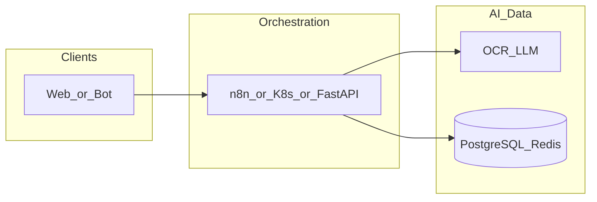

# dify-workflow

**Path:** `D:/_sinoptics_git/dify-workflow`  
**Category:** sinoptics-repo  
**Primary language:** Python  
**Status:** present on disk

## 1. Purpose (2-3 lines)

# dify-workflow

Dify workflow definitions for the Telegram supplier due diligence system.

## 2. Tech stack (from manifests and file-type mix)

- **Detected primary language:** Python
- **Top-level layout:** see listing below.

### `README.md`

```
# dify-workflow

Dify workflow definitions for the Telegram supplier due diligence system.

## 🚀 Quick Start

### Import the Workflow

1. Open your Dify Studio
2. Click **Create** → **Import DSL**
3. Select: `workflows/telegram_supplier_due_diligence_FIXED.yml`
4. Click Import

## 📁 Files

### Workflows

- **`workflows/telegram_supplier_due_diligence_FIXED.yml`** - Main workflow (Dify App format v0.4.0)
- **`workflows/telegram_supplier_due_diligence_FIXED.json`** - Alternative JSON format
- **`workflows/DEMO_worked_workflow.yml`** - Reference example from Dify

### Documentation

- **`FIX_SUMMARY.md`** - Detailed explanation of the DSL format issue and fix
- **`STRUCTURE_COMPARISON.md`** - Comparison between wrong and correct formats
- **`README_IMPORT.md`** - Quick import guide
- **`DEBUG_CHECKLIST.md`** - Troubleshooting guide
- **`TROUBLESHOOTING.md`** - Common issues and solutions

### Tools

- **`convert_to_dify_format.py`** - Convert workflows to correct Dify app format
- **`compare_format.py`** - Compare workflow structures to find differences

## 📊 Workflow Overview

**Telegram Supplier Due Diligence Workflow**

A comprehensive webhook-triggered workflow that:

1. **Receives** Telegram attachments (images, PDFs, GIFs)
2. **Downloads** files from Telegram API
3. **Extracts** text via OCR (Vision AI) or PDF parsing
4. **Parses** invoice data with LLM
5. **Validates** supplier via Qichacha API
6. **Analyzes** through 5 parallel microservice agents:
   - Lawyer/Compliance Agent
   - Logistics Agent
   - Finance Agent
   - Marketing & Export Agent
   - Accounting Agent
7. **Orchestrates** findings with AI
8. **Returns** comprehensive validation report

**Stats:**
- 24 Nodes
- 34 Edges
- Multi-agent architecture
- Parallel processing
- Full due diligence automation

## 🔧 Technical Details

- **Format**: Dify App DSL v0.4.0
- **Type**: Workflow (webhook-triggered)
- **Mode**: `workflow`
- **Features**: File upload, OCR, LLM, HTTP requests, parallel execution

## 🎯 What Was Fixed

The original workflows used the wrong DSL format (`kind: workflow` v0.3). They have been converted to the correct Dify App format (`kind: app` v0.4.0) with proper structure:

- ✅ `app:` section with metadata
- ✅ `workflow:` wrapper for graph
- ✅ Complete `features` configuration
- ✅ Proper version (0.4.0)
- ✅ Correct kind (`app`)

See `FIX_SUMMARY.md` for detailed explanation.

## 🛠️ Development

### Convert Other Workflows

If you need to convert workflows from the old format:

```bash
python convert_to_dify_format.py
```

### Compare Formats

To compare workflow structures:

```bash
python compare_format.py
```

## 📝 Git Tasks

**Clone the repo**
- `git clone git@github.com:SinopticsAI/dify-workflow.git`
- If your environment still uses the `github-sinoptics` SSH alias, run `.\git_sinoptics\connect-repo.ps1` for guided setup.

**Push your changes**
- Run `.\git_sinoptics\push-to-github.ps1 -Message "meaningful commit message"`
- The task stages all changes, creates the commit, and pushes to your current branch.

For more connection details, see [git_sinoptics/CONNECT.md](git_sinoptics/CONNECT.md).

## 📚 Resources

- [Dify Documentation](https:

…(truncated)…
```

### `readme.md`

```
# dify-workflow

Dify workflow definitions for the Telegram supplier due diligence system.

## 🚀 Quick Start

### Import the Workflow

1. Open your Dify Studio
2. Click **Create** → **Import DSL**
3. Select: `workflows/telegram_supplier_due_diligence_FIXED.yml`
4. Click Import

## 📁 Files

### Workflows

- **`workflows/telegram_supplier_due_diligence_FIXED.yml`** - Main workflow (Dify App format v0.4.0)
- **`workflows/telegram_supplier_due_diligence_FIXED.json`** - Alternative JSON format
- **`workflows/DEMO_worked_workflow.yml`** - Reference example from Dify

### Documentation

- **`FIX_SUMMARY.md`** - Detailed explanation of the DSL format issue and fix
- **`STRUCTURE_COMPARISON.md`** - Comparison between wrong and correct formats
- **`README_IMPORT.md`** - Quick import guide
- **`DEBUG_CHECKLIST.md`** - Troubleshooting guide
- **`TROUBLESHOOTING.md`** - Common issues and solutions

### Tools

- **`convert_to_dify_format.py`** - Convert workflows to correct Dify app format
- **`compare_format.py`** - Compare workflow structures to find differences

## 📊 Workflow Overview

**Telegram Supplier Due Diligence Workflow**

A comprehensive webhook-triggered workflow that:

1. **Receives** Telegram attachments (images, PDFs, GIFs)
2. **Downloads** files from Telegram API
3. **Extracts** text via OCR (Vision AI) or PDF parsing
4. **Parses** invoice data with LLM
5. **Validates** supplier via Qichacha API
6. **Analyzes** through 5 parallel microservice agents:
   - Lawyer/Compliance Agent
   - Logistics Agent
   - Finance Agent
   - Marketing & Export Agent
   - Accounting Agent
7. **Orchestrates** findings with AI
8. **Returns** comprehensive validation report

**Stats:**
- 24 Nodes
- 34 Edges
- Multi-agent architecture
- Parallel processing
- Full due diligence automation

## 🔧 Technical Details

- **Format**: Dify App DSL v0.4.0
- **Type**: Workflow (webhook-triggered)
- **Mode**: `workflow`
- **Features**: File upload, OCR, LLM, HTTP requests, parallel execution

## 🎯 What Was Fixed

The original workflows used the wrong DSL format (`kind: workflow` v0.3). They have been converted to the correct Dify App format (`kind: app` v0.4.0) with proper structure:

- ✅ `app:` section with metadata
- ✅ `workflow:` wrapper for graph
- ✅ Complete `features` configuration
- ✅ Proper version (0.4.0)
- ✅ Correct kind (`app`)

See `FIX_SUMMARY.md` for detailed explanation.

## 🛠️ Development

### Convert Other Workflows

If you need to convert workflows from the old format:

```bash
python convert_to_dify_format.py
```

### Compare Formats

To compare workflow structures:

```bash
python compare_format.py
```

## 📝 Git Tasks

**Clone the repo**
- `git clone git@github.com:SinopticsAI/dify-workflow.git`
- If your environment still uses the `github-sinoptics` SSH alias, run `.\git_sinoptics\connect-repo.ps1` for guided setup.

**Push your changes**
- Run `.\git_sinoptics\push-to-github.ps1 -Message "meaningful commit message"`
- The task stages all changes, creates the commit, and pushes to your current branch.

For more connection details, see [git_sinoptics/CONNECT.md](git_sinoptics/CONNECT.md).

## 📚 Resources

- [Dify Documentation](https:

…(truncated)…
```

### `Readme.md`

```
# dify-workflow

Dify workflow definitions for the Telegram supplier due diligence system.

## 🚀 Quick Start

### Import the Workflow

1. Open your Dify Studio
2. Click **Create** → **Import DSL**
3. Select: `workflows/telegram_supplier_due_diligence_FIXED.yml`
4. Click Import

## 📁 Files

### Workflows

- **`workflows/telegram_supplier_due_diligence_FIXED.yml`** - Main workflow (Dify App format v0.4.0)
- **`workflows/telegram_supplier_due_diligence_FIXED.json`** - Alternative JSON format
- **`workflows/DEMO_worked_workflow.yml`** - Reference example from Dify

### Documentation

- **`FIX_SUMMARY.md`** - Detailed explanation of the DSL format issue and fix
- **`STRUCTURE_COMPARISON.md`** - Comparison between wrong and correct formats
- **`README_IMPORT.md`** - Quick import guide
- **`DEBUG_CHECKLIST.md`** - Troubleshooting guide
- **`TROUBLESHOOTING.md`** - Common issues and solutions

### Tools

- **`convert_to_dify_format.py`** - Convert workflows to correct Dify app format
- **`compare_format.py`** - Compare workflow structures to find differences

## 📊 Workflow Overview

**Telegram Supplier Due Diligence Workflow**

A comprehensive webhook-triggered workflow that:

1. **Receives** Telegram attachments (images, PDFs, GIFs)
2. **Downloads** files from Telegram API
3. **Extracts** text via OCR (Vision AI) or PDF parsing
4. **Parses** invoice data with LLM
5. **Validates** supplier via Qichacha API
6. **Analyzes** through 5 parallel microservice agents:
   - Lawyer/Compliance Agent
   - Logistics Agent
   - Finance Agent
   - Marketing & Export Agent
   - Accounting Agent
7. **Orchestrates** findings with AI
8. **Returns** comprehensive validation report

**Stats:**
- 24 Nodes
- 34 Edges
- Multi-agent architecture
- Parallel processing
- Full due diligence automation

## 🔧 Technical Details

- **Format**: Dify App DSL v0.4.0
- **Type**: Workflow (webhook-triggered)
- **Mode**: `workflow`
- **Features**: File upload, OCR, LLM, HTTP requests, parallel execution

## 🎯 What Was Fixed

The original workflows used the wrong DSL format (`kind: workflow` v0.3). They have been converted to the correct Dify App format (`kind: app` v0.4.0) with proper structure:

- ✅ `app:` section with metadata
- ✅ `workflow:` wrapper for graph
- ✅ Complete `features` configuration
- ✅ Proper version (0.4.0)
- ✅ Correct kind (`app`)

See `FIX_SUMMARY.md` for detailed explanation.

## 🛠️ Development

### Convert Other Workflows

If you need to convert workflows from the old format:

```bash
python convert_to_dify_format.py
```

### Compare Formats

To compare workflow structures:

```bash
python compare_format.py
```

## 📝 Git Tasks

**Clone the repo**
- `git clone git@github.com:SinopticsAI/dify-workflow.git`
- If your environment still uses the `github-sinoptics` SSH alias, run `.\git_sinoptics\connect-repo.ps1` for guided setup.

**Push your changes**
- Run `.\git_sinoptics\push-to-github.ps1 -Message "meaningful commit message"`
- The task stages all changes, creates the commit, and pushes to your current branch.

For more connection details, see [git_sinoptics/CONNECT.md](git_sinoptics/CONNECT.md).

## 📚 Resources

- [Dify Documentation](https:

…(truncated)…
```


## 3. Architecture



- **Inbound:** HTTP (API Gateway / ALB), scheduled triggers, queues (SQS/SNS), EventBridge rules, or batch — infer from `stacks/`, `template.yaml`, `sst.config.ts`, or `src/` handlers.
- **Outbound:** databases and external HTTP APIs per layers and `package.json` / Python imports in handlers.
- **IaC pattern:** SST/CDK, SAM/CloudFormation, Pulumi, Helm, Terraform, or raw scripts — see manifests section.

## 4. Key files (auto-discovered)

- **Top-level entries:**

```
.pytest_cache
README.md
__pycache__
compare_format.py
convert_to_dify_format.py
git_sinoptics
tests
workflows_local
workflows_sinoptics_ai
workflows_sinoptics_ru
```

## 5. My contribution / role (evidence from git history — if available)

```text
190bff3 2025-12-18 add sinoptics ai workflow
44d505b 2025-12-02 get image url
b221c01 2025-12-01 first
c12e577 2025-11-06 dcl
6aa0634 2025-11-06 conmmit
789863e 2025-11-06 first commit
```

_Use commit messages only as hints; corroborate in interviews._

## 6. Notable patterns / snippets

_No snippet candidates matched (handler.py / stack.ts / template.yaml etc.). Expand manually after opening the repo._

## 7. Metrics / SLO / scale (if available)

_Extract from Airflow DAG params, load tests, README, or CloudFormation `ReservedConcurrentExecutions` when present — not auto-inferred to avoid fabrication._

## 8. Resume bullets (ready-to-paste, English)

- Owned or extended **`dify-workflow`** capabilities aligned with **sinoptics repo** delivery.
- Applied **Python** stack patterns and repository-local IaC/config where present.
- Collaborated on production-grade defaults: structured logging, retries, and least-privilege IAM patterns where applicable.
- Integrated with **Sinoptics** platform services (data stores, queues, gateways) per dependency manifests in-repo.
- Documented operational expectations (deploy, test, local dev) via README and automation files when available.

## 9. Interview talking points

- What is the main entrypoint and trigger for `dify-workflow`?
- How are secrets and non-prod environments separated?
- What failure modes are handled (retries, DLQ, idempotency)?
- How would you observe this service in production (metrics, logs, traces)?
