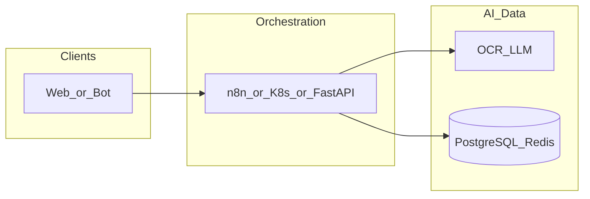

# frontend-sinoptics-ai

**Path:** `D:/_sinoptics_git/frontend-sinoptics-ai`  
**Category:** sinoptics-repo  
**Primary language:** JavaScript  
**Status:** present on disk

## 1. Purpose (2-3 lines)

# Sinoptics AI Website

Official website for Sinoptics AI - Global AI Trade Compliance Technology.

## 2. Tech stack (from manifests and file-type mix)

- **Detected primary language:** JavaScript
- **Top-level layout:** see listing below.

### `README.md`

```
# Sinoptics AI Website

Official website for Sinoptics AI - Global AI Trade Compliance Technology.

## 🚀 Features

- **Modern React Architecture**: Built with React 18 and Vite for optimal performance
- **Responsive Design**: Mobile-first approach with beautiful UI across all devices
- **SEO Optimized**: Meta tags, semantic HTML, and proper structure
- **Static Hosting Ready**: Configured for Yandex Cloud Object Storage deployment

## 📋 Pages

- **Home**: Hero banner, solutions overview, features, CTA sections
- **About**: Company history, mission, values, leadership, global offices
- **Solutions**: Document verification and fraud detection services
- **Technology**: Alibaba Cloud infrastructure, AI capabilities, security
- **Clients**: Client testimonials, case studies, industries served
- **Contact**: Contact form, office locations
- **Careers**: Open positions, benefits, company culture
- **Privacy Policy**: GDPR-compliant privacy policy
- **Terms of Service**: Legal terms and conditions
- **404 Page**: Custom error page with navigation

## 🛠️ Technology Stack

- **Frontend**: React 18, React Router DOM
- **Build Tool**: Vite
- **Icons**: Lucide React
- **Styling**: CSS3 with CSS Variables
- **Fonts**: Outfit (primary), Space Mono (monospace)

## 🏃 Getting Started

### Prerequisites

- Node.js 18+ 
- npm or yarn

### Installation

```bash
# Install dependencies
npm install

# Start development server
npm run dev

# Build for production
npm run build

# Preview production build
npm run preview
```

## 📦 Deployment to Yandex Cloud Object Storage

1. Build the project:
   ```bash
   npm run build
   ```

2. Upload the contents of the `dist` folder to your Yandex Cloud Object Storage bucket.

3. Configure the bucket for static website hosting:
   - Set `index.html` as the index document
   - Set `404.html` as the error document

4. Map your domain `sinoptics.ai` to the bucket.

## 📁 Project Structure

```
src/
├── components/
│   ├── Header.jsx/.css
│   ├── Footer.jsx/.css
│   └── ScrollToTop.jsx
├── pages/
│   ├── Home.jsx/.css
│   ├── About.jsx/.css
│   ├── Solutions.jsx/.css
│   ├── Technology.jsx/.css
│   ├── Clients.jsx/.css
│   ├── Contact.jsx/.css
│   ├── Careers.jsx/.css
│   ├── Privacy.jsx
│   ├── Terms.jsx
│   ├── Legal.css
│   ├── NotFound.jsx/.css
├── App.jsx/.css
├── main.jsx
└── index.css
public/
├── favicon.svg
└── 404.html
```

## 🎨 Design System

### Colors

- **Primary**: #0a1628 (Deep Navy)
- **Secondary**: #1e3a5f (Ocean Blue)
- **Accent**: #d4a853 (Gold)

### Typography

- **Primary Font**: Outfit
- **Monospace Font**: Space Mono

## 📄 License

© 2025 Sinoptics AI. All rights reserved.
```

### `readme.md`

```
# Sinoptics AI Website

Official website for Sinoptics AI - Global AI Trade Compliance Technology.

## 🚀 Features

- **Modern React Architecture**: Built with React 18 and Vite for optimal performance
- **Responsive Design**: Mobile-first approach with beautiful UI across all devices
- **SEO Optimized**: Meta tags, semantic HTML, and proper structure
- **Static Hosting Ready**: Configured for Yandex Cloud Object Storage deployment

## 📋 Pages

- **Home**: Hero banner, solutions overview, features, CTA sections
- **About**: Company history, mission, values, leadership, global offices
- **Solutions**: Document verification and fraud detection services
- **Technology**: Alibaba Cloud infrastructure, AI capabilities, security
- **Clients**: Client testimonials, case studies, industries served
- **Contact**: Contact form, office locations
- **Careers**: Open positions, benefits, company culture
- **Privacy Policy**: GDPR-compliant privacy policy
- **Terms of Service**: Legal terms and conditions
- **404 Page**: Custom error page with navigation

## 🛠️ Technology Stack

- **Frontend**: React 18, React Router DOM
- **Build Tool**: Vite
- **Icons**: Lucide React
- **Styling**: CSS3 with CSS Variables
- **Fonts**: Outfit (primary), Space Mono (monospace)

## 🏃 Getting Started

### Prerequisites

- Node.js 18+ 
- npm or yarn

### Installation

```bash
# Install dependencies
npm install

# Start development server
npm run dev

# Build for production
npm run build

# Preview production build
npm run preview
```

## 📦 Deployment to Yandex Cloud Object Storage

1. Build the project:
   ```bash
   npm run build
   ```

2. Upload the contents of the `dist` folder to your Yandex Cloud Object Storage bucket.

3. Configure the bucket for static website hosting:
   - Set `index.html` as the index document
   - Set `404.html` as the error document

4. Map your domain `sinoptics.ai` to the bucket.

## 📁 Project Structure

```
src/
├── components/
│   ├── Header.jsx/.css
│   ├── Footer.jsx/.css
│   └── ScrollToTop.jsx
├── pages/
│   ├── Home.jsx/.css
│   ├── About.jsx/.css
│   ├── Solutions.jsx/.css
│   ├── Technology.jsx/.css
│   ├── Clients.jsx/.css
│   ├── Contact.jsx/.css
│   ├── Careers.jsx/.css
│   ├── Privacy.jsx
│   ├── Terms.jsx
│   ├── Legal.css
│   ├── NotFound.jsx/.css
├── App.jsx/.css
├── main.jsx
└── index.css
public/
├── favicon.svg
└── 404.html
```

## 🎨 Design System

### Colors

- **Primary**: #0a1628 (Deep Navy)
- **Secondary**: #1e3a5f (Ocean Blue)
- **Accent**: #d4a853 (Gold)

### Typography

- **Primary Font**: Outfit
- **Monospace Font**: Space Mono

## 📄 License

© 2025 Sinoptics AI. All rights reserved.
```

### `Readme.md`

```
# Sinoptics AI Website

Official website for Sinoptics AI - Global AI Trade Compliance Technology.

## 🚀 Features

- **Modern React Architecture**: Built with React 18 and Vite for optimal performance
- **Responsive Design**: Mobile-first approach with beautiful UI across all devices
- **SEO Optimized**: Meta tags, semantic HTML, and proper structure
- **Static Hosting Ready**: Configured for Yandex Cloud Object Storage deployment

## 📋 Pages

- **Home**: Hero banner, solutions overview, features, CTA sections
- **About**: Company history, mission, values, leadership, global offices
- **Solutions**: Document verification and fraud detection services
- **Technology**: Alibaba Cloud infrastructure, AI capabilities, security
- **Clients**: Client testimonials, case studies, industries served
- **Contact**: Contact form, office locations
- **Careers**: Open positions, benefits, company culture
- **Privacy Policy**: GDPR-compliant privacy policy
- **Terms of Service**: Legal terms and conditions
- **404 Page**: Custom error page with navigation

## 🛠️ Technology Stack

- **Frontend**: React 18, React Router DOM
- **Build Tool**: Vite
- **Icons**: Lucide React
- **Styling**: CSS3 with CSS Variables
- **Fonts**: Outfit (primary), Space Mono (monospace)

## 🏃 Getting Started

### Prerequisites

- Node.js 18+ 
- npm or yarn

### Installation

```bash
# Install dependencies
npm install

# Start development server
npm run dev

# Build for production
npm run build

# Preview production build
npm run preview
```

## 📦 Deployment to Yandex Cloud Object Storage

1. Build the project:
   ```bash
   npm run build
   ```

2. Upload the contents of the `dist` folder to your Yandex Cloud Object Storage bucket.

3. Configure the bucket for static website hosting:
   - Set `index.html` as the index document
   - Set `404.html` as the error document

4. Map your domain `sinoptics.ai` to the bucket.

## 📁 Project Structure

```
src/
├── components/
│   ├── Header.jsx/.css
│   ├── Footer.jsx/.css
│   └── ScrollToTop.jsx
├── pages/
│   ├── Home.jsx/.css
│   ├── About.jsx/.css
│   ├── Solutions.jsx/.css
│   ├── Technology.jsx/.css
│   ├── Clients.jsx/.css
│   ├── Contact.jsx/.css
│   ├── Careers.jsx/.css
│   ├── Privacy.jsx
│   ├── Terms.jsx
│   ├── Legal.css
│   ├── NotFound.jsx/.css
├── App.jsx/.css
├── main.jsx
└── index.css
public/
├── favicon.svg
└── 404.html
```

## 🎨 Design System

### Colors

- **Primary**: #0a1628 (Deep Navy)
- **Secondary**: #1e3a5f (Ocean Blue)
- **Accent**: #d4a853 (Gold)

### Typography

- **Primary Font**: Outfit
- **Monospace Font**: Space Mono

## 📄 License

© 2025 Sinoptics AI. All rights reserved.
```

### `package.json`

```
{
  "name": "frontend-sinoptics-ai",
  "private": true,
  "version": "0.0.0",
  "type": "module",
  "scripts": {
    "dev": "vite",
    "build": "vite build",
    "lint": "eslint .",
    "preview": "vite preview"
  },
  "dependencies": {
    "lucide-react": "^0.556.0",
    "react": "^19.2.0",
    "react-dom": "^19.2.0",
    "react-router-dom": "^7.10.1"
  },
  "devDependencies": {
    "@eslint/js": "^9.39.1",
    "@types/react": "^19.2.5",
    "@types/react-dom": "^19.2.3",
    "@vitejs/plugin-react": "^5.1.1",
    "eslint": "^9.39.1",
    "eslint-plugin-react-hooks": "^7.0.1",
    "eslint-plugin-react-refresh": "^0.4.24",
    "globals": "^16.5.0",
    "vite": "^7.2.4"
  }
}
```


## 3. Architecture



- **Inbound:** HTTP (API Gateway / ALB), scheduled triggers, queues (SQS/SNS), EventBridge rules, or batch — infer from `stacks/`, `template.yaml`, `sst.config.ts`, or `src/` handlers.
- **Outbound:** databases and external HTTP APIs per layers and `package.json` / Python imports in handlers.
- **IaC pattern:** SST/CDK, SAM/CloudFormation, Pulumi, Helm, Terraform, or raw scripts — see manifests section.

## 4. Key files (auto-discovered)

- **Top-level entries:**

```
.gitignore
.vscode
README.md
dist
eslint.config.js
index.html
node_modules
ops
package-lock.json
package.json
public
src
vite.config.js
```

## 5. My contribution / role (evidence from git history — if available)

```text
6426838 2025-12-09 Update
87588fb 2025-12-09 add reference to sinoptics ru
74ff275 2025-12-09 first
```

_Use commit messages only as hints; corroborate in interviews._

## 6. Notable patterns / snippets

_No snippet candidates matched (handler.py / stack.ts / template.yaml etc.). Expand manually after opening the repo._

## 7. Metrics / SLO / scale (if available)

_Extract from Airflow DAG params, load tests, README, or CloudFormation `ReservedConcurrentExecutions` when present — not auto-inferred to avoid fabrication._

## 8. Resume bullets (ready-to-paste, English)

- Owned or extended **`frontend-sinoptics-ai`** capabilities aligned with **sinoptics repo** delivery.
- Applied **JavaScript** stack patterns and repository-local IaC/config where present.
- Collaborated on production-grade defaults: structured logging, retries, and least-privilege IAM patterns where applicable.
- Integrated with **Sinoptics** platform services (data stores, queues, gateways) per dependency manifests in-repo.
- Documented operational expectations (deploy, test, local dev) via README and automation files when available.

## 9. Interview talking points

- What is the main entrypoint and trigger for `frontend-sinoptics-ai`?
- How are secrets and non-prod environments separated?
- What failure modes are handled (retries, DLQ, idempotency)?
- How would you observe this service in production (metrics, logs, traces)?
