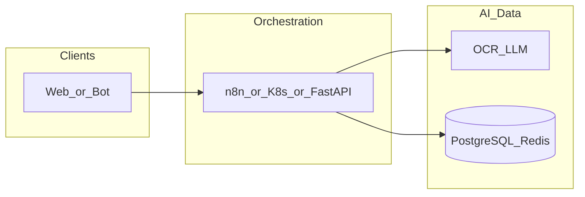

# frontend-sipoptics-ru

**Path:** `D:/_sinoptics_git/frontend-sipoptics-ru`  
**Category:** sinoptics-repo  
**Primary language:** TypeScript  
**Status:** present on disk

## 1. Purpose (2-3 lines)

# Sinoptics Frontend

Next.js 14 app with multi-domain support:
- **sinoptics.ru** — Публичный сайт компании (лэндинг на русском языке)
- **verify.sinoptics.ru** — Портал верификации документов (dashboard, billing, reports)

## 2. Tech stack (from manifests and file-type mix)

- **Detected primary language:** TypeScript
- **Top-level layout:** see listing below.

### `README.md`

```
# Sinoptics Frontend

Next.js 14 app with multi-domain support:
- **sinoptics.ru** — Публичный сайт компании (лэндинг на русском языке)
- **verify.sinoptics.ru** — Портал верификации документов (dashboard, billing, reports)

## Мультидоменная архитектура

Проект поддерживает два домена с разным контентом:

### sinoptics.ru (Главный сайт)
Публичный сайт компании с информацией о решениях, технологиях, клиентах и контактах. Страницы расположены в `src/app/landing/`:
- `/` — Главная страница
- `/about` — О компании  
- `/solutions` — Решения
- `/technology` — Технологии
- `/clients` — Клиенты
- `/contact` — Контакты
- `/careers` — Карьера
- `/privacy` — Политика конфиденциальности
- `/terms` — Условия использования

### verify.sinoptics.ru (Портал верификации)
Защищённый портал для авторизованных пользователей с функциями:
- Авторизация через Yandex OAuth
- Dashboard с метриками
- Биллинг и оплата
- Загрузка и верификация счетов
- Просмотр отчётов

### Настройка среды разработки

Для локальной разработки:
```bash
# По умолчанию localhost работает как verify.sinoptics.ru
npm run dev

# Для тестирования лэндинга (sinoptics.ru)
NEXT_PUBLIC_FORCE_LANDING=true npm run dev
```

### Маршрутизация
Middleware (`src/middleware.ts`) определяет по hostname какой контент показывать:
- `verify.*` → Портал верификации (auth, dashboard, billing)
- `sinoptics.ru` / `www.sinoptics.ru` → Лэндинг

### Режимы деплоя

#### Статический режим (Yandex Object Storage) — используется для деплоя
Приложение собирается в статический режим и деплоится через CI/CD:
```bash
npm run build:landing  # Сборка лэндинга для sinoptics.ru
npm run build:portal   # Сборка портала для verify.sinoptics.ru
```
⚠️ **Важно**: В статическом режиме middleware не работает. Маршрутизация по доменам происходит на уровне CI/CD, который собирает разные версии для разных доменов.

---

## Портал верификации (verify.sinoptics.ru)

This frontend integrates with existing backend APIs to provide authenticated access to billing, invoice submission, and validation reports.

## Tech Stack

- Next.js 14 (App Router, TypeScript, Tailwind CSS)
- React Query for server state, Zustand for lightweight UI state
- Auth0 authentication via `@auth0/auth0-spa-js`
- Axios API layer with automatic token refresh
- React Hook Form + Zod for forms and validation
- React Dropzone + React Webcam for upload and camera capture
- React Hot Toast + Radix for notifications

## Getting Started

```bash
npm install
npm run dev
```

> Requires Node.js 18.18+.

## Static Bucket Deployment (Yandex Object Storage)

The primary deployment target is now Yandex Object Storage, following the official [`yandex-cloud-examples/yc-s3-static-website`](https://github.com/yandex-cloud-examples/yc-s3-static-website) pattern. The process has three stages:

1. **Provision infrastructure (once).**
   - Copy `ops/object-storage/static.tf`, replace `<folder-id>` and `<domain>` with your values, and run:
     ```bash
     cd ops/object-storage
     terraform init
     terraform apply
     ```
   - The Terraform template mirrors the upstream exa

…(truncated)…
```

### `readme.md`

```
# Sinoptics Frontend

Next.js 14 app with multi-domain support:
- **sinoptics.ru** — Публичный сайт компании (лэндинг на русском языке)
- **verify.sinoptics.ru** — Портал верификации документов (dashboard, billing, reports)

## Мультидоменная архитектура

Проект поддерживает два домена с разным контентом:

### sinoptics.ru (Главный сайт)
Публичный сайт компании с информацией о решениях, технологиях, клиентах и контактах. Страницы расположены в `src/app/landing/`:
- `/` — Главная страница
- `/about` — О компании  
- `/solutions` — Решения
- `/technology` — Технологии
- `/clients` — Клиенты
- `/contact` — Контакты
- `/careers` — Карьера
- `/privacy` — Политика конфиденциальности
- `/terms` — Условия использования

### verify.sinoptics.ru (Портал верификации)
Защищённый портал для авторизованных пользователей с функциями:
- Авторизация через Yandex OAuth
- Dashboard с метриками
- Биллинг и оплата
- Загрузка и верификация счетов
- Просмотр отчётов

### Настройка среды разработки

Для локальной разработки:
```bash
# По умолчанию localhost работает как verify.sinoptics.ru
npm run dev

# Для тестирования лэндинга (sinoptics.ru)
NEXT_PUBLIC_FORCE_LANDING=true npm run dev
```

### Маршрутизация
Middleware (`src/middleware.ts`) определяет по hostname какой контент показывать:
- `verify.*` → Портал верификации (auth, dashboard, billing)
- `sinoptics.ru` / `www.sinoptics.ru` → Лэндинг

### Режимы деплоя

#### Статический режим (Yandex Object Storage) — используется для деплоя
Приложение собирается в статический режим и деплоится через CI/CD:
```bash
npm run build:landing  # Сборка лэндинга для sinoptics.ru
npm run build:portal   # Сборка портала для verify.sinoptics.ru
```
⚠️ **Важно**: В статическом режиме middleware не работает. Маршрутизация по доменам происходит на уровне CI/CD, который собирает разные версии для разных доменов.

---

## Портал верификации (verify.sinoptics.ru)

This frontend integrates with existing backend APIs to provide authenticated access to billing, invoice submission, and validation reports.

## Tech Stack

- Next.js 14 (App Router, TypeScript, Tailwind CSS)
- React Query for server state, Zustand for lightweight UI state
- Auth0 authentication via `@auth0/auth0-spa-js`
- Axios API layer with automatic token refresh
- React Hook Form + Zod for forms and validation
- React Dropzone + React Webcam for upload and camera capture
- React Hot Toast + Radix for notifications

## Getting Started

```bash
npm install
npm run dev
```

> Requires Node.js 18.18+.

## Static Bucket Deployment (Yandex Object Storage)

The primary deployment target is now Yandex Object Storage, following the official [`yandex-cloud-examples/yc-s3-static-website`](https://github.com/yandex-cloud-examples/yc-s3-static-website) pattern. The process has three stages:

1. **Provision infrastructure (once).**
   - Copy `ops/object-storage/static.tf`, replace `<folder-id>` and `<domain>` with your values, and run:
     ```bash
     cd ops/object-storage
     terraform init
     terraform apply
     ```
   - The Terraform template mirrors the upstream exa

…(truncated)…
```

### `Readme.md`

```
# Sinoptics Frontend

Next.js 14 app with multi-domain support:
- **sinoptics.ru** — Публичный сайт компании (лэндинг на русском языке)
- **verify.sinoptics.ru** — Портал верификации документов (dashboard, billing, reports)

## Мультидоменная архитектура

Проект поддерживает два домена с разным контентом:

### sinoptics.ru (Главный сайт)
Публичный сайт компании с информацией о решениях, технологиях, клиентах и контактах. Страницы расположены в `src/app/landing/`:
- `/` — Главная страница
- `/about` — О компании  
- `/solutions` — Решения
- `/technology` — Технологии
- `/clients` — Клиенты
- `/contact` — Контакты
- `/careers` — Карьера
- `/privacy` — Политика конфиденциальности
- `/terms` — Условия использования

### verify.sinoptics.ru (Портал верификации)
Защищённый портал для авторизованных пользователей с функциями:
- Авторизация через Yandex OAuth
- Dashboard с метриками
- Биллинг и оплата
- Загрузка и верификация счетов
- Просмотр отчётов

### Настройка среды разработки

Для локальной разработки:
```bash
# По умолчанию localhost работает как verify.sinoptics.ru
npm run dev

# Для тестирования лэндинга (sinoptics.ru)
NEXT_PUBLIC_FORCE_LANDING=true npm run dev
```

### Маршрутизация
Middleware (`src/middleware.ts`) определяет по hostname какой контент показывать:
- `verify.*` → Портал верификации (auth, dashboard, billing)
- `sinoptics.ru` / `www.sinoptics.ru` → Лэндинг

### Режимы деплоя

#### Статический режим (Yandex Object Storage) — используется для деплоя
Приложение собирается в статический режим и деплоится через CI/CD:
```bash
npm run build:landing  # Сборка лэндинга для sinoptics.ru
npm run build:portal   # Сборка портала для verify.sinoptics.ru
```
⚠️ **Важно**: В статическом режиме middleware не работает. Маршрутизация по доменам происходит на уровне CI/CD, который собирает разные версии для разных доменов.

---

## Портал верификации (verify.sinoptics.ru)

This frontend integrates with existing backend APIs to provide authenticated access to billing, invoice submission, and validation reports.

## Tech Stack

- Next.js 14 (App Router, TypeScript, Tailwind CSS)
- React Query for server state, Zustand for lightweight UI state
- Auth0 authentication via `@auth0/auth0-spa-js`
- Axios API layer with automatic token refresh
- React Hook Form + Zod for forms and validation
- React Dropzone + React Webcam for upload and camera capture
- React Hot Toast + Radix for notifications

## Getting Started

```bash
npm install
npm run dev
```

> Requires Node.js 18.18+.

## Static Bucket Deployment (Yandex Object Storage)

The primary deployment target is now Yandex Object Storage, following the official [`yandex-cloud-examples/yc-s3-static-website`](https://github.com/yandex-cloud-examples/yc-s3-static-website) pattern. The process has three stages:

1. **Provision infrastructure (once).**
   - Copy `ops/object-storage/static.tf`, replace `<folder-id>` and `<domain>` with your values, and run:
     ```bash
     cd ops/object-storage
     terraform init
     terraform apply
     ```
   - The Terraform template mirrors the upstream exa

…(truncated)…
```

### `package.json`

```
{
  "name": "frontend-sipoptics-ru",
  "version": "0.1.0",
  "private": true,
  "scripts": {
    "dev": "next dev",
    "dev:landing": "cross-env NEXT_PUBLIC_SITE_MODE=landing next dev",
    "build": "next build",
    "build:static": "cross-env STATIC_EXPORT=1 next build",
    "build:portal:static": "cross-env STATIC_EXPORT=1 NEXT_PUBLIC_SITE_MODE=portal next build",
    "build:landing": "node scripts/prebuild-landing.js && cross-env STATIC_EXPORT=1 NEXT_PUBLIC_SITE_MODE=landing next build && node scripts/postbuild-landing.js",
    "build:portal": "cross-env NEXT_PUBLIC_SITE_MODE=portal next build",
    "start": "next start",
    "lint": "next lint",
    "test": "vitest",
    "test:watch": "vitest --watch",
    "test:e2e": "playwright test",
    "test:batch-upload": "cross-env PLAYWRIGHT_BASE_URL=https://verify.sinoptics.ru playwright test batch-upload --project=chromium",
    "prepare": "husky",
    "postinstall": "node scripts/copy-pdf-worker.js",
    "deploy:bucket": "bash ./ops/deploy_static_bucket.sh"
  },
  "engines": {
    "node": ">=18.18.0",
    "npm": ">=9.0.0"
  },
  "dependencies": {
    "@headlessui/react": "^1.7.19",
    "@heroicons/react": "^2.1.5",
    "@hookform/resolvers": "^3.3.4",
    "@radix-ui/react-toast": "^1.1.4",
    "@tanstack/react-query": "^5.36.0",
    "@tanstack/react-query-devtools": "^5.36.0",
    "axios": "^1.6.8",
    "class-variance-authority": "^0.7.0",
    "clsx": "^2.1.0",
    "date-fns": "^3.6.0",
    "jspdf": "^2.5.2",
    "jspdf-autotable": "^3.8.4",
    "konva": "^9.3.22",
    "lucide-react": "^0.562.0",
    "next": "14.2.5",
    "oidc-client-ts": "^3.4.1",
    "pdf-lib": "^1.17.1",
    "pdfjs-dist": "^5.6.205",
    "react": "18.3.1",
    "react-dom": "18.3.1",
    "react-dropzone": "^14.3.7",
    "react-hook-form": "^7.51.5",
    "react-hot-toast": "^2.5.0",
    "react-konva": "^18.2.10",
    "react-oidc-context": "^3.3.0",
    "react-webcam": "^7.2.0",
    "zod": "^3.23.8",
    "zustand": "^4.5.2"
  },
  "devDependencies": {
    "@playwright/test": "^1.44.1",
    "@testing-library/jest-dom": "^6.4.2",
    "@testing-library/react": "^14.1.2",
    "@testing-library/user-event": "^14.5.2",
    "@types/node": "^20.12.7",
    "@types/react": "^18.2.67",
    "@types/react-dom": "^18.2.21",
    "autoprefixer": "^10.4.17",
    "cross-env": "^10.1.0",
    "eslint": "^8.57.0",
    "eslint-config-next": "14.2.5",
    "eslint-config-prettier": "^9.1.0",
    "husky": "^9.0.11",
    "jsdom": "^29.0.2",
    "lint-staged": "^15.2.2",
    "msw": "^2.3.2",
    "postcss": "^8.4.38",
    "prettier": "^3.2.5",
    "prettier-plugin-tailwindcss": "^0.5.11",
    "tailwindcss": "^3.4.4",
    "typescript": "^5.4.5",
    "vitest": "^1.5.0"
  },
  "lint-staged": {
    "*.{ts,tsx,js,jsx}": [
      "eslint --fix"
    ],
    "*.{ts,tsx,js,jsx,json,css,md}": [
      "prettier --write"
    ]
  }
}
```

### `tsconfig.json`

```
{
  "compilerOptions": {
    "target": "ES2019",
    "lib": [
      "dom",
      "dom.iterable",
      "esnext"
    ],
    "allowJs": false,
    "skipLibCheck": true,
    "strict": true,
    "forceConsistentCasingInFileNames": true,
    "noEmit": true,
    "esModuleInterop": true,
    "module": "esnext",
    "moduleResolution": "bundler",
    "resolveJsonModule": true,
    "isolatedModules": true,
    "jsx": "preserve",
    "incremental": true,
    "baseUrl": ".",
    "paths": {
      "@/*": [
        "src/*"
      ]
    },
    "types": [
      "vitest/globals",
      "node"
    ],
    "plugins": [
      {
        "name": "next"
      }
    ]
  },
  "include": [
    "next-env.d.ts",
    "**/*.ts",
    "**/*.tsx",
    ".next/types/**/*.ts"
  ],
  "exclude": [
    "node_modules",
    "template"
  ]
}
```


## 3. Architecture



- **Inbound:** HTTP (API Gateway / ALB), scheduled triggers, queues (SQS/SNS), EventBridge rules, or batch — infer from `stacks/`, `template.yaml`, `sst.config.ts`, or `src/` handlers.
- **Outbound:** databases and external HTTP APIs per layers and `package.json` / Python imports in handlers.
- **IaC pattern:** SST/CDK, SAM/CloudFormation, Pulumi, Helm, Terraform, or raw scripts — see manifests section.

## 4. Key files (auto-discovered)

- **Top-level entries:**

```
.cursor
.env.bucket
.env.bucketps
.env.local
.env.production
.eslintrc.cjs
.github
.gitignore
.husky
.next
.vscode
README.md
copy_home_to_var
docs
e2e
next-env.d.ts
next.config.mjs
node_modules
ops
out
package-lock.json
package.json
playwright-report
playwright.config.ts
postcss.config.cjs
presentation
prettier.config.cjs
prompts
public
scripts
sert
src
ssh
tailwind.config.ts
template
test
test-results
tsconfig.json
tsconfig.tsbuildinfo
vitest.config.ts
```

## 5. My contribution / role (evidence from git history — if available)

```text
5bca830 2026-04-22 fix progress
e315437 2026-04-22 add trial
cb06123 2026-04-21 trial b2c
53fdf58 2026-04-21 controller fon upload
cda7951 2026-04-21 reflect in form
34e4622 2026-04-21 fix pdf render
afd2a53 2026-04-20 debau error
7260db9 2026-04-20 EyeOff
```

_Use commit messages only as hints; corroborate in interviews._

## 6. Notable patterns / snippets


**`src/components/landing/index.ts`**

```typescript
export { default as Header } from './Header';
export { default as Footer } from './Footer';
```

**`src/types/index.ts`**

```typescript
export type PlanTier = 'trial' | 'starter' | 'growth' | 'enterprise';

export interface TrialLimits {
  files: number;
  pages: number;
  verifications: number;
}

export interface BillingPlan {
  id: PlanTier;
  /** Pricing tier — same as `id` for paid plans, mirrors `id` for `trial`. */
  tier: PlanTier;
  name: string;
  pricePerMonth: number;
  includedValidations: number;
  overagePrice: number;
  features: string[];
  nextInvoiceDate: string;
  /** True when the user already consumed their free trial verification. */
  trialUsed?: boolean;
  /** Per-trial caps. Present when `tier === 'trial'`. */
  trialLimits?: TrialLimits;
  /** Optional deep-link from backend for the YooKassa upgrade flow. */
  upgradeUrl?: string;
}

export interface InvoiceUsage {
  date: string;
  validations: number;
  cost: number;
}

export type ValidationStatus = 'pending' | 'processing' | 'completed' | 'failed';

export interface ValidationField {
  key: string;
  label: string;
  value: string | number | null;
  confidence: number;
  warnings?: string[];
}

export interface ValidationIssue {
  type: 'error' | 'warning';
  message: string;
  field?: string;
}

export interface ValidationReport {
  id: string;
  status: ValidationStatus;
  uploadedAt: string;
  completedAt?: string;
  documentType: string;
  summary: string;
  fields: ValidationField[];
  issues: ValidationIssue[];
  metadata?: Record<string, string>;
}
```


## 7. Metrics / SLO / scale (if available)

_Extract from Airflow DAG params, load tests, README, or CloudFormation `ReservedConcurrentExecutions` when present — not auto-inferred to avoid fabrication._

## 8. Resume bullets (ready-to-paste, English)

- Owned or extended **`frontend-sipoptics-ru`** capabilities aligned with **sinoptics repo** delivery.
- Applied **TypeScript** stack patterns and repository-local IaC/config where present.
- Collaborated on production-grade defaults: structured logging, retries, and least-privilege IAM patterns where applicable.
- Integrated with **Sinoptics** platform services (data stores, queues, gateways) per dependency manifests in-repo.
- Documented operational expectations (deploy, test, local dev) via README and automation files when available.

## 9. Interview talking points

- What is the main entrypoint and trigger for `frontend-sipoptics-ru`?
- How are secrets and non-prod environments separated?
- What failure modes are handled (retries, DLQ, idempotency)?
- How would you observe this service in production (metrics, logs, traces)?
