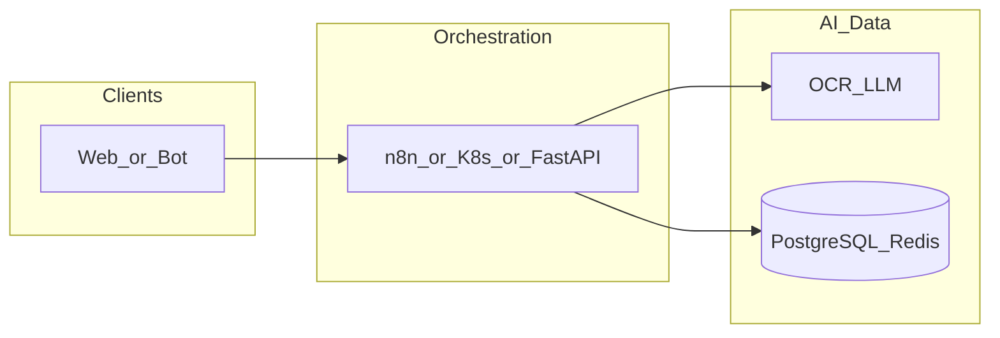

# hostingervps_hermes

**Path:** `D:/_sinoptics_git/hostingervps_hermes`  
**Category:** sinoptics-repo  
**Primary language:** Python  
**Status:** present on disk

## 1. Purpose (2-3 lines)

Internal **Sinoptics** repository `hostingervps_hermes` under category **sinoptics-repo**. Supports Yofi/Botnot platform capabilities (e-commerce intelligence, anti-fraud adjacent services, data plane, or infrastructure) as evidenced by repository layout and manifests.

## 2. Tech stack (from manifests and file-type mix)

- **Detected primary language:** Python
- **Top-level layout:** see listing below.

_No common manifest files found at repository root._


## 3. Architecture



- **Inbound:** HTTP (API Gateway / ALB), scheduled triggers, queues (SQS/SNS), EventBridge rules, or batch — infer from `stacks/`, `template.yaml`, `sst.config.ts`, or `src/` handlers.
- **Outbound:** databases and external HTTP APIs per layers and `package.json` / Python imports in handlers.
- **IaC pattern:** SST/CDK, SAM/CloudFormation, Pulumi, Helm, Terraform, or raw scripts — see manifests section.

## 4. Key files (auto-discovered)

- **Top-level entries:**

```
.gitattributes
.github
.gitignore
.vscode
hermes
hostinger
scripts
```

## 5. My contribution / role (evidence from git history — if available)

```text
b992f1a 2026-05-11 fix(install-hermes): render canonical model.* schema, drop dead env keys
24df665 2026-05-11 chore(hermes,scripts): update deploy.yml, README.md, set-github-secre...
b0aeb86 2026-05-11 refactor(deploy): не-секретные настройки вынесены в vars вместо secrets
74849e9 2026-05-11 fix(install): YAML-safe quoting + provider-alias API ключ + чистка monarx-glob
de98691 2026-05-11 fix(deploy): не ломать ownership /opt/hermes-deploy для github-runner
fdce58a 2026-05-11 fix(deploy): sanitize HERMES_USER, fallback to 'hermes' if invalid (was '-')
4a609d1 2026-05-11 fix(deploy): disable broken Hostinger Monarx repo before apt-get update
a3de283 2026-05-11 chore(hermes,hostinger): update 6 files
```

_Use commit messages only as hints; corroborate in interviews._

## 6. Notable patterns / snippets

_No snippet candidates matched (handler.py / stack.ts / template.yaml etc.). Expand manually after opening the repo._

## 7. Metrics / SLO / scale (if available)

_Extract from Airflow DAG params, load tests, README, or CloudFormation `ReservedConcurrentExecutions` when present — not auto-inferred to avoid fabrication._

## 8. Resume bullets (ready-to-paste, English)

- Owned or extended **`hostingervps_hermes`** capabilities aligned with **sinoptics repo** delivery.
- Applied **Python** stack patterns and repository-local IaC/config where present.
- Collaborated on production-grade defaults: structured logging, retries, and least-privilege IAM patterns where applicable.
- Integrated with **Sinoptics** platform services (data stores, queues, gateways) per dependency manifests in-repo.
- Documented operational expectations (deploy, test, local dev) via README and automation files when available.

## 9. Interview talking points

- What is the main entrypoint and trigger for `hostingervps_hermes`?
- How are secrets and non-prod environments separated?
- What failure modes are handled (retries, DLQ, idempotency)?
- How would you observe this service in production (metrics, logs, traces)?
