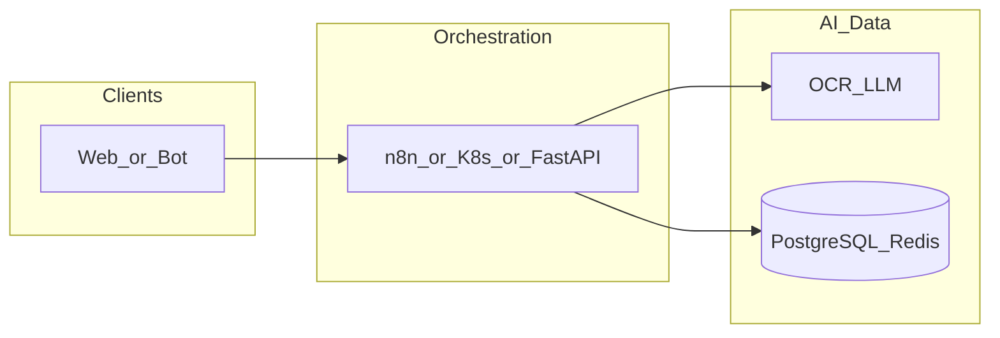

# n8n-flow

**Path:** `D:/_sinoptics_git/n8n-flow`  
**Category:** sinoptics-repo  
**Primary language:** JavaScript  
**Status:** present on disk

## 1. Purpose (2-3 lines)

# Chinese Company Validation n8n Workflow

A comprehensive n8n workflow that automates the validation of Chinese companies through AI-powered document parsing, business intelligence gathering, and multi-agent validation.

## 2. Tech stack (from manifests and file-type mix)

- **Detected primary language:** JavaScript
- **Top-level layout:** see listing below.

### `README.md`

```
# Chinese Company Validation n8n Workflow

A comprehensive n8n workflow that automates the validation of Chinese companies through AI-powered document parsing, business intelligence gathering, and multi-agent validation.

## 🎯 Overview

This workflow receives images or PDFs from a Telegram bot, extracts Chinese company information, searches business databases, and validates the company through multiple specialized AI agents before providing a comprehensive report.

## 🏗️ Architecture

```
Telegram Bot → n8n Workflow → AI Parsing Agent → QCC.com Search
                                                      ↓
AI Orchestrator ← AI Agent Microservices ← Parallel Processing
                                                      ↓
Telegram Response ← Formatted Report ← Aggregated Results
```

## 📋 Workflow Components

### 1. Telegram Input Trigger
- **Node Type**: Telegram Trigger
- **Function**: Receives images/PDFs from users
- **Supported Formats**: JPEG, PNG, GIF, JPG, TIFF, BMP, PDF
- **Output**: Binary file data with metadata

### 2. File Processing
- **Node Type**: Function Node
- **Function**: Converts binary to base64, adds metadata
- **Output**: Structured file object for AI processing

### 3. AI Document Parsing
- **Node Type**: HTTP Request
- **Function**: OCR + LLM-based text extraction
- **Extracts**: Chinese company name, English translation, document metadata
- **Output**: Parsed text and company information

### 4. Business Intelligence Search
- **Node Type**: HTTP Request
- **Function**: Searches QCC.com for company details
- **Retrieves**: Legal representative, registration number, business scope, capital, license status, risk data
- **Output**: JSON with comprehensive company information

### 5. Parallel AI Agent Processing
- **Node Type**: Split In Batches / Parallel Execution
- **Agents**:
  - **Lawyer/Compliance Agent**: Legal identity, sanctions, trademark validation
  - **Logistics/Supply-Chain Agent**: Business scope vs invoiced goods validation
  - **Finance/Credit Agent**: Tax ID, financial reports, credit rating
  - **Marketing/Export Agent**: Trademark/patent information validation
  - **Accounting Agent**: Invoice math/structure validation

### 6. AI Orchestrator
- **Node Type**: Function Node / HTTP Request
- **Function**: Aggregates all agent outputs
- **Output**: Unified compliance report with ratings

### 7. Telegram Response
- **Node Type**: Telegram Send Message
- **Function**: Sends formatted report to user
- **Content**: Company summary, validation results, risk assessment

## 🚀 Quick Start

### Prerequisites
- Docker and Docker Compose
- n8n instance
- Telegram Bot Token
- API keys for AI services
- QCC.com API access

### Installation

1. **Clone the repository**
```bash
git clone <repository-url>
cd chinese_company_validation_workflow
```

2. **Configure environment variables**
```bash
cp .env.example .env
# Edit .env with your API keys and tokens
```

3. **Start the services**
```bash
docker-compose up -d
```

4. **Import the workflow**
- Open n8n web interface
- Import the workflow JSON file
- Co

…(truncated)…
```

### `readme.md`

```
# Chinese Company Validation n8n Workflow

A comprehensive n8n workflow that automates the validation of Chinese companies through AI-powered document parsing, business intelligence gathering, and multi-agent validation.

## 🎯 Overview

This workflow receives images or PDFs from a Telegram bot, extracts Chinese company information, searches business databases, and validates the company through multiple specialized AI agents before providing a comprehensive report.

## 🏗️ Architecture

```
Telegram Bot → n8n Workflow → AI Parsing Agent → QCC.com Search
                                                      ↓
AI Orchestrator ← AI Agent Microservices ← Parallel Processing
                                                      ↓
Telegram Response ← Formatted Report ← Aggregated Results
```

## 📋 Workflow Components

### 1. Telegram Input Trigger
- **Node Type**: Telegram Trigger
- **Function**: Receives images/PDFs from users
- **Supported Formats**: JPEG, PNG, GIF, JPG, TIFF, BMP, PDF
- **Output**: Binary file data with metadata

### 2. File Processing
- **Node Type**: Function Node
- **Function**: Converts binary to base64, adds metadata
- **Output**: Structured file object for AI processing

### 3. AI Document Parsing
- **Node Type**: HTTP Request
- **Function**: OCR + LLM-based text extraction
- **Extracts**: Chinese company name, English translation, document metadata
- **Output**: Parsed text and company information

### 4. Business Intelligence Search
- **Node Type**: HTTP Request
- **Function**: Searches QCC.com for company details
- **Retrieves**: Legal representative, registration number, business scope, capital, license status, risk data
- **Output**: JSON with comprehensive company information

### 5. Parallel AI Agent Processing
- **Node Type**: Split In Batches / Parallel Execution
- **Agents**:
  - **Lawyer/Compliance Agent**: Legal identity, sanctions, trademark validation
  - **Logistics/Supply-Chain Agent**: Business scope vs invoiced goods validation
  - **Finance/Credit Agent**: Tax ID, financial reports, credit rating
  - **Marketing/Export Agent**: Trademark/patent information validation
  - **Accounting Agent**: Invoice math/structure validation

### 6. AI Orchestrator
- **Node Type**: Function Node / HTTP Request
- **Function**: Aggregates all agent outputs
- **Output**: Unified compliance report with ratings

### 7. Telegram Response
- **Node Type**: Telegram Send Message
- **Function**: Sends formatted report to user
- **Content**: Company summary, validation results, risk assessment

## 🚀 Quick Start

### Prerequisites
- Docker and Docker Compose
- n8n instance
- Telegram Bot Token
- API keys for AI services
- QCC.com API access

### Installation

1. **Clone the repository**
```bash
git clone <repository-url>
cd chinese_company_validation_workflow
```

2. **Configure environment variables**
```bash
cp .env.example .env
# Edit .env with your API keys and tokens
```

3. **Start the services**
```bash
docker-compose up -d
```

4. **Import the workflow**
- Open n8n web interface
- Import the workflow JSON file
- Co

…(truncated)…
```

### `Readme.md`

```
# Chinese Company Validation n8n Workflow

A comprehensive n8n workflow that automates the validation of Chinese companies through AI-powered document parsing, business intelligence gathering, and multi-agent validation.

## 🎯 Overview

This workflow receives images or PDFs from a Telegram bot, extracts Chinese company information, searches business databases, and validates the company through multiple specialized AI agents before providing a comprehensive report.

## 🏗️ Architecture

```
Telegram Bot → n8n Workflow → AI Parsing Agent → QCC.com Search
                                                      ↓
AI Orchestrator ← AI Agent Microservices ← Parallel Processing
                                                      ↓
Telegram Response ← Formatted Report ← Aggregated Results
```

## 📋 Workflow Components

### 1. Telegram Input Trigger
- **Node Type**: Telegram Trigger
- **Function**: Receives images/PDFs from users
- **Supported Formats**: JPEG, PNG, GIF, JPG, TIFF, BMP, PDF
- **Output**: Binary file data with metadata

### 2. File Processing
- **Node Type**: Function Node
- **Function**: Converts binary to base64, adds metadata
- **Output**: Structured file object for AI processing

### 3. AI Document Parsing
- **Node Type**: HTTP Request
- **Function**: OCR + LLM-based text extraction
- **Extracts**: Chinese company name, English translation, document metadata
- **Output**: Parsed text and company information

### 4. Business Intelligence Search
- **Node Type**: HTTP Request
- **Function**: Searches QCC.com for company details
- **Retrieves**: Legal representative, registration number, business scope, capital, license status, risk data
- **Output**: JSON with comprehensive company information

### 5. Parallel AI Agent Processing
- **Node Type**: Split In Batches / Parallel Execution
- **Agents**:
  - **Lawyer/Compliance Agent**: Legal identity, sanctions, trademark validation
  - **Logistics/Supply-Chain Agent**: Business scope vs invoiced goods validation
  - **Finance/Credit Agent**: Tax ID, financial reports, credit rating
  - **Marketing/Export Agent**: Trademark/patent information validation
  - **Accounting Agent**: Invoice math/structure validation

### 6. AI Orchestrator
- **Node Type**: Function Node / HTTP Request
- **Function**: Aggregates all agent outputs
- **Output**: Unified compliance report with ratings

### 7. Telegram Response
- **Node Type**: Telegram Send Message
- **Function**: Sends formatted report to user
- **Content**: Company summary, validation results, risk assessment

## 🚀 Quick Start

### Prerequisites
- Docker and Docker Compose
- n8n instance
- Telegram Bot Token
- API keys for AI services
- QCC.com API access

### Installation

1. **Clone the repository**
```bash
git clone <repository-url>
cd chinese_company_validation_workflow
```

2. **Configure environment variables**
```bash
cp .env.example .env
# Edit .env with your API keys and tokens
```

3. **Start the services**
```bash
docker-compose up -d
```

4. **Import the workflow**
- Open n8n web interface
- Import the workflow JSON file
- Co

…(truncated)…
```

### `docker-compose.yml`

```
version: '3.8'

services:
  # n8n Workflow Engine
  n8n:
    image: n8nio/n8n:latest
    container_name: n8n-workflow
    restart: unless-stopped
    ports:
      - "5678:5678"
    environment:
      - N8N_BASIC_AUTH_ACTIVE=true
      - N8N_BASIC_AUTH_USER=admin
      - N8N_BASIC_AUTH_PASSWORD=admin123
      - N8N_HOST=localhost
      - N8N_PORT=5678
      - N8N_PROTOCOL=http
      - WEBHOOK_URL=http://localhost:5678/
      - GENERIC_TIMEZONE=UTC
      - N8N_LOG_LEVEL=info
      - N8N_METRICS=true
      - N8N_DIAGNOSTICS_ENABLED=true
      # Environment variables for workflow
      - TELEGRAM_BOT_TOKEN=${TELEGRAM_BOT_TOKEN}
      - AI_PARSING_AGENT_URL=http://ai-parsing-agent:3000
      - AI_PARSING_API_KEY=${AI_PARSING_API_KEY}
      - QCC_API_URL=${QCC_API_URL}
      - QCC_API_KEY=${QCC_API_KEY}
      - LAWYER_AGENT_URL=http://lawyer-agent:3000
      - LOGISTICS_AGENT_URL=http://logistics-agent:3000
      - FINANCE_AGENT_URL=http://finance-agent:3000
      - MARKETING_AGENT_URL=http://marketing-agent:3000
      - ACCOUNTING_AGENT_URL=http://accounting-agent:3000
      - AI_AGENT_API_KEY=${AI_AGENT_API_KEY}
      - MONGODB_URI=mongodb://mongodb:27017/company_validation
    volumes:
      - n8n_data:/home/node/.n8n
      - ./workflow.json:/home/node/.n8n/workflows/chinese-company-validation.json
    depends_on:
      - mongodb
      - ai-parsing-agent
      - lawyer-agent
      - logistics-agent
      - finance-agent
      - marketing-agent
      - accounting-agent
    networks:
      - workflow-network

  # MongoDB for logging and data storage
  mongodb:
    image: mongo:7.0
    container_name: mongodb
    restart: unless-stopped
    ports:
      - "27017:27017"
    environment:
      - MONGO_INITDB_ROOT_USERNAME=admin
      - MONGO_INITDB_ROOT_PASSWORD=password123
      - MONGO_INITDB_DATABASE=company_validation
    volumes:
      - mongodb_data:/data/db
      - ./mongodb/init:/docker-entrypoint-initdb.d
    networks:
      - workflow-network

  # AI Parsing Agent
  ai-parsing-agent:
    build:
      context: ./microservices/ai-parsing-agent
      dockerfile: Dockerfile
    container_name: ai-parsing-agent
    restart: unless-stopped
    ports:
      - "3001:3000"
    environment:
      - NODE_ENV=production
      - OPENAI_API_KEY=${OPENAI_API_KEY}
      - ANTHROPIC_API_KEY=${ANTHROPIC_API_KEY}
      - TESSERACT_PATH=/usr/bin/tesseract
      - OCR_LANGUAGE=chi_sim+eng
    volumes:
      - ./microservices/ai-parsing-agent:/app
      - /usr/bin/tesseract:/usr/bin/tesseract:ro
    networks:
      - workflow-network

  # Lawyer/Compliance Agent
  lawyer-agent:
    build:
      context: ./microservices/lawyer-agent
      dockerfile: Dockerfile
    container_name: lawyer-agent
    restart: unless-stopped
    ports:
      - "3002:3000"
    environment:
      - NODE_ENV=production
      - OPENAI_API_KEY=${OPENAI_API_KEY}
      - QCC_API_KEY=${QCC_API_KEY}
      - QCC_API_URL=${QCC_API_URL}
      - MONGODB_URI=mongodb://mongodb:27017/company_validation
    volumes:
      - ./microservices/lawyer-agent:/app
    networks:
      

…(truncated)…
```

### `Dockerfile`

```
# Multi-stage build for n8n workflow
FROM node:18-alpine AS base

# Install system dependencies
RUN apk add --no-cache \
    tesseract-ocr \
    tesseract-ocr-data-chi-sim \
    tesseract-ocr-data-eng \
    poppler-utils \
    imagemagick \
    python3 \
    py3-pip \
    build-base

# Set working directory
WORKDIR /app

# Copy package files
COPY package*.json ./

# Install dependencies
RUN npm ci --only=production && npm cache clean --force

# Production stage
FROM node:18-alpine AS production

# Install runtime dependencies
RUN apk add --no-cache \
    tesseract-ocr \
    tesseract-ocr-data-chi-sim \
    tesseract-ocr-data-eng \
    poppler-utils \
    imagemagick \
    dumb-init

# Create app user
RUN addgroup -g 1001 -S nodejs && \
    adduser -S nodejs -u 1001

# Set working directory
WORKDIR /app

# Copy application files
COPY --from=base /app/node_modules ./node_modules
COPY . .

# Set permissions
RUN chown -R nodejs:nodejs /app
USER nodejs

# Expose port
EXPOSE 3000

# Health check
HEALTHCHECK --interval=30s --timeout=3s --start-period=5s --retries=3 \
    CMD node healthcheck.js

# Start application
ENTRYPOINT ["dumb-init", "--"]
CMD ["node", "src/index.js"]
```


## 3. Architecture



- **Inbound:** HTTP (API Gateway / ALB), scheduled triggers, queues (SQS/SNS), EventBridge rules, or batch — infer from `stacks/`, `template.yaml`, `sst.config.ts`, or `src/` handlers.
- **Outbound:** databases and external HTTP APIs per layers and `package.json` / Python imports in handlers.
- **IaC pattern:** SST/CDK, SAM/CloudFormation, Pulumi, Helm, Terraform, or raw scripts — see manifests section.

## 4. Key files (auto-discovered)

- **Top-level entries:**

```
Dockerfile
README.md
docker-compose.yml
env.example
microservices
nginx
scripts
telegram-bot-setup.md
workflow.json
```

## 5. My contribution / role (evidence from git history — if available)

```text
242794a 2025-10-27 first
```

_Use commit messages only as hints; corroborate in interviews._

## 6. Notable patterns / snippets


**`microservices/ai-parsing-agent/src/index.js`**

```text
const express = require('express');
const cors = require('cors');
const helmet = require('helmet');
const morgan = require('morgan');
const rateLimit = require('express-rate-limit');
const compression = require('compression');
require('dotenv').config();

const { parseDocument } = require('./services/documentParser');
const { validateRequest } = require('./middleware/validation');
const { errorHandler } = require('./middleware/errorHandler');
const { logger } = require('./utils/logger');

const app = express();
const PORT = process.env.PORT || 3000;

// Security middleware
app.use(helmet());
app.use(cors());
app.use(compression());

// Logging
app.use(morgan('combined', { stream: { write: message => logger.info(message.trim()) } }));

// Rate limiting
const limiter = rateLimit({
  windowMs: 15 * 60 * 1000, // 15 minutes
  max: 100, // limit each IP to 100 requests per windowMs
  message: 'Too many requests from this IP, please try again later.'
});
app.use('/api/', limiter);

// Body parsing
app.use(express.json({ limit: '50mb' }));
app.use(express.urlencoded({ extended: true, limit: '50mb' }));

// Health check endpoint
app.get('/health', (req, res) => {
  res.status(200).json({
    status: 'healthy',
    timestamp: new Date().toISOString(),
    service: 'ai-parsing-agent',
    version: '1.0.0'
  });
});

// Main parsing endpoint
app.post('/api/parse-document', validateRequest, async (req, res) => {
  try {
    const startTime = Date.now();
    logger.info('Document parsing request received', { 
      fileId: req.body.fileId,
      fileType: req.body.fileType 
    });

    const result = await parseDocument(req.body);
    
    const processingTime = Date.now() - startTime;
    logger.info('Document parsing completed', { 
      fileId: req.body.fileId,
      processingTime: `${processingTime}ms`,
      success: true
    });

    res.status(200).json({
      success: true,
      data: result,
      processingTime: processingTime,
      timestamp: new Date().toISOString()
    });

  } catch (error) {
    logger.error('Document parsing failed', { 
      error: error.message

…(truncated)…
```

**`microservices/lawyer-agent/src/index.js`**

```text
const express = require('express');
const cors = require('cors');
const helmet = require('helmet');
const morgan = require('morgan');
const rateLimit = require('express-rate-limit');
const compression = require('compression');
require('dotenv').config();

const { validateCompany } = require('./services/legalValidator');
const { validateRequest } = require('./middleware/validation');
const { errorHandler } = require('./middleware/errorHandler');
const { logger } = require('./utils/logger');

const app = express();
const PORT = process.env.PORT || 3000;

// Security middleware
app.use(helmet());
app.use(cors());
app.use(compression());

// Logging
app.use(morgan('combined', { stream: { write: message => logger.info(message.trim()) } }));

// Rate limiting
const limiter = rateLimit({
  windowMs: 15 * 60 * 1000, // 15 minutes
  max: 100, // limit each IP to 100 requests per windowMs
  message: 'Too many requests from this IP, please try again later.'
});
app.use('/api/', limiter);

// Body parsing
app.use(express.json({ limit: '10mb' }));
app.use(express.urlencoded({ extended: true, limit: '10mb' }));

// Health check endpoint
app.get('/health', (req, res) => {
  res.status(200).json({
    status: 'healthy',
    timestamp: new Date().toISOString(),
    service: 'lawyer-agent',
    version: '1.0.0'
  });
});

// Main validation endpoint
app.post('/api/validate', validateRequest, async (req, res) => {
  try {
    const startTime = Date.now();
    logger.info('Legal validation request received', { 
      companyName: req.body.companyData?.chineseCompanyName,
      agentType: req.body.agentType
    });

    const result = await validateCompany(req.body.companyData);
    
    const processingTime = Date.now() - startTime;
    logger.info('Legal validation completed', { 
      companyName: req.body.companyData?.chineseCompanyName,
      processingTime: `${processingTime}ms`,
      success: true
    });

    res.status(200).json({
      success: true,
      agentType: 'lawyer_compliance',
      data: result,
      processingTime: processingTime,
      timestamp: new Date().toISOString(

…(truncated)…
```


## 7. Metrics / SLO / scale (if available)

_Extract from Airflow DAG params, load tests, README, or CloudFormation `ReservedConcurrentExecutions` when present — not auto-inferred to avoid fabrication._

## 8. Resume bullets (ready-to-paste, English)

- Owned or extended **`n8n-flow`** capabilities aligned with **sinoptics repo** delivery.
- Applied **JavaScript** stack patterns and repository-local IaC/config where present.
- Collaborated on production-grade defaults: structured logging, retries, and least-privilege IAM patterns where applicable.
- Integrated with **Sinoptics** platform services (data stores, queues, gateways) per dependency manifests in-repo.
- Documented operational expectations (deploy, test, local dev) via README and automation files when available.

## 9. Interview talking points

- What is the main entrypoint and trigger for `n8n-flow`?
- How are secrets and non-prod environments separated?
- What failure modes are handled (retries, DLQ, idempotency)?
- How would you observe this service in production (metrics, logs, traces)?
