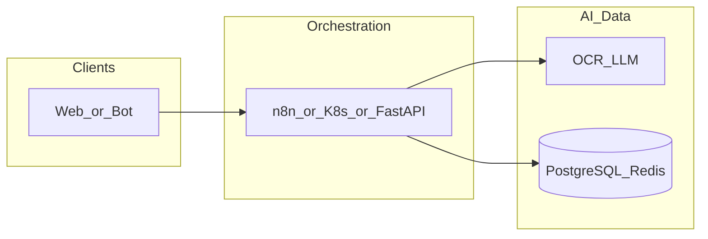

# n8n-workflow-cursor

**Path:** `D:/_sinoptics_git/n8n-workflow-cursor`  
**Category:** sinoptics-repo  
**Primary language:** SQL  
**Status:** present on disk

## 1. Purpose (2-3 lines)

# Chinese Invoice Validation System with AI Agents

## 2. Tech stack (from manifests and file-type mix)

- **Detected primary language:** SQL
- **Top-level layout:** see listing below.

### `README.md`

```
# Chinese Invoice Validation System with AI Agents

## Project Overview

This project implements a comprehensive AI-driven Chinese invoice validation system using n8n workflows. The system processes invoices from multiple sources, validates them through specialized AI agents, and generates compliance reports.

## Architecture

### Data Ingestion Sources
- **Webhook/API**: RESTful API endpoints for external system integration
- **Telegram Bot**: Direct invoice submission via Telegram
- **WeChat Bot**: Integration with WeChat Mini Programs
- **Mobile App**: Cross-platform mobile application
- **Web UI**: React-based web portal
- **Email Integration**: Automated email attachment processing
- **Cloud Storage**: Alibaba Cloud OSS monitoring
- **FTP/SFTP**: File transfer protocol monitoring

### Processing Pipeline
1. **Invoice Parsing**: OCR + LLM image-to-text processing
2. **AI Agent Validation**: 5 specialized AI agents
3. **Data Aggregation**: AI Reception Agent compilation
4. **Strategic Review**: AI General Manager approval
5. **Report Generation**: Final validated report issuance

## AI Agents

### 1. Lawyer AI Agent
- **Client Identity Verification**
- **Compliance Checking**
- **Trademark & Copyright Verification**
- **Legal Risk Assessment**

### 2. Logistics AI Agent
- **Supply Chain Management**
- **Delivery Performance Analysis**
- **Operational Status Verification**
- **Transportation Capability Assessment**

### 3. Finance AI Agent
- **Payment Control**
- **Financial Health Assessment**
- **Debt & Credit Control**
- **Tax Compliance Verification**

### 4. Marketing AI Agent
- **International Expansion Analysis**
- **Product Portfolio Review**
- **Export Code Verification**
- **Market Presence Assessment**

### 5. Accounting AI Agent
- **Calculation Verification**
- **Currency & Date Validation**
- **Invoice Completeness Check**
- **Tax Registration Verification**

## API Integrations

### Tianyancha APIs
- Enterprise Information Query
- Risk Assessment
- Legal Status Verification
- Financial Data Retrieval

### QCC APIs
- Company Registration Data
- Credit Rating Information
- Business Scope Verification
- Tax Registration Details

## Deployment

- **Cloud Platform**: Alibaba Cloud
- **Workflow Engine**: n8n Cloud (https://yofi-ai.app.n8n.cloud/)
- **Database**: PostgreSQL + Redis
- **Storage**: Alibaba Cloud OSS
- **Monitoring**: Prometheus + Grafana

## Getting Started

1. Clone the repository
2. Configure environment variables
3. Deploy to Alibaba Cloud
4. Import workflows to n8n
5. Configure API credentials
6. Start the system

## License

MIT License
```

### `readme.md`

```
# Chinese Invoice Validation System with AI Agents

## Project Overview

This project implements a comprehensive AI-driven Chinese invoice validation system using n8n workflows. The system processes invoices from multiple sources, validates them through specialized AI agents, and generates compliance reports.

## Architecture

### Data Ingestion Sources
- **Webhook/API**: RESTful API endpoints for external system integration
- **Telegram Bot**: Direct invoice submission via Telegram
- **WeChat Bot**: Integration with WeChat Mini Programs
- **Mobile App**: Cross-platform mobile application
- **Web UI**: React-based web portal
- **Email Integration**: Automated email attachment processing
- **Cloud Storage**: Alibaba Cloud OSS monitoring
- **FTP/SFTP**: File transfer protocol monitoring

### Processing Pipeline
1. **Invoice Parsing**: OCR + LLM image-to-text processing
2. **AI Agent Validation**: 5 specialized AI agents
3. **Data Aggregation**: AI Reception Agent compilation
4. **Strategic Review**: AI General Manager approval
5. **Report Generation**: Final validated report issuance

## AI Agents

### 1. Lawyer AI Agent
- **Client Identity Verification**
- **Compliance Checking**
- **Trademark & Copyright Verification**
- **Legal Risk Assessment**

### 2. Logistics AI Agent
- **Supply Chain Management**
- **Delivery Performance Analysis**
- **Operational Status Verification**
- **Transportation Capability Assessment**

### 3. Finance AI Agent
- **Payment Control**
- **Financial Health Assessment**
- **Debt & Credit Control**
- **Tax Compliance Verification**

### 4. Marketing AI Agent
- **International Expansion Analysis**
- **Product Portfolio Review**
- **Export Code Verification**
- **Market Presence Assessment**

### 5. Accounting AI Agent
- **Calculation Verification**
- **Currency & Date Validation**
- **Invoice Completeness Check**
- **Tax Registration Verification**

## API Integrations

### Tianyancha APIs
- Enterprise Information Query
- Risk Assessment
- Legal Status Verification
- Financial Data Retrieval

### QCC APIs
- Company Registration Data
- Credit Rating Information
- Business Scope Verification
- Tax Registration Details

## Deployment

- **Cloud Platform**: Alibaba Cloud
- **Workflow Engine**: n8n Cloud (https://yofi-ai.app.n8n.cloud/)
- **Database**: PostgreSQL + Redis
- **Storage**: Alibaba Cloud OSS
- **Monitoring**: Prometheus + Grafana

## Getting Started

1. Clone the repository
2. Configure environment variables
3. Deploy to Alibaba Cloud
4. Import workflows to n8n
5. Configure API credentials
6. Start the system

## License

MIT License
```

### `Readme.md`

```
# Chinese Invoice Validation System with AI Agents

## Project Overview

This project implements a comprehensive AI-driven Chinese invoice validation system using n8n workflows. The system processes invoices from multiple sources, validates them through specialized AI agents, and generates compliance reports.

## Architecture

### Data Ingestion Sources
- **Webhook/API**: RESTful API endpoints for external system integration
- **Telegram Bot**: Direct invoice submission via Telegram
- **WeChat Bot**: Integration with WeChat Mini Programs
- **Mobile App**: Cross-platform mobile application
- **Web UI**: React-based web portal
- **Email Integration**: Automated email attachment processing
- **Cloud Storage**: Alibaba Cloud OSS monitoring
- **FTP/SFTP**: File transfer protocol monitoring

### Processing Pipeline
1. **Invoice Parsing**: OCR + LLM image-to-text processing
2. **AI Agent Validation**: 5 specialized AI agents
3. **Data Aggregation**: AI Reception Agent compilation
4. **Strategic Review**: AI General Manager approval
5. **Report Generation**: Final validated report issuance

## AI Agents

### 1. Lawyer AI Agent
- **Client Identity Verification**
- **Compliance Checking**
- **Trademark & Copyright Verification**
- **Legal Risk Assessment**

### 2. Logistics AI Agent
- **Supply Chain Management**
- **Delivery Performance Analysis**
- **Operational Status Verification**
- **Transportation Capability Assessment**

### 3. Finance AI Agent
- **Payment Control**
- **Financial Health Assessment**
- **Debt & Credit Control**
- **Tax Compliance Verification**

### 4. Marketing AI Agent
- **International Expansion Analysis**
- **Product Portfolio Review**
- **Export Code Verification**
- **Market Presence Assessment**

### 5. Accounting AI Agent
- **Calculation Verification**
- **Currency & Date Validation**
- **Invoice Completeness Check**
- **Tax Registration Verification**

## API Integrations

### Tianyancha APIs
- Enterprise Information Query
- Risk Assessment
- Legal Status Verification
- Financial Data Retrieval

### QCC APIs
- Company Registration Data
- Credit Rating Information
- Business Scope Verification
- Tax Registration Details

## Deployment

- **Cloud Platform**: Alibaba Cloud
- **Workflow Engine**: n8n Cloud (https://yofi-ai.app.n8n.cloud/)
- **Database**: PostgreSQL + Redis
- **Storage**: Alibaba Cloud OSS
- **Monitoring**: Prometheus + Grafana

## Getting Started

1. Clone the repository
2. Configure environment variables
3. Deploy to Alibaba Cloud
4. Import workflows to n8n
5. Configure API credentials
6. Start the system

## License

MIT License
```


## 3. Architecture



- **Inbound:** HTTP (API Gateway / ALB), scheduled triggers, queues (SQS/SNS), EventBridge rules, or batch — infer from `stacks/`, `template.yaml`, `sst.config.ts`, or `src/` handlers.
- **Outbound:** databases and external HTTP APIs per layers and `package.json` / Python imports in handlers.
- **IaC pattern:** SST/CDK, SAM/CloudFormation, Pulumi, Helm, Terraform, or raw scripts — see manifests section.

## 4. Key files (auto-discovered)

- **Top-level entries:**

```
.cursor
.vscode
DEPLOYMENT_GUIDE.md
PROJECT_SUMMARY.md
README.md
api-configurations
architecture
database
deployment
n8n-workflow-cursor-local
n8n-workflows
project-structure.md
templates
test-subproject
test-subproject-ai
```

## 5. My contribution / role (evidence from git history — if available)

```text
46ceb30 2025-10-29 add local model
6c62bf1 2025-10-27 first
```

_Use commit messages only as hints; corroborate in interviews._

## 6. Notable patterns / snippets

_No snippet candidates matched (handler.py / stack.ts / template.yaml etc.). Expand manually after opening the repo._

## 7. Metrics / SLO / scale (if available)

_Extract from Airflow DAG params, load tests, README, or CloudFormation `ReservedConcurrentExecutions` when present — not auto-inferred to avoid fabrication._

## 8. Resume bullets (ready-to-paste, English)

- Owned or extended **`n8n-workflow-cursor`** capabilities aligned with **sinoptics repo** delivery.
- Applied **SQL** stack patterns and repository-local IaC/config where present.
- Collaborated on production-grade defaults: structured logging, retries, and least-privilege IAM patterns where applicable.
- Integrated with **Sinoptics** platform services (data stores, queues, gateways) per dependency manifests in-repo.
- Documented operational expectations (deploy, test, local dev) via README and automation files when available.

## 9. Interview talking points

- What is the main entrypoint and trigger for `n8n-workflow-cursor`?
- How are secrets and non-prod environments separated?
- What failure modes are handled (retries, DLQ, idempotency)?
- How would you observe this service in production (metrics, logs, traces)?
