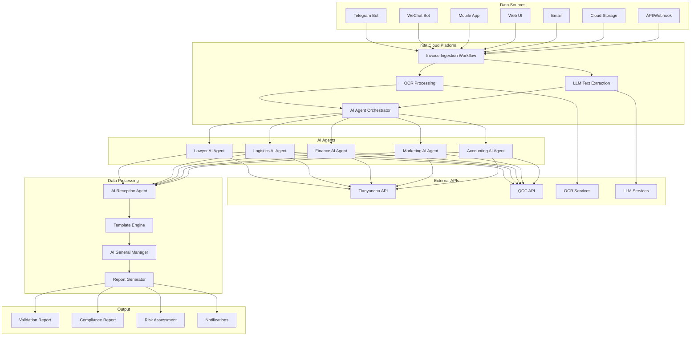

# system-architecture.md (repo root file)

**Path:** `D:/_sinoptics_git/system-architecture.md`  
**Category:** architecture-reference  
**Primary language:** Markdown / Mermaid  

## Full copy (truncated if huge)

```markdown
# System Architecture

## High-Level Architecture



## Component Details

### 1. Data Ingestion Layer
- **Multiple Entry Points**: Support for various invoice submission methods
- **Format Standardization**: Convert all inputs to common format
- **Validation**: Basic format and content validation
- **Queue Management**: Handle high-volume processing

### 2. Processing Layer
- **OCR Engine**: Extract text from invoice images
- **LLM Processing**: Enhanced text understanding and structuring
- **Data Enrichment**: Add metadata and context

### 3. AI Agent Layer
- **Specialized Agents**: Each agent handles specific validation aspects
- **Parallel Processing**: Agents work simultaneously for efficiency
- **API Integration**: Connect to external data sources
- **Decision Making**: AI-powered validation logic

#### 3.1 AI Agent Orchestrator
- **Workflow Coordination**: Receives normalized inputs from upstream workflows and dispatches them to the appropriate agents.
- **Load Balancing**: Dynamically distributes workloads across agents based on queue depth and response latency.
- **Policy Enforcement**: Applies routing rules, SLA thresholds, and escalation triggers before and after agent execution.

#### 3.2 Specialized Agent Pods
- **Domain Expertise**: Lawyer, Logistics, Finance, Marketing, and Accounting agents encapsulate domain-specific validation rules.
- **Microservice Isolation**: Each agent pod runs independently with its own scaling rules and retry logic.
- **Shared Tooling**: Accesses a common prompt library, retrieval layer, and telemetry collectors to ensure consistent reasoning quality.

#### 3.3 External Intelligence Connectors
- **API Abstraction**: Wraps Tianyancha, QCC, and other due-diligence APIs behind a unified connector interface.
- **Caching & Throttling**: Implements adaptive caching and rate limiting to control third-party API usage.
- **Data Normalization**: Harmonizes external responses into agent-friendly schemas for downstream aggregation.

### 4. Aggregation Layer
- **Data Compilation**: Combine results from all agents
- **Template Application**: Format data according to business rules
- **Quality Control**: Ensure data consistency and completeness

#### 4.1 AI Reception Agent
- **Result Intake**: Collects agent outputs, metadata, and error states into an enriched message envelope.
- **Signal Prioritization**: Scores findings based on severity, confidence, and downstream dependencies.
- **State Management**: Persists intermediate artifacts to Redis for idempotent replays.

#### 4.2 Template Engine
- **Dynamic Layouts**: Applies context-aware templates driven by customer profiles and jurisdiction rules.
- **Component Library**: Reuses modular snippets for tables, charts, and narrative summaries to ensure consistency.
- **Validation Hooks**: Runs schema validation and business-rule assertions before synthesis.

#### 4.3 AI General Manager
- **Cross-Agent Reasoning**: Resolves conflicts, merges overlapping insights, and flags ambiguous findings.
- **Decision Matrices**: Applies weighted scoring models to recommend approval, rejection, or escalation.
- **Feedback Loop**: Feeds anomalies back to the orchestrator for retraining or reprocessing.

#### 4.4 Report Generator
- **Multi-Format Output**: Produces PDF, HTML, and structured JSON packages for downstream consumers.
- **Localization**: Injects multilingual content and regional compliance notices when required.
- **Delivery Routing**: Publishes final artifacts to storage, email, chatbots, and web portals.

### 5. Approval Layer
- **Strategic Review**: High-level business rule validation
- **Correction Loop**: Handle discrepancies and re-processing
- **Final Approval**: Authorize report generation

#### 5.1 Strategic Review Console
- **Human-in-the-Loop UI**: Presents prioritized findings, raw evidence, and agent rationales for rapid triage.
- **Playbook Guidance**: Suggests recommended actions and next steps based on historical decisions.
- **Access Controls**: Enforces RBAC policies with audit-grade logging of reviewer interactions.

#### 5.2 Correction Loop Manager
- **Issue Tracking**: Captures reviewer comments, required follow-ups, and resolution states.
- **Automated Reprocessing**: Triggers targeted agent reruns or full workflow restarts based on correction type.
- **Compliance Checks**: Verifies that remedial actions satisfy regulatory and contractual obligations.

#### 5.3 Final Approval Gateway
- **Decision Recording**: Stores approval, rejection, or escalation outcomes with digital signatures.
- **Downstream Notifications**: Emits events for ERP updates, customer alerts, and archival pipelines.
- **Post-Mortem Hooks**: Initiates retrospectives for repeated issues and feeds insights into continuous improvement backlogs.

### 6. Output Layer
- **Report Generation**: Create standardized reports
- **Distribution**: Send reports to stakeholders
- **Archiving**: Store for future reference

## Technology Stack

### Core Technologies
- **n8n**: Workflow orchestration
- **Node.js**: Runtime environment
- **PostgreSQL**: Primary database
- **Redis**: Caching and session management

### AI/ML Technologies
- **OpenAI GPT**: LLM processing
- **Tesseract OCR**: Text extraction
- **Custom AI Models**: Specialized validation logic

### Cloud Infrastructure
- **Alibaba Cloud**: Primary hosting platform
- **n8n Cloud**: Workflow hosting
- **OSS**: File storage
- **RDS**: Database hosting

### APIs and Integrations
- **Tianyancha API**: Company verification
- **QCC API**: Business data
- **Telegram Bot API**: Chat integration
- **WeChat API**: Chinese market integration

## Security Architecture

### Data Protection
- **Encryption at Rest**: All stored data encrypted
- **Encryption in Transit**: HTTPS/TLS for all communications
- **Key Management**: Secure key storage and rotation

### Access Control
- **Role-Based Access Control (RBAC)**: Granular permissions
- **API Authentication**: Secure API access
- **Audit Logging**: Track all system activities

### Compliance
- **Chinese Data Laws**: Compliance with local regulations
- **GDPR**: European data protection compliance
- **SOC 2**: Security and availability standards

## Scalability Considerations

### Horizontal Scaling
- **Load Balancing**: Distribute traffic across instances
- **Microservices**: Independent scaling of components
- **Queue Management**: Handle peak loads efficiently

### Performance Optimization
- **Caching**: Reduce API calls and processing time
- **Database Optimization**: Efficient queries and indexing
- **CDN**: Fast content delivery

### Monitoring and Alerting
- **Real-time Monitoring**: Track system health
- **Performance Metrics**: Monitor response times and throughput
- **Error Tracking**: Identify and resolve issues quickly
```

## 8. Resume bullets

- Documented **end-to-end invoice / compliance automation** architecture spanning **n8n**, **OCR**, **LLM**, specialized **AI agents**, and external **API connectors** (e.g. Tianyancha, QCC).
- Captured **security and compliance** themes: encryption at rest/in transit, **RBAC**, audit logging, GDPR and regional data-law awareness in design narrative.
- Described **scalability** patterns: horizontal scaling, queues, caching, monitoring and alerting at platform level.

## 9. Interview talking points

- How does the orchestrator route work across agents under load?
- Where is human-in-the-loop enforced and how are corrections replayed idempotently?
- What third-party dependencies are rate-limited or cached?
