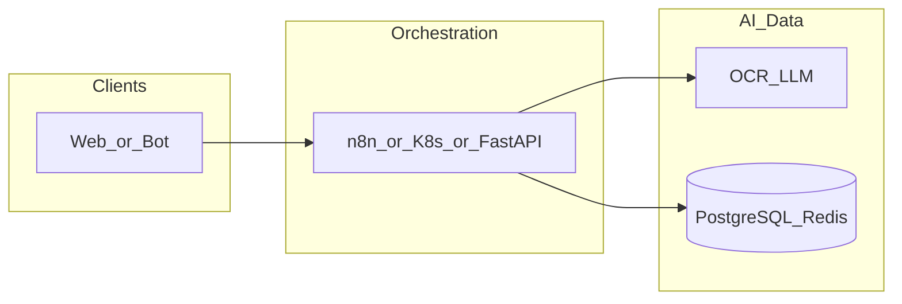

# yandex-cloud-env

**Path:** `D:/_sinoptics_git/yandex-cloud-env`  
**Category:** sinoptics-repo  
**Primary language:** YAML  
**Status:** present on disk

## 1. Purpose (2-3 lines)

# Yandex Cloud Environment for Sinoptics Platform

Production-ready infrastructure provisioning for Sinoptics platform on Yandex Cloud using GitHub Actions CI/CD.

## 2. Tech stack (from manifests and file-type mix)

- **Detected primary language:** YAML
- **Top-level layout:** see listing below.

### `README.md`

```
# Yandex Cloud Environment for Sinoptics Platform

Production-ready infrastructure provisioning for Sinoptics platform on Yandex Cloud using GitHub Actions CI/CD.

## Overview

This repository contains a fully automated CI/CD pipeline that provisions and manages the entire Yandex Cloud environment for the Sinoptics platform. All infrastructure is created and managed exclusively through GitHub Actions workflows, without any shell scripts or manual intervention.

## Features

- ✅ **Fully Automated**: Zero manual steps after initial push
- ✅ **Infrastructure as Code**: All resources defined in GitHub Actions workflows
- ✅ **OIDC Federation**: Secure authentication via GitHub Actions OIDC tokens
- ✅ **Secrets Management**: All secrets stored in GitHub Organization Secrets
- ✅ **Idempotent**: Safe to run multiple times (creates or updates resources)
- ✅ **Auditable**: Complete configuration reports generated automatically

## Prerequisites

1. **GitHub Organization Secrets** configured:
   - `YC_OAUTH_TOKEN` - OAuth token for Yandex Cloud API access
   - Location: https://github.com/organizations/SinopticsAI/settings/secrets/actions

2. **Yandex Cloud Account** with:
   - Cloud ID: `b1gip1vv7381q4bsoaso`
   - Folder ID: `b1g07nbj3q7ccru38on0`
   - Organization ID: `bpf7008tn8k2q9lav22a`

3. **SSL Certificates** (optional):
   - Place certificate files in `certs/wildcard-sinoptics-ru/` and `certs/sinoptics-ru-ssl/`
   - Certificates will be automatically uploaded to Yandex Certificate Manager

## CI/CD Flow

The workflow is triggered automatically on:
- Push to `main` branch
- Manual trigger via `workflow_dispatch`

### Workflow Steps

1. **Authentication**: Configures Yandex Cloud CLI using OAuth token
2. **Service Accounts**: Creates and configures IAM service accounts with required roles
3. **OIDC Federation**: Sets up federation for GitHub Actions authentication
4. **Object Storage**: Creates public hosting buckets and private storage buckets
5. **SSL Certificates**: Uploads certificates to Yandex Certificate Manager
6. **DNS Configuration**: Creates DNS zone and records for sinoptics.ru domain
7. **Configuration Report**: Generates comprehensive report of all created resources

## OIDC Security Model

The infrastructure uses OIDC Federation to enable secure authentication from GitHub Actions without storing static credentials:

1. **Federation Setup**: SAML/OIDC federation configured in Yandex Cloud Organization
2. **Service Account Binding**: Federation bound to `storage-ci-cd` and `admin-sa` service accounts
3. **GitHub Actions Integration**: Workflows authenticate using GitHub's OIDC provider
4. **Zero Static Secrets**: No long-lived credentials stored in code or secrets

### Future OIDC Usage

Once the federation is configured, future workflows can authenticate using:

```yaml
- name: Authenticate via OIDC
  uses: yandex-cloud/actions-oidc-auth@v1
  with:
    federation-id: ${{ secrets.YC_FEDERATION_ID }}
    service-account-id: ${{ secrets.YC_SERVICE_ACCOUNT_ID }}
```

## Repository Structure

```
.
├── .github/
│   └── workflows/
│       └── ya

…(truncated)…
```

### `readme.md`

```
# Yandex Cloud Environment for Sinoptics Platform

Production-ready infrastructure provisioning for Sinoptics platform on Yandex Cloud using GitHub Actions CI/CD.

## Overview

This repository contains a fully automated CI/CD pipeline that provisions and manages the entire Yandex Cloud environment for the Sinoptics platform. All infrastructure is created and managed exclusively through GitHub Actions workflows, without any shell scripts or manual intervention.

## Features

- ✅ **Fully Automated**: Zero manual steps after initial push
- ✅ **Infrastructure as Code**: All resources defined in GitHub Actions workflows
- ✅ **OIDC Federation**: Secure authentication via GitHub Actions OIDC tokens
- ✅ **Secrets Management**: All secrets stored in GitHub Organization Secrets
- ✅ **Idempotent**: Safe to run multiple times (creates or updates resources)
- ✅ **Auditable**: Complete configuration reports generated automatically

## Prerequisites

1. **GitHub Organization Secrets** configured:
   - `YC_OAUTH_TOKEN` - OAuth token for Yandex Cloud API access
   - Location: https://github.com/organizations/SinopticsAI/settings/secrets/actions

2. **Yandex Cloud Account** with:
   - Cloud ID: `b1gip1vv7381q4bsoaso`
   - Folder ID: `b1g07nbj3q7ccru38on0`
   - Organization ID: `bpf7008tn8k2q9lav22a`

3. **SSL Certificates** (optional):
   - Place certificate files in `certs/wildcard-sinoptics-ru/` and `certs/sinoptics-ru-ssl/`
   - Certificates will be automatically uploaded to Yandex Certificate Manager

## CI/CD Flow

The workflow is triggered automatically on:
- Push to `main` branch
- Manual trigger via `workflow_dispatch`

### Workflow Steps

1. **Authentication**: Configures Yandex Cloud CLI using OAuth token
2. **Service Accounts**: Creates and configures IAM service accounts with required roles
3. **OIDC Federation**: Sets up federation for GitHub Actions authentication
4. **Object Storage**: Creates public hosting buckets and private storage buckets
5. **SSL Certificates**: Uploads certificates to Yandex Certificate Manager
6. **DNS Configuration**: Creates DNS zone and records for sinoptics.ru domain
7. **Configuration Report**: Generates comprehensive report of all created resources

## OIDC Security Model

The infrastructure uses OIDC Federation to enable secure authentication from GitHub Actions without storing static credentials:

1. **Federation Setup**: SAML/OIDC federation configured in Yandex Cloud Organization
2. **Service Account Binding**: Federation bound to `storage-ci-cd` and `admin-sa` service accounts
3. **GitHub Actions Integration**: Workflows authenticate using GitHub's OIDC provider
4. **Zero Static Secrets**: No long-lived credentials stored in code or secrets

### Future OIDC Usage

Once the federation is configured, future workflows can authenticate using:

```yaml
- name: Authenticate via OIDC
  uses: yandex-cloud/actions-oidc-auth@v1
  with:
    federation-id: ${{ secrets.YC_FEDERATION_ID }}
    service-account-id: ${{ secrets.YC_SERVICE_ACCOUNT_ID }}
```

## Repository Structure

```
.
├── .github/
│   └── workflows/
│       └── ya

…(truncated)…
```

### `Readme.md`

```
# Yandex Cloud Environment for Sinoptics Platform

Production-ready infrastructure provisioning for Sinoptics platform on Yandex Cloud using GitHub Actions CI/CD.

## Overview

This repository contains a fully automated CI/CD pipeline that provisions and manages the entire Yandex Cloud environment for the Sinoptics platform. All infrastructure is created and managed exclusively through GitHub Actions workflows, without any shell scripts or manual intervention.

## Features

- ✅ **Fully Automated**: Zero manual steps after initial push
- ✅ **Infrastructure as Code**: All resources defined in GitHub Actions workflows
- ✅ **OIDC Federation**: Secure authentication via GitHub Actions OIDC tokens
- ✅ **Secrets Management**: All secrets stored in GitHub Organization Secrets
- ✅ **Idempotent**: Safe to run multiple times (creates or updates resources)
- ✅ **Auditable**: Complete configuration reports generated automatically

## Prerequisites

1. **GitHub Organization Secrets** configured:
   - `YC_OAUTH_TOKEN` - OAuth token for Yandex Cloud API access
   - Location: https://github.com/organizations/SinopticsAI/settings/secrets/actions

2. **Yandex Cloud Account** with:
   - Cloud ID: `b1gip1vv7381q4bsoaso`
   - Folder ID: `b1g07nbj3q7ccru38on0`
   - Organization ID: `bpf7008tn8k2q9lav22a`

3. **SSL Certificates** (optional):
   - Place certificate files in `certs/wildcard-sinoptics-ru/` and `certs/sinoptics-ru-ssl/`
   - Certificates will be automatically uploaded to Yandex Certificate Manager

## CI/CD Flow

The workflow is triggered automatically on:
- Push to `main` branch
- Manual trigger via `workflow_dispatch`

### Workflow Steps

1. **Authentication**: Configures Yandex Cloud CLI using OAuth token
2. **Service Accounts**: Creates and configures IAM service accounts with required roles
3. **OIDC Federation**: Sets up federation for GitHub Actions authentication
4. **Object Storage**: Creates public hosting buckets and private storage buckets
5. **SSL Certificates**: Uploads certificates to Yandex Certificate Manager
6. **DNS Configuration**: Creates DNS zone and records for sinoptics.ru domain
7. **Configuration Report**: Generates comprehensive report of all created resources

## OIDC Security Model

The infrastructure uses OIDC Federation to enable secure authentication from GitHub Actions without storing static credentials:

1. **Federation Setup**: SAML/OIDC federation configured in Yandex Cloud Organization
2. **Service Account Binding**: Federation bound to `storage-ci-cd` and `admin-sa` service accounts
3. **GitHub Actions Integration**: Workflows authenticate using GitHub's OIDC provider
4. **Zero Static Secrets**: No long-lived credentials stored in code or secrets

### Future OIDC Usage

Once the federation is configured, future workflows can authenticate using:

```yaml
- name: Authenticate via OIDC
  uses: yandex-cloud/actions-oidc-auth@v1
  with:
    federation-id: ${{ secrets.YC_FEDERATION_ID }}
    service-account-id: ${{ secrets.YC_SERVICE_ACCOUNT_ID }}
```

## Repository Structure

```
.
├── .github/
│   └── workflows/
│       └── ya

…(truncated)…
```


## 3. Architecture



- **Inbound:** HTTP (API Gateway / ALB), scheduled triggers, queues (SQS/SNS), EventBridge rules, or batch — infer from `stacks/`, `template.yaml`, `sst.config.ts`, or `src/` handlers.
- **Outbound:** databases and external HTTP APIs per layers and `package.json` / Python imports in handlers.
- **IaC pattern:** SST/CDK, SAM/CloudFormation, Pulumi, Helm, Terraform, or raw scripts — see manifests section.

## 4. Key files (auto-discovered)

- **Top-level entries:**

```
.github
.gitignore
.vscode
README.md
api-gateway
certs
docs
prompt.md
reports
```

## 5. My contribution / role (evidence from git history — if available)

```text
85407dd 2026-01-07 Update repository
eae9a2a 2026-01-05 Update Yandex Cloud configuration report [skip ci]
8bcde82 2026-01-05 Update repository
b7fd129 2026-01-05 Update repository
6bbdcf2 2026-01-05 Add new files
88e3a37 2026-01-05 Update repository
d99e495 2026-01-05 Add new files
ea8ab4f 2026-01-04 Add new files
```

_Use commit messages only as hints; corroborate in interviews._

## 6. Notable patterns / snippets

_No snippet candidates matched (handler.py / stack.ts / template.yaml etc.). Expand manually after opening the repo._

## 7. Metrics / SLO / scale (if available)

_Extract from Airflow DAG params, load tests, README, or CloudFormation `ReservedConcurrentExecutions` when present — not auto-inferred to avoid fabrication._

## 8. Resume bullets (ready-to-paste, English)

- Owned or extended **`yandex-cloud-env`** capabilities aligned with **sinoptics repo** delivery.
- Applied **YAML** stack patterns and repository-local IaC/config where present.
- Collaborated on production-grade defaults: structured logging, retries, and least-privilege IAM patterns where applicable.
- Integrated with **Sinoptics** platform services (data stores, queues, gateways) per dependency manifests in-repo.
- Documented operational expectations (deploy, test, local dev) via README and automation files when available.

## 9. Interview talking points

- What is the main entrypoint and trigger for `yandex-cloud-env`?
- How are secrets and non-prod environments separated?
- What failure modes are handled (retries, DLQ, idempotency)?
- How would you observe this service in production (metrics, logs, traces)?
