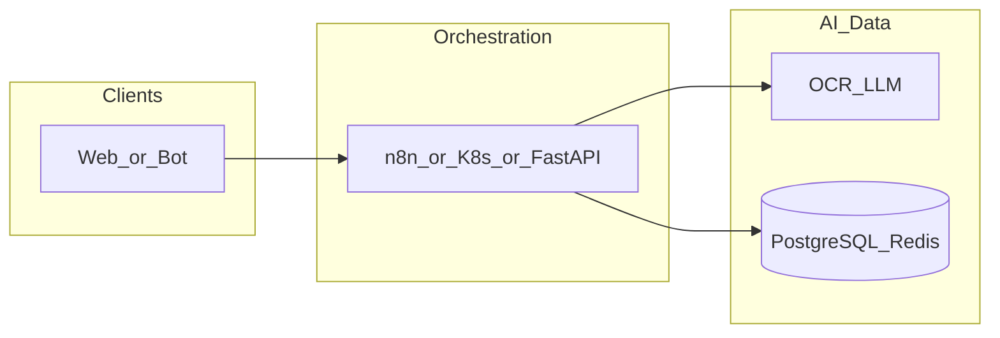

# yandex-cloud-functions

**Path:** `D:/_sinoptics_git/yandex-cloud-functions`  
**Category:** sinoptics-repo  
**Primary language:** TypeScript  
**Status:** present on disk

## 1. Purpose (2-3 lines)

Internal **Sinoptics** repository `yandex-cloud-functions` under category **sinoptics-repo**. Supports Yofi/Botnot platform capabilities (e-commerce intelligence, anti-fraud adjacent services, data plane, or infrastructure) as evidenced by repository layout and manifests.

## 2. Tech stack (from manifests and file-type mix)

- **Detected primary language:** TypeScript
- **Top-level layout:** see listing below.

_No common manifest files found at repository root._


## 3. Architecture



- **Inbound:** HTTP (API Gateway / ALB), scheduled triggers, queues (SQS/SNS), EventBridge rules, or batch — infer from `stacks/`, `template.yaml`, `sst.config.ts`, or `src/` handlers.
- **Outbound:** databases and external HTTP APIs per layers and `package.json` / Python imports in handlers.
- **IaC pattern:** SST/CDK, SAM/CloudFormation, Pulumi, Helm, Terraform, or raw scripts — see manifests section.

## 4. Key files (auto-discovered)

- **Top-level entries:**

```
.cursor
.github
.gitignore
.pytest_cache
.vscode
config
doc
frontend_template
invoice
prompts
pytest.ini
scr
sql
tests
tmp-body.json
```

## 5. My contribution / role (evidence from git history — if available)

```text
aac40ef 2026-04-29 report design
8398c96 2026-04-29 remove payload from log
455adb8 2026-04-27 change report 2
d10b0fc 2026-04-27 change report
37b57b3 2026-04-22 increase time out
aeb5daf 2026-04-22 auth bulling 4
38ef8f6 2026-04-22 auth bulling 3
a45454f 2026-04-22 auth bulling 2
```

_Use commit messages only as hints; corroborate in interviews._

## 6. Notable patterns / snippets

_No snippet candidates matched (handler.py / stack.ts / template.yaml etc.). Expand manually after opening the repo._

## 7. Metrics / SLO / scale (if available)

_Extract from Airflow DAG params, load tests, README, or CloudFormation `ReservedConcurrentExecutions` when present — not auto-inferred to avoid fabrication._

## 8. Resume bullets (ready-to-paste, English)

- Owned or extended **`yandex-cloud-functions`** capabilities aligned with **sinoptics repo** delivery.
- Applied **TypeScript** stack patterns and repository-local IaC/config where present.
- Collaborated on production-grade defaults: structured logging, retries, and least-privilege IAM patterns where applicable.
- Integrated with **Sinoptics** platform services (data stores, queues, gateways) per dependency manifests in-repo.
- Documented operational expectations (deploy, test, local dev) via README and automation files when available.

## 9. Interview talking points

- What is the main entrypoint and trigger for `yandex-cloud-functions`?
- How are secrets and non-prod environments separated?
- What failure modes are handled (retries, DLQ, idempotency)?
- How would you observe this service in production (metrics, logs, traces)?
