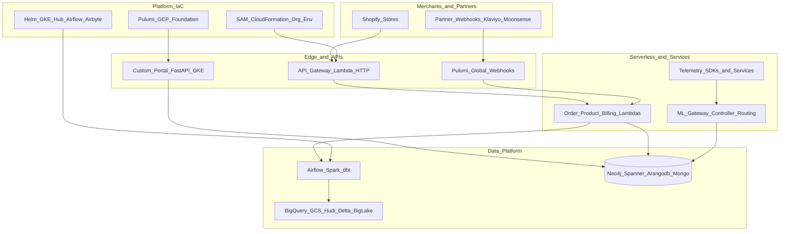

# Yofi Inc. (Botnot platform) — experience knowledge base

**Role (canonical):** Data Engineer — Yofi Inc. (USA)  
**Period:** February 2022 — October 2025  
**Product context:** Anti-fraud / customer intelligence for **Shopify** merchants (enterprise customers including **Lululemon**). Internal engineering codebases live under local mirror `D:\botnot\` (not public GitHub).

**Companion resume template (structure + phrasing baseline):** [Backend_Engineer_Constructor_RetailMedia_EN.md](../backend%20engineer/Backend_Engineer_Constructor_RetailMedia_EN.md)

---

## 1. Architecture poster (category-level)

---

## 2. Stack matrix (grounded in repo families)

| Layer | Representative technologies (see per-repo manifests) |
|-------|------------------------------------------------------|
| **Languages** | Python, TypeScript/JavaScript (SST/CDK/Node Lambdas), Go (telemetry), SQL (dbt / central definitions) |
| **AWS** | API Gateway, Lambda, S3, SQS/SNS, EventBridge, RDS, Secrets Manager, SAM/CloudFormation, CDK/SST |
| **GCP** | GKE, BigQuery, GCS, Spanner, Pub/Sub, Cloud Build, Pulumi (Python), Knative-oriented gateway services |
| **Data** | Airflow, Spark, dbt, Airbyte fork/custom sources, Beam/Dataflow patterns |
| **Stores** | MongoDB, PostgreSQL/RDS, Redis (incl. cluster client in layers), Neo4j, ArangoDB, Spanner, BigQuery |
| **Frontend / DX** | Svelte portal, Vue admin, Slack admin bot, GitBook docs |
| **Quality** | Jest (where present), Robot Framework serverless tests, internal integration-test env stacks |

---

## 3. Metrics and scale (only use when corroborated)

- **Data-plane scale claims** (e.g. **1B+** events, **~25** production DAGs, lakehouse patterns) appear in consolidated resume narrative — **verify in** [Yofi-airflow-dags.md](data-engineering/Yofi-airflow-dags.md), [Yofi-Spark-jobs.md](data-engineering/Yofi-Spark-jobs.md), and related DAG/SQL artifacts before citing in a new resume draft.
- **Per-service concurrency / SLO**: extract from `template.yaml`, `serverless.yml`, Airflow `default_args`, or load-test docs inside each repository file below — **do not invent.**

---

## 4. Bullet bank (reuse and trim per JD)

Each line is tagged for filtering. Copy only bullets you can defend with repo evidence.

| Tags | Bullet |
|------|--------|
| `#aws` `#sst` `#api` | Delivered **serverless API** surfaces with **SST + AWS CDK** and **API Gateway v2**, combining **Node.js** handlers and **Python Lambda layers** for persistence and integrations. |
| `#aws` `#lambda` `#mongodb` | Built **Python Lambda** services with **PyMongo**, **Redis** cluster client, **Neo4j**, **BigQuery** / **Spanner** / **Firestore** clients where required by domain handlers. |
| `#gcp` `#fastapi` `#k8s` | Owned **FastAPI + Uvicorn** services on **GCP** with **Kubernetes** integration, **Spanner**, **Redis** (Memorystore TLS patterns in docs), **Secret Manager**, and **JWT** admin APIs. |
| `#pulumi` `#iac` | Maintained **Pulumi (Python)** stacks for **global webhook ingress** with **GitHub Actions** CI/CD and reproducible dev workflows (`uv`, `just` where present). |
| `#telemetry` `#k8s` `#prometheus` | Extended **telemetry platform** components with **Helm**-based **Prometheus**/**Grafana** documentation and mixed **Go** / **TypeScript** services packaged to **ECR**. |
| `#ml` `#sqs` `#sns` | Implemented **ML routing** via **SNS + SQS**-triggered **Python Lambda** with model selection and **MongoDB** shadow prediction writes per internal service design. |
| `#billing` `#shopify` | Built **billing quota validation** and **billing flags** Lambdas with shared layers for cloud SDKs and datastore access. |
| `#orders` `#graph` | Delivered **order persistence** and **state prediction** pipelines using **PyMongo** and **Gremlin**/graph-related dependencies in persistence layers. |
| `#gke` `#helm` `#oauth` | Operated **GKE hub** service via **Helm**, **OAuth2/Okta** integration for **Airflow** / **Airbyte**, and **GitHub Actions** deploy workflows; **Terraform** workflow documented alongside hub. |
| `#sam` `#cloudformation` | Contributed to **org-wide AWS environment** templates (**SAM/CloudFormation**) including **Slack** routing parameters for operational alerts. |
| `#vpc` `#network` | Tuned **VPC** stacks via **CloudFormation + SAM** patterns documented in infra repositories. |
| `#shopify` `#webhooks` | Integrated **Shopify** webhooks and HMAC validation patterns across gateway and exporter services. |
| `#airflow` `#spark` | Ran production **Airflow** DAGs and **Spark** workloads on **Kubernetes** with **GCS**, **BigLake**, **Hudi/Delta** table formats. |
| `#dbt` | Authored or reviewed **dbt** models and tests in [yofi-dbt-models.md](data-engineering/yofi-dbt-models.md). |
| `#airbyte` | Extended **Airbyte** connectors (Klaviyo sources, forked platform) and connection automation Lambdas. |
| `#integrations` | Built **partner** and **Moonpay/Moonsense** webhook ingestion services with validation and routing. |
| `#ml` `#features` | Shipped **feature analytics**, **interaction**, and **realtime severity** services feeding downstream ML and risk workflows. |
| `#telemetry` `#sdk` | Published and maintained **telemetry SDKs** (web, lite) and **injector** tooling for client-side signal capture. |
| `#frontend` | Contributed to **merchant/admin portals** (Svelte, Vue) and **Slack** admin bot workflows. |
| `#docs` | Maintained **GitBook** documentation and **OpenAPI**-adjacent tooling for internal API consumers. |
| `#testing` | Added **serverless Robot Framework** harnesses and integration-test environment stacks for regression coverage. |
| `#pulumi` `#gcp` | Built **GCP foundation** with **Pulumi** including **Pub/Sub**-driven **Shopify** webhook handlers in repository layout. |
| `#neo4j` `#spanner` `#arangodb` | Operated **graph persistence** microservices spanning **Neo4j**, **Spanner**, and **ArangoDB** persistor/formation services. |
| `#sql` | Centralized **SQL data definitions** for relational schemas shared across services. |
| `#beam` `#dataflow` | Implemented **Apache Beam**/**Dataflow** style GPS/batch processing jobs. |
| `#cdk` `#batch` | Owned **CDK** batch counter refresh jobs for scheduled aggregates. |
| `#infra` `#secrets` `#cognito` `#rds` | Delivered modular **env stacks** (Cognito, RDS, Secrets, EventBridge, EC2, VPC, static assets). |
| `#gcp` `#pulumi` | Managed **GCP base resources** via **Pulumi** for shared networking and service prerequisites. |
| `#capability` | **Cross-team enablement:** GitBook API docs, Airflow pod-task templates, training on **dbt**, **Airbyte**, **Spark** practices. |

_Additional bullets:_ derive more from section **8** inside each per-repo file under the categories below.

---

## 5. Do-not-fabricate boundary

- Do **not** claim team size, reporting line, promotion history, or revenue impact unless you have external evidence.
- Do **not** cite cloud resources (account IDs, ARNs, bucket names) from screenshots; use generic descriptions.
- Do **not** duplicate **client confidential** data samples from Mongo/Postgres dumps if ever present locally — describe **shape** of data only.
- Do **not** assert **uptime %**, **latency ms**, or **money saved** unless explicitly documented in a repo README, runbook, or ticket export you also store here.

---

## 6. Per-repository deep dives (89)

### infra

- [botnot-env-base-resources.md](infra/botnot-env-base-resources.md)
- [botnot-env-cognito-resources.md](infra/botnot-env-cognito-resources.md)
- [botnot-env-ec2-resources.md](infra/botnot-env-ec2-resources.md)
- [botnot-env-eventbridge-resources.md](infra/botnot-env-eventbridge-resources.md)
- [botnot-env-rds-res.md](infra/botnot-env-rds-res.md)
- [botnot-env-secrets-resources.md](infra/botnot-env-secrets-resources.md)
- [botnot-env-vpc-resources.md](infra/botnot-env-vpc-resources.md)
- [botnot-static-resources.md](infra/botnot-static-resources.md)
- [yofi-gcp-base-resources-pulumi.md](infra/yofi-gcp-base-resources-pulumi.md)
- [botnot-integration-test-environment.md](infra/botnot-integration-test-environment.md)

### api-gateways

- [botnot-backend-swagger-api-proxing-.md](api-gateways/botnot-backend-swagger-api-proxing-.md)
- [botnot-documentation-api-stack.md](api-gateways/botnot-documentation-api-stack.md)
- [botnot-lambda-admin-api.md](api-gateways/botnot-lambda-admin-api.md)
- [botnot-lambda-api-gateway.md](api-gateways/botnot-lambda-api-gateway.md)
- [botnot-lululemon-api.md](api-gateways/botnot-lululemon-api.md)
- [yofi-custom-portal-api-gateway.md](api-gateways/yofi-custom-portal-api-gateway.md)
- [yofi-knative-api-gateway.md](api-gateways/yofi-knative-api-gateway.md)
- [yofi-global-webhoook-gateway.md](api-gateways/yofi-global-webhoook-gateway.md)
- [yofi-hub.md](api-gateways/yofi-hub.md)

### lambdas-business

- [botnot-lambda-order-edit-processing.md](lambdas-business/botnot-lambda-order-edit-processing.md)
- [botnot-lambda-order-persist.md](lambdas-business/botnot-lambda-order-persist.md)
- [botnot-lambda-order-state-prediction3.md](lambdas-business/botnot-lambda-order-state-prediction3.md)
- [botnot-lambda-order-validations.md](lambdas-business/botnot-lambda-order-validations.md)
- [botnot-lambda-order-webhook.md](lambdas-business/botnot-lambda-order-webhook.md)
- [botnot-lambda-update-processing.md](lambdas-business/botnot-lambda-update-processing.md)
- [botnot-lambda-cluster-order-injection.md](lambdas-business/botnot-lambda-cluster-order-injection.md)
- [botnot-lambda-recursive-order-ingestion.md](lambdas-business/botnot-lambda-recursive-order-ingestion.md)
- [botnot-lambda-processing-results-exporter.md](lambdas-business/botnot-lambda-processing-results-exporter.md)
- [botnot-lambda-products-ingestion.md](lambdas-business/botnot-lambda-products-ingestion.md)
- [botnot-lambda-products-processing.md](lambdas-business/botnot-lambda-products-processing.md)
- [botnot-lambda-raffles-processing.md](lambdas-business/botnot-lambda-raffles-processing.md)
- [botnot-lambda-billing-flags-update.md](lambdas-business/botnot-lambda-billing-flags-update.md)
- [botnot-lambda-billing-quota-validation.md](lambdas-business/botnot-lambda-billing-quota-validation.md)
- [botnot-lambda-notification.md](lambdas-business/botnot-lambda-notification.md)

### persistence

- [botnot-central-SQL-data-definitions.md](persistence/botnot-central-SQL-data-definitions.md)
- [botnot-lambda-mongodb-config.md](persistence/botnot-lambda-mongodb-config.md)
- [botnot-lambda-mongodb-edit-processing.md](persistence/botnot-lambda-mongodb-edit-processing.md)
- [botnot-lambda-mongodb-persist.md](persistence/botnot-lambda-mongodb-persist.md)
- [botnot-lambda-arangodb-edit-processing.md](persistence/botnot-lambda-arangodb-edit-processing.md)
- [botnot-lambda-graph-db-edit-processing.md](persistence/botnot-lambda-graph-db-edit-processing.md)
- [yofi-lambda-arangodb-persistor.md](persistence/yofi-lambda-arangodb-persistor.md)
- [yofi-lambda-graph-formation-service.md](persistence/yofi-lambda-graph-formation-service.md)
- [yofi-lambda-graph-spanner-service.md](persistence/yofi-lambda-graph-spanner-service.md)
- [yofi-lambda-neo4j-clustering.md](persistence/yofi-lambda-neo4j-clustering.md)

### data-engineering

- [yofi-airflow-codebase.md](data-engineering/yofi-airflow-codebase.md)
- [Yofi-airflow-dags.md](data-engineering/Yofi-airflow-dags.md)
- [yofi-airflow-kubernetes-operator.md](data-engineering/yofi-airflow-kubernetes-operator.md)
- [yofi-dbt-models.md](data-engineering/yofi-dbt-models.md)
- [yofi-dbt-models_old.md](data-engineering/yofi-dbt-models_old.md)
- [yofi-data-eng-scripts.md](data-engineering/yofi-data-eng-scripts.md)
- [Yofi-Spark-jobs.md](data-engineering/Yofi-Spark-jobs.md)
- [botnot-batch-cdk-refreshing-counter.md](data-engineering/botnot-batch-cdk-refreshing-counter.md)
- [botnot-gps-dataflow-beam.md](data-engineering/botnot-gps-dataflow-beam.md)

### airbyte-integrations

- [airbyte-yofi-fork.md](airbyte-integrations/airbyte-yofi-fork.md)
- [yofi-airbyte-klaviyo-source.md](airbyte-integrations/yofi-airbyte-klaviyo-source.md)
- [yofi-airbyte-klaviyo-source-.md](airbyte-integrations/yofi-airbyte-klaviyo-source-.md)
- [yofi-airbyte-klaviyo-source-temp.md](airbyte-integrations/yofi-airbyte-klaviyo-source-temp.md)
- [yofi-lambda-airbyte-connection.md](airbyte-integrations/yofi-lambda-airbyte-connection.md)
- [botnot-shopify-historical-ingestion.md](airbyte-integrations/botnot-shopify-historical-ingestion.md)
- [botnot-lambda-shopify-app-installer.md](airbyte-integrations/botnot-lambda-shopify-app-installer.md)
- [yofi-lambda-shopify-exporter.md](airbyte-integrations/yofi-lambda-shopify-exporter.md)
- [yofi-shopify-extension-botblocker.md](airbyte-integrations/yofi-shopify-extension-botblocker.md)
- [botnot-lambda-moonsense-webhook-api.md](airbyte-integrations/botnot-lambda-moonsense-webhook-api.md)
- [yofi-x-moonpay-moonsense-webhook.md](airbyte-integrations/yofi-x-moonpay-moonsense-webhook.md)
- [yofi-partner-event-webhook.md](airbyte-integrations/yofi-partner-event-webhook.md)
- [botnet-lambda-scheduled-shopify-sync.md](airbyte-integrations/botnet-lambda-scheduled-shopify-sync.md)

### ml-bot-detection

- [botnot-lambda-ml-bot-detection.md](ml-bot-detection/botnot-lambda-ml-bot-detection.md)
- [yofi-lambda-ml-controller.md](ml-bot-detection/yofi-lambda-ml-controller.md)
- [yofi-lambda-ml-export-router.md](ml-bot-detection/yofi-lambda-ml-export-router.md)
- [yofi-lambda-ml-gateway.md](ml-bot-detection/yofi-lambda-ml-gateway.md)
- [yofi-lambda-feature-analytics.md](ml-bot-detection/yofi-lambda-feature-analytics.md)
- [yofi-lambda-analytics-pipeline-trigger.md](ml-bot-detection/yofi-lambda-analytics-pipeline-trigger.md)
- [yofi-lambda-interaction-service.md](ml-bot-detection/yofi-lambda-interaction-service.md)
- [yofi-lambda-lululemon-cluster-formation-service.md](ml-bot-detection/yofi-lambda-lululemon-cluster-formation-service.md)
- [yofi-realtime-severity-engine.md](ml-bot-detection/yofi-realtime-severity-engine.md)
- [yofi-telemetry-predictions.md](ml-bot-detection/yofi-telemetry-predictions.md)

### telemetry

- [yofi-telemetry-injector.md](telemetry/yofi-telemetry-injector.md)
- [yofi-telemetry-lite-sdk.md](telemetry/yofi-telemetry-lite-sdk.md)
- [yofi-telemetry-services.md](telemetry/yofi-telemetry-services.md)
- [yofi-telemetry-web-sdk.md](telemetry/yofi-telemetry-web-sdk.md)

### frontend

- [botnot-frontend-svelte-portal.md](frontend/botnot-frontend-svelte-portal.md)
- [botnot-yarn-vue-admin.md](frontend/botnot-yarn-vue-admin.md)
- [yofi-custom-portal-ui.md](frontend/yofi-custom-portal-ui.md)
- [yofi-embed-portal-ui.md](frontend/yofi-embed-portal-ui.md)
- [yofi-admin-slackbot.md](frontend/yofi-admin-slackbot.md)

### libs-docs

- [yofi-common-libs-py.md](libs-docs/yofi-common-libs-py.md)
- [yofi-rules-monorepo.md](libs-docs/yofi-rules-monorepo.md)
- [yofi-docs-gitbook.md](libs-docs/yofi-docs-gitbook.md)
- [botnot-lambda-serverless-robot-test.md](libs-docs/botnot-lambda-serverless-robot-test.md)

---

## 7. Regenerating scans

From repository root:

`python resume/expirience/_generate_repo_docs.py`

Edits to generated per-repo files may be overwritten — keep long-form narrative in separate notes or patch the generator.
