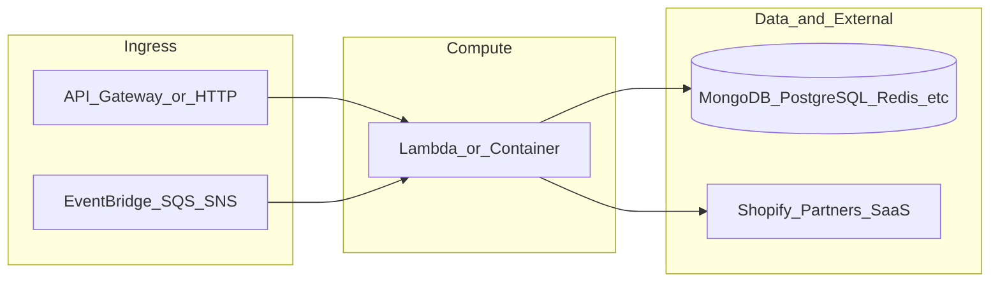

# botnot-backend-swagger-api-proxing-

**Path:** `D:/botnot/botnot-backend-swagger-api-proxing-`  
**Category:** api-gateways  
**Primary language:** TypeScript  
**Status:** present on disk

## 1. Purpose (2-3 lines)

# AWS Swagger API Proxing
- Author: Vitaly
- Last updated: 2022-09-27

## 2. Tech stack (from manifests and file-type mix)

- **Detected primary language:** TypeScript
- **Top-level layout:** see listing below.

### `README.md`

```
# AWS Swagger API Proxing
- Author: Vitaly
- Last updated: 2022-09-27
```

### `readme.md`

```
# AWS Swagger API Proxing
- Author: Vitaly
- Last updated: 2022-09-27
```

### `Readme.md`

```
# AWS Swagger API Proxing
- Author: Vitaly
- Last updated: 2022-09-27
```

### `package.json`

```
{
  "name": "botnot-backend-swagger-api-proxying",
  "version": "0.0.1",
  "description": "A simple setup of Swagger UI with Webpack",
  "scripts": {
    "build": "webpack",
    "start": "webpack-dev-server --open"
  },
  "author": "vitaly",
  "license": "Apache-2.0",
  "devDependencies": {
    "clean-webpack-plugin": "^4.0.0",
    "copy-webpack-plugin": "^11.0.0",
    "html-webpack-plugin": "^5.5.0",
    "webpack": "^5.74.0",
    "webpack-cli": "^4.10.0",
    "webpack-dev-server": "^4.11.0"
  },
  "dependencies": {
    "css-loader": "^6.7.1",
    "json-loader": "^0.5.7",
    "style-loader": "^3.3.1",
    "swagger-ui": "^4.14.0",
    "yaml-loader": "^0.8.0"
  }
}
```

### `sst.json`

```
{
  "name": "botnot-backend-swagger-api-proxying",
  "region": "us-east-1",
  "main": "stacks/index.js"
}
```


## 3. Architecture



- **Inbound:** HTTP (API Gateway / ALB), scheduled triggers, queues (SQS/SNS), EventBridge rules, or batch — infer from `stacks/`, `template.yaml`, `sst.config.ts`, or `src/` handlers.
- **Outbound:** databases and external HTTP APIs per layers and `package.json` / Python imports in handlers.
- **IaC pattern:** SST/CDK, SAM/CloudFormation, Pulumi, Helm, Terraform, or raw scripts — see manifests section.

## 4. Key files (auto-discovered)

- **Top-level entries:**

```
.idea
README.md
index.html
package-lock.json
package.json
seed.yml
src
sst.json
webpack.config.js
```

## 5. My contribution / role (evidence from git history — if available)

```text
afb0a02 2022-09-27 first commit
```

_Use commit messages only as hints; corroborate in interviews._

## 6. Notable patterns / snippets

_No snippet candidates matched (handler.py / stack.ts / template.yaml etc.). Expand manually after opening the repo._

## 7. Metrics / SLO / scale (if available)

_Extract from Airflow DAG params, load tests, README, or CloudFormation `ReservedConcurrentExecutions` when present — not auto-inferred to avoid fabrication._

## 8. Resume bullets (ready-to-paste, English)

- Owned or extended **`botnot-backend-swagger-api-proxing-`** capabilities aligned with **api gateways** delivery.
- Applied **TypeScript** stack patterns and repository-local IaC/config where present.
- Collaborated on production-grade defaults: structured logging, retries, and least-privilege IAM patterns where applicable.
- Integrated with **Yofi** platform services (data stores, queues, gateways) per dependency manifests in-repo.
- Documented operational expectations (deploy, test, local dev) via README and automation files when available.

## 9. Interview talking points

- What is the main entrypoint and trigger for `botnot-backend-swagger-api-proxing-`?
- How are secrets and non-prod environments separated?
- What failure modes are handled (retries, DLQ, idempotency)?
- How would you observe this service in production (metrics, logs, traces)?
