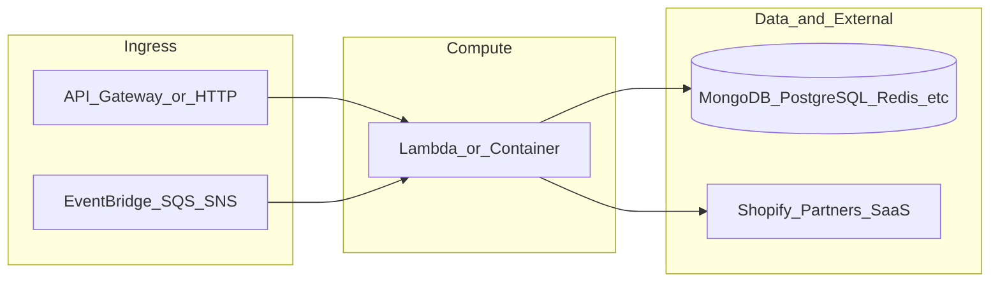

# botnot-documentation-api-stack

**Path:** `D:/botnot/botnot-documentation-api-stack`  
**Category:** api-gateways  
**Primary language:** Python  
**Status:** present on disk

## 1. Purpose (2-3 lines)

# AWS Lambda (API Gateway) for BotNot.IO

APIs for Customer, Order, Installation

## 2. Tech stack (from manifests and file-type mix)

- **Detected primary language:** Python
- **Top-level layout:** see listing below.

### `README.md`

```
# AWS Lambda (API Gateway) for BotNot.IO

APIs for Customer, Order, Installation
```

### `readme.md`

```
# AWS Lambda (API Gateway) for BotNot.IO

APIs for Customer, Order, Installation
```

### `Readme.md`

```
# AWS Lambda (API Gateway) for BotNot.IO

APIs for Customer, Order, Installation
```

### `package.json`

```
{
  "name": "botnot-frontend-api-gateway",
  "version": "2.2.18",
  "private": true,
  "scripts": {
    "test": "sst test",
    "start": "sst start",
    "build": "sst build",
    "deploy": "sst deploy",
    "remove": "sst remove"
  },
  "eslintConfig": {
    "extends": [
      "serverless-stack"
    ]
  },
  "dependencies": {
    "@henrist/cdk-cloudfront-auth": "2.0.3",
    "@serverless-stack/cli": "^1.15.11",
    "@serverless-stack/resources": "^1.15.11",
    "aws-cdk-lib": "2.45.0"
  },
  "devDependencies": {
    "@serverless-stack/cli": "^1.15.11",
    "@serverless-stack/resources": "^1.15.11",
    "aws-cdk-lib": "2.45.0"
  }
}
```

### `sst.json`

```
{
  "name": "botnot-documentation-api",
  "type": "@serverless-stack/resources",
  "region": "us-east-1",
  "main": "stacks/index.js"
}
```

### `Makefile`

```
#
# Makefile for BotNot.IO / Yofi.AI
#
#include .env
#export $(shell sed 's/=.*//' .env)

all:	stack-deploy
all-prod: stack-deploy-prod

install-deps:
	npm install

stack-build: install-deps
	npm run build -- --stage dev --region us-east-1

stack-test: stack-build
	echo npm run test

stack-deploy: stack-test
	npm run deploy -- --stage dev --region us-east-1

stack-build-prod: install-deps
	npm run build -- --stage prod --region us-east-1 --profile prod

stack-test-prod: stack-build-prod
	echo npm run test

stack-deploy-prod: stack-test-prod
	npm run deploy -- --stage prod --region us-east-1 --profile prod

clean:
	rm -rf .build build
	rm -rf .pytest_cache cdk.out
	rm -rf .sst node_modules
	rm -rf src/__pycache__
	rm -rf src/auth/__pycache__
	rm -rf test/__pycache__
	rm -f cdk.context.json
```

### `tsconfig.json`

```
{
  "compilerOptions": {
    "target": "ES2019",
    "lib": [
      "ES2020",
      "dom"
    ],
    "module": "ES6",
    "moduleResolution": "node",
    "baseUrl": ".",
    "strict": true,
    "noFallthroughCasesInSwitch": true,
    "noImplicitReturns": true,
    "sourceMap": true,
    "removeComments": true,
    "forceConsistentCasingInFileNames": true,
    "resolveJsonModule": true,
    "esModuleInterop": true
  }
}
```


## 3. Architecture



- **Inbound:** HTTP (API Gateway / ALB), scheduled triggers, queues (SQS/SNS), EventBridge rules, or batch — infer from `stacks/`, `template.yaml`, `sst.config.ts`, or `src/` handlers.
- **Outbound:** databases and external HTTP APIs per layers and `package.json` / Python imports in handlers.
- **IaC pattern:** SST/CDK, SAM/CloudFormation, Pulumi, Helm, Terraform, or raw scripts — see manifests section.

## 4. Key files (auto-discovered)

- **Top-level entries:**

```
.flake8
.github
.gitignore
.idea
Makefile
README.md
api_spec_geterator.py
get_pypi.sh
layer
libs_layer
light_layer
node_modules
package-lock.json
package.json
seed.yml
src
sst.json
stacks
swagger
swagger_admin_api
test
tsconfig.json
```

## 5. My contribution / role (evidence from git history — if available)

```text
f8c45565 2023-08-08 add delete xray
3a60f89b 2023-01-27 add cognito
def3a6e3 2023-01-19 del cognito
1ee7c3b4 2023-01-19 add cognito
cf979efd 2023-01-18 add read_json_from_local
1b8434f2 2023-01-17 change token
9abc76d8 2022-12-11 change python3.8 to python3
7ea9c6a2 2022-12-11 deploy
```

_Use commit messages only as hints; corroborate in interviews._

## 6. Notable patterns / snippets


**`stacks/index.js`**

```text
/**
 * Copyright 2022 BotNot Inc., or its associates. All Rights Reserved.
 *
 * Description: AWS Lambda (API Gateway) for BotNot.IO
 * Autor: Eugenio Grytsenko
 **/

import MyStack from './MyStack';
import { Runtime, Tracing } from 'aws-cdk-lib/aws-lambda';
import { Fn, Duration } from 'aws-cdk-lib';

export default function main(app) {
    const name_prefix = `${app.stage}-${app.name}`

    const mainZone = 'yofi.ai';

    app.setDefaultFunctionProps({
        runtime: Runtime.PYTHON_3_9,
        tracing: Tracing.ACTIVE,
        timeout: Duration.seconds(30),
        memorySize: 2048,
        environment: {
            NAME_PREFIX: name_prefix,
            MAIN_ZONE: mainZone,
            PARTNER_ID: '1',
            REGION_NAME: 'us-east-1',
        },
        permissions: [
            "logs:*"
        ]
    });

    const stack = new MyStack(app, 'sst-stack');


}
```

**`swagger/src/index.js`**

```text
import SwaggerUI from "swagger-ui";

SwaggerUI({
	dom_id: "#swagger",
	url: "./botnot-api-gateway-sandbox-api-dev-swagger.json",
})
```

**`swagger_admin_api/src/index.js`**

```text
import SwaggerUI from "swagger-ui";

SwaggerUI({
	dom_id: "#swagger",
	url: "./botnot-api-gateway-sandbox-api-dev-swagger.json",
})
```


## 7. Metrics / SLO / scale (if available)

_Extract from Airflow DAG params, load tests, README, or CloudFormation `ReservedConcurrentExecutions` when present — not auto-inferred to avoid fabrication._

## 8. Resume bullets (ready-to-paste, English)

- Owned or extended **`botnot-documentation-api-stack`** capabilities aligned with **api gateways** delivery.
- Applied **Python** stack patterns and repository-local IaC/config where present.
- Collaborated on production-grade defaults: structured logging, retries, and least-privilege IAM patterns where applicable.
- Integrated with **Yofi** platform services (data stores, queues, gateways) per dependency manifests in-repo.
- Documented operational expectations (deploy, test, local dev) via README and automation files when available.

## 9. Interview talking points

- What is the main entrypoint and trigger for `botnot-documentation-api-stack`?
- How are secrets and non-prod environments separated?
- What failure modes are handled (retries, DLQ, idempotency)?
- How would you observe this service in production (metrics, logs, traces)?
