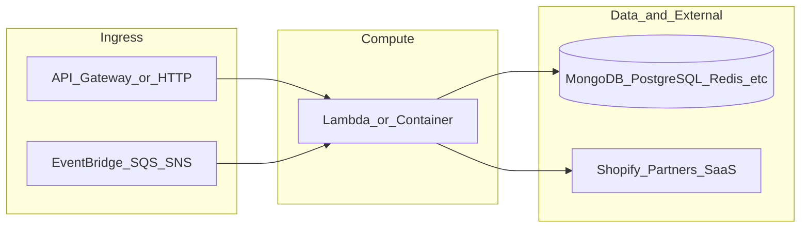

# botnot-lambda-admin-api

**Path:** `D:/botnot/botnot-lambda-admin-api`  
**Category:** api-gateways  
**Primary language:** Python  
**Status:** present on disk

## 1. Purpose (2-3 lines)

# AWS Lambda (Admin API) for Platform Management
Author: Eugenio Grytsenko

- API Gateway for TIER (get info / quota reset)

## 2. Tech stack (from manifests and file-type mix)

- **Detected primary language:** Python
- **Top-level layout:** see listing below.

### `README.md`

```
# AWS Lambda (Admin API) for Platform Management
Author: Eugenio Grytsenko

- API Gateway for TIER (get info / quota reset)
```

### `readme.md`

```
# AWS Lambda (Admin API) for Platform Management
Author: Eugenio Grytsenko

- API Gateway for TIER (get info / quota reset)
```

### `Readme.md`

```
# AWS Lambda (Admin API) for Platform Management
Author: Eugenio Grytsenko

- API Gateway for TIER (get info / quota reset)
```

### `package.json`

```
{
  "name": "admin-api",
  "version": "2.2.19",
  "private": true,
  "scripts": {
    "test": "sst test",
    "start": "sst start",
    "build": "sst build",
    "deploy": "sst deploy",
    "remove": "sst remove",
    "diff": "sst diff"
  },
  "eslintConfig": {
    "extends": [
      "serverless-stack"
    ]
  },
  "devDependencies": {
    "@aws-cdk/aws-lambda-python-alpha": "2.132.1-alpha.0",
    "@serverless-stack/resources": "1.16.1",
    "@tsconfig/node16": "1.0.3",
    "async": ">=2.6.4",
    "aws-cdk-lib": "2.132.1",
    "constructs": "10.3.0",
    "jszip": ">=3.7.0",
    "sst": "^2.41.5",
    "ts-node": "^10.9.1",
    "typescript": "^4.9.4"
  },
  "dependencies": {
    "yarn": "^1.22.22",
    "aws4": "^1.11.0"
  },
  "type": "module"
}
```

### `sst.config.ts`

```
import type { SSTConfig } from "sst"
import {Fn} from 'aws-cdk-lib';
import { AdminApiStack } from './stacks/ManagerStack';

export default {
  config(input) {
    return {
      name: "yofi-admin-api",  // Updated to match your original sst.json
      region: "us-east-1",
      profile: input.stage === "prod" ? "prod" : "dev",
    };
  },
  stacks(app) {
    const namePrefix = `${app.stage}-${app.name}`;
    const mainZone = app.stage === 'prod' ? 'botnot.io' : 'yofi.ai';
    app.setDefaultFunctionProps({
      runtime: 'python3.9',
      tracing: "disabled",
      timeout: 30,
      environment: {
        NAME_PREFIX: namePrefix,
        MAIN_ZONE: mainZone,
        PARTNER_ID: '1',
        REDIS_CLUSTER_ENDPOINT: Fn.importValue('botnot-backend-elasticache-cluster-redis-endpoint'),
        REDIS_CLUSTER_PORT: Fn.importValue('botnot-backend-elasticache-cluster-redis-port'),
        DYNAMODB_TABLE_API_SECRETS: Fn.importValue('store-credentials-simple-table-arn'),
        SECRET_TOKEN_KEY: Fn.importValue('secret-token-key-secret'),
        REGION_NAME: 'us-east-1',
        SAVE_EVENT_HISTORY_TOPIC: Fn.importValue("save-event-history-sns-topic-arn"),
        SPANNER_SNS: Fn.importValue("graph-spanner-task-sns-topic-arn")
      },
    permissions: [
            'secretsmanager:*',
            'sns:*',
            'ssm',
            'elasticache:*',
            'dynamodb:*',
            'ec2:*',
            'xray:*',
            'lambda:*'
    ]
    })

    app.stack(AdminApiStack, { id: "sst-stack" });  // Ensure the stack ID and function are named correctly
  },
} satisfies SSTConfig;
```

### `Makefile`

```
all:	stack-deploy
all-prod: stack-deploy-prod

install-deps:
	npm install

stack-build: install-deps
	npm run build -- --stage dev --region us-east-1 --profile dev

stack-test: stack-build
	echo npm run test

stack-deploy: stack-test
	npm run deploy -- --stage dev --region us-east-1 --profile dev

stack-build-prod: install-deps
	npm run build -- --stage prod --region us-east-1 --profile prod

stack-test-prod: stack-build-prod
	echo npm run test

stack-deploy-prod: stack-test-prod
	npm run deploy -- --stage prod --region us-east-1 --profile prod

clean:
	rm -rf .build build
	rm -rf .pytest_cache cdk.out
	rm -rf .sst node_modules
	rm -rf src/__pycache__
	rm -rf test/__pycache__
```


## 3. Architecture



- **Inbound:** HTTP (API Gateway / ALB), scheduled triggers, queues (SQS/SNS), EventBridge rules, or batch — infer from `stacks/`, `template.yaml`, `sst.config.ts`, or `src/` handlers.
- **Outbound:** databases and external HTTP APIs per layers and `package.json` / Python imports in handlers.
- **IaC pattern:** SST/CDK, SAM/CloudFormation, Pulumi, Helm, Terraform, or raw scripts — see manifests section.

## 4. Key files (auto-discovered)

- **Top-level entries:**

```
.env
.github
.gitignore
.idea
Makefile
README.md
api_spec_geterator.py
layer
layer_common
layer_mongo
layer_nodejs
node_modules
package-lock.json
package.json
seed.yml
src
sst.config.ts
stacks
test
```

## 5. My contribution / role (evidence from git history — if available)

```text
6319d8c 2024-12-19 fix subscription notifications
0b898a4 2024-12-05 update connected customer
0c214e3 2024-12-04 change connected customer
5e5ad54 2024-11-01 exclude root customer from connected
fad8a10 2024-10-26 change to push_order_to_high_priority_dedup_queue
6ba6795 2024-10-26 add fill spanner
79576f5 2024-10-26 fix connected_obj
f470ff3 2024-10-26 add second query2
```

_Use commit messages only as hints; corroborate in interviews._

## 6. Notable patterns / snippets


**`src/beat/add/main.py`**

```python
##
# Copyright 2024 BotNot Inc., or its associates. All Rights Reserved.
#
# Description: AWS Lambda (Admin API)
# Autor: Vitaly
##
import json
import os
import logging
from datetime import datetime
from pydantic import BaseModel
from validator_deco import validate_request_model
from mongo import MongoDB

mongo = MongoDB('beat')

# Logging enabled
logger = logging.getLogger()
logger.setLevel(logging.INFO)

# {"username":"yofi","firstname":"yoyi","lastname":"yofi","email":"yo@yof.ai","timeintervals":"1,0,17,1"} from Jimmi
payload_map = ["username", "firstname", "lastname", "email", "timeintervals", "company"]


class RequestModel(BaseModel):
    username: str
    firstname: str
    lastname: str
    email: str
    timeintervals: str
    company: str


class MongoDBOrderFilter:
    def __init__(self):
        self.filter_dictionary: dict = {}

    def set_param(self, _key: str, _value: str):
        if _value:
            self.filter_dictionary[_key] = str(_value)
            logger.warning(f'set {_key}:{_value} :{self.filter_dictionary}')

    def set_shop_url(self, shop_url: str):
        if shop_url:
            self.filter_dictionary['shop_url'] = str(shop_url)
            logger.warning(f'set_shop_url :{self.filter_dictionary}')

    def to_json(self):
        logger.warning(f'to_json :{self.filter_dictionary}')
        # return json.loads(self.filter_dictionary)
        return self.filter_dictionary


def add_leaderboard(payload: dict):
    map_valid = MongoDBOrderFilter()
    for param in payload_map:
        map_valid.set_param(param, payload[param])
    insert_dict = map_valid.to_json()
    insert_dict["created_at"] = datetime.now().strftime("%Y-%m-%dT%H:%M:%S")
    timeintervals = insert_dict.get("timeintervals", "1")
    parts = timeintervals.split(',')
    total_time = sum(int(part) for part in parts)
    insert_dict["totaltime"] = total_time if total_time >= 1 else 1
    print(f"insert_dict:{insert_dict}")
    insert_id = mongo.insert("leaderboard", insert_dict)
    logger.warning(f"insert_id:{insert_id}")
    return insert_id


def get_leaderboard_mongo(insert_id

…(truncated)…
```

**`src/beat/leaderboard/main.py`**

```python
##
# Copyright 2024 BotNot Inc., or its associates. All Rights Reserved.
#
# Description: AWS Lambda (Admin API)
# Autor: Vitaly
##
import os
import logging
from bson.json_util import dumps
import json
from mongo import MongoDB
import math

mongo = MongoDB('beat')

# Logging enabled
logger = logging.getLogger()
logger.setLevel(logging.INFO)


class MongoDBOrderFilter:
    def __init__(self):
        self.filter_dictionary: dict = {}

    def set_limit(self, limit: str):
        if limit:
            self.filter_dictionary["items_per_page"] = int(limit)
            logger.warning(f'set :{limit} :{self.filter_dictionary}')

    def set_page(self, page: str):
        if page:
            self.filter_dictionary["current_page"] = int(page)
            logger.warning(f'set :{page} :{self.filter_dictionary}')

    def to_json(self):
        logger.warning(f'to_json :{self.filter_dictionary}')
        # return json.loads(self.filter_dictionary)
        return self.filter_dictionary


def get_agg_query_count(conditions):
    query = [
        {
            '$match': conditions
        }, {
            '$group': {
                '_id': 0,
                'count': {
                    '$sum': 1
                }
            }
        }
    ]
    return query


def get_leaderboard_list(pagination: dict):
    per_page = int(pagination['items_per_page']) if 'items_per_page' in pagination else 10
    current = int(pagination['current_page']) if 'current_page' in pagination else 1
    offset = int(per_page * (current - 1))
    query_count = get_agg_query_count({})
    agg_result_count = mongo.aggregate('leaderboard', query_count)
    leaderboard_count = json.loads(dumps(agg_result_count))
    items_count = leaderboard_count[0]['count'] if leaderboard_count and leaderboard_count[0]['count'] else 0
    if items_count == 0:
        return 200, {
            'leaderboard': {
                'count': 0,
                'data': []
            },
            'pagination': {'items_count': 0, 'page_count': 0, 'items_per_page': per_page,
                           'current_page': current}
      

…(truncated)…
```

**`src/billing/refcounter/main.py`**

```python
##
# Copyright 2022 BotNot Inc., or its associates. All Rights Reserved.
#
# Description: AWS Lambda (Admin API)
# Autor: Vitaly
##
import boto3
import os
import logging
from rediscluster import RedisCluster
import bson
from datetime import datetime
from mongo import MongoDB
from validator_deco import apply_validation, read_json_file
mongo = MongoDB('billing')

# Importing application configs
redis_cluster_endpoint = os.environ['REDIS_CLUSTER_ENDPOINT']
redis_cluster_port = os.environ['REDIS_CLUSTER_PORT']

# Logging enabled
logger = logging.getLogger()
logger.setLevel(logging.INFO)

# DynamoDB client settings
dynamodb = boto3.client('dynamodb')

# ElastiCache client settings
ec_startup_nodes = [{
    'host': redis_cluster_endpoint,
    'port': redis_cluster_port
}]
ec_client = RedisCluster(
    startup_nodes=ec_startup_nodes,
    decode_responses=True,
    skip_full_coverage_check=True)


def trier_find(tier_id: int) -> tuple:
    condition = {"id": tier_id}
    tier_detail = mongo.find_one("tier", condition)
    return (tier_detail.get("order_transactions_maximum_quota", 0),
            tier_detail.get("order_transactions_suspend_quota", 0))


def update_detail(shop_url: str, old_processed_order_account: int):
    print(f'old_processed_order_account:{old_processed_order_account}')
    new_processed_order_account = counter_calc(shop_url, old_processed_order_account)
    print(f'new_processed_order_account:{new_processed_order_account}')
    condition = {"shop_url": shop_url}
    mongo_set = {"$set": {
        "is_service_suspended": False,
        "is_service_warning": False,
        "current_warning_notification_count": 0,
        "current_suspended_notification_count": 0,
        # "last_refresh_counter_date": bson.timestamp.Timestamp(datetime.now(), 1),  # replaced by new field last_time_refreshed_quota
        "processed_order_account": new_processed_order_account
    }}
    update = mongo.find_one_and_update("detail", condition, mongo_set)
    logger.warning(f"client:{shop_url}, update:{update}")


def counter_calc(shop_url: str, processed_order_account) -> int:
    shop_acc

…(truncated)…
```


## 7. Metrics / SLO / scale (if available)

_Extract from Airflow DAG params, load tests, README, or CloudFormation `ReservedConcurrentExecutions` when present — not auto-inferred to avoid fabrication._

## 8. Resume bullets (ready-to-paste, English)

- Owned or extended **`botnot-lambda-admin-api`** capabilities aligned with **api gateways** delivery.
- Applied **Python** stack patterns and repository-local IaC/config where present.
- Collaborated on production-grade defaults: structured logging, retries, and least-privilege IAM patterns where applicable.
- Integrated with **Yofi** platform services (data stores, queues, gateways) per dependency manifests in-repo.
- Documented operational expectations (deploy, test, local dev) via README and automation files when available.

## 9. Interview talking points

- What is the main entrypoint and trigger for `botnot-lambda-admin-api`?
- How are secrets and non-prod environments separated?
- What failure modes are handled (retries, DLQ, idempotency)?
- How would you observe this service in production (metrics, logs, traces)?
