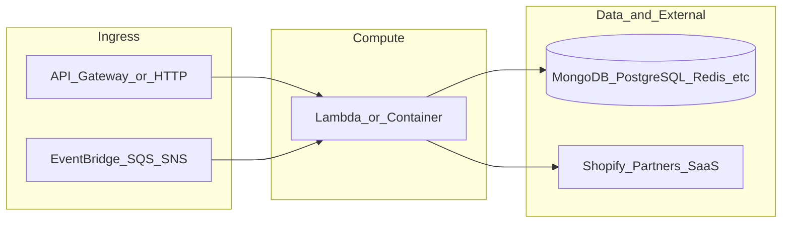

# botnot-lambda-api-gateway

**Path:** `D:/botnot/botnot-lambda-api-gateway`  
**Category:** api-gateways  
**Primary language:** Python  
**Status:** present on disk

## 1. Purpose (2-3 lines)

# AWS Lambda (API Gateway) for BotNot.IO

APIs for Customer, Order, Installation

## 2. Tech stack (from manifests and file-type mix)

- **Detected primary language:** Python
- **Top-level layout:** see listing below.

### `README.md`

```
# AWS Lambda (API Gateway) for BotNot.IO

APIs for Customer, Order, Installation
```

### `readme.md`

```
# AWS Lambda (API Gateway) for BotNot.IO

APIs for Customer, Order, Installation
```

### `Readme.md`

```
# AWS Lambda (API Gateway) for BotNot.IO

APIs for Customer, Order, Installation
```

### `package.json`

```
{
  "name": "botnot-frontend-api-gateway",
  "version": "2.2.18",
  "private": true,
  "scripts": {
    "test": "sst test",
    "start": "sst start",
    "build": "sst build",
    "deploy": "sst deploy",
    "remove": "sst remove",
    "test:graph_v3": "jest src/customer/graph_v3/main.test.js --testTimeout=60000",
    "test:similarity_v2": "jest src/customer/similarity_v2/main.test.js --testTimeout=60000"
  },
  "eslintConfig": {
    "extends": [
      "serverless-stack"
    ]
  },
  "dependencies": {
    "@aws-cdk/aws-apigatewayv2-alpha": "2.39.1-alpha.0",
    "@aws-cdk/aws-lambda-python-alpha": "2.39.1-alpha.0",
    "@aws-sdk/client-dynamodb": "^3.87.0",
    "@aws-sdk/client-sns": "^3.67.0",
    "@aws-sdk/lib-dynamodb": "^3.87.0",
    "@serverless-stack/cli": "1.16.1",
    "@serverless-stack/resources": "1.16.1",
    "apispec": "^1.0.5",
    "aws-cdk-lib": "2.177.0",
    "aws-lambda": "^1.0.7",
    "aws-xray-sdk": "^3.3.5",
    "shopify-hmac-validation": "^1.1.1"
  },
  "devDependencies": {
    "@google-cloud/bigquery": "^7.3.0",
    "aws4": "^1.12.0",
    "geolib": "^3.3.4",
    "jest": "^29.7.0",
    "moment": "^2.30.1",
    "mongodb": "^6.3.0",
    "neo4j-driver": "^5.16.0"
  }
}
```

### `sst.json`

```
{
  "name": "botnot-api",
  "type": "@serverless-stack/resources",
  "region": "us-east-1",
  "main": "stacks/index.js"
}
```

### `Makefile`

```
#
# Makefile for BotNot.IO / Yofi.AI
#
#include .env
#export $(shell sed 's/=.*//' .env)

all:	stack-deploy
all-prod: stack-deploy-prod

install-deps:
	npm install

stack-build: install-deps
	npm run build -- --stage dev --region us-east-1

stack-test: stack-build
	echo npm run test

stack-deploy: stack-test
	npm run deploy -- --stage dev --region us-east-1

stack-build-prod: install-deps
	npm run build -- --stage prod --region us-east-1 --profile prod

stack-test-prod: stack-build-prod
	echo npm run test

stack-deploy-prod: stack-test-prod
	npm run deploy -- --stage prod --region us-east-1 --profile prod

clean:
	rm -rf .build build
	rm -rf .pytest_cache cdk.out
	rm -rf .sst node_modules
	rm -rf src/__pycache__
	rm -rf src/auth/__pycache__
	rm -rf test/__pycache__
	rm -f cdk.context.json
```

### `tsconfig.json`

```
{
  "compilerOptions": {
    "target": "ES2019",
    "lib": [
      "ES2020",
      "dom"
    ],
    "module": "ES6",
    "moduleResolution": "node",
    "baseUrl": ".",
    "strict": true,
    "noFallthroughCasesInSwitch": true,
    "noImplicitReturns": true,
    "sourceMap": true,
    "removeComments": true,
    "forceConsistentCasingInFileNames": true,
    "resolveJsonModule": true,
    "esModuleInterop": true
  }
}
```


## 3. Architecture



- **Inbound:** HTTP (API Gateway / ALB), scheduled triggers, queues (SQS/SNS), EventBridge rules, or batch — infer from `stacks/`, `template.yaml`, `sst.config.ts`, or `src/` handlers.
- **Outbound:** databases and external HTTP APIs per layers and `package.json` / Python imports in handlers.
- **IaC pattern:** SST/CDK, SAM/CloudFormation, Pulumi, Helm, Terraform, or raw scripts — see manifests section.

## 4. Key files (auto-discovered)

- **Top-level entries:**

```
.flake8
.github
.gitignore
.idea
.vscode
Makefile
README.md
api_spec_geterator.py
botnot-lambda-api-gateway-spec.json
get_all_routes.py
layer
layer_nodejs
libs_layer
package.json
seed.yml
src
sst.json
stacks
test
tsconfig.json
```

## 5. My contribution / role (evidence from git history — if available)

```text
3addfb75 2025-09-19 remove unnecessary log
a28a3d64 2025-09-19 fix edit
68412776 2025-09-18 shopify as default
3f06c029 2025-09-18 remove log
d9605e06 2025-09-18 fix
0bcca4f0 2025-09-18 fix organization_id in script
28c62291 2025-09-18 partner_id headers
c2233e38 2025-09-18 add partner_id into integrations
```

_Use commit messages only as hints; corroborate in interviews._

## 6. Notable patterns / snippets


**`src/analytics/clusters/list/main.py`**

```python
##
# Vitaly 2024 BotNot Inc., or its associates. A
##
import os
import logging
from bson.json_util import dumps
import json
from mongo import MongoDB
import math
from pydantic import BaseModel
from pydantic_models import BasicFilter, SortParams, PaginationParams
from validator_deco import validate_request
from typing import Optional
from openapi_schema_pydantic import OpenAPI, Info, PathItem, Operation, Response, RequestBody, MediaType
from openapi_schema_pydantic.util import PydanticSchema, construct_open_api_with_schema_class

mongo = MongoDB('analytics')

# Logging enabled
logger = logging.getLogger()
logger.setLevel(logging.INFO)


class Core_customer(BasicFilter):
    id: Optional[str]
    first_name: Optional[str]
    last_name: Optional[str]
    email: Optional[str]
    mobile: Optional[str]


class Filter(BasicFilter):
    cluster_id: Optional[str]
    num_customers: Optional[int]
    num_orders: Optional[int]
    num_products: Optional[int]
    num_variants: Optional[int]
    num_refunds: Optional[int]
    num_emails: Optional[int]
    num_addresses: Optional[int]
    num_phone_numbers: Optional[int]
    orders_per_customer: Optional[int]
    addresses_per_customer: Optional[int]
    total_bots: Optional[int]
    total_discount_abusers: Optional[int]
    total_return_abusers: Optional[int]
    total_resell_abusers: Optional[int]
    total_net_value: Optional[str]
    total_loss: Optional[str]
    total_after_loss: Optional[str]
    total_money_refunds: Optional[str]
    total_money_rspend: Optional[str]
    total_money_rdiscounts: Optional[str]
    pct_discounts: Optional[float]
    pct_refunds: Optional[float]
    avg_order_value: Optional[str]
    avg_discount: Optional[str]
    avg_pct_refund: Optional[str]
    core_customer: Optional[Core_customer] = None


class RequestModel(BaseModel):
    filter: Filter
    pagination: PaginationParams = PaginationParams(current_page=1, items_per_page=10)


def generate_schema():
    open_api = OpenAPI(
        info=Info(title="Order list Api", version="v0.0.1"),
        paths={"/ecommerce/orders/list": PathItem(post=Operatio

…(truncated)…
```

**`src/auth_okta/main.py`**

```python
##
# Copyright 2022 BotNot Inc., or its associates. All Rights Reserved.
#
# Description: AWS Lambda (API Gateway) for BotNot.IO
#
##

import logging
import typing
from shopify_utils import get_credentials
from datetime import datetime
import base64

logger = logging.getLogger()
logger.setLevel(logging.INFO)

import json
import requests
import boto3
import random
import string

# Constants
LENGTH = 20  # Length of the random principalId string

secrets_manager = boto3.client('secretsmanager')
secret = secrets_manager.get_secret_value(SecretId="okta_shopify_app_auth_credentials")
secret_json = json.loads(secret["SecretString"])

OKTA_DOMAIN = secret_json.get('OKTA_DOMAIN')
CLIENT_ID = secret_json.get('CLIENT_ID')


def generate_policy(principal_id, effect, resource, shop_url):
    policy = {
        'Version': '2012-10-17',
        'Statement': [
            {
                'Action': 'execute-api:Invoke',
                'Effect': effect,
                'Resource': ["arn:aws:execute-api:*", resource]
            }
        ]
    }
    return (dict(
        principalId=principal_id,
        policyDocument=policy,
        context={"shop_url": shop_url},
    ))


def handler(event: typing.Dict, _):
    method_arn = event.get('methodArn')
    logger.info(f'Received event: {event}')
    print(event)
    event_headers = event.get('headers', {})
    token = event_headers.get('authorization', event_headers.get('Authorization', None))
    shop_url = event_headers.get('shop_url', None)
    introspect_url = f"https://{OKTA_DOMAIN}/oauth2/v1/introspect"

    if not token:
        logger.error('Empty Authorization header')
        return generate_policy(None, 'Deny', method_arn, '')

    headers = {
        'Content-Type': 'application/x-www-form-urlencoded'
    }

    data = {
        'token': token.replace('Bearer ', ''),
        'token_type_hint': 'access_token',
        'client_id': CLIENT_ID
    }

    # Introspect the Okta token
    response = requests.post(introspect_url, headers=headers, data=data)
    token_data = response.json()

    print(token_data)

    # If the 

…(truncated)…
```

**`src/auth_simple/main.py`**

```python
##
# Copyright 2022 BotNot Inc., or its associates. All Rights Reserved.
#
# Description: AWS Lambda (API Gateway) for BotNot.IO
#
##

import logging
import typing
from shopify_utils import get_credentials
from datetime import datetime
import base64

logger = logging.getLogger()
logger.setLevel(logging.INFO)


def handler(event: typing.Dict, context):
    logger.info(f'Received event: {event}')
    method_arn = event.get('methodArn')
    try:
        headers = event.get('headers', {})
        token = headers.get('authorization', headers.get('Authorization', None))

        if not token:
            logger.error('Empty Authorization header')
            return generate_policy(None, 'Deny', method_arn, '')

        # the decryption key was hardcoded in front end, do not change it
        decrypted = xor_decrypt(base64.b64decode(token).decode(encoding='utf-8'), '3088b00b-f7d7-42ed-91cb-c783a1868620')
        splitted = decrypted.split('|')

        if len(splitted) != 2:
            logger.error('Invalid Authorization header: ' + decrypted)
            return generate_policy(None, 'Deny', method_arn, '')

        now = datetime.now().timestamp()
        timestamp = int(splitted[1]) / 1000
        shop_url = splitted[0]

        # sometimes the front end will newer then backend and sometimes network is very slow need more times
        if (timestamp > now + 5000) or (timestamp < now - 5000):
            logger.error(f'Authorization expired, fe:{timestamp}, be:{now}, offset: {now - timestamp}')
            return generate_policy(None, 'Deny', method_arn, shop_url)

        credential = get_credentials(shop_url)

        if not credential:
            logger.error('Invalid shop_url: ' + decrypted)
            return generate_policy(None, 'Deny', method_arn, shop_url)

        logger.warning(f'AUTH-SIMPLE-ALLOW: Shop verified {shop_url}')
        return generate_policy(None, 'Allow', method_arn, shop_url)

    except Exception as e:
        logger.error(f'AUTH-SIMPLE: Exception: {e}')
        return generate_policy(None, 'Deny', method_arn, '')


def xor_decrypt(encrypted_string, key):
    

…(truncated)…
```


## 7. Metrics / SLO / scale (if available)

_Extract from Airflow DAG params, load tests, README, or CloudFormation `ReservedConcurrentExecutions` when present — not auto-inferred to avoid fabrication._

## 8. Resume bullets (ready-to-paste, English)

- Owned or extended **`botnot-lambda-api-gateway`** capabilities aligned with **api gateways** delivery.
- Applied **Python** stack patterns and repository-local IaC/config where present.
- Collaborated on production-grade defaults: structured logging, retries, and least-privilege IAM patterns where applicable.
- Integrated with **Yofi** platform services (data stores, queues, gateways) per dependency manifests in-repo.
- Documented operational expectations (deploy, test, local dev) via README and automation files when available.

## 9. Interview talking points

- What is the main entrypoint and trigger for `botnot-lambda-api-gateway`?
- How are secrets and non-prod environments separated?
- What failure modes are handled (retries, DLQ, idempotency)?
- How would you observe this service in production (metrics, logs, traces)?
