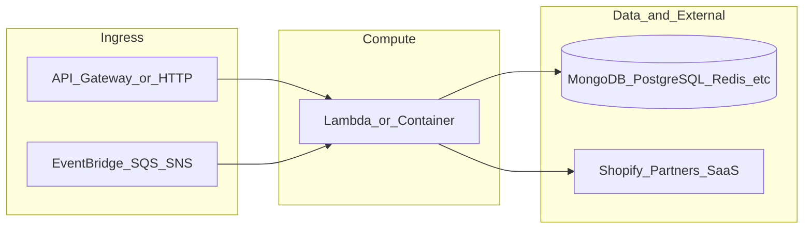

# botnot-lululemon-api

**Path:** `D:/botnot/botnot-lululemon-api`  
**Category:** api-gateways  
**Primary language:** Python  
**Status:** present on disk

## 1. Purpose (2-3 lines)

# AWS Lambda (Admin API) for Platform Management
Author: Garik Israelyan

- API Gateway for TIER (get info / quota reset)

## 2. Tech stack (from manifests and file-type mix)

- **Detected primary language:** Python
- **Top-level layout:** see listing below.

### `README.md`

```
# AWS Lambda (Admin API) for Platform Management
Author: Garik Israelyan

- API Gateway for TIER (get info / quota reset)
```

### `readme.md`

```
# AWS Lambda (Admin API) for Platform Management
Author: Garik Israelyan

- API Gateway for TIER (get info / quota reset)
```

### `Readme.md`

```
# AWS Lambda (Admin API) for Platform Management
Author: Garik Israelyan

- API Gateway for TIER (get info / quota reset)
```

### `package.json`

```
{
  "version": "0.1.0",
  "private": true,
  "scripts": {
    "test": "sst test",
    "start": "sst start",
    "build": "sst build",
    "deploy": "sst deploy",
    "remove": "sst remove"
  },
  "eslintConfig": {
    "extends": [
      "serverless-stack"
    ]
  },
  "dependencies": {
    "@serverless-stack/cli": "1.15.0",
    "@serverless-stack/resources": "1.15.0",
    "@aws-cdk/aws-lambda-python-alpha": "2.50.0-alpha.0",
    "aws-cdk-lib": "2.80.0",
    "ts-node": "^10.9.1",
    "async": ">=2.6.4",
    "jszip": ">=3.7.0"
  }
}
```

### `sst.json`

```
{
  "name": "bootnot-admin-api",
  "type": "@serverless-stack/resources",
  "region": "us-east-1",
  "main": "stacks/index.js"
}
```

### `Makefile`

```
#
# Makefile for BotNot.IO / Yofi.AI
#
#include .env
#export $(shell sed 's/=.*//' .env)

all:	stack-deploy
all-prod: stack-deploy-prod

install-deps:
	npm install

stack-build: install-deps
	npm run build -- --stage dev --region us-east-1 --profile dev

stack-test: stack-build
	echo npm run test

stack-deploy: stack-test
	npm run deploy -- --stage dev --region us-east-1 --profile dev

stack-build-prod: install-deps
	npm run build -- --stage prod --region us-east-1 --profile prod

stack-test-prod: stack-build-prod
	echo npm run test

stack-deploy-prod: stack-test-prod
	npm run deploy -- --stage prod --region us-east-1 --profile prod

clean:
	rm -rf .build build
	rm -rf .pytest_cache cdk.out
	rm -rf .sst node_modules
	rm -rf src/__pycache__
	rm -rf src/auth/__pycache__
	rm -rf test/__pycache__
	rm -f cdk.context.json
```


## 3. Architecture



- **Inbound:** HTTP (API Gateway / ALB), scheduled triggers, queues (SQS/SNS), EventBridge rules, or batch — infer from `stacks/`, `template.yaml`, `sst.config.ts`, or `src/` handlers.
- **Outbound:** databases and external HTTP APIs per layers and `package.json` / Python imports in handlers.
- **IaC pattern:** SST/CDK, SAM/CloudFormation, Pulumi, Helm, Terraform, or raw scripts — see manifests section.

## 4. Key files (auto-discovered)

- **Top-level entries:**

```
.idea
Makefile
README.md
api_spec_geterator.py
layer
layer_common
node_modules
package-lock.json
package.json
seed.yml
src
sst.json
stacks
test
```

## 5. My contribution / role (evidence from git history — if available)

```text
7495e27 2024-01-15 put create prefix before vpc
ae61486 2024-01-15 add vpc into api and lambda
6e93906 2023-12-05 fix: okta auth
786fc96 2023-11-28 Merge pull request #10 from BotNotOrg/security
c6dec2f 2023-11-28 add: debugging logs and fix aws vurnerable package version
81fba6c 2023-11-24 Merge pull request #9 from BotNotOrg/cluster-stats-metrics
97ef5e4 2023-11-24 add: maxProductTitlesQuantityPerNormalizedAddress, totalProducts metrics in cluster stats
a337397 2023-11-24 Merge pull request #8 from BotNotOrg/cluster-stats-metrics
```

_Use commit messages only as hints; corroborate in interviews._

## 6. Notable patterns / snippets


**`src/customer/address_statistics/main.py`**

```python
import boto3
import time
import json
import psycopg2
from psycopg2 import sql
from cache_helpers import dynamodb_cache
from decimal import Decimal
from bson import ObjectId, Timestamp
from bson.decimal128 import Decimal128
from bson.int64 import Int64
from datetime import datetime
import json


class JSONEncoder(json.JSONEncoder):
    def default(self, o):
        if isinstance(o, Decimal):
            return(str(o))
        elif isinstance(o, ObjectId):
            return(str(o))
        elif isinstance(o, Timestamp):
            return(o.as_datetime().timestamp())
        elif isinstance(o, Decimal128):
            return(str(o.to_decimal()))
        elif isinstance(o, Int64):
            return(int(o))
        elif isinstance(o, datetime):
            return(str(o))
        return json.JSONEncoder.default(self, o)
        
def get_db_credentials(secret_name):
    secrets_client = boto3.client('secretsmanager')
    get_secret_value_response = secrets_client.get_secret_value(SecretId=secret_name)
    secret = get_secret_value_response['SecretString']
    return json.loads(secret)

def get_db_connection():
    secret_name = "lulu-rds-db-creds"
    credentials = get_db_credentials(secret_name)
    try:
        conn = psycopg2.connect(
            dbname=credentials['dbname'],
            user=credentials['username'],
            password=credentials['password'],
            host=credentials['reader_host'],
            port=credentials['port']
        )
        return conn
    except Exception as e:
        print(f"Error {e}")
        return None

def form_query(payload):    
    base_query = sql.SQL("""
    SELECT 
        concat_addr,
        total_transactions,
        prop_bot_orders,
        prop_program_abusers,
        prop_return_abusers,
        prop_cancellations
    FROM address_stats
    """)

    conditions = []
    search_params = {}

    if payload.get('search_string'):
        search_params['search_string'] = f"%{payload['search_string']}%"
        conditions.append(sql.SQL("(concat_addr LIKE %(search_string)s)"))

    default_sorting = "prop_bot_orders DESC,

…(truncated)…
```

**`src/customer/details/main.py`**

```python
import boto3
import time
import json
import psycopg2
from cache_helpers import dynamodb_cache

# ----------------- Database Connection Management ----------------- #

def get_db_credentials(secret_name):
    secrets_client = boto3.client('secretsmanager')
    get_secret_value_response = secrets_client.get_secret_value(SecretId=secret_name)
    secret = get_secret_value_response['SecretString']
    return json.loads(secret)

def get_db_connection():
    secret_name = "lulu-rds-db-creds"
    credentials = get_db_credentials(secret_name)
    try:
        conn = psycopg2.connect(
            dbname=credentials['dbname'],
            user=credentials['username'],
            password=credentials['password'],
            host=credentials['reader_host'],
            port=credentials['port']
        )
        return conn
    except Exception as e:
        print(f"Error {e}")
        return None

# ----------------- Query Execution ----------------- #

def execute_query(conn, query):
    try:
        with conn.cursor() as cur:
            cur.execute(query)
            return cur.fetchall(), cur.description
    except Exception as e:
        print(f"Database query failed due to {e}")
        return [], None

# ----------------- Data Processing ----------------- #

def process_query_results(rows, description):
    if not rows:
        return {
            'statusCode': 404,
            'body': 'customer_id not found in database'
        }

    headers = [desc[0] for desc in description] # Getting column headers
    values = rows[0] # Assuming the first row contains the relevant information

    # Fill in any missing values with defaults
    response_body = {}
    for header in headers:
        response_body[header] = values[headers.index(header)] if values[headers.index(header)] is not None else 'Calculating'

    return {
        'statusCode': 200,
        'body': json.dumps(response_body, default=str) # default=str to handle any non-serializable types
    }


# ----------------- Cache Management ----------------- #

def update_cache(table_name, request_body, response):
    dynamodb = 

…(truncated)…
```

**`src/customer/list/main.py`**

```python
import boto3
import time
import json
import psycopg2
from psycopg2 import sql
from cache_helpers import dynamodb_cache
from decimal import Decimal
from bson import ObjectId, Timestamp
from bson.decimal128 import Decimal128
from bson.int64 import Int64
from datetime import datetime
import json


class JSONEncoder(json.JSONEncoder):
    def default(self, o):
        if isinstance(o, Decimal):
            return(str(o))
        elif isinstance(o, ObjectId):
            return(str(o))
        elif isinstance(o, Timestamp):
            return(o.as_datetime().timestamp())
        elif isinstance(o, Decimal128):
            return(str(o.to_decimal()))
        elif isinstance(o, Int64):
            return(int(o))
        elif isinstance(o, datetime):
            return(str(o))
        return json.JSONEncoder.default(self, o)
        
def get_db_credentials(secret_name):
    secrets_client = boto3.client('secretsmanager')
    get_secret_value_response = secrets_client.get_secret_value(SecretId=secret_name)
    secret = get_secret_value_response['SecretString']
    return json.loads(secret)

def get_db_connection():
    secret_name = "lulu-rds-db-creds"
    credentials = get_db_credentials(secret_name)
    try:
        conn = psycopg2.connect(
            dbname=credentials['dbname'],
            user=credentials['username'],
            password=credentials['password'],
            host=credentials['reader_host'],
            port=credentials['port']
        )
        return conn
    except Exception as e:
        print(f"Error {e}")
        return None

def form_query(payload):    
    base_query = sql.SQL("""
    SELECT 
        customer_id,
        guest_email,
        guest_name,
        total_purchases,
        date_joined,
        last_purchase_date,
        program_codes,
        total_related_accounts,
        prop_program_abuse,
        prop_return_rate,
        total_master_style,
        total_products,
        bot_status,
        program_abuser_status,
        return_abuser_status,
        reseller_status,
        bad_actor_status,
        last_transaction_id
    FROM

…(truncated)…
```


## 7. Metrics / SLO / scale (if available)

_Extract from Airflow DAG params, load tests, README, or CloudFormation `ReservedConcurrentExecutions` when present — not auto-inferred to avoid fabrication._

## 8. Resume bullets (ready-to-paste, English)

- Owned or extended **`botnot-lululemon-api`** capabilities aligned with **api gateways** delivery.
- Applied **Python** stack patterns and repository-local IaC/config where present.
- Collaborated on production-grade defaults: structured logging, retries, and least-privilege IAM patterns where applicable.
- Integrated with **Yofi** platform services (data stores, queues, gateways) per dependency manifests in-repo.
- Documented operational expectations (deploy, test, local dev) via README and automation files when available.

## 9. Interview talking points

- What is the main entrypoint and trigger for `botnot-lululemon-api`?
- How are secrets and non-prod environments separated?
- What failure modes are handled (retries, DLQ, idempotency)?
- How would you observe this service in production (metrics, logs, traces)?
