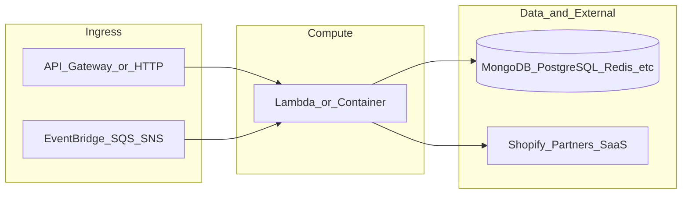

# yofi-custom-portal-api-gateway

**Path:** `D:/botnot/yofi-custom-portal-api-gateway`  
**Category:** api-gateways  
**Primary language:** Python  
**Status:** present on disk

## 1. Purpose (2-3 lines)

# AWS Lambda and API-gateway for Custom Portal

## 2. Tech stack (from manifests and file-type mix)

- **Detected primary language:** Python
- **Top-level layout:** see listing below.

### `README.md`

```
# AWS Lambda and API-gateway for Custom Portal

## RDS index backup

```sql
---- customer table index
CREATE INDEX customer_id_idx ON public.customers USING btree (customer_id)
CREATE INDEX idx__first_order_timestamp ON public.customers USING btree (first_order_timestamp)
CREATE INDEX idx_customer_email ON public.customers USING btree (customer_email)
CREATE INDEX idx__id ON public.customers USING btree (id)
CREATE INDEX idx_customer_first_name ON public.customers USING btree (customer_first_name)
CREATE INDEX idx_customer_last_name ON public.customers USING btree (customer_last_name)
CREATE INDEX idx_customer_ml_batch_predictions ON public.customers USING btree (ml_batch_predictions)
------- for sorting
CREATE INDEX idx_customer_last_order_id ON public.customers (last_order_id);
CREATE INDEX idx_customer_num_orders ON public.customers (num_orders);
CREATE INDEX idx_customer_refund_pct ON public.customers (refund_pct);
CREATE INDEX idx_customer_bot_abuse_score ON public.customers (((ml_batch_predictions ->> 'bot_abuse_score')::numeric));
CREATE INDEX idx_customer_discount_abuse_score ON public.customers (((ml_batch_predictions ->> 'discount_abuse_score')::numeric));
CREATE INDEX idx_customer_return_abuse_score ON public.customers (((ml_batch_predictions ->> 'return_abuse_score')::numeric));
CREATE INDEX idx_customer_resell_abuse_score ON public.customers (((ml_batch_predictions ->> 'resell_abuse_score')::numeric));

------ order table index
CREATE INDEX idx__customer_id ON public.orders USING btree (((customer ->> 'id'::text)))
CREATE INDEX idx__customer_email ON public.orders USING btree (((customer ->> 'email'::text)))
CREATE INDEX idx__customer_last_name ON public.orders USING btree (((customer ->> 'last_name'::text)))
CREATE INDEX idx__customer_first_name ON public.orders USING btree (((customer ->> 'first_name'::text)))

------ product table index
CREATE INDEX idx__product_id ON public.products USING btree (product_id)

------ shop table index
CREATE INDEX idx__datefilter ON public.shops USING btree (date_filter)
```

## 2024-April-17 update: Need to add a new column of risk_count

```sql
ALTER TABLE public.customers ADD COLUMN risk_count NUMERIC;
UPDATE public.customers
    SET risk_count = (
        COALESCE((ml_batch_predictions ->> 'discount_abuse_score')::numeric, 0) +
        COALESCE((ml_batch_predictions ->> 'resell_abuse_score')::numeric, 0) +
        COALESCE((ml_batch_predictions ->> 'return_abuse_score')::numeric, 0) +
        COALESCE((ml_batch_predictions ->> 'bot_abuse_score')::numeric, 0)
    );


CREATE INDEX idx_customer_risk_orders_count ON public.customers (risk_count DESC, num_orders DESC);
```




## Note: Better use psql in cloudshell to manage RDS, because cloudsql-studio sometimes query timeout
```bash
wget https://dl.google.com/cloudsql/cloud_sql_proxy.linux.amd64 -O cloud_sql_proxy
chmod +x cloud_sql_proxy
./cloud_sql_proxy -instances=<YOUR_INSTANCE_CONNECTION_NAME>=tcp:5432
# ->> Now run psql in another cloudshell tab
psql -h 127.0.0.1 -U <YOUR_DATABASE_USER> -d <YOUR_DATABASE_NAME>
```
```

### `readme.md`

```
# AWS Lambda and API-gateway for Custom Portal

## RDS index backup

```sql
---- customer table index
CREATE INDEX customer_id_idx ON public.customers USING btree (customer_id)
CREATE INDEX idx__first_order_timestamp ON public.customers USING btree (first_order_timestamp)
CREATE INDEX idx_customer_email ON public.customers USING btree (customer_email)
CREATE INDEX idx__id ON public.customers USING btree (id)
CREATE INDEX idx_customer_first_name ON public.customers USING btree (customer_first_name)
CREATE INDEX idx_customer_last_name ON public.customers USING btree (customer_last_name)
CREATE INDEX idx_customer_ml_batch_predictions ON public.customers USING btree (ml_batch_predictions)
------- for sorting
CREATE INDEX idx_customer_last_order_id ON public.customers (last_order_id);
CREATE INDEX idx_customer_num_orders ON public.customers (num_orders);
CREATE INDEX idx_customer_refund_pct ON public.customers (refund_pct);
CREATE INDEX idx_customer_bot_abuse_score ON public.customers (((ml_batch_predictions ->> 'bot_abuse_score')::numeric));
CREATE INDEX idx_customer_discount_abuse_score ON public.customers (((ml_batch_predictions ->> 'discount_abuse_score')::numeric));
CREATE INDEX idx_customer_return_abuse_score ON public.customers (((ml_batch_predictions ->> 'return_abuse_score')::numeric));
CREATE INDEX idx_customer_resell_abuse_score ON public.customers (((ml_batch_predictions ->> 'resell_abuse_score')::numeric));

------ order table index
CREATE INDEX idx__customer_id ON public.orders USING btree (((customer ->> 'id'::text)))
CREATE INDEX idx__customer_email ON public.orders USING btree (((customer ->> 'email'::text)))
CREATE INDEX idx__customer_last_name ON public.orders USING btree (((customer ->> 'last_name'::text)))
CREATE INDEX idx__customer_first_name ON public.orders USING btree (((customer ->> 'first_name'::text)))

------ product table index
CREATE INDEX idx__product_id ON public.products USING btree (product_id)

------ shop table index
CREATE INDEX idx__datefilter ON public.shops USING btree (date_filter)
```

## 2024-April-17 update: Need to add a new column of risk_count

```sql
ALTER TABLE public.customers ADD COLUMN risk_count NUMERIC;
UPDATE public.customers
    SET risk_count = (
        COALESCE((ml_batch_predictions ->> 'discount_abuse_score')::numeric, 0) +
        COALESCE((ml_batch_predictions ->> 'resell_abuse_score')::numeric, 0) +
        COALESCE((ml_batch_predictions ->> 'return_abuse_score')::numeric, 0) +
        COALESCE((ml_batch_predictions ->> 'bot_abuse_score')::numeric, 0)
    );


CREATE INDEX idx_customer_risk_orders_count ON public.customers (risk_count DESC, num_orders DESC);
```




## Note: Better use psql in cloudshell to manage RDS, because cloudsql-studio sometimes query timeout
```bash
wget https://dl.google.com/cloudsql/cloud_sql_proxy.linux.amd64 -O cloud_sql_proxy
chmod +x cloud_sql_proxy
./cloud_sql_proxy -instances=<YOUR_INSTANCE_CONNECTION_NAME>=tcp:5432
# ->> Now run psql in another cloudshell tab
psql -h 127.0.0.1 -U <YOUR_DATABASE_USER> -d <YOUR_DATABASE_NAME>
```
```

### `Readme.md`

```
# AWS Lambda and API-gateway for Custom Portal

## RDS index backup

```sql
---- customer table index
CREATE INDEX customer_id_idx ON public.customers USING btree (customer_id)
CREATE INDEX idx__first_order_timestamp ON public.customers USING btree (first_order_timestamp)
CREATE INDEX idx_customer_email ON public.customers USING btree (customer_email)
CREATE INDEX idx__id ON public.customers USING btree (id)
CREATE INDEX idx_customer_first_name ON public.customers USING btree (customer_first_name)
CREATE INDEX idx_customer_last_name ON public.customers USING btree (customer_last_name)
CREATE INDEX idx_customer_ml_batch_predictions ON public.customers USING btree (ml_batch_predictions)
------- for sorting
CREATE INDEX idx_customer_last_order_id ON public.customers (last_order_id);
CREATE INDEX idx_customer_num_orders ON public.customers (num_orders);
CREATE INDEX idx_customer_refund_pct ON public.customers (refund_pct);
CREATE INDEX idx_customer_bot_abuse_score ON public.customers (((ml_batch_predictions ->> 'bot_abuse_score')::numeric));
CREATE INDEX idx_customer_discount_abuse_score ON public.customers (((ml_batch_predictions ->> 'discount_abuse_score')::numeric));
CREATE INDEX idx_customer_return_abuse_score ON public.customers (((ml_batch_predictions ->> 'return_abuse_score')::numeric));
CREATE INDEX idx_customer_resell_abuse_score ON public.customers (((ml_batch_predictions ->> 'resell_abuse_score')::numeric));

------ order table index
CREATE INDEX idx__customer_id ON public.orders USING btree (((customer ->> 'id'::text)))
CREATE INDEX idx__customer_email ON public.orders USING btree (((customer ->> 'email'::text)))
CREATE INDEX idx__customer_last_name ON public.orders USING btree (((customer ->> 'last_name'::text)))
CREATE INDEX idx__customer_first_name ON public.orders USING btree (((customer ->> 'first_name'::text)))

------ product table index
CREATE INDEX idx__product_id ON public.products USING btree (product_id)

------ shop table index
CREATE INDEX idx__datefilter ON public.shops USING btree (date_filter)
```

## 2024-April-17 update: Need to add a new column of risk_count

```sql
ALTER TABLE public.customers ADD COLUMN risk_count NUMERIC;
UPDATE public.customers
    SET risk_count = (
        COALESCE((ml_batch_predictions ->> 'discount_abuse_score')::numeric, 0) +
        COALESCE((ml_batch_predictions ->> 'resell_abuse_score')::numeric, 0) +
        COALESCE((ml_batch_predictions ->> 'return_abuse_score')::numeric, 0) +
        COALESCE((ml_batch_predictions ->> 'bot_abuse_score')::numeric, 0)
    );


CREATE INDEX idx_customer_risk_orders_count ON public.customers (risk_count DESC, num_orders DESC);
```




## Note: Better use psql in cloudshell to manage RDS, because cloudsql-studio sometimes query timeout
```bash
wget https://dl.google.com/cloudsql/cloud_sql_proxy.linux.amd64 -O cloud_sql_proxy
chmod +x cloud_sql_proxy
./cloud_sql_proxy -instances=<YOUR_INSTANCE_CONNECTION_NAME>=tcp:5432
# ->> Now run psql in another cloudshell tab
psql -h 127.0.0.1 -U <YOUR_DATABASE_USER> -d <YOUR_DATABASE_NAME>
```
```

### `package.json`

```
{
  "version": "0.1.0",
  "private": true,
  "scripts": {
    "test": "sst test",
    "start": "sst start",
    "build": "sst build",
    "deploy": "sst deploy",
    "remove": "sst remove",
    "test:graph_v3": "jest src/customer/graph_v3/main.test.js --testTimeout=120000",
    "test:similarity_v2": "jest src/customer/similarity_v2/main.test.js --testTimeout=120000"
  },
  "eslintConfig": {
    "extends": [
      "serverless-stack"
    ]
  },
  "dependencies": {
    "@aws-cdk/aws-lambda-python-alpha": "2.136.1-alpha.0",
    "@google-cloud/bigquery": "^7.3.0",
    "aws-cdk-lib": "2.136.1",
    "aws4": "^1.12.0",
    "constructs": "10.3.0",
    "geolib": "^3.3.4",
    "jest": "^29.7.0",
    "moment": "^2.30.1",
    "mongodb": "^6.3.0",
    "neo4j-driver": "^5.16.0",
    "sst": "2.41.4",
    "ts-node": "^10.9.1",
    "vitest": "^0.24.5"
  },
  "devDependencies": {
    "better-sqlite3": "^9.5.0",
    "knex": "^3.1.0",
    "mysql": "^2.18.1",
    "mysql2": "^3.9.4",
    "oracledb": "^6.4.0",
    "pg": "^8.11.5",
    "pg-query-stream": "^4.5.5",
    "sqlite3": "^5.1.7",
    "tedious": "^18.1.0"
  }
}
```

### `sst.config.ts`

```
import type { SSTConfig } from 'sst';
import { APIStack } from './stacks/APIStack';

export default {
    config(input) {
        return {
            name: 'yofi-custom-portal-backend',
            region: 'us-east-1',
            profile: input.stage === 'prod' ? 'prod' : 'dev',
        };
    },
    stacks(app) {
        app.setDefaultFunctionProps({
            // handler: 'src/lambda.handler',
            runtime: 'python3.11',
            tracing: "disabled",
            timeout: 30,
            permissions: [
                'secretsmanager:*',
                'dynamodb:*',
                'sns:*',
                'sqs:*',
                'ssm',
                'ec2:*',
                'xray:*',
                'lambda:*',
                'athena:*',
                's3:*',
                'glue:*'
            ]
        })
        app.stack(APIStack);
    },
} satisfies SSTConfig;
```

### `Makefile`

```
#
# Makefile for BotNot.IO / Yofi.AI
#
#include .env
#export $(shell sed 's/=.*//' .env)

all:	stack-deploy
all-prod: stack-deploy-prod

install-deps:
	npm install

stack-build: install-deps
	npm run build -- --stage dev --region us-east-1 --profile dev

stack-test: stack-build
	echo npm run test

stack-deploy: stack-test
	npm run deploy -- --stage dev --region us-east-1 --profile dev

stack-build-prod: install-deps
	npm run build -- --stage prod --region us-east-1 --profile prod

stack-test-prod: stack-build-prod
	echo npm run test

stack-deploy-prod: stack-test-prod
	npm run deploy -- --stage prod --region us-east-1 --profile prod

clean:
	rm -rf .build build
	rm -rf .pytest_cache cdk.out
	rm -rf .sst node_modules
	rm -rf src/__pycache__
	rm -rf src/auth/__pycache__
	rm -rf test/__pycache__
	rm -f cdk.context.json
```


## 3. Architecture



- **Inbound:** HTTP (API Gateway / ALB), scheduled triggers, queues (SQS/SNS), EventBridge rules, or batch — infer from `stacks/`, `template.yaml`, `sst.config.ts`, or `src/` handlers.
- **Outbound:** databases and external HTTP APIs per layers and `package.json` / Python imports in handlers.
- **IaC pattern:** SST/CDK, SAM/CloudFormation, Pulumi, Helm, Terraform, or raw scripts — see manifests section.

## 4. Key files (auto-discovered)

- **Top-level entries:**

```
.gitignore
.idea
.vscode
Makefile
README.md
api_spec_geterator.py
layer_nodejs
layer_python
node_modules
package.json
seed.yml
src
sst.config.ts
stacks
test
```

## 5. My contribution / role (evidence from git history — if available)

```text
01d09bb 2024-07-23 change return_category
bf8a4c7 2024-07-23 put original return reason query
6482fd0 2024-07-23 change mapping
9bd728e 2024-07-23 fix validation
703d18b 2024-07-23 add customer id to _return_reasons_x_product_categories
0cd3432 2024-07-23 update chart api
c83a655 2024-07-23 add chart api
4304536 2024-07-23 feat: add top list of return reason and product category
```

_Use commit messages only as hints; corroborate in interviews._

## 6. Notable patterns / snippets


**`src/customer/chart/main.py`**

```python
##
# Description: AWS Lambda (ebay API Gateway) for BotNot.IO
# Autor: Vitaly
##

import json
from util_std import logger
from pydantic import BaseModel, validator
from shared_lib.util_sql import connect_cloudsql, run_sql_to_get_objects, dump_sql_objects_to_json
from validator_deco import validate_request
from shared_lib.pydantic_models import BasicFilter


class Filter(BasicFilter):
    customer_id: str

    @validator('customer_id')
    def validate_customer_id(cls, v):
        if isinstance(v, str):
            return v
        raise ValueError(f'Invalid customer id')


class RequestModel(BaseModel):
    filter: Filter


@validate_request(RequestModel)
def handler(event, context, params: RequestModel):
    logger.info(f"Received event -> {json.dumps(event)}")
    try:
        okta_client_id = event['requestContext']['authorizer']['lambda']['client_id']
        db = connect_cloudsql(okta_client_id)
        customer_id = params.filter.customer_id
        data_return_types_x_return_reasons = _return_types_x_return_reasons(db, customer_id)
        print(f"data_return_types_x_return_reasons:{data_return_types_x_return_reasons}")
        data_return_reasons_x_product_categories = _return_reasons_x_product_categories(db, customer_id)
        print(f"data_return_reasons_x_product_categories:{data_return_reasons_x_product_categories}")
        return_types = list({row["product_category"] for row in data_return_types_x_return_reasons})
        return_reasons = list({row["return_reason"] for row in data_return_types_x_return_reasons})

        # Unique product categories and return reasons
        product_categories = list({row["product_category"] for row in data_return_reasons_x_product_categories})
        print(f"product_categories:{product_categories}")
        return_reasons_product = list({row["return_reason"] for row in data_return_reasons_x_product_categories
                                       if row["return_reason"] != "None"})
        print(f"return_reasons_product:{return_reasons_product}")

        # Process heatmap data
        heatmap_data_return_types, max_value_return_types = genera

…(truncated)…
```

**`src/customer/detail/main.py`**

```python
##
# Copyright 2022 BotNot Inc., or its associates. All Rights Reserved.
#
# Description: AWS Lambda (API Gateway) for BotNot.IO
# Autor: Eugenio Grytsenko
##

import json
from util_std import logger
from shared_lib.pydantic_models import BasicFilter
from pydantic import BaseModel, validator
from shared_lib.util_sql import connect_cloudsql, run_sql_to_get_objects, dump_sql_objects_to_json, run_sql_to_get_count
from validator_deco import validate_request


class Filter(BasicFilter):
    customer_id: str

    @validator('customer_id')
    def validate_customer_id(cls, v):
        if isinstance(v, str):
            return v
        raise ValueError(f'Invalid customer id')


class RequestModel(BaseModel):
    filter: Filter


@validate_request(RequestModel)
def handler(event, context, params: RequestModel):
    logger.info(f"Received event -> {json.dumps(event)}")
    try:
        customer_id = params.filter.customer_id
        okta_client_id = event['requestContext']['authorizer']['lambda']['client_id']
        db = connect_cloudsql(okta_client_id)
        customer = _get_one_customer(db, customer_id)
        # generate_analytics_object(customer)
        customer['orders'] = get_orders(db, customer_id)

        customer['top_return_reason_list'] = get_top_return_reason_list(db, customer_id)
        customer['top_product_category_list'] = get_top_product_category_list(db, customer_id)

        return {
            'statusCode': 200,
            'body': dump_sql_objects_to_json(customer),
            'headers': {
                'Access-Control-Allow-Origin': '*',
                'Access-Control-Allow-Credentials': True
            }
        }
    except Exception as e:
        logger.exception(f'[customportal-api-customer-detail]Exception: {e}')
        return {
            'statusCode': 503,
            'body': str(e)
        }


def _get_one_customer(db, customer_id):
    sql_query = f"""
            SELECT
        c.customer_id AS id,
        c.first_name AS first_name,
        c.last_name AS last_name,
        c.email,
        c.phone,
        c.last_active_on,
        c.sour

…(truncated)…
```

**`src/customer/list/main.py`**

```python
import logging
import math
from shared_lib.util_sql import connect_cloudsql, run_sql_to_get_objects, run_sql_to_get_count, dump_sql_objects_to_json
from pydantic import BaseModel
from validator_deco import validate_request

logger = logging.getLogger()
logger.setLevel(logging.INFO)


class RequestModel(BaseModel):
    filter: dict
    sort: dict
    pagination: dict
    search_string: str = None


@validate_request(RequestModel)
def handler(event, context, params: RequestModel):
    logger.info(event)
    client_id = event['requestContext']['authorizer']['lambda']['client_id']
    params = params.dict()
    pagination = params.get('pagination', {})
    per_page = pagination.get('items_per_page', 10)
    current = pagination.get('current_page', 1)
    offset = per_page * (current - 1)

    conn = connect_cloudsql(client_id)
    data_query, count_query = get_query(filter_by=params.get('filter'), sort=params.get('sort'),
                                        per_page=per_page, offset=offset, search_string=params.get('search_string'))
    data = run_sql_to_get_objects(conn, data_query)
    # count = run_sql_to_get_count(conn, count_query)

    res = {
        'pagination': {'items_count': 1, 'page_count': math.ceil(1 / per_page), 'items_per_page': per_page,
                       'current_page': current},
        'data': data
    }

    logger.info(f'formatted res: {res}')
    final_res = dump_sql_objects_to_json(res)
    return {
        'headers': {
            'Access-Control-Allow-Origin': '*',
            'Access-Control-Allow-Credentials': True,
            'Content-Type': 'application/json'
        },
        'statusCode': 200,
        'body': final_res
    }


def get_query(filter_by, sort, per_page, offset, search_string):
    sort_field = sort.get('by', 'id')
    sort_dir = sort.get('direction', 'asc')
    default_sort = 'risk_count desc, total_order_count desc'
    sort_by = default_sort if sort_field == 'id' else f'{sort_field} {sort_dir}'

    where = f''' WHERE
    (c.created_at >= '{filter_by['date_from']}'
    AND c.created_at < '{filter_by['date_to']}')
'''
    if se

…(truncated)…
```


## 7. Metrics / SLO / scale (if available)

_Extract from Airflow DAG params, load tests, README, or CloudFormation `ReservedConcurrentExecutions` when present — not auto-inferred to avoid fabrication._

## 8. Resume bullets (ready-to-paste, English)

- Owned or extended **`yofi-custom-portal-api-gateway`** capabilities aligned with **api gateways** delivery.
- Applied **Python** stack patterns and repository-local IaC/config where present.
- Collaborated on production-grade defaults: structured logging, retries, and least-privilege IAM patterns where applicable.
- Integrated with **Yofi** platform services (data stores, queues, gateways) per dependency manifests in-repo.
- Documented operational expectations (deploy, test, local dev) via README and automation files when available.

## 9. Interview talking points

- What is the main entrypoint and trigger for `yofi-custom-portal-api-gateway`?
- How are secrets and non-prod environments separated?
- What failure modes are handled (retries, DLQ, idempotency)?
- How would you observe this service in production (metrics, logs, traces)?
