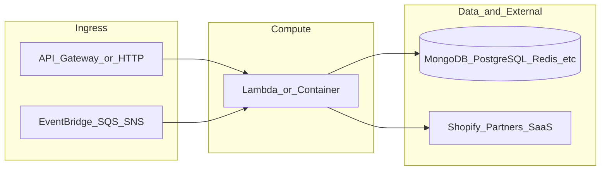

# yofi-global-webhoook-gateway

**Path:** `D:/botnot/yofi-global-webhoook-gateway`  
**Category:** api-gateways  
**Primary language:** Python  
**Status:** present on disk

## 1. Purpose (2-3 lines)

# Yofi Global Webhook Gateway

## 2. Tech stack (from manifests and file-type mix)

- **Detected primary language:** Python
- **Top-level layout:** see listing below.

### `README.md`

```
# Yofi Global Webhook Gateway

## Development

You can set up your local environment for development with [uv](https://astral.sh/uv).

To run the preset commands for development, you should install [just](https://just.systems/man/en/).

You can use `just install` to setup the environment and dependencies using uv.
This command will also install uv if you don't have it installed already.
You only need to do this once.

To run static code checks, use `just check`.
To run tests, use `just test`. Make sure you have [docker](https://www.docker.com/products/docker-desktop/)
and [gcloud CLI](https://cloud.google.com/sdk/docs/install) installed.

## Deployment

Deployment is currently done automatically: if you merge to dev or create a PR targeting
the dev branch, it will deploy to the `development` AWS environment.
When commits are pushed to main, it will be deployed to the production environment.

<details>
<summary>Deploying locally</summary>

**Only deploy locally if you know what you're doing, as this might interfere with
production services or other people's work.**

To deploy to AWS, we use Pulumi. You can get started [here](https://www.pulumi.com/docs/iac/get-started/aws/begin/).
Make sure to login using `pulumi login` with the 1Password admin credentials.

The resources are defined in the [`__main__.py`](./__main__.py) file.

To automatically run the deployment, you can run `just deploy <env>` where `<env>`
is either `prod` or `dev`.

You should have `prod` and `dev` [aws cli profiles](https://docs.aws.amazon.com/cli/latest/userguide/cli-configure-files.html#cli-configure-files-using-profiles)
configured to their respective accounts.

</details>
```

### `readme.md`

```
# Yofi Global Webhook Gateway

## Development

You can set up your local environment for development with [uv](https://astral.sh/uv).

To run the preset commands for development, you should install [just](https://just.systems/man/en/).

You can use `just install` to setup the environment and dependencies using uv.
This command will also install uv if you don't have it installed already.
You only need to do this once.

To run static code checks, use `just check`.
To run tests, use `just test`. Make sure you have [docker](https://www.docker.com/products/docker-desktop/)
and [gcloud CLI](https://cloud.google.com/sdk/docs/install) installed.

## Deployment

Deployment is currently done automatically: if you merge to dev or create a PR targeting
the dev branch, it will deploy to the `development` AWS environment.
When commits are pushed to main, it will be deployed to the production environment.

<details>
<summary>Deploying locally</summary>

**Only deploy locally if you know what you're doing, as this might interfere with
production services or other people's work.**

To deploy to AWS, we use Pulumi. You can get started [here](https://www.pulumi.com/docs/iac/get-started/aws/begin/).
Make sure to login using `pulumi login` with the 1Password admin credentials.

The resources are defined in the [`__main__.py`](./__main__.py) file.

To automatically run the deployment, you can run `just deploy <env>` where `<env>`
is either `prod` or `dev`.

You should have `prod` and `dev` [aws cli profiles](https://docs.aws.amazon.com/cli/latest/userguide/cli-configure-files.html#cli-configure-files-using-profiles)
configured to their respective accounts.

</details>
```

### `Readme.md`

```
# Yofi Global Webhook Gateway

## Development

You can set up your local environment for development with [uv](https://astral.sh/uv).

To run the preset commands for development, you should install [just](https://just.systems/man/en/).

You can use `just install` to setup the environment and dependencies using uv.
This command will also install uv if you don't have it installed already.
You only need to do this once.

To run static code checks, use `just check`.
To run tests, use `just test`. Make sure you have [docker](https://www.docker.com/products/docker-desktop/)
and [gcloud CLI](https://cloud.google.com/sdk/docs/install) installed.

## Deployment

Deployment is currently done automatically: if you merge to dev or create a PR targeting
the dev branch, it will deploy to the `development` AWS environment.
When commits are pushed to main, it will be deployed to the production environment.

<details>
<summary>Deploying locally</summary>

**Only deploy locally if you know what you're doing, as this might interfere with
production services or other people's work.**

To deploy to AWS, we use Pulumi. You can get started [here](https://www.pulumi.com/docs/iac/get-started/aws/begin/).
Make sure to login using `pulumi login` with the 1Password admin credentials.

The resources are defined in the [`__main__.py`](./__main__.py) file.

To automatically run the deployment, you can run `just deploy <env>` where `<env>`
is either `prod` or `dev`.

You should have `prod` and `dev` [aws cli profiles](https://docs.aws.amazon.com/cli/latest/userguide/cli-configure-files.html#cli-configure-files-using-profiles)
configured to their respective accounts.

</details>
```

### `pyproject.toml`

```
[project]
name = "yofi-webhooks"
version = "0.1.0"
description = "Yofi's application to parse and persist webhook events"
authors = [{ name = "Noel", email = "noel@yofi.ai" }]
dependencies = [
    "awslambdaric>=3.1.1",
    "boto3>=1.39.14",
    "codeguru-profiler-agent>=1.2.5",
    "google-cloud-spanner>=3.56.0",
    "polars>=1.32.3",
    "pydantic>=2.11.7",
    "sqlalchemy-spanner>=1.14.0",
    "yofi-common-libs",
]
requires-python = "==3.12.*"

[dependency-groups]
dev = [
    "coverage>=7.10.6",
    "pre-commit>=4.3.0",
    "pulumi>=3.186.0",
    "pulumi-aws>=7.1.0",
    "pulumi-command>=1.1.0",
    "pulumi-esc-sdk>=0.12.1",
    "pyright>=1.1.403",
    "pytest>=8.4.1",
    "pytest-cov>=7.0.0",
    "ruff>=0.12.4",
]

[tool.ruff.lint]
select = [
    "A",
    "B",
    "C4",
    "E",
    "EM",
    "ERA",
    "EXE",
    "F",
    "FURB",
    "I",
    "INP",
    "LOG",
    "N",
    "NPY",
    "PIE",
    "PTH",
    "RUF",
    "TID",
    "UP",
    "W",
]
ignore = ["UP047"]

[tool.ruff.lint.per-file-ignores]
"!src/yofi_webhooks/**.py" = ["INP001"]

[tool.uv.sources]
yofi-common-libs = { git = "https://github.com/BotNotOrg/yofi-common-libs-py", tag = "v1.0.61" }

[tool.pytest.ini_options]
testpaths = ["tests"]

[build-system]
requires = ["uv_build>=0.8.0,<0.9.0"]
build-backend = "uv_build"
```

### `Pulumi.yaml`

```
name: yofi-global-webhook-gateway
description: Orchestrator for webhook events
runtime:
  name: python
  options:
    toolchain: uv
config:
  pulumi:tags:
    value:
      pulumi:template: aws-python
```

### `pulumi.yaml`

```
name: yofi-global-webhook-gateway
description: Orchestrator for webhook events
runtime:
  name: python
  options:
    toolchain: uv
config:
  pulumi:tags:
    value:
      pulumi:template: aws-python
```


## 3. Architecture



- **Inbound:** HTTP (API Gateway / ALB), scheduled triggers, queues (SQS/SNS), EventBridge rules, or batch — infer from `stacks/`, `template.yaml`, `sst.config.ts`, or `src/` handlers.
- **Outbound:** databases and external HTTP APIs per layers and `package.json` / Python imports in handlers.
- **IaC pattern:** SST/CDK, SAM/CloudFormation, Pulumi, Helm, Terraform, or raw scripts — see manifests section.

## 4. Key files (auto-discovered)

- **Top-level entries:**

```
.cursorrules
.github
.gitignore
.pre-commit-config.yaml
.vscode
Justfile
Pulumi.dev.yaml
Pulumi.prod.yaml
Pulumi.yaml
README.md
__main__.py
db.mmd
pyproject.toml
src
tests
uv.lock
zip_layer.sh
```

## 5. My contribution / role (evidence from git history — if available)

```text
85daca2 2025-09-24 Merge pull request #28 from BotNotOrg/dev
e6f1c6a 2025-09-24 fix: refactor exceptions for missing entities
c0086e6 2025-09-24 Merge pull request #26 from BotNotOrg/dev
f20528b 2025-09-24 Merge pull request #24 from BotNotOrg/feat/fix_float_issue
6cec7a9 2025-09-24 fix: normalize json
6c24412 2025-09-23 Merge pull request #23 from BotNotOrg/fix/null_line_item
340f405 2025-09-23 fix: handle null line items in shopify return line items
9017232 2025-09-23 Merge pull request #22 from BotNotOrg/dev
```

_Use commit messages only as hints; corroborate in interviews._

## 6. Notable patterns / snippets


**`Pulumi.yaml`**

```yaml
name: yofi-global-webhook-gateway
description: Orchestrator for webhook events
runtime:
  name: python
  options:
    toolchain: uv
config:
  pulumi:tags:
    value:
      pulumi:template: aws-python
```

**`src/yofi_webhooks/db/models/app.py`**

```python
from datetime import datetime
from typing import Any

from sqlalchemy import JSON, text
from sqlalchemy.orm import Mapped, mapped_column

from yofi_webhooks._constants import SPANNER_PENDING_COMMIT_TIMESTAMP
from yofi_webhooks.db.models.base_model import BaseModel
from yofi_webhooks.logger import get_logger

logger = get_logger(__name__)


class App(BaseModel):
    __tablename__ = "apps"

    app_id: Mapped[str] = mapped_column(
        primary_key=True, nullable=False, doc="Unique ID for the app."
    )
    partner_id: Mapped[str] = mapped_column(
        primary_key=True, nullable=False, doc="Unique ID for the partner."
    )
    organization_id: Mapped[str] = mapped_column(
        primary_key=True, nullable=False, doc="Unique ID for the organization."
    )
    app_name: Mapped[str | None] = mapped_column(default=None, doc="Name of the app.")
    app_type: Mapped[str | None] = mapped_column(default=None, doc="Type of the app.")
    app_metadata: Mapped[dict | None] = mapped_column(
        JSON, default=None, doc="Metadata for the app."
    )
    created_at: Mapped[datetime | None] = mapped_column(
        default=None, doc="Timestamp of when the app was created."
    )
    updated_at: Mapped[datetime] = mapped_column(
        default=text(SPANNER_PENDING_COMMIT_TIMESTAMP),
        doc="Last update. DO NOT SET THIS FIELD MANUALLY.",
        spanner_allow_commit_timestamp=True,
    )
    shopify_installation_state: Mapped[str | None] = mapped_column(
        default=None, doc="State of the Shopify installation."
    )

    @property
    def primary_keys(self) -> dict[str, Any]:
        return {
            "app_id": self.app_id,
            "partner_id": self.partner_id,
            "organization_id": self.organization_id,
        }

    def is_newer_than(self, other: "App | None") -> bool:
        if other is None:
            return True
        our_updated_at = self.updated_at or self.created_at
        other_updated_at = other.updated_at or other.created_at
        logger.debug(
            f"{self}: our_updated_at: {our_updated_at} | "
            f"{other}: other_updated_at: {o

…(truncated)…
```


## 7. Metrics / SLO / scale (if available)

_Extract from Airflow DAG params, load tests, README, or CloudFormation `ReservedConcurrentExecutions` when present — not auto-inferred to avoid fabrication._

## 8. Resume bullets (ready-to-paste, English)

- Owned or extended **`yofi-global-webhoook-gateway`** capabilities aligned with **api gateways** delivery.
- Applied **Python** stack patterns and repository-local IaC/config where present.
- Collaborated on production-grade defaults: structured logging, retries, and least-privilege IAM patterns where applicable.
- Integrated with **Yofi** platform services (data stores, queues, gateways) per dependency manifests in-repo.
- Documented operational expectations (deploy, test, local dev) via README and automation files when available.

## 9. Interview talking points

- What is the main entrypoint and trigger for `yofi-global-webhoook-gateway`?
- How are secrets and non-prod environments separated?
- What failure modes are handled (retries, DLQ, idempotency)?
- How would you observe this service in production (metrics, logs, traces)?
