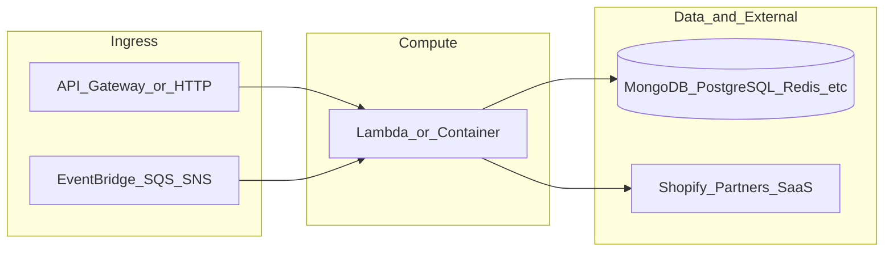

# yofi-hub

**Path:** `D:/botnot/yofi-hub`  
**Category:** api-gateways  
**Primary language:** YAML  
**Status:** present on disk

## 1. Purpose (2-3 lines)

# Yofi Hub

Kubernetes-based OAuth2 authentication service with Okta as identity provider, integrated with Airflow, Airbyte and other services.

## 2. Tech stack (from manifests and file-type mix)

- **Detected primary language:** YAML
- **Top-level layout:** see listing below.

### `README.md`

```
# Yofi Hub

Kubernetes-based OAuth2 authentication service with Okta as identity provider, integrated with Airflow, Airbyte and other services.

## Project Structure

```
yofi-okta-oauth-proxy/
├── frontend/                # Frontend code
│   ├── src/                 # Source code
│   ├── public/              # Static assets
│   ├── build/               # Build output
│   └── build.sh             # Build script
├── helm/                    # Helm chart for Kubernetes deployment
│   ├── templates/           # K8s resource templates
│   ├── Chart.yaml           # Chart metadata
│   ├── values.yaml          # Default values (production)
│   └── values-dev.yaml      # Development values
├── scripts/                 # Utility scripts
│   ├── install-deps-dev.sh  # Install dev dependencies
│   ├── install-deps-prod.sh # Install prod dependencies
│   ├── cleanup-deps-dev.sh  # Cleanup dev resources
│   └── cleanup-deps-prod.sh # Cleanup prod resources
└── .github/workflows/       # GitHub Actions workflows
    ├── deploy-dev.yaml      # Dev deployment workflow
    └── deploy-prod.yaml     # Prod deployment workflow
```

## Configuration and Secrets

### Environment Configuration

The application uses separate configuration files for development and production environments.

#### Development Configuration (values-dev.yaml)

Defines settings specific to development including resource limits, replicas, and database connections.

#### Production Configuration (values.yaml)

Contains default production configurations with higher resource allocations and more replicas for high availability.

### Configuration Variables and Secrets

#### GitHub Repository Environment Variables
Configure in GitHub repository Settings → Environments:

- `APP_DOMAIN`: Application domain
- `GCP_PROJECT_ID`: GCP project ID
- `GKE_CLUSTER_NAME`: GKE cluster name
- `GKE_ZONE`: GKE cluster zone
- `ADMIN_EMAIL`: Administrator email
- `DATABASE_HOST`: Database host address
- `DATABASE_USER`: Database username
- `AIRBYTE_MEMORY_LIMIT_PROD`: Memory limit for Airbyte connections in production (e.g., "500Mi")
- `AIRBYTE_MEMORY_REQUEST_PROD`: Memory request for Airbyte connections in production (e.g., "300Mi")
- `AIRBYTE_CPU_LIMIT_PROD`: CPU limit for Airbyte connections in production (e.g., "0.5")
- `AIRBYTE_CPU_REQUEST_PROD`: CPU request for Airbyte connections in production (e.g., "0.3")

#### GitHub Repository Secrets
Configure in GitHub repository Settings → Secrets:

- `GCP_DEV_ACCESS_KEY`: GCP service account key for development environment
- `GCP_PROD_ACCESS_KEY`: GCP service account key for production environment

#### GCP Secret Manager Secrets
Required secrets in GCP Secret Manager:

- `okta-client-id-[env]`: Okta OAuth client ID
- `okta-client-secret-[env]`: Okta OAuth client secret
- `okta-client-basic-auth-[env]`: Basic auth credentials
- `okta-oauth-proxy-airbyte-password-[env]`: Airbyte auth password
- `okta-oauth-proxy-database-password-[env]`: Database password for both airflow and airbyte
- `okta-oauth-proxy-github-ssh-key-[env]`: GitHub SSH private key for airflow dags sync


…(truncated)…
```

### `readme.md`

```
# Yofi Hub

Kubernetes-based OAuth2 authentication service with Okta as identity provider, integrated with Airflow, Airbyte and other services.

## Project Structure

```
yofi-okta-oauth-proxy/
├── frontend/                # Frontend code
│   ├── src/                 # Source code
│   ├── public/              # Static assets
│   ├── build/               # Build output
│   └── build.sh             # Build script
├── helm/                    # Helm chart for Kubernetes deployment
│   ├── templates/           # K8s resource templates
│   ├── Chart.yaml           # Chart metadata
│   ├── values.yaml          # Default values (production)
│   └── values-dev.yaml      # Development values
├── scripts/                 # Utility scripts
│   ├── install-deps-dev.sh  # Install dev dependencies
│   ├── install-deps-prod.sh # Install prod dependencies
│   ├── cleanup-deps-dev.sh  # Cleanup dev resources
│   └── cleanup-deps-prod.sh # Cleanup prod resources
└── .github/workflows/       # GitHub Actions workflows
    ├── deploy-dev.yaml      # Dev deployment workflow
    └── deploy-prod.yaml     # Prod deployment workflow
```

## Configuration and Secrets

### Environment Configuration

The application uses separate configuration files for development and production environments.

#### Development Configuration (values-dev.yaml)

Defines settings specific to development including resource limits, replicas, and database connections.

#### Production Configuration (values.yaml)

Contains default production configurations with higher resource allocations and more replicas for high availability.

### Configuration Variables and Secrets

#### GitHub Repository Environment Variables
Configure in GitHub repository Settings → Environments:

- `APP_DOMAIN`: Application domain
- `GCP_PROJECT_ID`: GCP project ID
- `GKE_CLUSTER_NAME`: GKE cluster name
- `GKE_ZONE`: GKE cluster zone
- `ADMIN_EMAIL`: Administrator email
- `DATABASE_HOST`: Database host address
- `DATABASE_USER`: Database username
- `AIRBYTE_MEMORY_LIMIT_PROD`: Memory limit for Airbyte connections in production (e.g., "500Mi")
- `AIRBYTE_MEMORY_REQUEST_PROD`: Memory request for Airbyte connections in production (e.g., "300Mi")
- `AIRBYTE_CPU_LIMIT_PROD`: CPU limit for Airbyte connections in production (e.g., "0.5")
- `AIRBYTE_CPU_REQUEST_PROD`: CPU request for Airbyte connections in production (e.g., "0.3")

#### GitHub Repository Secrets
Configure in GitHub repository Settings → Secrets:

- `GCP_DEV_ACCESS_KEY`: GCP service account key for development environment
- `GCP_PROD_ACCESS_KEY`: GCP service account key for production environment

#### GCP Secret Manager Secrets
Required secrets in GCP Secret Manager:

- `okta-client-id-[env]`: Okta OAuth client ID
- `okta-client-secret-[env]`: Okta OAuth client secret
- `okta-client-basic-auth-[env]`: Basic auth credentials
- `okta-oauth-proxy-airbyte-password-[env]`: Airbyte auth password
- `okta-oauth-proxy-database-password-[env]`: Database password for both airflow and airbyte
- `okta-oauth-proxy-github-ssh-key-[env]`: GitHub SSH private key for airflow dags sync


…(truncated)…
```

### `Readme.md`

```
# Yofi Hub

Kubernetes-based OAuth2 authentication service with Okta as identity provider, integrated with Airflow, Airbyte and other services.

## Project Structure

```
yofi-okta-oauth-proxy/
├── frontend/                # Frontend code
│   ├── src/                 # Source code
│   ├── public/              # Static assets
│   ├── build/               # Build output
│   └── build.sh             # Build script
├── helm/                    # Helm chart for Kubernetes deployment
│   ├── templates/           # K8s resource templates
│   ├── Chart.yaml           # Chart metadata
│   ├── values.yaml          # Default values (production)
│   └── values-dev.yaml      # Development values
├── scripts/                 # Utility scripts
│   ├── install-deps-dev.sh  # Install dev dependencies
│   ├── install-deps-prod.sh # Install prod dependencies
│   ├── cleanup-deps-dev.sh  # Cleanup dev resources
│   └── cleanup-deps-prod.sh # Cleanup prod resources
└── .github/workflows/       # GitHub Actions workflows
    ├── deploy-dev.yaml      # Dev deployment workflow
    └── deploy-prod.yaml     # Prod deployment workflow
```

## Configuration and Secrets

### Environment Configuration

The application uses separate configuration files for development and production environments.

#### Development Configuration (values-dev.yaml)

Defines settings specific to development including resource limits, replicas, and database connections.

#### Production Configuration (values.yaml)

Contains default production configurations with higher resource allocations and more replicas for high availability.

### Configuration Variables and Secrets

#### GitHub Repository Environment Variables
Configure in GitHub repository Settings → Environments:

- `APP_DOMAIN`: Application domain
- `GCP_PROJECT_ID`: GCP project ID
- `GKE_CLUSTER_NAME`: GKE cluster name
- `GKE_ZONE`: GKE cluster zone
- `ADMIN_EMAIL`: Administrator email
- `DATABASE_HOST`: Database host address
- `DATABASE_USER`: Database username
- `AIRBYTE_MEMORY_LIMIT_PROD`: Memory limit for Airbyte connections in production (e.g., "500Mi")
- `AIRBYTE_MEMORY_REQUEST_PROD`: Memory request for Airbyte connections in production (e.g., "300Mi")
- `AIRBYTE_CPU_LIMIT_PROD`: CPU limit for Airbyte connections in production (e.g., "0.5")
- `AIRBYTE_CPU_REQUEST_PROD`: CPU request for Airbyte connections in production (e.g., "0.3")

#### GitHub Repository Secrets
Configure in GitHub repository Settings → Secrets:

- `GCP_DEV_ACCESS_KEY`: GCP service account key for development environment
- `GCP_PROD_ACCESS_KEY`: GCP service account key for production environment

#### GCP Secret Manager Secrets
Required secrets in GCP Secret Manager:

- `okta-client-id-[env]`: Okta OAuth client ID
- `okta-client-secret-[env]`: Okta OAuth client secret
- `okta-client-basic-auth-[env]`: Basic auth credentials
- `okta-oauth-proxy-airbyte-password-[env]`: Airbyte auth password
- `okta-oauth-proxy-database-password-[env]`: Database password for both airflow and airbyte
- `okta-oauth-proxy-github-ssh-key-[env]`: GitHub SSH private key for airflow dags sync


…(truncated)…
```


## 3. Architecture



- **Inbound:** HTTP (API Gateway / ALB), scheduled triggers, queues (SQS/SNS), EventBridge rules, or batch — infer from `stacks/`, `template.yaml`, `sst.config.ts`, or `src/` handlers.
- **Outbound:** databases and external HTTP APIs per layers and `package.json` / Python imports in handlers.
- **IaC pattern:** SST/CDK, SAM/CloudFormation, Pulumi, Helm, Terraform, or raw scripts — see manifests section.

## 4. Key files (auto-discovered)

- **Top-level entries:**

```
.github
.gitignore
README.md
frontend
helm
images
scripts
terraform
```

## 5. My contribution / role (evidence from git history — if available)

```text
1525e39 2025-09-16 Merge pull request #81 from BotNotOrg/dev
90c1e69 2025-09-16 Merge pull request #91 from BotNotOrg/fix/dag-processor-resources
72db440 2025-09-16 fix: increase dagprocessor resources
bcdb9bb 2025-09-15 fix: airflow deployment fixes
8b6f456 2025-09-14 Merge pull request #90 from BotNotOrg/fix/dagbag_import_timeout
6f77e2d 2025-09-14 fix: set scheduler and dagprocessor resources explicitly
5a2ff44 2025-09-14 fix: increase dagbag import timeout
7f6cd52 2025-09-14 Merge pull request #89 from BotNotOrg/fix/dbt_version
```

_Use commit messages only as hints; corroborate in interviews._

## 6. Notable patterns / snippets


**`frontend/src/index.js`**

```text
import React from 'react';
import ReactDOM from 'react-dom/client';
import './index.css';
import App from './App';

const root = ReactDOM.createRoot(document.getElementById('root'));
root.render(
  <React.StrictMode>
    <App />
  </React.StrictMode>
);
```


## 7. Metrics / SLO / scale (if available)

_Extract from Airflow DAG params, load tests, README, or CloudFormation `ReservedConcurrentExecutions` when present — not auto-inferred to avoid fabrication._

## 8. Resume bullets (ready-to-paste, English)

- Owned or extended **`yofi-hub`** capabilities aligned with **api gateways** delivery.
- Applied **YAML** stack patterns and repository-local IaC/config where present.
- Collaborated on production-grade defaults: structured logging, retries, and least-privilege IAM patterns where applicable.
- Integrated with **Yofi** platform services (data stores, queues, gateways) per dependency manifests in-repo.
- Documented operational expectations (deploy, test, local dev) via README and automation files when available.

## 9. Interview talking points

- What is the main entrypoint and trigger for `yofi-hub`?
- How are secrets and non-prod environments separated?
- What failure modes are handled (retries, DLQ, idempotency)?
- How would you observe this service in production (metrics, logs, traces)?
