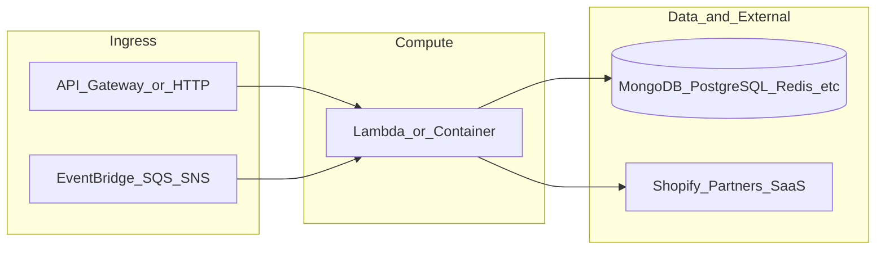

# yofi-knative-api-gateway

**Path:** `D:/botnot/yofi-knative-api-gateway`  
**Category:** api-gateways  
**Primary language:** Python  
**Status:** present on disk

## 1. Purpose (2-3 lines)

# yofi-knative-api-gateway
knative api gateway

#Setup Pytest for auth_util.py

```
pip install -r requirements.txt
pip install pytest-asyncio httpx pytest-env cryptography
```

## 2. Tech stack (from manifests and file-type mix)

- **Detected primary language:** Python
- **Top-level layout:** see listing below.

### `README.md`

```
# yofi-knative-api-gateway
knative api gateway

#Setup Pytest for auth_util.py

```
pip install -r requirements.txt
pip install pytest-asyncio httpx pytest-env cryptography
```


## Create Redis instance

```
gcloud redis instances create --project=yofi-dev-environment  yofi-portal-redis-instance --tier=basic --size=1 --region=us-central1 --redis-version=redis_7_0 --network=projects/yofi-dev-environment/global/networks/yofi-global-vpc --zone=us-central1-a --connect-mode=PRIVATE_SERVICE_ACCESS --transit-encryption-mode=SERVER_AUTHENTICATION --display-name="Yofi Portal Redis Instance" --enable-auth
```

## Issues:

1. The allocated private IP address space is exhausted
   
```
Unable to create/update instance. The allocated private IP address space is exhausted. For information on expanding the allocation, see https://cloud.google.com/vpc/docs/configure-private-services-access#modify-ip-range.
Private services access
```
Steps:

* Go to the `Private services access` of the target vpc
* Select `Allocated IP ranges for services` tab, click `Allocate IP range` to add new range.
* Select `Private connections to services` tab, create connect with the range created in previous step.
  

## Redis for Pytest and local serving

The redis instance is from redis.io, please use the account in 1Password to access it.
It has 30MB storage limit.


## Required Secrets

**portal_admin_token_secret** The secret to encode JWT for admin/operation apis for portal
**portal_redis_certificate**  Ther certificate of GCP redis, will be set as `cert_secret_id` attribute in `PORTAL_REDIS_CONNECTION`, download the `server-ca.pem` from GCP and add as plain text secret.


## Required Env values

**PORTAL_REDIS_CONNECTION** The redis connection for auth caching, sample:

```json
{"host":"10.41.54.3","port":6378,"username":"","password":"AUTH string","cert_secret_id":"portal_redis_certificate"}
```


## Key Notes

1. If you seperate router logic to different python files, make sure you import it in `__init__.py`


## Pytest

### Prerequisites

Initialized organization `yofi_dev_tests` for `alexh-dev-shop.myshopify.com` and `matt-dev-shop.myshopify.com`

## VSCode Extensions

To enhance your development experience, install the recommended VSCode extensions:

```
ms-python.python
ms-python.vscode-pylance
ms-python.black-formatter
```

You can install these extensions manually or use the built-in recommendations feature in VSCode, which will prompt you to install them based on the workspace configuration.
```

### `readme.md`

```
# yofi-knative-api-gateway
knative api gateway

#Setup Pytest for auth_util.py

```
pip install -r requirements.txt
pip install pytest-asyncio httpx pytest-env cryptography
```


## Create Redis instance

```
gcloud redis instances create --project=yofi-dev-environment  yofi-portal-redis-instance --tier=basic --size=1 --region=us-central1 --redis-version=redis_7_0 --network=projects/yofi-dev-environment/global/networks/yofi-global-vpc --zone=us-central1-a --connect-mode=PRIVATE_SERVICE_ACCESS --transit-encryption-mode=SERVER_AUTHENTICATION --display-name="Yofi Portal Redis Instance" --enable-auth
```

## Issues:

1. The allocated private IP address space is exhausted
   
```
Unable to create/update instance. The allocated private IP address space is exhausted. For information on expanding the allocation, see https://cloud.google.com/vpc/docs/configure-private-services-access#modify-ip-range.
Private services access
```
Steps:

* Go to the `Private services access` of the target vpc
* Select `Allocated IP ranges for services` tab, click `Allocate IP range` to add new range.
* Select `Private connections to services` tab, create connect with the range created in previous step.
  

## Redis for Pytest and local serving

The redis instance is from redis.io, please use the account in 1Password to access it.
It has 30MB storage limit.


## Required Secrets

**portal_admin_token_secret** The secret to encode JWT for admin/operation apis for portal
**portal_redis_certificate**  Ther certificate of GCP redis, will be set as `cert_secret_id` attribute in `PORTAL_REDIS_CONNECTION`, download the `server-ca.pem` from GCP and add as plain text secret.


## Required Env values

**PORTAL_REDIS_CONNECTION** The redis connection for auth caching, sample:

```json
{"host":"10.41.54.3","port":6378,"username":"","password":"AUTH string","cert_secret_id":"portal_redis_certificate"}
```


## Key Notes

1. If you seperate router logic to different python files, make sure you import it in `__init__.py`


## Pytest

### Prerequisites

Initialized organization `yofi_dev_tests` for `alexh-dev-shop.myshopify.com` and `matt-dev-shop.myshopify.com`

## VSCode Extensions

To enhance your development experience, install the recommended VSCode extensions:

```
ms-python.python
ms-python.vscode-pylance
ms-python.black-formatter
```

You can install these extensions manually or use the built-in recommendations feature in VSCode, which will prompt you to install them based on the workspace configuration.
```

### `Readme.md`

```
# yofi-knative-api-gateway
knative api gateway

#Setup Pytest for auth_util.py

```
pip install -r requirements.txt
pip install pytest-asyncio httpx pytest-env cryptography
```


## Create Redis instance

```
gcloud redis instances create --project=yofi-dev-environment  yofi-portal-redis-instance --tier=basic --size=1 --region=us-central1 --redis-version=redis_7_0 --network=projects/yofi-dev-environment/global/networks/yofi-global-vpc --zone=us-central1-a --connect-mode=PRIVATE_SERVICE_ACCESS --transit-encryption-mode=SERVER_AUTHENTICATION --display-name="Yofi Portal Redis Instance" --enable-auth
```

## Issues:

1. The allocated private IP address space is exhausted
   
```
Unable to create/update instance. The allocated private IP address space is exhausted. For information on expanding the allocation, see https://cloud.google.com/vpc/docs/configure-private-services-access#modify-ip-range.
Private services access
```
Steps:

* Go to the `Private services access` of the target vpc
* Select `Allocated IP ranges for services` tab, click `Allocate IP range` to add new range.
* Select `Private connections to services` tab, create connect with the range created in previous step.
  

## Redis for Pytest and local serving

The redis instance is from redis.io, please use the account in 1Password to access it.
It has 30MB storage limit.


## Required Secrets

**portal_admin_token_secret** The secret to encode JWT for admin/operation apis for portal
**portal_redis_certificate**  Ther certificate of GCP redis, will be set as `cert_secret_id` attribute in `PORTAL_REDIS_CONNECTION`, download the `server-ca.pem` from GCP and add as plain text secret.


## Required Env values

**PORTAL_REDIS_CONNECTION** The redis connection for auth caching, sample:

```json
{"host":"10.41.54.3","port":6378,"username":"","password":"AUTH string","cert_secret_id":"portal_redis_certificate"}
```


## Key Notes

1. If you seperate router logic to different python files, make sure you import it in `__init__.py`


## Pytest

### Prerequisites

Initialized organization `yofi_dev_tests` for `alexh-dev-shop.myshopify.com` and `matt-dev-shop.myshopify.com`

## VSCode Extensions

To enhance your development experience, install the recommended VSCode extensions:

```
ms-python.python
ms-python.vscode-pylance
ms-python.black-formatter
```

You can install these extensions manually or use the built-in recommendations feature in VSCode, which will prompt you to install them based on the workspace configuration.
```


## 3. Architecture



- **Inbound:** HTTP (API Gateway / ALB), scheduled triggers, queues (SQS/SNS), EventBridge rules, or batch — infer from `stacks/`, `template.yaml`, `sst.config.ts`, or `src/` handlers.
- **Outbound:** databases and external HTTP APIs per layers and `package.json` / Python imports in handlers.
- **IaC pattern:** SST/CDK, SAM/CloudFormation, Pulumi, Helm, Terraform, or raw scripts — see manifests section.

## 4. Key files (auto-discovered)

- **Top-level entries:**

```
.github
.gitignore
README.md
portal
```

## 5. My contribution / role (evidence from git history — if available)

```text
51a55cc 2025-09-24 Merge pull request #69 from BotNotOrg/dev
16c433f 2025-09-24 Refactor search_quick function to streamline app and organization ID handling (#68)
9c07003 2025-09-23 Merge pull request #67 from BotNotOrg/dev
ed7b86e 2025-09-23 exactly match for email in quick search (#66)
eef951e 2025-09-22 Merge pull request #65 from BotNotOrg/dev
3e7520b 2025-09-22 Merge pull request #64 from BotNotOrg/feature/YOFI-920-fix-non-order-number
0c164a7 2025-09-19 Merge pull request #63 from BotNotOrg/dev
6e58e60 2025-09-19 [bugfix] remove results type validation (#62)
```

_Use commit messages only as hints; corroborate in interviews._

## 6. Notable patterns / snippets


**`portal/api/ecommerce_customers/customer_llm_prediction/handler.py`**

```python
import json
import time
import arrow
import hashlib
from datetime import datetime, timedelta, timezone

from .pred_util import (
    get_merged_pred_result,
    generate_llm_explanations,
    get_merged_rule_based_model_predictions,
)
from .spanner_lib import (
    SPANNER,
    get_customer_entity_id,
    get_customer_cluster_info,
    persist_llm_predictions,
    update_predictions,
    persist_ml_validation_dataset,
)
from .features import (
    LLMPredictionFeature,
    is_quip_subscription_customer,
    is_company_customer,
)

from yofi_common_libs.log_k8s import klogger


def get_process_time():
    now = datetime.utcnow()
    formatted_time = now.strftime("%Y-%m-%dT%H:%M:%S.") + f"{now.microsecond:06d}" + "Z"
    return formatted_time


def generate_response(
    customer_obj, llm_predictions, request_id, model_predictions=None
):
    return {
        "request_id": request_id,
        "model_predictions": model_predictions or customer_obj.get("model_predictions"),
        "llm_predictions": llm_predictions,
        "basic_info": {
            "email": customer_obj.get("email"),
            "first_name": customer_obj.get("first_name"),
            "last_name": customer_obj.get("last_name"),
            "full_name": customer_obj.get("full_name"),
            "customer_id": customer_obj.get("customer_id"),
            "created_at": customer_obj.get("created_at"),
        },
    }


def generate_entity_id(
    customer_shopify_id: str, shop_url: str, model_version: str, feat_set_version: str
):
    shop_url = shop_url[0:45]
    formula = f"{customer_shopify_id}{shop_url}{model_version}{feat_set_version}"
    return hashlib.blake2b(key=formula.encode("utf8"), digest_size=18).hexdigest()


def generate_request_id(customer_shopify_id: str, shop_url: str):
    shop_url = shop_url[0:45]
    ts = int(time.time())
    formula = f"{customer_shopify_id}_{shop_url}_{ts}"
    return hashlib.blake2b(key=formula.encode("utf8"), digest_size=18).hexdigest()


def handle_prediction(shop_url: str, customer_id: str) -> dict:
    customer_shopify_id = customer_id
    if not customer_shopify_

…(truncated)…
```

**`portal/main.py`**

```python
from fastapi import FastAPI, Request, HTTPException
from fastapi.middleware.cors import CORSMiddleware

from contextvars import ContextVar
import uuid
import logging
from yofi_common_libs.log_k8s import klogger
import http

from core.json_api import (
    JsonApiException,
    json_api_exception_handler,
    http_exception_handler,
)

# import routers
import api.ecommerce_order_return.router
import api.ecommerce_claim.router
import api.ecommerce_customers.router
import api.ecommerce_orders.router
import api.app.router
import api.employee.router
import api.event.router
import api.portal_core.router
import api.portal_admin.router
import api.notification_events.router
import api.app_analytics.router
import api.pivot_table.router
import api.transaction.router
import api.ecommerce_unified_return.router
import api.ebr_payment_detail.router
import api.partner.router
import api.search.quick

trace_id_ctx_var: ContextVar[str] = ContextVar("trace_id", default=None)


class TraceIdFilter(logging.Filter):
    def filter(self, record):
        record.trace_id = trace_id_ctx_var.get() or ""
        return True


klogger.addFilter(TraceIdFilter())

app = FastAPI()
app.add_middleware(
    CORSMiddleware,
    allow_origins=["*"],
    allow_credentials=True,
    allow_methods=["*"],
    allow_headers=[
        "authorization",
        "shop_url",
        "session-token",
        "is_all_connected",
        "partner_id",
        "organization_id",
        "app_id",
    ],
)


@app.middleware("http")
async def trace_id_middleware(request: Request, call_next):
    trace_id = str(uuid.uuid4())
    trace_id_ctx_var.set(trace_id)
    response = await call_next(request)
    response.headers["X-Trace-Id"] = trace_id

    try:
        request_log_text = f"{request.client.host} - \"{request.method} {request.url.path} {request.scope.get('type')}/{request.scope.get('http_version')}\" {response.status_code} {http.HTTPStatus(response.status_code).phrase}"
        klogger.info(request_log_text)
    except Exception as e:
        pass

    return response


app.include_router(
    prefix="/ecommer

…(truncated)…
```


## 7. Metrics / SLO / scale (if available)

_Extract from Airflow DAG params, load tests, README, or CloudFormation `ReservedConcurrentExecutions` when present — not auto-inferred to avoid fabrication._

## 8. Resume bullets (ready-to-paste, English)

- Owned or extended **`yofi-knative-api-gateway`** capabilities aligned with **api gateways** delivery.
- Applied **Python** stack patterns and repository-local IaC/config where present.
- Collaborated on production-grade defaults: structured logging, retries, and least-privilege IAM patterns where applicable.
- Integrated with **Yofi** platform services (data stores, queues, gateways) per dependency manifests in-repo.
- Documented operational expectations (deploy, test, local dev) via README and automation files when available.

## 9. Interview talking points

- What is the main entrypoint and trigger for `yofi-knative-api-gateway`?
- How are secrets and non-prod environments separated?
- What failure modes are handled (retries, DLQ, idempotency)?
- How would you observe this service in production (metrics, logs, traces)?
