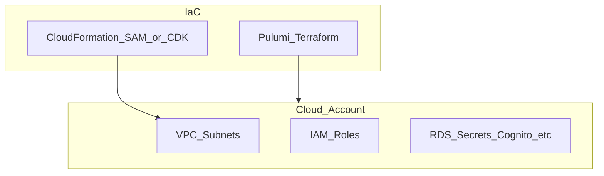

# botnot-env-base-resources

**Path:** `D:/botnot/botnot-env-base-resources`  
**Category:** infra  
**Primary language:** YAML  
**Status:** present on disk

## 1. Purpose (2-3 lines)

mock-push-int-2

## 2. Tech stack (from manifests and file-type mix)

- **Detected primary language:** YAML
- **Top-level layout:** see listing below.

### `README.md`

```
mock-push-int-2
```

### `readme.md`

```
mock-push-int-2
```

### `Readme.md`

```
mock-push-int-2
```

### `template.yaml`

```
AWSTemplateFormatVersion: '2010-09-09'
Transform: AWS::Serverless-2016-10-31
Description: >
  Base environment resources for the Lambda functions

Parameters:
  AppName:
    Description: "Application Name"
    Type: String
    Default: botnot

  EnvType:
    Description: "Environment type (eg, dev, qa, prod)"
    Type: String
    Default: dev

  StackType:
    Description: "backend or frontend"
    Type: String
    Default: backend

  SlackChannelForAlerts:
    Description: "Please create different channel for different env"
    Type: String
    Default: C03HK6GPFCG # this is #aws-dev-alerts channel

  SlackWorkspaceForAlerts:
    Description: "Please create different channel for different env"
    Type: String
    Default: T02LXND45T6 # this is organization channel

  ShopifyAppApiKeyParam:
    Description: "Please provide ShopifyAppCode"
    Type: String
    Default: "7234f3953e03e9a8d324e83ff0b5d676"

  ShopifyAppApiSecretParam:
    Description: "Please provide ShopifyAppSecret"
    Type: String
    Default: "97810344ba3196c38b18c0b2d8bcd2c3"


Conditions:
  IsProduction: !Equals [ !Ref EnvType, prod ]

Resources:
  # SNS Topics
  # --> SNS Events
  LambdaExecutionErrorEventSNS:
    Type: AWS::SNS::Topic
    Properties:
      DisplayName: !Sub "${EnvType}-${AppName}-${StackType}-lambda-execution-error-event-sns"
      TopicName: !Sub "${EnvType}-${AppName}-${StackType}-lambda-execution-errors-event-sns"
  ControllerTaskEventSNS:
    Type: AWS::SNS::Topic
    Properties:
      DisplayName: !Sub "${EnvType}-${AppName}-${StackType}-sns-ml-controller-task-topic"
      TopicName: !Sub "${EnvType}-${AppName}-${StackType}-sns-ml-controller-task-topic"
  ExportTaskSNS:
    Type: AWS::SNS::Topic
    Properties:
      DisplayName: !Sub "${EnvType}-${AppName}-${StackType}-export-controller-task-sns"
      TopicName: !Sub "${EnvType}-${AppName}-${StackType}-export-controller-task-sns"
  ExportTaskOutputSNS:
    Type: AWS::SNS::Topic
    Properties:
      DisplayName: !Sub "${EnvType}-${AppName}-${StackType}-export-task-sns"
      TopicName: !Sub "${EnvType}-${AppName}-${StackType}-export-task-sns"
  OrderMlPredictionEventSNS:
    Type: AWS::SNS::Topic
    Properties:
      DisplayName: !Sub "${EnvType}-${AppName}-${StackType}-order-ml-predictions-sns-topic"
      TopicName: !Sub "${EnvType}-${AppName}-${StackType}-order-ml-predictions-sns-topic"
  BudgetThresholdCrossEventSNS:
    Type: AWS::SNS::Topic
    Properties:
      DisplayName: !Sub "${EnvType}-${AppName}-${StackType}-budget-threshold-cross-event-sns"
      TopicName: !Sub "${EnvType}-${AppName}-${StackType}-budget-threshold-cross-event-sns"
  OrderBotDetectionMLEventSNS:
    Type: AWS::SNS::Topic
    Properties:
      DisplayName: !Sub "${EnvType}-${AppName}-${StackType}-order-bot-detection-ml-event-sns"
      TopicName: !Sub "${EnvType}-${AppName}-${StackType}-order-bot-detection-ml-event-sns"
  OrderReceivedEventSNS:
    Type: AWS::SNS::Topic
    Properties:
      DisplayName: !Sub "${EnvType}-${AppName}-${StackType}-order-received-event-sns"
      TopicName: !Sub "${EnvType}-${AppNam

…(truncated)…
```

### `Makefile`

```
git-update:
	git pull

build-dev: git-update
	sam build --config-file samconfig_dev.toml --profile dev

build-prod: git-update
	sam build --config-file samconfig_prod.toml --profile prod

deploy-dev: build-dev
	sam deploy --config-file samconfig_dev.toml --profile dev

deploy-prod: build-prod
	sam deploy --config-file samconfig_prod.toml --profile prod
```


## 3. Architecture



- **Inbound:** HTTP (API Gateway / ALB), scheduled triggers, queues (SQS/SNS), EventBridge rules, or batch — infer from `stacks/`, `template.yaml`, `sst.config.ts`, or `src/` handlers.
- **Outbound:** databases and external HTTP APIs per layers and `package.json` / Python imports in handlers.
- **IaC pattern:** SST/CDK, SAM/CloudFormation, Pulumi, Helm, Terraform, or raw scripts — see manifests section.

## 4. Key files (auto-discovered)

- **Top-level entries:**

```
.github
.gitignore
.idea
Makefile
README.md
samconfig_dev.toml
samconfig_prod.toml
template.yaml
```

## 5. My contribution / role (evidence from git history — if available)

```text
4f75eb3 2024-10-26 add graph-spanner-task-sns-topic-arn
6032eb4 2024-09-03 back name
b75211e 2024-09-03 change name table
ebdee87 2024-09-03 add KeyType range for shop_url
519c1ae 2024-09-03 add StoreSettingsAddressDelete
403b701 2024-06-27 add order-enrichment-2-task-sns-topic-arn
b2ee138 2024-06-12 feat: feature-analytics-task-sns-topic-arn
d4b6a15 2024-05-17 add save event history
```

_Use commit messages only as hints; corroborate in interviews._

## 6. Notable patterns / snippets


**`template.yaml`**

```yaml
AWSTemplateFormatVersion: '2010-09-09'
Transform: AWS::Serverless-2016-10-31
Description: >
  Base environment resources for the Lambda functions

Parameters:
  AppName:
    Description: "Application Name"
    Type: String
    Default: botnot

  EnvType:
    Description: "Environment type (eg, dev, qa, prod)"
    Type: String
    Default: dev

  StackType:
    Description: "backend or frontend"
    Type: String
    Default: backend

  SlackChannelForAlerts:
    Description: "Please create different channel for different env"
    Type: String
    Default: C03HK6GPFCG # this is #aws-dev-alerts channel

  SlackWorkspaceForAlerts:
    Description: "Please create different channel for different env"
    Type: String
    Default: T02LXND45T6 # this is organization channel

  ShopifyAppApiKeyParam:
    Description: "Please provide ShopifyAppCode"
    Type: String
    Default: "7234f3953e03e9a8d324e83ff0b5d676"

  ShopifyAppApiSecretParam:
    Description: "Please provide ShopifyAppSecret"
    Type: String
    Default: "97810344ba3196c38b18c0b2d8bcd2c3"


Conditions:
  IsProduction: !Equals [ !Ref EnvType, prod ]

Resources:
  # SNS Topics
  # --> SNS Events
  LambdaExecutionErrorEventSNS:
    Type: AWS::SNS::Topic
    Properties:
      DisplayName: !Sub "${EnvType}-${AppName}-${StackType}-lambda-execution-error-event-sns"
      TopicName: !Sub "${EnvType}-${AppName}-${StackType}-lambda-execution-errors-event-sns"
  ControllerTaskEventSNS:
    Type: AWS::SNS::Topic
    Properties:
      DisplayName: !Sub "${EnvType}-${AppName}-${StackType}-sns-ml-controller-task-topic"
      TopicName: !Sub "${EnvType}-${AppName}-${StackType}-sns-ml-controller-task-topic"
  ExportTaskSNS:
    Type: AWS::SNS::Topic
    Properties:
      DisplayName: !Sub "${EnvType}-${AppName}-${StackType}-export-controller-task-sns"
      TopicName: !Sub "${EnvType}-${AppName}-${StackType}-export-controller-task-sns"
  ExportTaskOutputSNS:
    Type: AWS::SNS::Topic
    Properties:
      DisplayName: !Sub "${EnvType}-${AppName}-${StackType}-export-task-sns"
      TopicName: !Sub "${EnvType}-${AppName}-${StackType}-expo

…(truncated)…
```


## 7. Metrics / SLO / scale (if available)

_Extract from Airflow DAG params, load tests, README, or CloudFormation `ReservedConcurrentExecutions` when present — not auto-inferred to avoid fabrication._

## 8. Resume bullets (ready-to-paste, English)

- Owned or extended **`botnot-env-base-resources`** capabilities aligned with **infra** delivery.
- Applied **YAML** stack patterns and repository-local IaC/config where present.
- Collaborated on production-grade defaults: structured logging, retries, and least-privilege IAM patterns where applicable.
- Integrated with **Yofi** platform services (data stores, queues, gateways) per dependency manifests in-repo.
- Documented operational expectations (deploy, test, local dev) via README and automation files when available.

## 9. Interview talking points

- What is the main entrypoint and trigger for `botnot-env-base-resources`?
- How are secrets and non-prod environments separated?
- What failure modes are handled (retries, DLQ, idempotency)?
- How would you observe this service in production (metrics, logs, traces)?
