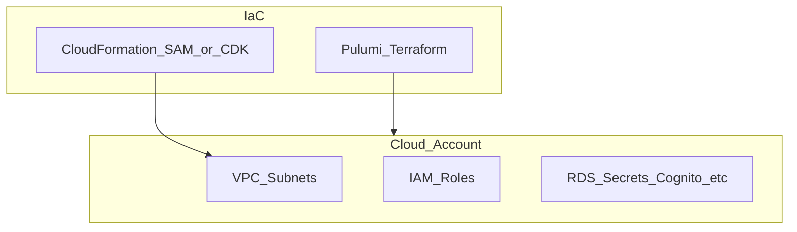

# botnot-env-cognito-resources

**Path:** `D:/botnot/botnot-env-cognito-resources`  
**Category:** infra  
**Primary language:** YAML  
**Status:** present on disk

## 1. Purpose (2-3 lines)

Internal **Yofi** repository `botnot-env-cognito-resources` under category **infra**. Supports Yofi/Botnot platform capabilities (e-commerce intelligence, anti-fraud adjacent services, data plane, or infrastructure) as evidenced by repository layout and manifests.

## 2. Tech stack (from manifests and file-type mix)

- **Detected primary language:** YAML
- **Top-level layout:** see listing below.

### `template.yaml`

```
AWSTemplateFormatVersion: '2010-09-09'
Transform: AWS::Serverless-2016-10-31
Description: >
  Cognito environment resources for the Swagger API documentation

Parameters:
  AppName:
    Description: "Application Name"
    Type: String
    Default: botnot

  EnvType:
    Description: "Environment type (eg, dev, qa, prod)"
    Type: String
    Default: dev

  StackType:
    Description: "backend or frontend"
    Type: String
    Default: backend
  
#  SlackChannelForAlerts:
#    Description: "Please create different channel for different env"
#    Type: String
#    Default: C03HK6GPFCG # this is #aws-dev-alerts channel


Resources:


Outputs:
  # Secrets
  ShopifyAppSecretArn:
    Description: "This secret has a shopify appCode and App secret inside"
    Value: !Ref ShopifyAppSecret
    Export:
      Name: "secret-shopify-app-secrets"

  # Secrets token key
  JwtTokenLocalSecretArn:
    Description: "This secret has a shopify appCode and App secret inside"
    Value: !Ref JwtTokenLocalSecret
    Export:
      Name: "secret-token-key-secret"

  # SNS Topics
  LambdaExecutionErrorSNSTopicARN:
    Description: "SNS Topic ARN for lambdas failed execution"
    Value: !Ref LambdaExecutionErrorEventSNS
    Export:
      Name: "lambda-execution-error-event-sns-topic-arn"
  OrderValidationTaskSNSTopicARN:
    Description: "SNS Topic ARN for order validation"
    Value: !Ref OrderValidationTaskSNS
    Export:
      Name: "order-validation-task-sns-topic-arn"
  OrderValidatedEventSNSTopicARN:
    Description: "SNS Topic ARN for order validated event"
    Value: !Ref OrderValidatedEventSNS
    Export:
      Name: "order-validated-event-sns-topic-arn"
  OrderReceivedEventSNSTopicARN:
    Description: "SNS Topic ARN for order received event"
    Value: !Ref OrderReceivedEventSNS
    Export:
      Name: "order-received-event-sns-topic-arn"
  CustomerLifetimeValueEventSNSTopicARN:
    Description: "SNS Topic ARN for customer lifetime value event"
    Value: !Ref CustomerLifetimeValueEventSNS
    Export:
      Name: "customer-lifetime-value-task-sns-topic-arn"
  CustomerSegmentationEventSNSTopicARN:
    Description: "SNS Topic ARN for customer segmentation event"
    Value: !Ref CustomerSegmentationEventSNS
    Export:
      Name: "customer-segmentation-sns-topic-arn"
  InitialDataLoadEventSNSTopicARN:
    Description: "SNS Topic ARN for initial data load value event"
    Value: !Ref InitialDataLoadEventSNS
    Export:
      Name: "initial-data-load-event-sns-topic-arn"
  OrderRecursiveEventSNSTopicARN:
    Description: "SNS Topic ARN for recursive events to get orders from Shopify API lambda"
    Value: !Ref OrderRecursiveShopifyProcessorEventSNS
    Export:
      Name: "order-recursive-event-sns-topic-arn"
  OrderUpdatedEventSNSTopicARN:
    Description: "SNS Topic ARN for order updated event"
    Value: !Ref OrderUpdatedEventSNS
    Export:
      Name: "order-updated-event-sns-topic-arn"
  OrderRefundedEventSNSTopicARN:
    Description: "SNS Topic ARN for order refunded event"
    Value: !Ref OrderRefundedEventSNS
    Export:
      Name: "order-

…(truncated)…
```

### `Makefile`

```
build-dev: 
	sam build --config-file samconfig_dev.toml

build-prod: 
	sam build --config-file samconfig_prod.toml

deploy-to-dev: 
	sam build --config-file samconfig_dev.toml
	sam deploy --config-file samconfig_dev.toml

deploy-to-prod: 
	sam build --config-file samconfig_prod.toml
	sam deploy --config-file samconfig_prod.toml
```


## 3. Architecture



- **Inbound:** HTTP (API Gateway / ALB), scheduled triggers, queues (SQS/SNS), EventBridge rules, or batch — infer from `stacks/`, `template.yaml`, `sst.config.ts`, or `src/` handlers.
- **Outbound:** databases and external HTTP APIs per layers and `package.json` / Python imports in handlers.
- **IaC pattern:** SST/CDK, SAM/CloudFormation, Pulumi, Helm, Terraform, or raw scripts — see manifests section.

## 4. Key files (auto-discovered)

- **Top-level entries:**

```
.github
.gitignore
.idea
Makefile
samconfig_dev.toml
samconfig_prod.toml
template.yaml
```

## 5. My contribution / role (evidence from git history — if available)

```text
b570c1d 2022-09-15 Merge pull request #10 from BotNotOrg/dev
99ad2bd 2022-09-15 fixes
4156fad 2022-09-15 Merge pull request #9 from BotNotOrg/dev
d492631 2022-09-15 fixes
9aa2461 2022-09-15 * Enable shopify app secret to dev
15bd608 2022-09-14 Merge pull request #8 from BotNotOrg/dev
ced86cc 2022-09-14 * github action fix
5aa882c 2022-09-14 Merge pull request #7 from BotNotOrg/dev
```

_Use commit messages only as hints; corroborate in interviews._

## 6. Notable patterns / snippets


**`template.yaml`**

```yaml
AWSTemplateFormatVersion: '2010-09-09'
Transform: AWS::Serverless-2016-10-31
Description: >
  Cognito environment resources for the Swagger API documentation

Parameters:
  AppName:
    Description: "Application Name"
    Type: String
    Default: botnot

  EnvType:
    Description: "Environment type (eg, dev, qa, prod)"
    Type: String
    Default: dev

  StackType:
    Description: "backend or frontend"
    Type: String
    Default: backend
  
#  SlackChannelForAlerts:
#    Description: "Please create different channel for different env"
#    Type: String
#    Default: C03HK6GPFCG # this is #aws-dev-alerts channel


Resources:


Outputs:
  # Secrets
  ShopifyAppSecretArn:
    Description: "This secret has a shopify appCode and App secret inside"
    Value: !Ref ShopifyAppSecret
    Export:
      Name: "secret-shopify-app-secrets"

  # Secrets token key
  JwtTokenLocalSecretArn:
    Description: "This secret has a shopify appCode and App secret inside"
    Value: !Ref JwtTokenLocalSecret
    Export:
      Name: "secret-token-key-secret"

  # SNS Topics
  LambdaExecutionErrorSNSTopicARN:
    Description: "SNS Topic ARN for lambdas failed execution"
    Value: !Ref LambdaExecutionErrorEventSNS
    Export:
      Name: "lambda-execution-error-event-sns-topic-arn"
  OrderValidationTaskSNSTopicARN:
    Description: "SNS Topic ARN for order validation"
    Value: !Ref OrderValidationTaskSNS
    Export:
      Name: "order-validation-task-sns-topic-arn"
  OrderValidatedEventSNSTopicARN:
    Description: "SNS Topic ARN for order validated event"
    Value: !Ref OrderValidatedEventSNS
    Export:
      Name: "order-validated-event-sns-topic-arn"
  OrderReceivedEventSNSTopicARN:
    Description: "SNS Topic ARN for order received event"
    Value: !Ref OrderReceivedEventSNS
    Export:
      Name: "order-received-event-sns-topic-arn"
  CustomerLifetimeValueEventSNSTopicARN:
    Description: "SNS Topic ARN for customer lifetime value event"
    Value: !Ref CustomerLifetimeValueEventSNS
    Export:
      Name: "customer-lifetime-value-task-sns-topic-arn"
  CustomerSegmentationEventSNST

…(truncated)…
```


## 7. Metrics / SLO / scale (if available)

_Extract from Airflow DAG params, load tests, README, or CloudFormation `ReservedConcurrentExecutions` when present — not auto-inferred to avoid fabrication._

## 8. Resume bullets (ready-to-paste, English)

- Owned or extended **`botnot-env-cognito-resources`** capabilities aligned with **infra** delivery.
- Applied **YAML** stack patterns and repository-local IaC/config where present.
- Collaborated on production-grade defaults: structured logging, retries, and least-privilege IAM patterns where applicable.
- Integrated with **Yofi** platform services (data stores, queues, gateways) per dependency manifests in-repo.
- Documented operational expectations (deploy, test, local dev) via README and automation files when available.

## 9. Interview talking points

- What is the main entrypoint and trigger for `botnot-env-cognito-resources`?
- How are secrets and non-prod environments separated?
- What failure modes are handled (retries, DLQ, idempotency)?
- How would you observe this service in production (metrics, logs, traces)?
