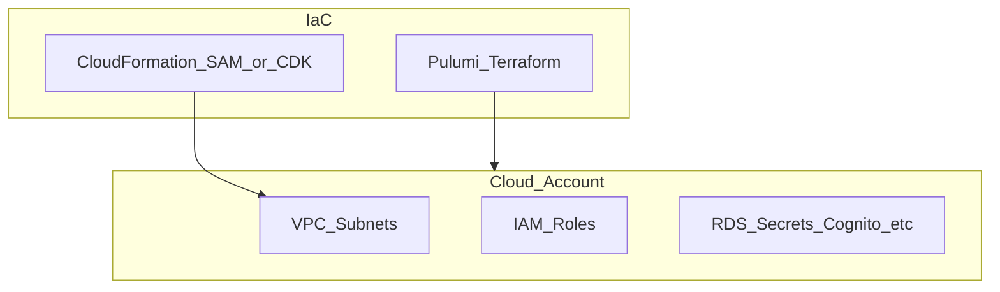

# botnot-env-ec2-resources

**Path:** `D:/botnot/botnot-env-ec2-resources`  
**Category:** infra  
**Primary language:** YAML  
**Status:** present on disk

## 1. Purpose (2-3 lines)

# Base Stack
This repository contains the base resources for the BotNot app.

## 2. Tech stack (from manifests and file-type mix)

- **Detected primary language:** YAML
- **Top-level layout:** see listing below.

### `README.md`

```
# Base Stack
This repository contains the base resources for the BotNot app.

## Deploying
A full app deploying and troubleshooting guide is available in the [BotNot Notion site](https://www.notion.so/botnot/Deploying-App-To-New-AWS-Env-9d236f558358449f91768e74f939a307).

### tl;dr
```
sam build --profile {profile}
sam deploy --profile {profile} --stack-name {stage}-botnot-backend-env-ec2-resources-cf-stack
```
```

### `readme.md`

```
# Base Stack
This repository contains the base resources for the BotNot app.

## Deploying
A full app deploying and troubleshooting guide is available in the [BotNot Notion site](https://www.notion.so/botnot/Deploying-App-To-New-AWS-Env-9d236f558358449f91768e74f939a307).

### tl;dr
```
sam build --profile {profile}
sam deploy --profile {profile} --stack-name {stage}-botnot-backend-env-ec2-resources-cf-stack
```
```

### `Readme.md`

```
# Base Stack
This repository contains the base resources for the BotNot app.

## Deploying
A full app deploying and troubleshooting guide is available in the [BotNot Notion site](https://www.notion.so/botnot/Deploying-App-To-New-AWS-Env-9d236f558358449f91768e74f939a307).

### tl;dr
```
sam build --profile {profile}
sam deploy --profile {profile} --stack-name {stage}-botnot-backend-env-ec2-resources-cf-stack
```
```

### `template.yaml`

```
AWSTemplateFormatVersion: '2010-09-09'
Transform: AWS::Serverless-2016-10-31
Description: >
  EC2 Instances and resources for deployment

Parameters:
  EnvType:
    Description: "Environment type (eg, dev, qa, prod)"
    Type: String
    Default: dev

  AppName:
    Description: "Application Name"
    Type: String
    Default: botnot

  StackType:
    Description: "backend or frontend"
    Type: String
    Default: backend

  ElasticacheInstanceClass:
    Description: "Default instance of Redis"
    Type: String
    Default: cache.t2.micro

Resources:
  NeptuneDBInstance:
    Type: "AWS::Neptune::DBInstance"
    Properties:
      DBClusterIdentifier: !Ref NeptuneDBCluster #Note: If you specify this property, the default deletion policy is Delete. Otherwise, the default deletion policy is Snapshot.
      DBInstanceClass: 'db.r5d.xlarge'
      AutoMinorVersionUpgrade: true
      DBSubnetGroupName: !Ref NeptuneDBSubnetGroup
      Tags:
        - Key: Name
          Value: !Sub ${EnvType}-${AppName}-${StackType}-neptune-db-instance
        - Key: Creator
          Value: 'Abror Aliboyev - abror@aliboyev.com'

  NeptuneDBCluster:
    Type: "AWS::Neptune::DBCluster"
    DependsOn: NeptuneDBSG
    Properties:
      BackupRetentionPeriod: 31
      DBSubnetGroupName: !Ref NeptuneDBSubnetGroup
      StorageEncrypted: 'true'
      VpcSecurityGroupIds:
        - !Ref NeptuneDBSG
      Tags:
        - Key: Name
          Value: !Sub ${EnvType}-${AppName}-${StackType}-neptune-db-cluster
        - Key: Creator
          Value: 'Abror Aliboyev - abror@aliboyev.com'

  NeptuneDBClusterAlarm:
    Type: "AWS::CloudWatch::Alarm"
    Properties:
      AlarmName: !Sub ${EnvType}-${AppName}-${StackType}-neptune-db-cluster-freeable-memory-low
      AlarmDescription: "Alarm for low freeable memory in NeptuneDBCluster"
      ActionsEnabled: true
      AlarmActions:
        - Fn::ImportValue: lambda-execution-error-event-sns-topic-arn
      MetricName: FreeableMemory
      Namespace: AWS/Neptune
      Statistic: Maximum
      Dimensions:
        - Name: DBClusterIdentifier
          Value: !Ref NeptuneDBCluster
        - Name: Role
          Value: "WRITER"
      Period: 60
      EvaluationPeriods: 1
      DatapointsToAlarm: 1
      Threshold: 1000000000
      ComparisonOperator: LessThanThreshold
      TreatMissingData: notBreaching
    DependsOn: [NeptuneDBInstance, NeptuneDBCluster]


  NeptuneDBClusterCPUUtilizationAlarm:
    Type: AWS::CloudWatch::Alarm
    Properties:
      AlarmName: !Sub ${EnvType}-${AppName}-${StackType}-neptune-db-cluster-cpu-utilization
      AlarmDescription: "Alarm for neptunedbcluster CPUUtilization lower"
      ActionsEnabled: true
      AlarmActions:
        - Fn::ImportValue: lambda-execution-error-event-sns-topic-arn
      InsufficientDataActions: [ ]
      MetricName: CPUUtilization
      Namespace: AWS/Neptune
      Statistic: Maximum
      Dimensions:
        - Name: Role
          Value: "WRITER"
        - Name: DBClusterIdentifier
          Value: !Ref NeptuneDBCluster
      Period: 60
      EvaluationPeriods: 1


…(truncated)…
```

### `Makefile`

```
build-dev: 
	sam build --config-file samconfig_dev.toml

build-prod: 
	sam build --config-file samconfig_prod.toml

deploy-to-dev: 
	sam build --config-file samconfig_dev.toml
	sam deploy --config-file samconfig_dev.toml

deploy-to-prod: 
	sam build --config-file samconfig_prod.toml
	sam deploy --config-file samconfig_prod.toml
```


## 3. Architecture



- **Inbound:** HTTP (API Gateway / ALB), scheduled triggers, queues (SQS/SNS), EventBridge rules, or batch — infer from `stacks/`, `template.yaml`, `sst.config.ts`, or `src/` handlers.
- **Outbound:** databases and external HTTP APIs per layers and `package.json` / Python imports in handlers.
- **IaC pattern:** SST/CDK, SAM/CloudFormation, Pulumi, Helm, Terraform, or raw scripts — see manifests section.

## 4. Key files (auto-discovered)

- **Top-level entries:**

```
.github
.gitignore
.idea
Makefile
README.md
samconfig_dev.toml
samconfig_prod.toml
template.yaml
```

## 5. My contribution / role (evidence from git history — if available)

```text
b211cd1 2023-06-07 add alarm for instance Andrii
9eb5544 2023-05-31 fix: alarm
181468b 2023-05-21 add alarm for new instance
2145f34 2023-04-23 add 1 CPUUtilization alarm for 1 new instance
fdf3e8b 2023-04-20 add 2 CPUUtilization alarms for 2 new instance
d4291b5 2023-03-28 feat: modify a neptune instance to Ensure Auto Minor Version Upgrade feature is Enabled
22e6c1a 2023-03-28 delete encrypted cluster alarms
a00ded4 2023-03-23 add 2 EC2CPUUtilizationShineInstAlarm
```

_Use commit messages only as hints; corroborate in interviews._

## 6. Notable patterns / snippets


**`template.yaml`**

```yaml
AWSTemplateFormatVersion: '2010-09-09'
Transform: AWS::Serverless-2016-10-31
Description: >
  EC2 Instances and resources for deployment

Parameters:
  EnvType:
    Description: "Environment type (eg, dev, qa, prod)"
    Type: String
    Default: dev

  AppName:
    Description: "Application Name"
    Type: String
    Default: botnot

  StackType:
    Description: "backend or frontend"
    Type: String
    Default: backend

  ElasticacheInstanceClass:
    Description: "Default instance of Redis"
    Type: String
    Default: cache.t2.micro

Resources:
  NeptuneDBInstance:
    Type: "AWS::Neptune::DBInstance"
    Properties:
      DBClusterIdentifier: !Ref NeptuneDBCluster #Note: If you specify this property, the default deletion policy is Delete. Otherwise, the default deletion policy is Snapshot.
      DBInstanceClass: 'db.r5d.xlarge'
      AutoMinorVersionUpgrade: true
      DBSubnetGroupName: !Ref NeptuneDBSubnetGroup
      Tags:
        - Key: Name
          Value: !Sub ${EnvType}-${AppName}-${StackType}-neptune-db-instance
        - Key: Creator
          Value: 'Abror Aliboyev - abror@aliboyev.com'

  NeptuneDBCluster:
    Type: "AWS::Neptune::DBCluster"
    DependsOn: NeptuneDBSG
    Properties:
      BackupRetentionPeriod: 31
      DBSubnetGroupName: !Ref NeptuneDBSubnetGroup
      StorageEncrypted: 'true'
      VpcSecurityGroupIds:
        - !Ref NeptuneDBSG
      Tags:
        - Key: Name
          Value: !Sub ${EnvType}-${AppName}-${StackType}-neptune-db-cluster
        - Key: Creator
          Value: 'Abror Aliboyev - abror@aliboyev.com'

  NeptuneDBClusterAlarm:
    Type: "AWS::CloudWatch::Alarm"
    Properties:
      AlarmName: !Sub ${EnvType}-${AppName}-${StackType}-neptune-db-cluster-freeable-memory-low
      AlarmDescription: "Alarm for low freeable memory in NeptuneDBCluster"
      ActionsEnabled: true
      AlarmActions:
        - Fn::ImportValue: lambda-execution-error-event-sns-topic-arn
      MetricName: FreeableMemory
      Namespace: AWS/Neptune
      Statistic: Maximum
      Dimensions:
        - Name: DBClusterIdentifier
          Value: !Ref Neptune

…(truncated)…
```


## 7. Metrics / SLO / scale (if available)

_Extract from Airflow DAG params, load tests, README, or CloudFormation `ReservedConcurrentExecutions` when present — not auto-inferred to avoid fabrication._

## 8. Resume bullets (ready-to-paste, English)

- Owned or extended **`botnot-env-ec2-resources`** capabilities aligned with **infra** delivery.
- Applied **YAML** stack patterns and repository-local IaC/config where present.
- Collaborated on production-grade defaults: structured logging, retries, and least-privilege IAM patterns where applicable.
- Integrated with **Yofi** platform services (data stores, queues, gateways) per dependency manifests in-repo.
- Documented operational expectations (deploy, test, local dev) via README and automation files when available.

## 9. Interview talking points

- What is the main entrypoint and trigger for `botnot-env-ec2-resources`?
- How are secrets and non-prod environments separated?
- What failure modes are handled (retries, DLQ, idempotency)?
- How would you observe this service in production (metrics, logs, traces)?
