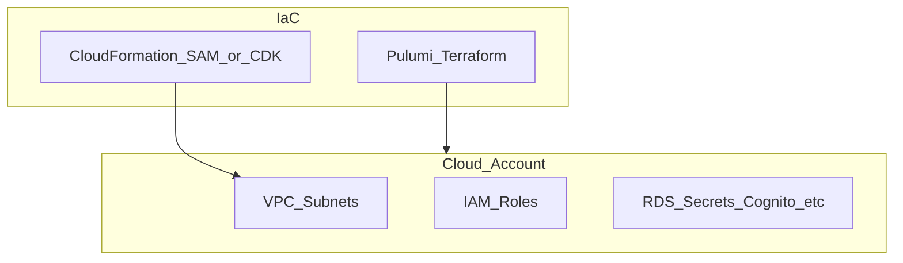

# botnot-env-rds-res

**Path:** `D:/botnot/botnot-env-rds-res`  
**Category:** infra  
**Primary language:** JavaScript  
**Status:** present on disk

## 1. Purpose (2-3 lines)

# first thing first
1. Be carefull, use short path as short as possible, otherwise something may crash, such as db migration.
2. Use npm only, do not use npx or yarn.


# Getting Started with Serverless Stack (SST)

This project was bootstrapped with [Create Serverless Stack](https://docs.serverless-stack.com/packages/create-serverless-stack).

Start by installing the dependencies.

```bash
$ npm install
```

## 2. Tech stack (from manifests and file-type mix)

- **Detected primary language:** JavaScript
- **Top-level layout:** see listing below.

### `README.md`

```
# first thing first
1. Be carefull, use short path as short as possible, otherwise something may crash, such as db migration.
2. Use npm only, do not use npx or yarn.


# Getting Started with Serverless Stack (SST)

This project was bootstrapped with [Create Serverless Stack](https://docs.serverless-stack.com/packages/create-serverless-stack).

Start by installing the dependencies.

```bash
$ npm install
```

## Commands

### `npm run start`

Starts the local Lambda development environment.

### `npm run build`

Build your app and synthesize your stacks.

Generates a `.build/` directory with the compiled files and a `.build/cdk.out/` directory with the synthesized CloudFormation stacks.

### `npm run deploy [stack]`

Deploy all your stacks to AWS. Or optionally deploy, a specific stack.

### `npm run remove [stack]`

Remove all your stacks and all of their resources from AWS. Or optionally removes, a specific stack.

### `npm run test`

Runs your tests using Jest. Takes all the [Jest CLI options](https://jestjs.io/docs/en/cli).

## Documentation

Learn more about the Serverless Stack.
- [Docs](https://docs.serverless-stack.com)
- [@serverless-stack/cli](https://docs.serverless-stack.com/packages/cli)
- [@serverless-stack/resources](https://docs.serverless-stack.com/packages/resources)

## Community

[Follow us on Twitter](https://twitter.com/ServerlessStack) or [post on our forums](https://discourse.serverless-stack.com).
```

### `readme.md`

```
# first thing first
1. Be carefull, use short path as short as possible, otherwise something may crash, such as db migration.
2. Use npm only, do not use npx or yarn.


# Getting Started with Serverless Stack (SST)

This project was bootstrapped with [Create Serverless Stack](https://docs.serverless-stack.com/packages/create-serverless-stack).

Start by installing the dependencies.

```bash
$ npm install
```

## Commands

### `npm run start`

Starts the local Lambda development environment.

### `npm run build`

Build your app and synthesize your stacks.

Generates a `.build/` directory with the compiled files and a `.build/cdk.out/` directory with the synthesized CloudFormation stacks.

### `npm run deploy [stack]`

Deploy all your stacks to AWS. Or optionally deploy, a specific stack.

### `npm run remove [stack]`

Remove all your stacks and all of their resources from AWS. Or optionally removes, a specific stack.

### `npm run test`

Runs your tests using Jest. Takes all the [Jest CLI options](https://jestjs.io/docs/en/cli).

## Documentation

Learn more about the Serverless Stack.
- [Docs](https://docs.serverless-stack.com)
- [@serverless-stack/cli](https://docs.serverless-stack.com/packages/cli)
- [@serverless-stack/resources](https://docs.serverless-stack.com/packages/resources)

## Community

[Follow us on Twitter](https://twitter.com/ServerlessStack) or [post on our forums](https://discourse.serverless-stack.com).
```

### `Readme.md`

```
# first thing first
1. Be carefull, use short path as short as possible, otherwise something may crash, such as db migration.
2. Use npm only, do not use npx or yarn.


# Getting Started with Serverless Stack (SST)

This project was bootstrapped with [Create Serverless Stack](https://docs.serverless-stack.com/packages/create-serverless-stack).

Start by installing the dependencies.

```bash
$ npm install
```

## Commands

### `npm run start`

Starts the local Lambda development environment.

### `npm run build`

Build your app and synthesize your stacks.

Generates a `.build/` directory with the compiled files and a `.build/cdk.out/` directory with the synthesized CloudFormation stacks.

### `npm run deploy [stack]`

Deploy all your stacks to AWS. Or optionally deploy, a specific stack.

### `npm run remove [stack]`

Remove all your stacks and all of their resources from AWS. Or optionally removes, a specific stack.

### `npm run test`

Runs your tests using Jest. Takes all the [Jest CLI options](https://jestjs.io/docs/en/cli).

## Documentation

Learn more about the Serverless Stack.
- [Docs](https://docs.serverless-stack.com)
- [@serverless-stack/cli](https://docs.serverless-stack.com/packages/cli)
- [@serverless-stack/resources](https://docs.serverless-stack.com/packages/resources)

## Community

[Follow us on Twitter](https://twitter.com/ServerlessStack) or [post on our forums](https://discourse.serverless-stack.com).
```

### `package.json`

```
{
  "name": "botnot-env-rds-resources",
  "version": "0.1.0",
  "private": true,
  "scripts": {
    "test": "sst test",
    "start": "sst start",
    "build": "sst build",
    "deploy": "sst deploy",
    "diff": "sst diff"
  },
  "dependencies": {
    "@serverless-stack/cli": "0.69.7",
    "@serverless-stack/resources": "0.69.7",
    "@aws-cdk/aws-lambda-python-alpha": "2.15.0-alpha.0",
    "aws-cdk-lib": "2.15.0",
    "data-api-client": "^1.2.0",
    "async": ">=2.6.4",
    "jszip": ">=3.7.0"
  }
}
```

### `sst.json`

```
{
  "name": "botnot-rds",
  "region": "us-east-1",
  "main": "stacks/index.js"
}
```

### `Makefile`

```
all:	stack-deploy
all-prod: stack-deploy-prod

install-deps:
	npm install

stack-build: install-deps
	npm run build -- --stage dev --region us-east-1

stack-test: stack-build
	echo npm run test

stack-deploy: stack-test
	npm run deploy -- --stage dev --region us-east-1

stack-deploy-force: stack-test
	npm run deploy -- --stage dev --region us-east-1 --force

stack-build-prod: install-deps
	npm run build -- --stage prod --region us-east-1 --profile prod

stack-test-prod: stack-build-prod
	echo npm run test

stack-deploy-prod: stack-test-prod
	npm run deploy -- --stage prod --region us-east-1 --profile prod

clean:
	rm -rf .build build
	rm -rf .pytest_cache cdk.out
	rm -rf .sst node_modules
	rm -rf src/__pycache__
	rm -rf test/__pycache__
```


## 3. Architecture



- **Inbound:** HTTP (API Gateway / ALB), scheduled triggers, queues (SQS/SNS), EventBridge rules, or batch — infer from `stacks/`, `template.yaml`, `sst.config.ts`, or `src/` handlers.
- **Outbound:** databases and external HTTP APIs per layers and `package.json` / Python imports in handlers.
- **IaC pattern:** SST/CDK, SAM/CloudFormation, Pulumi, Helm, Terraform, or raw scripts — see manifests section.

## 4. Key files (auto-discovered)

- **Top-level entries:**

```
.env
.github
.gitignore
.idea
Makefile
README.md
package.json
sst.json
stacks
test
```

## 5. My contribution / role (evidence from git history — if available)

```text
4bfc62d 2022-06-16 fix: vpc
5205e8e 2022-05-26 fix: don't change export name as in use
cc2d1cc 2022-05-26 fix: port is a number
f6998ce 2022-05-26 fix: port tostring
1828341 2022-05-26 fix: add port for endpoint
3fb55f9 2022-05-26 feat: add ClusterEndpoint as output
3a83f8f 2022-05-11 feat: remove all kysely migrations, and plan to use custom migration
8afc7e1 2022-05-11 fix: ignor .vscode
```

_Use commit messages only as hints; corroborate in interviews._

## 6. Notable patterns / snippets


**`stacks/index.js`**

```text
import CoreStack from "./CoreStack";

export default function main(app) {

    new CoreStack(app, "sst-stack");

    // Add more stacks
}
```


## 7. Metrics / SLO / scale (if available)

_Extract from Airflow DAG params, load tests, README, or CloudFormation `ReservedConcurrentExecutions` when present — not auto-inferred to avoid fabrication._

## 8. Resume bullets (ready-to-paste, English)

- Owned or extended **`botnot-env-rds-res`** capabilities aligned with **infra** delivery.
- Applied **JavaScript** stack patterns and repository-local IaC/config where present.
- Collaborated on production-grade defaults: structured logging, retries, and least-privilege IAM patterns where applicable.
- Integrated with **Yofi** platform services (data stores, queues, gateways) per dependency manifests in-repo.
- Documented operational expectations (deploy, test, local dev) via README and automation files when available.

## 9. Interview talking points

- What is the main entrypoint and trigger for `botnot-env-rds-res`?
- How are secrets and non-prod environments separated?
- What failure modes are handled (retries, DLQ, idempotency)?
- How would you observe this service in production (metrics, logs, traces)?
