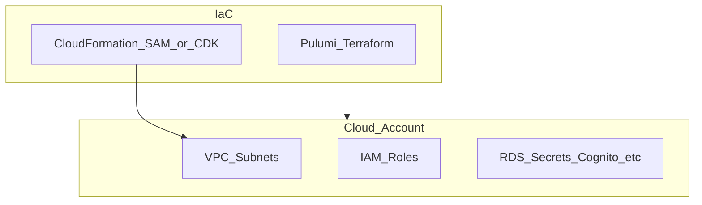

# botnot-env-secrets-resources

**Path:** `D:/botnot/botnot-env-secrets-resources`  
**Category:** infra  
**Primary language:** YAML  
**Status:** present on disk

## 1. Purpose (2-3 lines)

# botnot-env-secrets-resources
It's for quick deployment without adding secrets in AWS manually.
Especially when sometime a env disaster happens, like us-east-1 region is down, we need to deploy to another region quickly

# first thing first
1. we are using Seed to deploy for dev and prod
2. for local build, use Makefile
3. Use npm only, do not use npx or yarn.
-test-dep

## 2. Tech stack (from manifests and file-type mix)

- **Detected primary language:** YAML
- **Top-level layout:** see listing below.

### `README.md`

```
# botnot-env-secrets-resources
It's for quick deployment without adding secrets in AWS manually.
Especially when sometime a env disaster happens, like us-east-1 region is down, we need to deploy to another region quickly

# first thing first
1. we are using Seed to deploy for dev and prod
2. for local build, use Makefile
3. Use npm only, do not use npx or yarn.
-test-dep
```

### `readme.md`

```
# botnot-env-secrets-resources
It's for quick deployment without adding secrets in AWS manually.
Especially when sometime a env disaster happens, like us-east-1 region is down, we need to deploy to another region quickly

# first thing first
1. we are using Seed to deploy for dev and prod
2. for local build, use Makefile
3. Use npm only, do not use npx or yarn.
-test-dep
```

### `Readme.md`

```
# botnot-env-secrets-resources
It's for quick deployment without adding secrets in AWS manually.
Especially when sometime a env disaster happens, like us-east-1 region is down, we need to deploy to another region quickly

# first thing first
1. we are using Seed to deploy for dev and prod
2. for local build, use Makefile
3. Use npm only, do not use npx or yarn.
-test-dep
```

### `package.json`

```
{
  "name": "botnot-env-secrets",
  "version": "0.1.0",
  "private": true,
  "scripts": {
    "test": "sst test",
    "start": "sst start",
    "build": "sst build",
    "deploy": "sst deploy",
    "diff": "sst diff"
  },
  "dependencies": {
    "aws-cdk-lib": "2.50.0",
    "@serverless-stack/cli": "^1.2.30",
    "@serverless-stack/resources": "^1.2.30"
  }
}
```

### `sst.json`

```
{
  "name": "botnot-secrets",
  "region": "us-east-1",
  "main": "stacks/index.js"
}
```

### `Makefile`

```
all:	stack-deploy
all-prod: stack-deploy-prod

install-deps:
	npm install

stack-build: install-deps
	npm run build -- --stage dev --region us-east-1

stack-test: stack-build
	echo npm run test

stack-deploy: stack-test
	npm run deploy -- --stage dev --region us-east-1

stack-deploy-force: stack-test
	npm run deploy -- --stage dev --region us-east-1 --force

stack-build-prod: install-deps
	npm run build -- --stage prod --region us-east-1 --profile prod

stack-test-prod: stack-build-prod
	echo npm run test

stack-deploy-prod: stack-test-prod
	npm run deploy -- --stage prod --region us-east-1 --profile prod

clean:
	rm -rf .build build
	rm -rf .pytest_cache cdk.out
	rm -rf .sst node_modules
	rm -rf src/__pycache__
	rm -rf test/__pycache__
```


## 3. Architecture



- **Inbound:** HTTP (API Gateway / ALB), scheduled triggers, queues (SQS/SNS), EventBridge rules, or batch — infer from `stacks/`, `template.yaml`, `sst.config.ts`, or `src/` handlers.
- **Outbound:** databases and external HTTP APIs per layers and `package.json` / Python imports in handlers.
- **IaC pattern:** SST/CDK, SAM/CloudFormation, Pulumi, Helm, Terraform, or raw scripts — see manifests section.

## 4. Key files (auto-discovered)

- **Top-level entries:**

```
.github
.gitignore
.idea
Makefile
README.md
node_modules
package-lock.json
package.json
sst.json
stacks
test
```

## 5. My contribution / role (evidence from git history — if available)

```text
d49c7ce 2024-09-13 update neimans config
3da6bf7 2024-09-11 update neo4j cred for levis
2318a4f 2024-09-10 update secret
e5d843f 2024-09-10 update secret
edb5225 2024-09-10 add levis client id
1683cd8 2024-09-09 fix creds for ebay
97aa0a4 2024-09-09 add neimans config
6761408 2024-07-19 change it for postgres
```

_Use commit messages only as hints; corroborate in interviews._

## 6. Notable patterns / snippets


**`stacks/index.js`**

```text
import CoreStack from "./CoreStack";

export default function main(app) {

    new CoreStack(app, "sst-stack");

    // Add more stacks
}
```


## 7. Metrics / SLO / scale (if available)

_Extract from Airflow DAG params, load tests, README, or CloudFormation `ReservedConcurrentExecutions` when present — not auto-inferred to avoid fabrication._

## 8. Resume bullets (ready-to-paste, English)

- Owned or extended **`botnot-env-secrets-resources`** capabilities aligned with **infra** delivery.
- Applied **YAML** stack patterns and repository-local IaC/config where present.
- Collaborated on production-grade defaults: structured logging, retries, and least-privilege IAM patterns where applicable.
- Integrated with **Yofi** platform services (data stores, queues, gateways) per dependency manifests in-repo.
- Documented operational expectations (deploy, test, local dev) via README and automation files when available.

## 9. Interview talking points

- What is the main entrypoint and trigger for `botnot-env-secrets-resources`?
- How are secrets and non-prod environments separated?
- What failure modes are handled (retries, DLQ, idempotency)?
- How would you observe this service in production (metrics, logs, traces)?
