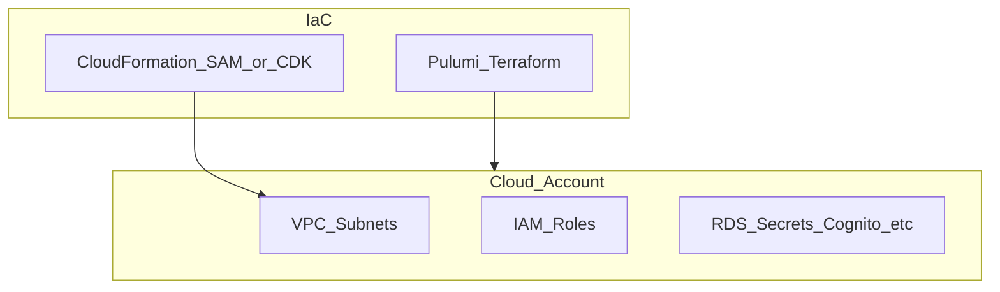

# botnot-env-vpc-resources

**Path:** `D:/botnot/botnot-env-vpc-resources`  
**Category:** infra  
**Primary language:** YAML  
**Status:** present on disk

## 1. Purpose (2-3 lines)

mock-push-int-2
# Intro

This is a base stack which deploy VPC

## 2. Tech stack (from manifests and file-type mix)

- **Detected primary language:** YAML
- **Top-level layout:** see listing below.

### `README.md`

```
mock-push-int-2
# Intro

This is a base stack which deploy VPC

## Project framework
- Use cloudformation for stack definition in `template.yaml`
- use aws-sam to deploy with `samconfig_{dev|prod}.toml`

## Deploy

Deploy to Dev Env:
- make deploy-global-vpc-to-dev
- make deploy-yofi-vpc-to-dev

Promote to Production:
- make deploy-global-vpc-to-prod
- make deploy-yofi-vpc-to-prod
```

### `readme.md`

```
mock-push-int-2
# Intro

This is a base stack which deploy VPC

## Project framework
- Use cloudformation for stack definition in `template.yaml`
- use aws-sam to deploy with `samconfig_{dev|prod}.toml`

## Deploy

Deploy to Dev Env:
- make deploy-global-vpc-to-dev
- make deploy-yofi-vpc-to-dev

Promote to Production:
- make deploy-global-vpc-to-prod
- make deploy-yofi-vpc-to-prod
```

### `Readme.md`

```
mock-push-int-2
# Intro

This is a base stack which deploy VPC

## Project framework
- Use cloudformation for stack definition in `template.yaml`
- use aws-sam to deploy with `samconfig_{dev|prod}.toml`

## Deploy

Deploy to Dev Env:
- make deploy-global-vpc-to-dev
- make deploy-yofi-vpc-to-dev

Promote to Production:
- make deploy-global-vpc-to-prod
- make deploy-yofi-vpc-to-prod
```

### `Makefile`

```
#
# Makefile to build and deploy VPCs to AWS
# Author: Eugenio Grytsenko
#

all: deploy-global-vpc-to-dev deploy-yofi-vpc-to-dev

build-global-vpc-dev:
	sam build --config-file samconfig-global-vpc-dev.toml \
		--template-file template-global-vpc.yaml --profile=dev

build-global-vpc-prod:
	sam build --config-file samconfig-global-vpc-prod.toml \
		--template-file template-global-vpc.yaml --profile=prod

build-yofi-vpc-dev:
	sam build --config-file samconfig-yofi-vpc-dev.toml \
		--template-file template-yofi-vpc.yaml --profile=dev

build-yofi-vpc-prod:
	sam build --config-file samconfig-yofi-vpc-prod.toml \
		--template-file template-yofi-vpc.yaml --profile=prod

deploy-global-vpc-to-dev: build-global-vpc-dev
	sam deploy --config-file samconfig-global-vpc-dev.toml \
		--template-file template-global-vpc.yaml --profile=dev

deploy-global-vpc-to-prod: build-global-vpc-prod
	sam deploy --config-file samconfig-global-vpc-prod.toml \
		--template-file template-global-vpc.yaml --profile=prod

deploy-yofi-vpc-to-dev: build-yofi-vpc-dev
	sam deploy --config-file samconfig-yofi-vpc-dev.toml \
		--template-file template-yofi-vpc.yaml --profile=dev

deploy-yofi-vpc-to-prod: build-yofi-vpc-prod
	sam deploy --config-file samconfig-yofi-vpc-prod.toml \
		--template-file template-yofi-vpc.yaml --profile=prod
```


## 3. Architecture



- **Inbound:** HTTP (API Gateway / ALB), scheduled triggers, queues (SQS/SNS), EventBridge rules, or batch — infer from `stacks/`, `template.yaml`, `sst.config.ts`, or `src/` handlers.
- **Outbound:** databases and external HTTP APIs per layers and `package.json` / Python imports in handlers.
- **IaC pattern:** SST/CDK, SAM/CloudFormation, Pulumi, Helm, Terraform, or raw scripts — see manifests section.

## 4. Key files (auto-discovered)

- **Top-level entries:**

```
.github
.gitignore
.idea
Makefile
README.md
samconfig-global-vpc-dev.toml
samconfig-global-vpc-prod.toml
samconfig-yofi-vpc-dev.toml
samconfig-yofi-vpc-prod.toml
template-global-vpc.yaml
template-yofi-vpc.yaml
```

## 5. My contribution / role (evidence from git history — if available)

```text
74f3550 2023-05-31 fix: for prod
525244f 2023-05-31 fix: template
acd25d4 2023-05-31 fix: template_file = "template-yofi-vpc.yaml"
51899a4 2023-05-31 fix: typo
975d272 2023-05-31 fix: template file
9fd5402 2023-05-31 fix: github action change according to eugene's new vpc change
96286e3 2023-04-19 Added Yofi-VPC
d2c4954 2023-03-17 feat: specify protocal explicitly
```

_Use commit messages only as hints; corroborate in interviews._

## 6. Notable patterns / snippets

_No snippet candidates matched (handler.py / stack.ts / template.yaml etc.). Expand manually after opening the repo._

## 7. Metrics / SLO / scale (if available)

_Extract from Airflow DAG params, load tests, README, or CloudFormation `ReservedConcurrentExecutions` when present — not auto-inferred to avoid fabrication._

## 8. Resume bullets (ready-to-paste, English)

- Owned or extended **`botnot-env-vpc-resources`** capabilities aligned with **infra** delivery.
- Applied **YAML** stack patterns and repository-local IaC/config where present.
- Collaborated on production-grade defaults: structured logging, retries, and least-privilege IAM patterns where applicable.
- Integrated with **Yofi** platform services (data stores, queues, gateways) per dependency manifests in-repo.
- Documented operational expectations (deploy, test, local dev) via README and automation files when available.

## 9. Interview talking points

- What is the main entrypoint and trigger for `botnot-env-vpc-resources`?
- How are secrets and non-prod environments separated?
- What failure modes are handled (retries, DLQ, idempotency)?
- How would you observe this service in production (metrics, logs, traces)?
