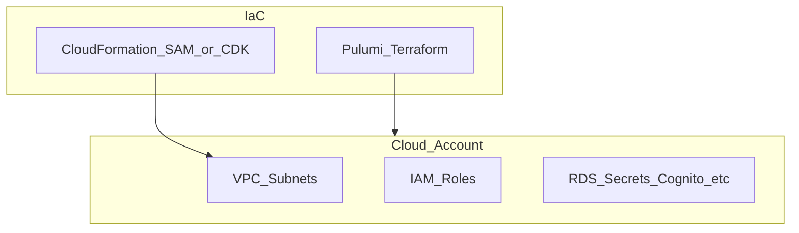

# botnot-integration-test-environment

**Path:** `D:/botnot/botnot-integration-test-environment`  
**Category:** infra  
**Primary language:** Python  
**Status:** present on disk

## 1. Purpose (2-3 lines)

# test_template
Testing Template

## 2. Tech stack (from manifests and file-type mix)

- **Detected primary language:** Python
- **Top-level layout:** see listing below.

### `README.md`

```
# test_template
Testing Template
```

### `readme.md`

```
# test_template
Testing Template
```

### `Readme.md`

```
# test_template
Testing Template
```

### `requirements.txt`

```
attrs==21.4.0
boto3==1.21.6
botocore==1.24.6
iniconfig==1.1.1
install==1.3.5
jmespath==0.10.0
packaging==21.3
pluggy==1.0.0
py==1.11.0
pyfiglet==0.8.post1
pyparsing==3.0.7
pytest==7.0.1
python-dateutil==2.8.2
s3transfer==0.5.1
six==1.16.0
tomli==2.0.1
urllib3==1.26.8
```


## 3. Architecture



- **Inbound:** HTTP (API Gateway / ALB), scheduled triggers, queues (SQS/SNS), EventBridge rules, or batch — infer from `stacks/`, `template.yaml`, `sst.config.ts`, or `src/` handlers.
- **Outbound:** databases and external HTTP APIs per layers and `package.json` / Python imports in handlers.
- **IaC pattern:** SST/CDK, SAM/CloudFormation, Pulumi, Helm, Terraform, or raw scripts — see manifests section.

## 4. Key files (auto-discovered)

- **Top-level entries:**

```
.aws-sam
.github
.gitignore
.idea
README.md
backend
conftest.py
github-actions-demo.yml
integration_test
requirements.txt
test_cli.py
venv
```

## 5. My contribution / role (evidence from git history — if available)

```text
2abd5d9 2022-03-06 Merge pull request #2 from BotNotOrg/dev
b64312d 2022-03-06 filled with ES, RDS, Neptune retrieving functions
f08176a 2022-03-03 complete env
dfb0726 2022-03-03 test: skip prompt
39ae842 2022-03-03 added sam delete
bc4a795 2022-03-03 added sam delete
406db8e 2022-03-03 add some tests
1b4177e 2022-03-03 test: fix
```

_Use commit messages only as hints; corroborate in interviews._

## 6. Notable patterns / snippets


**`backend/local/src/app.py`**

```python
import logging
import os

import boto3

logger = logging.getLogger()


# 'collectibles-sneakers.myshopify.com'
def lambda_handler_1(event, _):
    # secret_key = _get_secret_key()
    return dict(env='testing', events=event)


def lambda_handler_2(event, _):
    return dict(env='testing', events=event)

#
# def _get_secret_key(shop_url=None):
#     dynamodb = boto3.resource('dynamodb', region_name='us-east-1')
#     table = dynamodb.Table(os.environ['API_SECRETS_TABLE'])
#     return table
    # has_item = table.get_item(Key={'id': shop_url.split('://')[-1]})
    # logger.error(has_item)
    # if 'Item' in has_item:
    #     logger.error(has_item['Item'])
    #     return str(has_item['Item']['shopSecretKey'])
    # else:
    #     return '::NoKey::'
```

**`backend/local/template.yaml`**

```yaml
AWSTemplateFormatVersion: '2010-09-09'
Transform: AWS::Serverless-2016-10-31
Description: >
  SAM template for local testing

Globals:
  Function:
    Timeout: 30

Resources:
  SimpleLambda:
    Type: AWS::Serverless::Function
    Properties:
      CodeUri: src/
      Handler: app.lambda_handler_1
      Runtime: python3.8
      Policies:
        Version: '2012-10-17'
        Statement:
          Effect: Allow
          Action: [
              "dynamodb:*"
          ]
          Resource: [ "*" ]
        Environment:
          Variables:
            API_SECRETS_TABLE: !ImportValue 'StoreApiSecretTokensTable'
      Architectures:
        - x86_64
  ComplexLambda:
    Type: AWS::Serverless::Function
    Properties:
      CodeUri: src/
      Handler: app.lambda_handler_2
      Runtime: python3.8
      Architectures:
        - x86_64
```

**`integration_test/src/app.py`**

```python
import logging

from libs import es, rds, neptune

logger = logging.getLogger()


def lambda_handler(event, _):
    # ES is working fine!
    # resp = es.get_order(4682595565805)
    # logger.warning(f'Order: {resp}')

    # RDS is working fine!
    # resp = rds.get_order(4682595565805)
    # logger.warning(f'Order: {resp}')

    # Neptune is working fine!
    # resp = neptune.request_data_from_neptune(
    #     shop_domain='collectibles-sneakers.myshopify.com',
    #     customer={},
    #     order_id=4652832719085
    # )
    # logger.warning(f'Order: {resp}')
    return dict(status='Fine')
```


## 7. Metrics / SLO / scale (if available)

_Extract from Airflow DAG params, load tests, README, or CloudFormation `ReservedConcurrentExecutions` when present — not auto-inferred to avoid fabrication._

## 8. Resume bullets (ready-to-paste, English)

- Owned or extended **`botnot-integration-test-environment`** capabilities aligned with **infra** delivery.
- Applied **Python** stack patterns and repository-local IaC/config where present.
- Collaborated on production-grade defaults: structured logging, retries, and least-privilege IAM patterns where applicable.
- Integrated with **Yofi** platform services (data stores, queues, gateways) per dependency manifests in-repo.
- Documented operational expectations (deploy, test, local dev) via README and automation files when available.

## 9. Interview talking points

- What is the main entrypoint and trigger for `botnot-integration-test-environment`?
- How are secrets and non-prod environments separated?
- What failure modes are handled (retries, DLQ, idempotency)?
- How would you observe this service in production (metrics, logs, traces)?
