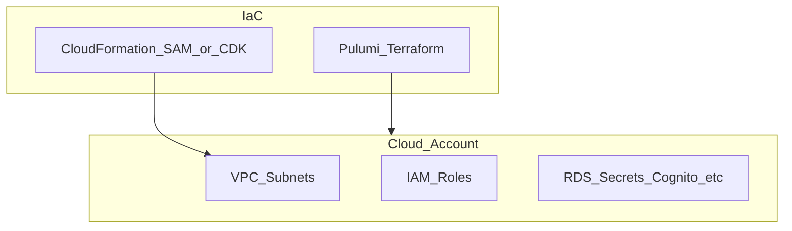

# botnot-static-resources

**Path:** `D:/botnot/botnot-static-resources`  
**Category:** infra  
**Primary language:** JavaScript  
**Status:** present on disk

## 1. Purpose (2-3 lines)

# Serving public static resource for all subsites

### 1. Moonsense integration script
- source: static-src/js/moon.js
- artifact: static/js/moon.min.js

How to contribute: 
1. update source js(both dev and prod)
2. minify them to final xxx.min.js
    ```javascript
    npm run uglify-botblock-dev
    npm run uglify-moon-dev
    ```

How to upgrade moonsense-web-sdk.js
1. run `npm install --save @moonsense/moonsense-web-sdk`, which will upgrade to latest version and update package.json
2. copy the content of the file `node_modules/@moonsense/moonsense-web-sdk/moonsense-web-sdk.js` 
3. replace the content in source js(both dev and prod)

## 2. Tech stack (from manifests and file-type mix)

- **Detected primary language:** JavaScript
- **Top-level layout:** see listing below.

### `README.md`

```
# Serving public static resource for all subsites

### 1. Moonsense integration script
- source: static-src/js/moon.js
- artifact: static/js/moon.min.js

How to contribute: 
1. update source js(both dev and prod)
2. minify them to final xxx.min.js
    ```javascript
    npm run uglify-botblock-dev
    npm run uglify-moon-dev
    ```

How to upgrade moonsense-web-sdk.js
1. run `npm install --save @moonsense/moonsense-web-sdk`, which will upgrade to latest version and update package.json
2. copy the content of the file `node_modules/@moonsense/moonsense-web-sdk/moonsense-web-sdk.js` 
3. replace the content in source js(both dev and prod)
```

### `readme.md`

```
# Serving public static resource for all subsites

### 1. Moonsense integration script
- source: static-src/js/moon.js
- artifact: static/js/moon.min.js

How to contribute: 
1. update source js(both dev and prod)
2. minify them to final xxx.min.js
    ```javascript
    npm run uglify-botblock-dev
    npm run uglify-moon-dev
    ```

How to upgrade moonsense-web-sdk.js
1. run `npm install --save @moonsense/moonsense-web-sdk`, which will upgrade to latest version and update package.json
2. copy the content of the file `node_modules/@moonsense/moonsense-web-sdk/moonsense-web-sdk.js` 
3. replace the content in source js(both dev and prod)
```

### `Readme.md`

```
# Serving public static resource for all subsites

### 1. Moonsense integration script
- source: static-src/js/moon.js
- artifact: static/js/moon.min.js

How to contribute: 
1. update source js(both dev and prod)
2. minify them to final xxx.min.js
    ```javascript
    npm run uglify-botblock-dev
    npm run uglify-moon-dev
    ```

How to upgrade moonsense-web-sdk.js
1. run `npm install --save @moonsense/moonsense-web-sdk`, which will upgrade to latest version and update package.json
2. copy the content of the file `node_modules/@moonsense/moonsense-web-sdk/moonsense-web-sdk.js` 
3. replace the content in source js(both dev and prod)
```

### `package.json`

```
{
  "name": "botnot-static-resources",
  "version": "1.0.0",
  "private": true,
  "scripts": {
    "test": "sst test",
    "start": "sst start",
    "build": "sst build",
    "deploy": "sst deploy",
    "remove": "sst remove",
    "uglify-botblock-dev": "uglifyjs src/static-src/js/botblock_util.js src/static-src/js/botblock_dev.js -m reserved=['Shopify','$yofiUtil'] -c --toplevel -o src/static/js/botblock_dev.min.js",
    "uglify-moon-dev": "uglifyjs src/static-src/js/moon_util.js src/static-src/js/moon_dev.js -m reserved=['Shopify','$moonUtil','ShopifyAnalytics','MoonsenseSdk'] -c --toplevel -o src/static/js/moon_dev.min.js",
    "uglify-dev": "npm run uglify-botblock-dev && npm run uglify-moon-dev",
    "uglify-botblock-prod": "uglifyjs src/static-src/js/botblock_util.js src/static-src/js/botblock_prod.js -m reserved=['Shopify','$yofiUtil'] -c --toplevel -o src/static/js/botblock_prod.min.js",
    "uglify-moon-prod": "uglifyjs src/static-src/js/moon_util.js src/static-src/js/moon_prod.js -m reserved=['Shopify','$moonUtil','ShopifyAnalytics','MoonsenseSdk'] -c --toplevel -o src/static/js/moon_prod.min.js",
    "uglify-prod": "npm run uglify-botblock-prod && npm run uglify-moon-prod"
  },
  "eslintConfig": {
    "extends": [
      "serverless-stack"
    ]
  },
  "dependencies": {
    "@aws-cdk/aws-lambda-python-alpha": "2.24.0-alpha.0",
    "@moonsense/moonsense-web-sdk": "^1.9.2",
    "@serverless-stack/cli": "1.4.0",
    "@serverless-stack/resources": "1.4.0",
    "async": ">=2.6.4",
    "aws-cdk-lib": "2.24.0",
    "jszip": ">=3.7.0",
    "uglify-js": "^3.17.4"
  }
}
```

### `sst.json`

```
{
  "name": "botnot-static-resources",
  "type": "@serverless-stack/resources",
  "region": "us-east-1",
  "main": "stacks/index.js"
}
```


## 3. Architecture



- **Inbound:** HTTP (API Gateway / ALB), scheduled triggers, queues (SQS/SNS), EventBridge rules, or batch — infer from `stacks/`, `template.yaml`, `sst.config.ts`, or `src/` handlers.
- **Outbound:** databases and external HTTP APIs per layers and `package.json` / Python imports in handlers.
- **IaC pattern:** SST/CDK, SAM/CloudFormation, Pulumi, Helm, Terraform, or raw scripts — see manifests section.

## 4. Key files (auto-discovered)

- **Top-level entries:**

```
.gitignore
.idea
.npmrc
README.md
get_pypi.sh
package.json
pytest.ini
seed.yml
src
sst.json
stacks
test
```

## 5. My contribution / role (evidence from git history — if available)

```text
a0f3d3a 2023-08-09 Tracing.DISABLED
1201984 2023-08-07 Integrate botd and move some theme script to here (#22)
aa5a0df 2023-08-01 Move journey id generator and pre-prediction to theme (#21)
77ceac8 2023-07-28 fix custome event and remove thankyou logic (#20)
eb58e5c 2023-07-26 clean up telemetry code (#19)
4c28fe3 2023-07-20 stop saming line items and add predicting status (#18)
4acc2af 2023-07-19 fix the failure saving line items
57b71ce 2023-07-19 update attribute name
```

_Use commit messages only as hints; corroborate in interviews._

## 6. Notable patterns / snippets


**`stacks/index.js`**

```text
import MyStack from './MyStack';
import {Runtime, Tracing} from 'aws-cdk-lib/aws-lambda';
import {Fn, Duration} from 'aws-cdk-lib';

export default function main(app) {

    // Set default runtime for all functions
    app.setDefaultFunctionProps({
        tracing: Tracing.DISABLED
    });

    new MyStack(app, 'sst-stack', {prefix: "botnot", name: "static-resources"});
}
```


## 7. Metrics / SLO / scale (if available)

_Extract from Airflow DAG params, load tests, README, or CloudFormation `ReservedConcurrentExecutions` when present — not auto-inferred to avoid fabrication._

## 8. Resume bullets (ready-to-paste, English)

- Owned or extended **`botnot-static-resources`** capabilities aligned with **infra** delivery.
- Applied **JavaScript** stack patterns and repository-local IaC/config where present.
- Collaborated on production-grade defaults: structured logging, retries, and least-privilege IAM patterns where applicable.
- Integrated with **Yofi** platform services (data stores, queues, gateways) per dependency manifests in-repo.
- Documented operational expectations (deploy, test, local dev) via README and automation files when available.

## 9. Interview talking points

- What is the main entrypoint and trigger for `botnot-static-resources`?
- How are secrets and non-prod environments separated?
- What failure modes are handled (retries, DLQ, idempotency)?
- How would you observe this service in production (metrics, logs, traces)?
