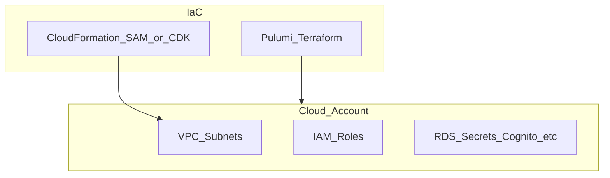

# yofi-gcp-base-resources-pulumi

**Path:** `D:/botnot/yofi-gcp-base-resources-pulumi`  
**Category:** infra  
**Primary language:** Python  
**Status:** present on disk

## 1. Purpose (2-3 lines)

Internal **Yofi** repository `yofi-gcp-base-resources-pulumi` under category **infra**. Supports Yofi/Botnot platform capabilities (e-commerce intelligence, anti-fraud adjacent services, data plane, or infrastructure) as evidenced by repository layout and manifests.

## 2. Tech stack (from manifests and file-type mix)

- **Detected primary language:** Python
- **Top-level layout:** see listing below.

_No common manifest files found at repository root._


## 3. Architecture



- **Inbound:** HTTP (API Gateway / ALB), scheduled triggers, queues (SQS/SNS), EventBridge rules, or batch — infer from `stacks/`, `template.yaml`, `sst.config.ts`, or `src/` handlers.
- **Outbound:** databases and external HTTP APIs per layers and `package.json` / Python imports in handlers.
- **IaC pattern:** SST/CDK, SAM/CloudFormation, Pulumi, Helm, Terraform, or raw scripts — see manifests section.

## 4. Key files (auto-discovered)

- **Top-level entries:**

```
yofi-gcp-base-resources-pulumi
```

## 5. My contribution / role (evidence from git history — if available)

_No readable `git log` in this working copy (shallow clone, missing .git, or not a git repo)._

_Use commit messages only as hints; corroborate in interviews._

## 6. Notable patterns / snippets


**`yofi-gcp-base-resources-pulumi/cloudrun-func-src/pubsub_loopreturn/main.py`**

```python
import functions_framework
import json
import hmac
import base64
import hashlib
from flask import make_response
from typing import Dict, Any, List, Optional
from yofi_common_libs.log_gcp import glogger
import aws_client
from data_processor_factory import data_processor_factory
from unified_spanner_base import UnifiedDataConverter

RETURN_SOURCE_PROVIDER_LOOPRETURNS = "loopreturns"
LOOP_NULL_VALUE = "N/A"
SHOPIFY_CARRIER_NAME_CODE_MAP = {
    "FedEx": "100003",
    "UPS": "100002",
    "UPSDAP": "100002",
    "USPS": "21051",
    "DHL Express": "44023",
    "DHL": "44023",
    "OnTrac": "100580",
    "Amazon Shipping": "55041",
    "Amazon": "55041",
    "China Post": "3011",
    "Australia Post": "7013",
    "Royal Mail": "52042",
    "SAIA": "100528",
    "XPO": "100650",
    "Estes": "100488",
    "4PX": "200002",
    "CJ Dropshipping": "100700",
    "CDEK": "100651",
    "SF Express": "200001",
    "Cainiao": "100663",
    "J&T International": "100662",
    "YunExpress": "100629",
    "Yamato": "50051",
    "Sagawa": "50052",
    "DPD": "14040",
    "GLS": "14041"
}
# TODO: put to google secret
API_SECRET_17TRACK = "4B572F3FED6E928DD41C98DF6A40DEC6"

# Triggered from a message on a Cloud Pub/Sub topic.
@functions_framework.cloud_event
def main(cloud_event):
    glogger.info(f"Cloud Event: {cloud_event}")
# CloudEvent metadata
    glogger.info({
        "event_id": cloud_event["id"],
        "event_type": cloud_event["type"],
        "event_source": cloud_event["source"],
        "subject": cloud_event.get("subject"),
        "time": cloud_event.get("time"),
    })

    # Pub/Sub envelope + your decoded data (keep it small)    
    attributes = cloud_event.data["message"]["attributes"]
    stream_name = attributes["_stream"]
    content_dump = base64.b64decode(cloud_event.data["message"]["data"])
    content = json.loads(content_dump)
    glogger.info(f"Processing stream: {stream_name}")
    _airbyte_data = content["_airbyte_data"]
    glogger.info(f"Airbyte data: {_airbyte_data}")
    # Use factory pattern to process data
    success = data_processor_factory.process_data(st

…(truncated)…
```

**`yofi-gcp-base-resources-pulumi/cloudrun-func-src/webhook_17track/main.py`**

```python
import functions_framework
import json
import hmac
import base64
import arrow
import hashlib
from flask import make_response
from yofi_common_libs.log_gcp import glogger
from yofi_common_libs import gcp_secret
from spanner_db import GCPSpannerDB
from google.cloud.spanner_v1 import param_types

spanner_client = GCPSpannerDB()
WEBHOOK_17TRACK_SECRET = gcp_secret.get_gcp_secret(
    "API_SECRET_17TRACK", load_json=False, cache_refresh_seconds=60 * 60 * 24)

@functions_framework.http
def main(request):
    """HTTP Cloud Function.
    Args:
        request (flask.Request): The request object.
        <https://flask.palletsprojects.com/en/1.1.x/api/#incoming-request-data>
    Returns:
        The response text, or any set of values that can be turned into a
        Response object using `make_response`
        <https://flask.palletsprojects.com/en/1.1.x/api/#flask.make_response>.
    """
    try:
        headers = request.headers
        x_signature = headers.get('sign')  # Extract specific header (for example: 'Authorization')
        request_body = request.get_data(as_text=True)  # Raw body payload

        if not x_signature:
            return make_response("Signature header missing", 400)
        if not request_body:
            glogger.error(f"Request payload empty! headers: {headers}")
            return make_response("Request payload empty!", 400)

        is_authorized = verify_signature(x_signature, request_body, WEBHOOK_17TRACK_SECRET)
        if not is_authorized:
            return make_response("Signature is wrong!", 400)

        request_json = request.get_json(silent=True)
        event_type = request_json.get("event")
        if event_type == "TRACKING_UPDATED":
            save_tracking_updates_to_spanner(request_json)
        elif event_type == "TRACKING_STOPPED":
            glogger.warning(f"This number has stopped tracking: {request_json}")
        else:
            glogger.error(f"Unexpected webhook event type, payload: {request_json}")

        glogger.debug(f'Processed webhook event -- {x_signature}')
        return "Received."
    except Exception as e:
        glogger.

…(truncated)…
```

**`yofi-gcp-base-resources-pulumi/cloudrun-func-src/webhook_shopify_pubsub/main.py`**

```python
import arrow
import functions_framework
import json
import base64
from yofi_common_libs import logger
from spanner_db import GCPSpannerDB
from google.cloud.spanner_v1 import param_types


RETURN_SOURCE_PROVIDER_SHOPIFY = "shopify"
spanner_client = GCPSpannerDB()

SHOPIFY_CARRIER_NAME_CODE_MAP = {
    "FedEx": "100003",
    # TODO: get more
}


@functions_framework.cloud_event
def main(cloud_event):
    """
    Directly processing Shopify events pushed into Pub/Sub like return_requested
    - "X-Shopify-Topic": "returns/approve"
        - This is when a return is created
    - "X-Shopify-Topic": "reverse_deliveries/attach_deliverable"
        - This will send the returnDelivery info
    """
    try:
        pubsub_message = cloud_event.data.get("message")
        logger.info(f"CloudEvent ID: {cloud_event["id"]}, payload: {json.dumps(pubsub_message)}")

        shopify_attrs = pubsub_message["attributes"]
        shop_url = shopify_attrs["X-Shopify-Shop-Domain"]
        shopify_topic = shopify_attrs["X-Shopify-Topic"]

        shopify_topic_data = json.loads(base64.b64decode(pubsub_message["data"]).decode("utf-8"))

        if shopify_topic == "returns/approve":
            return_id = shopify_topic_data["id"]
            order_id = shopify_topic_data["order"]["id"]
            save_shopify_return_to_spanner(shop_url, return_id, order_id)
        elif shopify_topic == "reverse_deliveries/attach_deliverable":
            return_id = shopify_topic_data["return"]["id"]
            carrier_name = shopify_topic_data["shipping_deliverable"]["tracking"]["carrier_name"]
            carrier_code = SHOPIFY_CARRIER_NAME_CODE_MAP.get(carrier_name)
            tracking_number = shopify_topic_data["shipping_deliverable"]["tracking"]["tracking_number"]
            update_shopify_return_delivery_to_spanner(shop_url, return_id, tracking_number, carrier_code, carrier_name)
        else:
            logger.error(f"This topic webhook event is not expected: {shopify_topic}")

        logger.info(f"Processed {shopify_topic} topic event from Shopify: {shopify_topic_data}")
    except Exception as e:
        logger.e

…(truncated)…
```


## 7. Metrics / SLO / scale (if available)

_Extract from Airflow DAG params, load tests, README, or CloudFormation `ReservedConcurrentExecutions` when present — not auto-inferred to avoid fabrication._

## 8. Resume bullets (ready-to-paste, English)

- Owned or extended **`yofi-gcp-base-resources-pulumi`** capabilities aligned with **infra** delivery.
- Applied **Python** stack patterns and repository-local IaC/config where present.
- Collaborated on production-grade defaults: structured logging, retries, and least-privilege IAM patterns where applicable.
- Integrated with **Yofi** platform services (data stores, queues, gateways) per dependency manifests in-repo.
- Documented operational expectations (deploy, test, local dev) via README and automation files when available.

## 9. Interview talking points

- What is the main entrypoint and trigger for `yofi-gcp-base-resources-pulumi`?
- How are secrets and non-prod environments separated?
- What failure modes are handled (retries, DLQ, idempotency)?
- How would you observe this service in production (metrics, logs, traces)?
