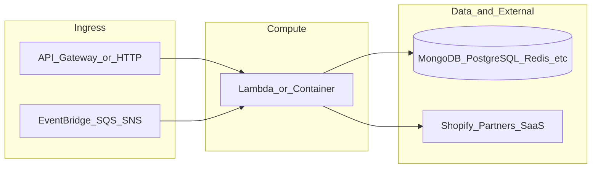

# botnot-lambda-billing-flags-update

**Path:** `D:/botnot/botnot-lambda-billing-flags-update`  
**Category:** lambdas-business  
**Primary language:** Python  
**Status:** present on disk

## 1. Purpose (2-3 lines)

# Lambda for updating billing flags (Cron Job)

### Updating Billing Flags
1. MongoDB
2. Redis

Refactored from the original `botnot-batch-cdk-refreshing-counter`.

## 2. Tech stack (from manifests and file-type mix)

- **Detected primary language:** Python
- **Top-level layout:** see listing below.

### `README.md`

```
# Lambda for updating billing flags (Cron Job)

### Updating Billing Flags
1. MongoDB
2. Redis

Refactored from the original `botnot-batch-cdk-refreshing-counter`.
```

### `readme.md`

```
# Lambda for updating billing flags (Cron Job)

### Updating Billing Flags
1. MongoDB
2. Redis

Refactored from the original `botnot-batch-cdk-refreshing-counter`.
```

### `Readme.md`

```
# Lambda for updating billing flags (Cron Job)

### Updating Billing Flags
1. MongoDB
2. Redis

Refactored from the original `botnot-batch-cdk-refreshing-counter`.
```

### `package.json`

```
{
  "name": "yofi-scheduled-lambda-billing-flags-update",
  "version": "0.0.1",
  "private": true,
  "scripts": {
    "start": "sst start",
    "build": "sst build",
    "deploy": "sst deploy",
    "remove": "sst remove",
    "console": "sst console",
    "typecheck": "tsc --noEmit",
    "test": "sst bind -- vitest run"
  },
  "eslintConfig": {
    "extends": [
      "serverless-stack"
    ]
  },
  "devDependencies": {
    "@serverless-stack/cli": "1.18.4",
    "@serverless-stack/resources": "1.18.4",
    "@aws-cdk/aws-lambda-python-alpha": ">=2.55.0-alpha.0",
    "aws-cdk-lib": ">=2.55.0",
    "async": ">=2.6.4",
    "jszip": ">=3.7.0",
    "typescript": "^4.8.4",
    "@tsconfig/node16": "1.0.3",
    "vitest": "^0.24.5"
  }
}
```

### `sst.json`

```
{
  "name": "yofi-scheduled-lambda-billing-flags-update",
  "region": "us-east-1",
  "main": "stacks/index.js"
}
```

### `Makefile`

```
all:	stack-deploy
all-prod: stack-deploy-prod

install-deps:
	npm install

stack-build: install-deps
	npm run build -- --stage dev --region us-east-1

stack-test: stack-build
	echo npm run test

stack-deploy: stack-test
	npm run deploy -- --stage dev --region us-east-1

stack-build-prod:
	npm run build -- --stage prod --region us-east-1 --profile prod

stack-test-prod: stack-build-prod
	echo npm run test

stack-deploy-prod: stack-test-prod
	npm run deploy -- --stage prod --region us-east-1 --profile prod

clean:
	rm -rf .build build
	rm -rf .pytest_cache cdk.out
	rm -rf .sst node_modules
	rm -rf src/__pycache__
	rm -rf test/__pycache__
	rm -f cdk.context.json
```

### `tsconfig.json`

```
{
  "extends": "@tsconfig/node16/tsconfig.json",
  "include": [
    "stacks"
  ]
}
```


## 3. Architecture



- **Inbound:** HTTP (API Gateway / ALB), scheduled triggers, queues (SQS/SNS), EventBridge rules, or batch — infer from `stacks/`, `template.yaml`, `sst.config.ts`, or `src/` handlers.
- **Outbound:** databases and external HTTP APIs per layers and `package.json` / Python imports in handlers.
- **IaC pattern:** SST/CDK, SAM/CloudFormation, Pulumi, Helm, Terraform, or raw scripts — see manifests section.

## 4. Key files (auto-discovered)

- **Top-level entries:**

```
.gitignore
.idea
Makefile
README.md
layer
node_modules
package-lock.json
package.json
src
sst.json
stacks
tsconfig.json
```

## 5. My contribution / role (evidence from git history — if available)

```text
ede9722 2025-02-25 update 30 to 29 for worker function
53a8db2 2025-02-14 fix 30 to 29
8e58513 2025-02-14 back EVERY_30_DAYS
79e3a2c 2025-02-06 update 30 to 29
7982b96 2025-02-03 fix: upgrade layer
617f3e1 2025-02-03 feat: upgrade
2449bf8 2025-02-03 fix: common-lib
08ed1cb 2024-12-13 fix: pip
```

_Use commit messages only as hints; corroborate in interviews._

## 6. Notable patterns / snippets


**`src/quota-email-function/main.py`**

```python
import json
from mongo import mongo_client
from utils import logger
import send_email
import os


def lambda_handler(events, context):
    logger.info(f"Processing Event -> {json.dumps(events)}")
    find_shops_to_notify()


def find_shops_to_notify():
    shops_to_notify = mongo_client.billing["detail"].find({
        '$and': [  # if more than one $or are put in root level, they will be merged, so need $and
            {'$or': [
                {"is_service_warning": True},
                {"is_service_suspended": True}]},
            {'$or': [
                {"notification_sent_count": {"$exists": False}},
                {"notification_sent_count": {"$lt": 5}},
            ]}
        ],
        "is_installed": True,
    })

    for shop in shops_to_notify:
        logger.warning(f'Processing notification for this shop: {shop}')
        shop_url = shop["shop_url"]
        current_count = shop.get("notification_sent_count") or 0

        contact_email = shop.get("contact_info", {}).get("contact_email")
        if not contact_email:
            logger.error(f"Email is not defined for {shop_url} to notify quota usage, please fix.")
            continue

        render_quota_alert_email_and_send(shop_url, _get_shop_email_list(contact_email))
        mongo_client.billing["detail"].find_one_and_update(
            {"shop_url": shop_url},
            {"$set": {
                "notification_sent_count": current_count + 1,
            }}
        )


def render_quota_alert_email_and_send(shop_url, shop_email_list):
    risk_order_subject = f"Yofi notification: monthly quota is exceeded"
    render_data = {
        "shop_name": shop_url.split(".")[0].capitalize(),
        "logo_url": f'{os.environ["STATIC_URL"]}/img/yofi_logo.png',
    }
    mail_html = send_email.render_email_html(render_data)
    send_email.send_email(mail_html, shop_email_list, risk_order_subject)


def _get_shop_email_list(email_string):
    email_string = email_string or ""
    delimiter = "," if "," in email_string else ";" if ";" in email_string else None
    email_list = email_string.split(delimiter) if delimiter else

…(truncated)…
```

**`src/work-distributor-function/main.py`**

```python
import json
import os
from datetime import datetime, timedelta

import boto3
from mongo import mongo_client
import utils
from utils import logger


def handler(event, context):
    logger.info(f"Processing Event -> {json.dumps(event)}")

    # Why we use distributor-worker mode: we expect >10000 shops onboard, and may need >15 min to process
    # Filter out all the shops that the billing circle ends, and distribute each shop to the worker

    # There are two subscription_interval: EVERY_30_DAYS or ANNUAL
    # Currently we only support EVERY_30_DAYS, otherwise we need to do different processing for ANNUAL shops
    # TODO: remove $quota_refresh_time_period_in_days from billing.detail because not in use, and we expect it to be 30 days always
    tier_ids_30_days = _get_all_tiers_with_30_days_interval()

    # "$last_refresh_counter_date" + $quota_refresh_time_period_in_days >= Now,  # create with value of now if not exist
    shops_to_refresh = mongo_client.billing.detail.find({
        '$or': [
            {utils.FIELD_REFRESH_DATE: {"$exists": False}},  # if not exist, means it's a new shop not refreshed yet
            {utils.FIELD_REFRESH_DATE: {"$lte": datetime.now() - timedelta(days=29)}},  # not refreshed for 29 days
        ],
        "is_installed": True,
        "tier_id": {"$in": tier_ids_30_days},
    }, projection=["shop_url"])

    for shop in shops_to_refresh:
        logger.info(f'Distributing task for shop({shop["shop_url"]}) to refresh-worker')
        _send_event_to_workers_sns({"shop_url": shop["shop_url"]})


def _send_event_to_workers_sns(params):
    client = boto3.client('sns')
    client.publish(
        TargetArn=os.environ["WORKERS_PROCESSING_TOPIC"],
        Message=json.dumps({'default': json.dumps(params)}),
        MessageStructure='json'
    )


def _get_all_tiers_with_30_days_interval():
    all_tiers_num = mongo_client.billing.tier.count_documents({})
    tiers_30_days = mongo_client.billing.tier.find({
        "subscription_interval": "EVERY_30_DAYS"
    }, projection=["id"])
    tier_id_30_days = [_["id"] for _ in tiers_30_days]
    if all_tiers_num > len(

…(truncated)…
```

**`src/worker-function/main.py`**

```python
#
# Billing Counter Update (Cron Job) - Main job itself.
#
# Refactored from the original [botnot-batch-cdk-refreshing-counter]
#

import json
import os
from datetime import datetime, timedelta
from rediscluster import RedisCluster
from mongo import mongo_client
import utils
from utils import logger

ec_endpoint = os.environ['ENV_EC_ENDPOINT']
ec_port = os.environ['ENV_PORT']
ec_startup_nodes = [{
    'host': ec_endpoint,
    'port': ec_port
}]
ec_client = RedisCluster(
    startup_nodes=ec_startup_nodes,
    decode_responses=True,
    skip_full_coverage_check=True)


def handler(events, context):
    logger.info(f"Processing Event -> {json.dumps(events)}")

    for event in events["Records"]:
        message = json.loads(event["body"])
        refresh_quota_for_shop(message["shop_url"])


def refresh_quota_for_shop(shop_url):
    logger.warning(f"Refreshing quota for shop: {shop_url}")

    shop_detail = _get_shop_detail(shop_url)
    last_refresh_date = shop_detail.get(utils.FIELD_REFRESH_DATE)
    if last_refresh_date:
        days_not_refreshed = (datetime.now() - last_refresh_date).days
        if days_not_refreshed < 29:
            logger.error(f"Shop last refresh date is within 29 days, please check why it's triggered. Now quit.")
            return
        else:
            logger.info(f"Shop is not refreshed for {days_not_refreshed} days, now refreshing")
            last_refresh_date = last_refresh_date + timedelta(days=29)
    else:
        logger.info(f"Shop has no record set for {utils.FIELD_REFRESH_DATE}, initialize it as current time.")
        last_refresh_date = datetime.now()

    key_counter_trans_cur = f'count.trans.cur.{shop_url}'
    counter_cur = int(ec_client.get(key_counter_trans_cur) or "0")
    logger.warning(f"Current usage before refreshing: {counter_cur}")
    ec_client.set(key_counter_trans_cur, 0)

    # sometimes the subscription is cancelled or frozen, we need to update the max according to latest tier
    current_tier = mongo_client["billing"]["tier"].find_one({"id": shop_detail["tier_id"]})
    key_counter_trans_sus = f'count.trans.sus.{shop_url}'


…(truncated)…
```


## 7. Metrics / SLO / scale (if available)

_Extract from Airflow DAG params, load tests, README, or CloudFormation `ReservedConcurrentExecutions` when present — not auto-inferred to avoid fabrication._

## 8. Resume bullets (ready-to-paste, English)

- Owned or extended **`botnot-lambda-billing-flags-update`** capabilities aligned with **lambdas business** delivery.
- Applied **Python** stack patterns and repository-local IaC/config where present.
- Collaborated on production-grade defaults: structured logging, retries, and least-privilege IAM patterns where applicable.
- Integrated with **Yofi** platform services (data stores, queues, gateways) per dependency manifests in-repo.
- Documented operational expectations (deploy, test, local dev) via README and automation files when available.

## 9. Interview talking points

- What is the main entrypoint and trigger for `botnot-lambda-billing-flags-update`?
- How are secrets and non-prod environments separated?
- What failure modes are handled (retries, DLQ, idempotency)?
- How would you observe this service in production (metrics, logs, traces)?
