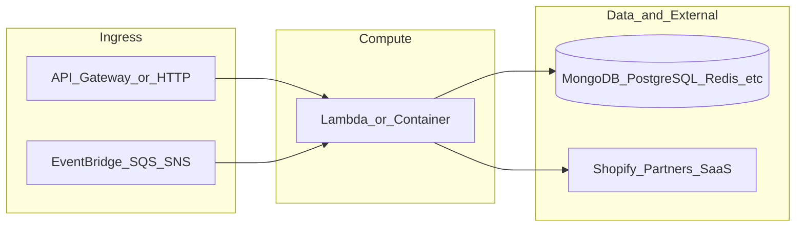

# botnot-lambda-billing-quota-validation

**Path:** `D:/botnot/botnot-lambda-billing-quota-validation`  
**Category:** lambdas-business  
**Primary language:** Python  
**Status:** present on disk

## 1. Purpose (2-3 lines)

# AWS Lambda for billing quota validation

- Author: Eugenio Grytsenko
- Last updated: Year 2022

## 2. Tech stack (from manifests and file-type mix)

- **Detected primary language:** Python
- **Top-level layout:** see listing below.

### `README.md`

```
# AWS Lambda for billing quota validation

- Author: Eugenio Grytsenko
- Last updated: Year 2022
```

### `readme.md`

```
# AWS Lambda for billing quota validation

- Author: Eugenio Grytsenko
- Last updated: Year 2022
```

### `Readme.md`

```
# AWS Lambda for billing quota validation

- Author: Eugenio Grytsenko
- Last updated: Year 2022
```

### `package.json`

```
{
  "name": "billing-quota-validation",
  "version": "2.2.18",
  "private": true,
  "scripts": {
    "test": "sst test",
    "start": "sst start",
    "build": "sst build",
    "deploy": "sst deploy",
    "remove": "sst remove"
  },
  "eslintConfig": {
    "extends": [
      "serverless-stack"
    ]
  },
  "dependencies": {
    "@serverless-stack/cli": "0.69.6",
    "@serverless-stack/resources": "0.69.6",
    "@aws-cdk/aws-lambda-python-alpha": "2.15.0-alpha.0",
    "aws-cdk-lib": "2.15.0",
    "async": ">=2.6.4",
    "jszip": ">=3.7.0"
  }
}
```

### `sst.json`

```
{
  "name": "billing-quota-validation",
  "type": "@serverless-stack/resources",
  "region": "us-east-1",
  "main": "stacks/index.js"
}
```

### `Makefile`

```
all:	stack-deploy
all-prod: stack-deploy-prod

install-deps:
	npm install

stack-build: update-dbmodels-framework install-deps
	npm run build -- --stage dev --region us-east-1 --profile dev

stack-test: stack-build
	echo npm run test

stack-deploy: stack-test
	npm run deploy -- --stage dev --region us-east-1 --profile dev

update-dbmodels-framework:
	test -d botnot-central-SQL-data-definitions/generated ||\
		git clone https://github.com/BotNotOrg/botnot-central-SQL-data-definitions
	cd botnot-central-SQL-data-definitions/generated &&\
		git pull
	cp botnot-central-SQL-data-definitions/generated/generated_billing.py\
		layer_rds/db_models/billing.py
	cp botnot-central-SQL-data-definitions/generated/generated_ecommerce.py\
		layer_rds/db_models/ecommerce.py
	diff botnot-central-SQL-data-definitions/generated/generated_billing.py\
		layer_rds/db_models/billing.py
	diff botnot-central-SQL-data-definitions/generated/generated_ecommerce.py\
		layer_rds/db_models/ecommerce.py

stack-build-prod: update-dbmodels-framework install-deps
	npm run build -- --stage prod --region us-east-1 --profile prod

stack-test-prod: stack-build-prod
	echo npm run test

stack-deploy-prod: stack-test-prod
	npm run deploy -- --stage prod --region us-east-1 --profile prod

clean:
	rm -rf .build build
	rm -rf .pytest_cache cdk.out
	rm -rf .sst node_modules
	rm -rf src/__pycache__
	rm -rf test/__pycache__
	rm -rf botnot-central-SQL-data-definitions
	rm -f cdk.context.json
```


## 3. Architecture



- **Inbound:** HTTP (API Gateway / ALB), scheduled triggers, queues (SQS/SNS), EventBridge rules, or batch — infer from `stacks/`, `template.yaml`, `sst.config.ts`, or `src/` handlers.
- **Outbound:** databases and external HTTP APIs per layers and `package.json` / Python imports in handlers.
- **IaC pattern:** SST/CDK, SAM/CloudFormation, Pulumi, Helm, Terraform, or raw scripts — see manifests section.

## 4. Key files (auto-discovered)

- **Top-level entries:**

```
.env
.github
.gitignore
.idea
Makefile
README.md
docs
layer
node_modules
package-lock.json
package.json
seed.yml
src
sst.json
stacks
test
```

## 5. My contribution / role (evidence from git history — if available)

```text
67e9c24 2025-03-15 concurrency 2
04f6646 2025-02-21 refactoring
1a871bb 2025-02-21 refactoring
e0bd88a 2025-02-20 refactoring
48b3ca4 2024-12-16 feat: upgrade pip
c8e2f48 2024-12-13 fix: pip
403a6e6 2024-08-19 fix: git creds
f222984 2024-08-01 feat: use new yofi mongo
```

_Use commit messages only as hints; corroborate in interviews._

## 6. Notable patterns / snippets


**`stacks/index.js`**

```text
/**
 * Copyright 2022 BotNot Inc., or its associates. All Rights Reserved.
 *
 * Description: Billing quota validation (SST stack definitions).
 * Autor: Eugenio Grytsenko
 **/

import MyStack from './MyStack';
import {Runtime, Tracing} from 'aws-cdk-lib/aws-lambda';
import {Fn, Duration} from 'aws-cdk-lib';

export default function main(app) {
    // Set default runtime for all functions
    app.setDefaultFunctionProps({
        srcPath: 'src',
        memorySize: 1024,
        handler: 'lambda.handler',
        runtime: Runtime.PYTHON_3_8,
        tracing: Tracing.DISABLED,
        timeout: Duration.seconds(30),
        environment: {
            REDIS_CLUSTER_ENDPOINT: Fn.importValue('botnot-backend-elasticache-cluster-redis-endpoint'),
            REDIS_CLUSTER_PORT: Fn.importValue('botnot-backend-elasticache-cluster-redis-port')
        },
        permissions: [
            'secretsmanager:*',
            'sns:*',
            'elasticache:*'
        ]
    });

    new MyStack(app, 'sst-stack');
}
```


## 7. Metrics / SLO / scale (if available)

_Extract from Airflow DAG params, load tests, README, or CloudFormation `ReservedConcurrentExecutions` when present — not auto-inferred to avoid fabrication._

## 8. Resume bullets (ready-to-paste, English)

- Owned or extended **`botnot-lambda-billing-quota-validation`** capabilities aligned with **lambdas business** delivery.
- Applied **Python** stack patterns and repository-local IaC/config where present.
- Collaborated on production-grade defaults: structured logging, retries, and least-privilege IAM patterns where applicable.
- Integrated with **Yofi** platform services (data stores, queues, gateways) per dependency manifests in-repo.
- Documented operational expectations (deploy, test, local dev) via README and automation files when available.

## 9. Interview talking points

- What is the main entrypoint and trigger for `botnot-lambda-billing-quota-validation`?
- How are secrets and non-prod environments separated?
- What failure modes are handled (retries, DLQ, idempotency)?
- How would you observe this service in production (metrics, logs, traces)?
