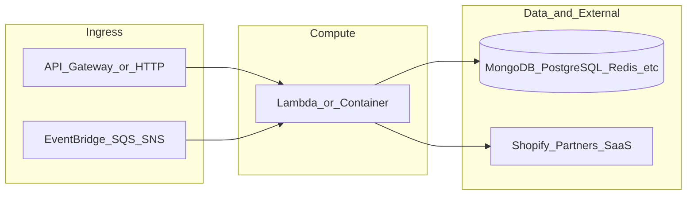

# botnot-lambda-cluster-order-injection

**Path:** `D:/botnot/botnot-lambda-cluster-order-injection`  
**Category:** lambdas-business  
**Primary language:** Python  
**Status:** present on disk

## 1. Purpose (2-3 lines)

# Getting Started with Serverless Stack (SST)

This project was bootstrapped with [Create Serverless Stack](https://docs.serverless-stack.com/packages/create-serverless-stack).

Start by installing the dependencies.

```bash
$ npm install
```

## 2. Tech stack (from manifests and file-type mix)

- **Detected primary language:** Python
- **Top-level layout:** see listing below.

### `README.md`

```
# Getting Started with Serverless Stack (SST)

This project was bootstrapped with [Create Serverless Stack](https://docs.serverless-stack.com/packages/create-serverless-stack).

Start by installing the dependencies.

```bash
$ npm install
```

## Commands

### `npm run start`

Starts the local Lambda development environment.

### `npm run build`

Build your app and synthesize your stacks.

Generates a `.build/` directory with the compiled files and a `.build/cdk.out/` directory with the synthesized CloudFormation stacks.

### `npm run deploy [stack]`

Deploy all your stacks to AWS. Or optionally deploy, a specific stack.

### `npm run remove [stack]`

Remove all your stacks and all of their resources from AWS. Or optionally removes, a specific stack.

### `npm run test`

Runs your tests using Jest. Takes all the [Jest CLI options](https://jestjs.io/docs/en/cli).

## Documentation

Learn more about the Serverless Stack.
- [Docs](https://docs.serverless-stack.com)
- [@serverless-stack/cli](https://docs.serverless-stack.com/packages/cli)
- [@serverless-stack/resources](https://docs.serverless-stack.com/packages/resources)

## Community

[Follow us on Twitter](https://twitter.com/ServerlessStack) or [post on our forums](https://discourse.serverless-stack.com).
```

### `readme.md`

```
# Getting Started with Serverless Stack (SST)

This project was bootstrapped with [Create Serverless Stack](https://docs.serverless-stack.com/packages/create-serverless-stack).

Start by installing the dependencies.

```bash
$ npm install
```

## Commands

### `npm run start`

Starts the local Lambda development environment.

### `npm run build`

Build your app and synthesize your stacks.

Generates a `.build/` directory with the compiled files and a `.build/cdk.out/` directory with the synthesized CloudFormation stacks.

### `npm run deploy [stack]`

Deploy all your stacks to AWS. Or optionally deploy, a specific stack.

### `npm run remove [stack]`

Remove all your stacks and all of their resources from AWS. Or optionally removes, a specific stack.

### `npm run test`

Runs your tests using Jest. Takes all the [Jest CLI options](https://jestjs.io/docs/en/cli).

## Documentation

Learn more about the Serverless Stack.
- [Docs](https://docs.serverless-stack.com)
- [@serverless-stack/cli](https://docs.serverless-stack.com/packages/cli)
- [@serverless-stack/resources](https://docs.serverless-stack.com/packages/resources)

## Community

[Follow us on Twitter](https://twitter.com/ServerlessStack) or [post on our forums](https://discourse.serverless-stack.com).
```

### `Readme.md`

```
# Getting Started with Serverless Stack (SST)

This project was bootstrapped with [Create Serverless Stack](https://docs.serverless-stack.com/packages/create-serverless-stack).

Start by installing the dependencies.

```bash
$ npm install
```

## Commands

### `npm run start`

Starts the local Lambda development environment.

### `npm run build`

Build your app and synthesize your stacks.

Generates a `.build/` directory with the compiled files and a `.build/cdk.out/` directory with the synthesized CloudFormation stacks.

### `npm run deploy [stack]`

Deploy all your stacks to AWS. Or optionally deploy, a specific stack.

### `npm run remove [stack]`

Remove all your stacks and all of their resources from AWS. Or optionally removes, a specific stack.

### `npm run test`

Runs your tests using Jest. Takes all the [Jest CLI options](https://jestjs.io/docs/en/cli).

## Documentation

Learn more about the Serverless Stack.
- [Docs](https://docs.serverless-stack.com)
- [@serverless-stack/cli](https://docs.serverless-stack.com/packages/cli)
- [@serverless-stack/resources](https://docs.serverless-stack.com/packages/resources)

## Community

[Follow us on Twitter](https://twitter.com/ServerlessStack) or [post on our forums](https://discourse.serverless-stack.com).
```

### `package.json`

```
{
  "name": "botnot-lambda-order-validations",
  "version": "0.1.0",
  "private": true,
  "scripts": {
    "test": "sst test",
    "start": "sst start",
    "build": "sst build",
    "deploy": "sst deploy",
    "remove": "sst remove",
    "diff": "sst diff"
  },
  "eslintConfig": {
    "extends": [
      "serverless-stack"
    ]
  },
  "dependencies": {
    "@serverless-stack/cli": "0.69.7",
    "@serverless-stack/resources": "0.69.7",
    "@aws-cdk/aws-lambda-python-alpha": "2.15.0-alpha.0",
    "aws-cdk-lib": "2.15.0",
    "async": ">=2.6.4",
    "jszip": ">=3.7.0"
  }
}
```

### `sst.json`

```
{
  "name": "botnot-lambda-cluster-order-injection",
  "region": "us-east-1",
  "main": "stacks/index.js"
}
```

### `Makefile`

```
all:	stack-deploy
all-prod: stack-deploy-prod

install-deps:
	npm install

stack-build: install-deps
	npm run build -- --stage dev --region us-east-1

stack-test: stack-build
	echo npm run test

stack-deploy: stack-test
	npm run deploy -- --stage dev --region us-east-1

stack-build-prod: install-deps
	npm run build -- --stage prod --region us-east-1 --profile prod

stack-test-prod: stack-build-prod
	echo npm run test

stack-deploy-prod: stack-test-prod
	npm run deploy -- --stage prod --region us-east-1 --profile prod

clean:
	rm -rf .build build
	rm -rf .pytest_cache cdk.out
	rm -rf .sst node_modules
	rm -rf src/__pycache__
	rm -rf test/__pycache__
```


## 3. Architecture



- **Inbound:** HTTP (API Gateway / ALB), scheduled triggers, queues (SQS/SNS), EventBridge rules, or batch — infer from `stacks/`, `template.yaml`, `sst.config.ts`, or `src/` handlers.
- **Outbound:** databases and external HTTP APIs per layers and `package.json` / Python imports in handlers.
- **IaC pattern:** SST/CDK, SAM/CloudFormation, Pulumi, Helm, Terraform, or raw scripts — see manifests section.

## 4. Key files (auto-discovered)

- **Top-level entries:**

```
.env
.github
.gitignore
.idea
Makefile
README.md
layer
package.json
src
sst.json
stacks
test
```

## 5. My contribution / role (evidence from git history — if available)

```text
00959cd 2022-06-06 add sending tracing
1d280ca 2022-06-02 feat: re-enable opentelemetry with simplified code
9cb52b4 2022-06-01 fix: remove tracing
a90d0e6 2022-06-01 fix: stop tracing temporarily
d7ad949 2022-05-31 Merge branch 'develop' of https://github.com/BotNotOrg/botnot-lambda-cluster-order-injection into develop
81caa43 2022-05-31 fix: TracingFlag
3f3941b 2022-05-31 fixes
d5b9d81 2022-05-31 fix: TracingFlag is a int (0x01)
```

_Use commit messages only as hints; corroborate in interviews._

## 6. Notable patterns / snippets


**`src/app.py`**

```python
import os, sys, backoff, math, time, json, logging
from gremlin_python import statics
from gremlin_python.driver.driver_remote_connection import DriverRemoteConnection
from gremlin_python.driver.protocol import GremlinServerError
from gremlin_python.driver import serializer
from gremlin_python.process.anonymous_traversal import traversal
from gremlin_python.process.graph_traversal import __
from gremlin_python.process.strategies import *
from gremlin_python.process.traversal import T, Cardinality
from tornado.websocket import WebSocketClosedError
from tornado import httpclient
from botocore.auth import SigV4Auth
from botocore.awsrequest import AWSRequest
from botocore.credentials import ReadOnlyCredentials
from types import SimpleNamespace
from utils.entities import OrderVertex, ConnectionEdge
from utils.publisher import push_to_downstream

# from aws_xray_sdk.core import xray_recorder  # added by Vitaly
# from aws_xray_sdk.core import patch_all  # added by Vitaly

from opentelemetry import trace
from opentelemetry.trace import NonRecordingSpan, SpanContext, SpanKind, TraceFlags, Link
tracer = trace.get_tracer(__name__)  # Get a tracer for the current module from the Global Tracer Provider


# patch_all()

logger = logging.getLogger()
logger.setLevel(logging.INFO)
logger = logging.LoggerAdapter(logger, {})

reconnectable_err_msgs = [
    'ReadOnlyViolationException',
    'Server disconnected',
    'Connection refused',
    'Connection was already closed.'
]

retriable_err_msgs = ['ConcurrentModificationException'] + reconnectable_err_msgs

network_errors = [WebSocketClosedError, OSError]

retriable_errors = [GremlinServerError] + network_errors


def is_retriable_error(e):
    is_retriable = False
    err_msg = str(e)

    if isinstance(e, tuple(network_errors)):
        is_retriable = True
    else:
        is_retriable = any(retriable_err_msg in err_msg for retriable_err_msg in retriable_err_msgs)

    print('error: [{}] {}'.format(type(e), err_msg))
    print('is_retriable: {}'.format(is_retriable))

    return is_retriable


def is_non_retriable_error(e):
    return not is_retr

…(truncated)…
```

**`stacks/index.js`**

```text
import MyStack from "./MyStack";
import {Runtime, Tracing} from 'aws-cdk-lib/aws-lambda';
import {Duration} from 'aws-cdk-lib';

export default function main(app) {
    // Set default runtime for all functions
    app.setDefaultFunctionProps({
        srcPath: 'src',
        handler: 'app.lambda_handler',
        runtime: Runtime.PYTHON_3_8,
        tracing: Tracing.ACTIVE,
        timeout: Duration.seconds(30)
    });

    new MyStack(app, "sst-stack", {prefix: "botnot-backend", name: "cluster-order-injection"});

    // Add more stacks
}
```


## 7. Metrics / SLO / scale (if available)

_Extract from Airflow DAG params, load tests, README, or CloudFormation `ReservedConcurrentExecutions` when present — not auto-inferred to avoid fabrication._

## 8. Resume bullets (ready-to-paste, English)

- Owned or extended **`botnot-lambda-cluster-order-injection`** capabilities aligned with **lambdas business** delivery.
- Applied **Python** stack patterns and repository-local IaC/config where present.
- Collaborated on production-grade defaults: structured logging, retries, and least-privilege IAM patterns where applicable.
- Integrated with **Yofi** platform services (data stores, queues, gateways) per dependency manifests in-repo.
- Documented operational expectations (deploy, test, local dev) via README and automation files when available.

## 9. Interview talking points

- What is the main entrypoint and trigger for `botnot-lambda-cluster-order-injection`?
- How are secrets and non-prod environments separated?
- What failure modes are handled (retries, DLQ, idempotency)?
- How would you observe this service in production (metrics, logs, traces)?
