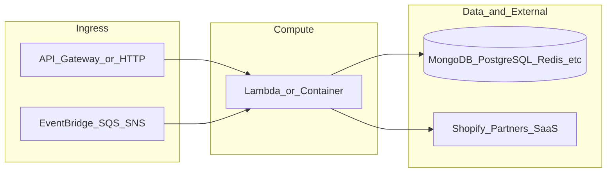

# botnot-lambda-notification

**Path:** `D:/botnot/botnot-lambda-notification`  
**Category:** lambdas-business  
**Primary language:** Python  
**Status:** present on disk

## 1. Purpose (2-3 lines)

# botnot-lambda-notification
for all async notifications to clients, shop, etc

# SST version
Be careful to use the latest SST version,   
as I tested, newer version than v1.10.6, can not work well between python function and python layer, and you get error like:  
> `Error: This lambda function uses a runtime that is incompatible with this layer (nodejs16.x is not in [python3.9])`

# How to build a nice email using mjml
1. Create a template file with the notification type name (e.g., `risky_confirmation_codes.mjml.jinja`) in the appropriate partner directory: `src/notification_handler/templates/[partner_id]/`
2. Write it with mjml and mixing with jinja syntax
3. Put the mjml content to https://mjml.io/try-it-live to preview
4. Ensure format ok then all good

## 2. Tech stack (from manifests and file-type mix)

- **Detected primary language:** Python
- **Top-level layout:** see listing below.

### `README.md`

```
# botnot-lambda-notification
for all async notifications to clients, shop, etc

# SST version
Be careful to use the latest SST version,   
as I tested, newer version than v1.10.6, can not work well between python function and python layer, and you get error like:  
> `Error: This lambda function uses a runtime that is incompatible with this layer (nodejs16.x is not in [python3.9])`

# How to build a nice email using mjml
1. Create a template file with the notification type name (e.g., `risky_confirmation_codes.mjml.jinja`) in the appropriate partner directory: `src/notification_handler/templates/[partner_id]/`
2. Write it with mjml and mixing with jinja syntax
3. Put the mjml content to https://mjml.io/try-it-live to preview
4. Ensure format ok then all good
```

### `readme.md`

```
# botnot-lambda-notification
for all async notifications to clients, shop, etc

# SST version
Be careful to use the latest SST version,   
as I tested, newer version than v1.10.6, can not work well between python function and python layer, and you get error like:  
> `Error: This lambda function uses a runtime that is incompatible with this layer (nodejs16.x is not in [python3.9])`

# How to build a nice email using mjml
1. Create a template file with the notification type name (e.g., `risky_confirmation_codes.mjml.jinja`) in the appropriate partner directory: `src/notification_handler/templates/[partner_id]/`
2. Write it with mjml and mixing with jinja syntax
3. Put the mjml content to https://mjml.io/try-it-live to preview
4. Ensure format ok then all good
```

### `Readme.md`

```
# botnot-lambda-notification
for all async notifications to clients, shop, etc

# SST version
Be careful to use the latest SST version,   
as I tested, newer version than v1.10.6, can not work well between python function and python layer, and you get error like:  
> `Error: This lambda function uses a runtime that is incompatible with this layer (nodejs16.x is not in [python3.9])`

# How to build a nice email using mjml
1. Create a template file with the notification type name (e.g., `risky_confirmation_codes.mjml.jinja`) in the appropriate partner directory: `src/notification_handler/templates/[partner_id]/`
2. Write it with mjml and mixing with jinja syntax
3. Put the mjml content to https://mjml.io/try-it-live to preview
4. Ensure format ok then all good
```

### `package.json`

```
{
  "name": "botnot-backend-lambda-notification",
  "version": "1.0.0",
  "private": true,
  "scripts": {
    "test": "sst test",
    "start": "sst start",
    "build": "sst build",
    "deploy": "sst deploy",
    "remove": "sst remove"
  },
  "eslintConfig": {
    "extends": [
      "serverless-stack"
    ]
  },
  "dependencies": {
    "@serverless-stack/cli": "1.18.4",
    "@serverless-stack/resources": "1.18.4",
    "@aws-cdk/aws-lambda-python-alpha": ">=2.55.0-alpha.0",
    "aws-cdk-lib": ">=2.55.0",
    "async": ">=2.6.4",
    "jszip": ">=3.8.0"
  }
}
```

### `sst.json`

```
{
  "name": "botnot-backend-lambda-notification",
  "type": "@serverless-stack/resources",
  "region": "us-east-1",
  "main": "stacks/index.js"
}
```


## 3. Architecture



- **Inbound:** HTTP (API Gateway / ALB), scheduled triggers, queues (SQS/SNS), EventBridge rules, or batch — infer from `stacks/`, `template.yaml`, `sst.config.ts`, or `src/` handlers.
- **Outbound:** databases and external HTTP APIs per layers and `package.json` / Python imports in handlers.
- **IaC pattern:** SST/CDK, SAM/CloudFormation, Pulumi, Helm, Terraform, or raw scripts — see manifests section.

## 4. Key files (auto-discovered)

- **Top-level entries:**

```
.cursorrules
.gitignore
.idea
.vscode
README.md
layer
package.json
pytest.ini
seed.yml
src
sst.json
stacks
tests
```

## 5. My contribution / role (evidence from git history — if available)

```text
83a288f 2025-07-04 Refactored EmailNotificationTarget class to inherit from BaseNotificationTarget and simplified the constructor. Updated send_notifications method to send_notification, improved email sending logic. Adjusted RiskyConfirmationCodesHandler to use the new notification target interface, updated related documentation and templates.
226563f 2025-07-03 Refactor notification handling module, remove unnecessary classes and methods
8f6c240 2025-07-02 fix: update tests for RiskyConfirmationCodesHandler
6f0f313 2025-07-01 feat: update README and refactor notification handling
a83c6be 2025-06-04 Merge pull request #34 from BotNotOrg/dev
ef76676 2025-06-04 fix: spanner lib
4612a97 2025-06-04 Merge pull request #33 from BotNotOrg/dev
cd5f70c 2025-05-26 Merge branch 'main' into dev
```

_Use commit messages only as hints; corroborate in interviews._

## 6. Notable patterns / snippets


**`stacks/index.js`**

```text
import LambdaStack from './MyStack';
import {Runtime, Tracing} from 'aws-cdk-lib/aws-lambda';
import {Fn, Duration} from 'aws-cdk-lib';

export default function main(app) {
    // Set default runtime for all functions
    app.setDefaultFunctionProps({
        runtime: 'python3.9',
        tracing: Tracing.DISABLED
    });

    new LambdaStack(app, 'sst-stack', {prefix: "botnot-backend", name: "lambda-notification"});
}
```


## 7. Metrics / SLO / scale (if available)

_Extract from Airflow DAG params, load tests, README, or CloudFormation `ReservedConcurrentExecutions` when present — not auto-inferred to avoid fabrication._

## 8. Resume bullets (ready-to-paste, English)

- Owned or extended **`botnot-lambda-notification`** capabilities aligned with **lambdas business** delivery.
- Applied **Python** stack patterns and repository-local IaC/config where present.
- Collaborated on production-grade defaults: structured logging, retries, and least-privilege IAM patterns where applicable.
- Integrated with **Yofi** platform services (data stores, queues, gateways) per dependency manifests in-repo.
- Documented operational expectations (deploy, test, local dev) via README and automation files when available.

## 9. Interview talking points

- What is the main entrypoint and trigger for `botnot-lambda-notification`?
- How are secrets and non-prod environments separated?
- What failure modes are handled (retries, DLQ, idempotency)?
- How would you observe this service in production (metrics, logs, traces)?
