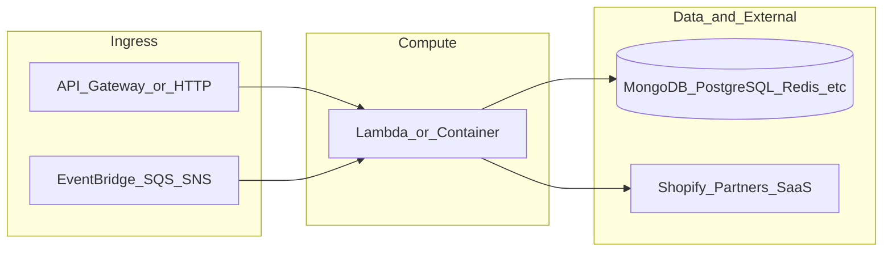

# botnot-lambda-order-edit-processing

**Path:** `D:/botnot/botnot-lambda-order-edit-processing`  
**Category:** lambdas-business  
**Primary language:** Python  
**Status:** present on disk

## 1. Purpose (2-3 lines)

# Getting Started with Serverless Stack (SST)

This project was bootstrapped with [Create Serverless Stack](https://docs.serverless-stack.com/packages/create-serverless-stack).

Start by installing the dependencies.

```bash
$ npm install
```

## 2. Tech stack (from manifests and file-type mix)

- **Detected primary language:** Python
- **Top-level layout:** see listing below.

### `README.md`

```
# Getting Started with Serverless Stack (SST)

This project was bootstrapped with [Create Serverless Stack](https://docs.serverless-stack.com/packages/create-serverless-stack).

Start by installing the dependencies.

```bash
$ npm install
```

## Commands

### `npm run start`

Starts the local Lambda development environment.

### `npm run build`

Build your app and synthesize your stacks.

Generates a `.build/` directory with the compiled files and a `.build/cdk.out/` directory with the synthesized CloudFormation stacks.

### `npm run deploy [stack]`

Deploy all your stacks to AWS. Or optionally deploy, a specific stack.

### `npm run remove [stack]`

Remove all your stacks and all of their resources from AWS. Or optionally removes, a specific stack.

### `npm run test`

Runs your tests using Jest. Takes all the [Jest CLI options](https://jestjs.io/docs/en/cli).

## Expected Effects

This should update the json_order_data w mutations. Additionally updates ES tables and potentially anything that persist can (right now the following)

```python
Customer, Order, OrderRefund, RefundLineItem, OrderLineItem, OrderFulfillment,
ClientDetail, FulfillmentLineItem
```

## Debugging Elastic Search
Useful for local testing of elasticsearch functions.
```
#start and interact with local opensearch

docker run -p 9200:9200 -p 9600:9600 -e "discovery.type=single-node" opensearchproject/opensearch:1.3.2
curl -XGET https://localhost:9200 -u 'admin:admin' --insecure
```

Getting a python client for local ES:
```python
import os
os.environ["ES_HOST"] = "localhost"
os.environ["ES_PORT"] = "9200"
os.environ["ES_USER"] = "admin"
os.environ["ES_PASSWORD"] = "admin"

from opensearchpy import OpenSearch, RequestsHttpConnection
host = os.environ["ES_HOST"]
port = os.environ["ES_PORT"]

es_client = OpenSearch(
    hosts=[{'host': host, 'port': int(port)}],
    http_auth=(os.environ["ES_USER"], os.environ["ES_PASSWORD"]),
    use_ssl=True,
    verify_certs=False,
    connection_class=RequestsHttpConnection
)
```


## Documentation

Learn more about the Serverless Stack.
- [Docs](https://docs.serverless-stack.com)
- [@serverless-stack/cli](https://docs.serverless-stack.com/packages/cli)
- [@serverless-stack/resources](https://docs.serverless-stack.com/packages/resources)

## Community

[Follow us on Twitter](https://twitter.com/ServerlessStack) or [post on our forums](https://discourse.serverless-stack.com).
```

### `readme.md`

```
# Getting Started with Serverless Stack (SST)

This project was bootstrapped with [Create Serverless Stack](https://docs.serverless-stack.com/packages/create-serverless-stack).

Start by installing the dependencies.

```bash
$ npm install
```

## Commands

### `npm run start`

Starts the local Lambda development environment.

### `npm run build`

Build your app and synthesize your stacks.

Generates a `.build/` directory with the compiled files and a `.build/cdk.out/` directory with the synthesized CloudFormation stacks.

### `npm run deploy [stack]`

Deploy all your stacks to AWS. Or optionally deploy, a specific stack.

### `npm run remove [stack]`

Remove all your stacks and all of their resources from AWS. Or optionally removes, a specific stack.

### `npm run test`

Runs your tests using Jest. Takes all the [Jest CLI options](https://jestjs.io/docs/en/cli).

## Expected Effects

This should update the json_order_data w mutations. Additionally updates ES tables and potentially anything that persist can (right now the following)

```python
Customer, Order, OrderRefund, RefundLineItem, OrderLineItem, OrderFulfillment,
ClientDetail, FulfillmentLineItem
```

## Debugging Elastic Search
Useful for local testing of elasticsearch functions.
```
#start and interact with local opensearch

docker run -p 9200:9200 -p 9600:9600 -e "discovery.type=single-node" opensearchproject/opensearch:1.3.2
curl -XGET https://localhost:9200 -u 'admin:admin' --insecure
```

Getting a python client for local ES:
```python
import os
os.environ["ES_HOST"] = "localhost"
os.environ["ES_PORT"] = "9200"
os.environ["ES_USER"] = "admin"
os.environ["ES_PASSWORD"] = "admin"

from opensearchpy import OpenSearch, RequestsHttpConnection
host = os.environ["ES_HOST"]
port = os.environ["ES_PORT"]

es_client = OpenSearch(
    hosts=[{'host': host, 'port': int(port)}],
    http_auth=(os.environ["ES_USER"], os.environ["ES_PASSWORD"]),
    use_ssl=True,
    verify_certs=False,
    connection_class=RequestsHttpConnection
)
```


## Documentation

Learn more about the Serverless Stack.
- [Docs](https://docs.serverless-stack.com)
- [@serverless-stack/cli](https://docs.serverless-stack.com/packages/cli)
- [@serverless-stack/resources](https://docs.serverless-stack.com/packages/resources)

## Community

[Follow us on Twitter](https://twitter.com/ServerlessStack) or [post on our forums](https://discourse.serverless-stack.com).
```

### `Readme.md`

```
# Getting Started with Serverless Stack (SST)

This project was bootstrapped with [Create Serverless Stack](https://docs.serverless-stack.com/packages/create-serverless-stack).

Start by installing the dependencies.

```bash
$ npm install
```

## Commands

### `npm run start`

Starts the local Lambda development environment.

### `npm run build`

Build your app and synthesize your stacks.

Generates a `.build/` directory with the compiled files and a `.build/cdk.out/` directory with the synthesized CloudFormation stacks.

### `npm run deploy [stack]`

Deploy all your stacks to AWS. Or optionally deploy, a specific stack.

### `npm run remove [stack]`

Remove all your stacks and all of their resources from AWS. Or optionally removes, a specific stack.

### `npm run test`

Runs your tests using Jest. Takes all the [Jest CLI options](https://jestjs.io/docs/en/cli).

## Expected Effects

This should update the json_order_data w mutations. Additionally updates ES tables and potentially anything that persist can (right now the following)

```python
Customer, Order, OrderRefund, RefundLineItem, OrderLineItem, OrderFulfillment,
ClientDetail, FulfillmentLineItem
```

## Debugging Elastic Search
Useful for local testing of elasticsearch functions.
```
#start and interact with local opensearch

docker run -p 9200:9200 -p 9600:9600 -e "discovery.type=single-node" opensearchproject/opensearch:1.3.2
curl -XGET https://localhost:9200 -u 'admin:admin' --insecure
```

Getting a python client for local ES:
```python
import os
os.environ["ES_HOST"] = "localhost"
os.environ["ES_PORT"] = "9200"
os.environ["ES_USER"] = "admin"
os.environ["ES_PASSWORD"] = "admin"

from opensearchpy import OpenSearch, RequestsHttpConnection
host = os.environ["ES_HOST"]
port = os.environ["ES_PORT"]

es_client = OpenSearch(
    hosts=[{'host': host, 'port': int(port)}],
    http_auth=(os.environ["ES_USER"], os.environ["ES_PASSWORD"]),
    use_ssl=True,
    verify_certs=False,
    connection_class=RequestsHttpConnection
)
```


## Documentation

Learn more about the Serverless Stack.
- [Docs](https://docs.serverless-stack.com)
- [@serverless-stack/cli](https://docs.serverless-stack.com/packages/cli)
- [@serverless-stack/resources](https://docs.serverless-stack.com/packages/resources)

## Community

[Follow us on Twitter](https://twitter.com/ServerlessStack) or [post on our forums](https://discourse.serverless-stack.com).
```

### `package.json`

```
{
  "name": "botnot-lambda-order-edit-processing",
  "version": "0.1.0",
  "private": true,
  "scripts": {
    "test": "sst test",
    "start": "sst start",
    "build": "sst build",
    "deploy": "sst deploy",
    "remove": "sst remove"
  },
  "eslintConfig": {
    "extends": [
      "serverless-stack"
    ]
  },
  "dependencies": {
    "@serverless-stack/cli": "0.69.7",
    "@serverless-stack/resources": "0.69.7",
    "@aws-cdk/aws-lambda-python-alpha": "2.15.0-alpha.0",
    "aws-cdk-lib": "2.15.0",
    "async": ">=2.6.4",
    "jszip": ">=3.7.0"
  }
}
```

### `sst.json`

```
{
  "name": "botnot-lambda-order-edit-processing",
  "type": "@serverless-stack/resources",
  "region": "us-east-1",
  "main": "stacks/index.js"
}
```


## 3. Architecture



- **Inbound:** HTTP (API Gateway / ALB), scheduled triggers, queues (SQS/SNS), EventBridge rules, or batch — infer from `stacks/`, `template.yaml`, `sst.config.ts`, or `src/` handlers.
- **Outbound:** databases and external HTTP APIs per layers and `package.json` / Python imports in handlers.
- **IaC pattern:** SST/CDK, SAM/CloudFormation, Pulumi, Helm, Terraform, or raw scripts — see manifests section.

## 4. Key files (auto-discovered)

- **Top-level entries:**

```
.gitignore
.idea
README.md
events
get_pypi.sh
package-lock.json
package.json
rds_layer
seed.yml
src
sst.json
stacks
```

## 5. My contribution / role (evidence from git history — if available)

```text
9223d27 2022-07-11 fix es issue, add steps for local testing to readme
8671824 2022-07-11 add notes about local testing ES
7053e72 2022-07-11 change elasticsearch search
5cba543 2022-07-11 add line_items
48f6124 2022-07-11 add None
9c180a1 2022-07-11 change engine
9d92af7 2022-07-08 s
9090ed7 2022-07-08 escape
```

_Use commit messages only as hints; corroborate in interviews._

## 6. Notable patterns / snippets


**`src/app.py`**

```python
import json
from libs.aurora import AuroraDB
from generated.generated_ecommerce import Order
# from stream.neptune_topic import push_to_downstream
from utils.default_logging import logger
from typing import Dict
from decimal import Decimal
from datetime import datetime as dt

from elastic_search.update_es import update_order, save_refund_es, save_order_rds

import logging

logger_logging = logging.getLogger()
logger_logging.setLevel(logging.INFO)



def primary_function(db, order):
    #  Connecting to aurora db
    # push_to_downstream(order)
    # a comment for the fuckedityness of aws bullshits
    save_order_rds(db, order)


def lambda_handler_mend(event, _):
    logger.info(f'Update Event ->: {json.dumps(event)}')

    updated_order_ids = []

    db = AuroraDB("shopify")
    for record in event['Records']:
        body = json.loads(record['body'])
        data = body['detail']['payload']
        webhook_topic = body['detail']['metadata']['X-Shopify-Topic']
        if webhook_topic == 'orders/updated':
            update_order(db, data)
        elif webhook_topic == 'orders/cancelled':
            update_order(db, data)
        elif webhook_topic == 'refunds/create':
            primary_function(db, data)
            save_refund_es(data)
        else:
            logger.warning('Unknown message: %s', record)

    db.close()
    return dict(
        statusCode=200,
        body=dict(
            message='Success',
            order_ids=json.dumps(
                updated_order_ids
            )
        )
    )
```

**`stacks/index.js`**

```text
import MyStack from "./Stack";
import { Runtime, Tracing } from "aws-cdk-lib/aws-lambda";
import { Duration } from 'aws-cdk-lib';

export default function main(app) {
  // Set default runtime for all functions
  app.setDefaultFunctionProps({
    srcPath: 'src',
    runtime: Runtime.PYTHON_3_8,
    tracing: Tracing.ACTIVE,
    timeout: Duration.seconds(30),
  });

  new MyStack(app, "sst-stack", { prefix: "botnot-lambda", name: "order-edit" });
}
```


## 7. Metrics / SLO / scale (if available)

_Extract from Airflow DAG params, load tests, README, or CloudFormation `ReservedConcurrentExecutions` when present — not auto-inferred to avoid fabrication._

## 8. Resume bullets (ready-to-paste, English)

- Owned or extended **`botnot-lambda-order-edit-processing`** capabilities aligned with **lambdas business** delivery.
- Applied **Python** stack patterns and repository-local IaC/config where present.
- Collaborated on production-grade defaults: structured logging, retries, and least-privilege IAM patterns where applicable.
- Integrated with **Yofi** platform services (data stores, queues, gateways) per dependency manifests in-repo.
- Documented operational expectations (deploy, test, local dev) via README and automation files when available.

## 9. Interview talking points

- What is the main entrypoint and trigger for `botnot-lambda-order-edit-processing`?
- How are secrets and non-prod environments separated?
- What failure modes are handled (retries, DLQ, idempotency)?
- How would you observe this service in production (metrics, logs, traces)?
