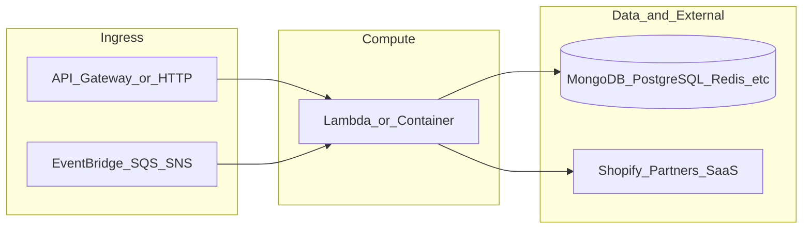

# botnot-lambda-order-persist

**Path:** `D:/botnot/botnot-lambda-order-persist`  
**Category:** lambdas-business  
**Primary language:** Python  
**Status:** present on disk

## 1. Purpose (2-3 lines)

# Order Persist Lambda

## 2. Tech stack (from manifests and file-type mix)

- **Detected primary language:** Python
- **Top-level layout:** see listing below.

### `README.md`

```
# Order Persist Lambda
```

### `readme.md`

```
# Order Persist Lambda
```

### `Readme.md`

```
# Order Persist Lambda
```

### `package.json`

```
{
  "name": "order-persist",
  "version": "0.1.0",
  "private": true,
  "scripts": {
    "test": "sst test",
    "start": "sst start",
    "build": "sst build",
    "deploy": "sst deploy",
    "remove": "sst remove"
  },
  "eslintConfig": {
    "extends": [
      "serverless-stack"
    ]
  },
  "dependencies": {
    "@serverless-stack/cli": "0.69.5",
    "@serverless-stack/resources": "0.69.5",
    "@aws-cdk/aws-lambda-python-alpha": "2.15.0-alpha.0",
    "aws-cdk-lib": "2.15.0",
    "async": ">=2.6.4",
    "jszip": ">=3.7.0"
  }
}
```

### `sst.json`

```
{
  "name": "botnot-lambda-order-persist",
  "type": "@serverless-stack/resources",
  "region": "us-east-1",
  "main": "stacks/index.js"
}
```

### `Makefile`

```
all:	stack-deploy
all-prod: stack-deploy-prod

install-deps:
	npm install

stack-build: install-deps
	npm run build -- --stage dev --region us-east-1

stack-test: stack-build
	echo npm run test

stack-deploy: stack-test
	npm run deploy -- --stage dev --region us-east-1

stack-build-prod: install-deps
	npm run build -- --stage prod --region us-east-1 --profile prod

stack-test-prod: stack-build-prod
	echo npm run test

stack-deploy-prod: stack-test-prod
	npm run deploy -- --stage prod --region us-east-1 --profile prod

clean:
	rm -rf .build build
	rm -rf .pytest_cache cdk.out
	rm -rf .sst node_modules
	rm -rf src/__pycache__
	rm -rf test/__pycache__
```


## 3. Architecture



- **Inbound:** HTTP (API Gateway / ALB), scheduled triggers, queues (SQS/SNS), EventBridge rules, or batch — infer from `stacks/`, `template.yaml`, `sst.config.ts`, or `src/` handlers.
- **Outbound:** databases and external HTTP APIs per layers and `package.json` / Python imports in handlers.
- **IaC pattern:** SST/CDK, SAM/CloudFormation, Pulumi, Helm, Terraform, or raw scripts — see manifests section.

## 4. Key files (auto-discovered)

- **Top-level entries:**

```
.env
.github
.gitignore
.idea
Makefile
README.md
docs
events
get_pypi.sh
layer
package.json
rds_layer
seed.yml
src
sst.json
stacks
test
```

## 5. My contribution / role (evidence from git history — if available)

```text
1406083 2022-08-24 Merge pull request #17 from BotNotOrg/include_customer_id
f0d5865 2022-08-24 nit - inconsistent whitespace
5667fde 2022-08-24 including customer
4aa22de 2022-08-15 Merge branch 'main' into dev
aa027e9 2022-08-15 put thing in correct place
cb755fc 2022-08-15 trynna add itemwise tax logic
a91449f 2022-08-12 adding logic to push upstream w/o customer back in
80baad5 2022-08-12 adding logic to push upstream w/o customer back in
```

_Use commit messages only as hints; corroborate in interviews._

## 6. Notable patterns / snippets


**`src/app.py`**

```python
import json
from libs.aurora import AuroraDB
from libs.publisher import push_to_downstream
from libs.persist_to_rds import insert_order_rds
from libs.default_logging import logger

from opentelemetry import trace
from opentelemetry.trace import NonRecordingSpan, SpanContext, SpanKind, TraceFlags, Link

tracer = trace.get_tracer(__name__)  # Get a tracer for the current module from the Global Tracer Provider


def primary_function(db, order):
    logger.info(f'[Lambda-order-persist]: primary function processing')

    logger.info(f'[Lambda-order-persist]: Saving order infos')
    insert_order_rds(db.session, order)
    logger.info(f'[Lambda-order-persist]: Saved order infos Successfully')


    logger.info(f'[Lambda-order-persist]: Pushing to SNS')
    push_to_downstream(order)
    logger.info(f'[Lambda-order-persist]: Pushed to SNS Successfully')

    logger.info(f'[Lambda-order-persist]: Rds Order Persisting function succeeded!')


def ok_message(body):
    return ({
        'statusCode': 200,
        'body': json.dumps(body)
    })


def lambda_handler(event, context):
    logger.info('[Lambda-order-persist] : start processing event -> %s', json.dumps(event))


    # FIXME: temporarily disable because of errors
    db = AuroraDB("shopify")
    for record in event['Records']:
        body = json.loads(record['body'])

        ctx = None
        lambda_context = trace.get_current_span().get_span_context()
        tracing_info = body.pop("opentelemetry_tracing", None)
        if tracing_info:
            logger.info("Found OpenTelemetry tracing context. Will connect with upstream xray servicemap.")
            ctx = trace.set_span_in_context(NonRecordingSpan(SpanContext(
                tracing_info["traceId"], tracing_info["spanId"], is_remote=True, trace_flags=TraceFlags(0x01))))
        with tracer.start_as_current_span('consuming_sqs', context=ctx, kind=SpanKind.SERVER,
                                          links=[Link(lambda_context)]):

            primary_function(db, order=body)

    return True
```

**`stacks/index.js`**

```text
import MyStack from "./MyStack";
import { Runtime, Tracing } from "aws-cdk-lib/aws-lambda";
import { Duration } from 'aws-cdk-lib';

export default function main(app) {
  // Set default runtime for all functions
  app.setDefaultFunctionProps({
    srcPath: 'src',
    runtime: Runtime.PYTHON_3_8,
    tracing: Tracing.ACTIVE,
    timeout: Duration.seconds(30),
  });

  new MyStack(app, "sst-stack", { prefix: "botnot-lambda", name: "order-persist" });
}
```


## 7. Metrics / SLO / scale (if available)

_Extract from Airflow DAG params, load tests, README, or CloudFormation `ReservedConcurrentExecutions` when present — not auto-inferred to avoid fabrication._

## 8. Resume bullets (ready-to-paste, English)

- Owned or extended **`botnot-lambda-order-persist`** capabilities aligned with **lambdas business** delivery.
- Applied **Python** stack patterns and repository-local IaC/config where present.
- Collaborated on production-grade defaults: structured logging, retries, and least-privilege IAM patterns where applicable.
- Integrated with **Yofi** platform services (data stores, queues, gateways) per dependency manifests in-repo.
- Documented operational expectations (deploy, test, local dev) via README and automation files when available.

## 9. Interview talking points

- What is the main entrypoint and trigger for `botnot-lambda-order-persist`?
- How are secrets and non-prod environments separated?
- What failure modes are handled (retries, DLQ, idempotency)?
- How would you observe this service in production (metrics, logs, traces)?
