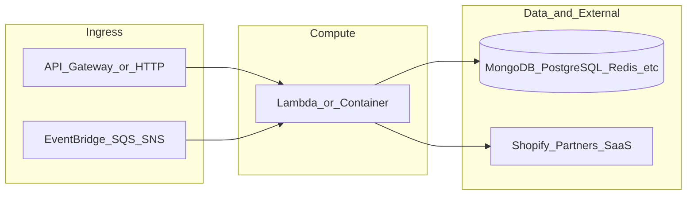

# botnot-lambda-order-state-prediction3

**Path:** `D:/botnot/botnot-lambda-order-state-prediction3`  
**Category:** lambdas-business  
**Primary language:** Python  
**Status:** present on disk

## 1. Purpose (2-3 lines)

# AWS Lambda for order state prediction

Author: Herman  Last updated: 2022-05-20

## 2. Tech stack (from manifests and file-type mix)

- **Detected primary language:** Python
- **Top-level layout:** see listing below.

### `README.md`

```
# AWS Lambda for order state prediction

Author: Herman  Last updated: 2022-05-20
```

### `readme.md`

```
# AWS Lambda for order state prediction

Author: Herman  Last updated: 2022-05-20
```

### `Readme.md`

```
# AWS Lambda for order state prediction

Author: Herman  Last updated: 2022-05-20
```

### `package.json`

```
{
  "name": "botnot-lambda-order-state-prediction",
  "version": "0.1.0",
  "private": true,
  "scripts": {
    "test": "sst test",
    "start": "sst start",
    "build": "sst build",
    "deploy": "sst deploy",
    "remove": "sst remove",
    "diff": "sst diff"
  },
  "eslintConfig": {
    "extends": [
      "serverless-stack"
    ]
  },
  "dependencies": {
    "@serverless-stack/cli": "^1.18.4",
    "@serverless-stack/resources": "^1.18.4",
    "@aws-cdk/aws-lambda-python-alpha": "2.50.0-alpha.0",
    "aws-cdk-lib": "2.50.0",
    "parse-url": ">=8.1.0"
  }
}
```

### `sst.json`

```
{
  "name": "botnot-lambda-order-state-prediction",
  "type": "@serverless-stack/resources",
  "region": "us-east-1",
  "main": "stacks/index.js"
}
```

### `Makefile`

```
all:	stack-deploy
all-prod: stack-deploy-prod

install-deps:
	npm install

stack-build: install-deps
	npm run build -- --stage dev --region us-east-1

stack-test: stack-build
	echo npm run test

stack-deploy: stack-test
	npm run deploy -- --stage dev --region us-east-1

stack-build-prod: install-deps
	npm run build -- --stage prod --region us-east-1 --profile prod

stack-test-prod: stack-build-prod
	echo npm run test

stack-deploy-prod: stack-test-prod
	npm run deploy -- --stage prod --region us-east-1 --profile prod

clean:
	rm -rf .build build
	rm -rf .pytest_cache cdk.out
	rm -rf .sst node_modules
	rm -rf src/__pycache__
	rm -rf test/__pycache__
```


## 3. Architecture



- **Inbound:** HTTP (API Gateway / ALB), scheduled triggers, queues (SQS/SNS), EventBridge rules, or batch — infer from `stacks/`, `template.yaml`, `sst.config.ts`, or `src/` handlers.
- **Outbound:** databases and external HTTP APIs per layers and `package.json` / Python imports in handlers.
- **IaC pattern:** SST/CDK, SAM/CloudFormation, Pulumi, Helm, Terraform, or raw scripts — see manifests section.

## 4. Key files (auto-discovered)

- **Top-level entries:**

```
.env
.github
.gitignore
.idea
Makefile
README.md
get_pypi.sh
layer
package.json
seed.yml
src
sst.json
stacks
test
```

## 5. My contribution / role (evidence from git history — if available)

```text
9fe5542 2023-08-09 Tracing.DISABLED
789aaf3 2023-08-08 remove tracing
82fdf99 2023-04-03 fix: sstV1
af8708c 2023-04-03 feat: add encryption for queue
1be2b8d 2023-04-03 fix: unused code
7fa77e5 2023-04-03 fix: seed.yml
11e05a8 2023-04-03 feat: upgrade to SSTv1
a37c757 2023-04-03 feat: remove RDS layer which is unused
```

_Use commit messages only as hints; corroborate in interviews._

## 6. Notable patterns / snippets


**`src/app.py`**

```python
import json
import os
import boto3
import logging
from decimal import Decimal
from datetime import datetime

from boto3.dynamodb.types import TypeSerializer
from prediction_by_mongo import combine_predictions_from_mongo


serializer = TypeSerializer()

logger = logging.getLogger()
logger.setLevel(logging.INFO)


# @xray_recorder.capture('error_message')
def error_message(message, debug_info=None):
    if debug_info is not None:
        logger.error(f'[order-state-prediction] {message}: {debug_info}')
    else:
        logger.error(f'[order-state-prediction] {message}')
    return ({
        'statusCode': 503,
        'body': json.dumps({
            'success': False,
            'message': message
        })
    })


# @xray_recorder.capture('ok_message')
def ok_message(body):
    return ({
        'statusCode': 200,
        'body': json.dumps(body)
    })


def handler(event, context):
    print(f'[Lambda]: processing -> {json.dumps(event)}')

    for record in event['Records']:
        message = json.loads(record['body'])
        message = message['data'] if 'data' in message else message
        flag_no_export = message.get("no_export") is True
        process_event(message, flag_no_export)


# @xray_recorder.capture('process_order_state_prediction_event')
def process_event(message, flag_no_export=False):
    print(f'[Lambda-process-event]: {message}')

    # order_data, result, created = combine_predictions(message) # FIXME: rds temporary not working
    order_data, result, mongo_updated_order, partner_id, mongo_order_id, ml_order_pred = combine_predictions_from_mongo(message)
    print(f'[Lambda-process-event-combined-result]: {result}')
    if order_data is None and result is None:
        return

    if flag_no_export:
        logger.info(f'Stop the pipeline here because no_export flag.')
        return
    validations = message.get("payload").get("order").get("order_validation")
    risks, trusts = message.get("risks"), message.get("trusts")
    if isinstance(risks, list) and isinstance(trusts, list):
        print(f'[Risks and Trusts Retrieved from Message]: {risks} {t

…(truncated)…
```

**`stacks/index.js`**

```text
import MyStack from "./MyStack";
import { Tracing } from "aws-cdk-lib/aws-lambda";

export default function main(app) {
  // Set default runtime for all functions
  app.setDefaultFunctionProps({
    srcPath: 'src',
    runtime: 'python3.9',
    tracing: Tracing.DISABLED,
    timeout: 30,
  });

  // Define sst-stack
  new MyStack(app, "sst-stack", { prefix: "botnot-lambda", name: "order-state-prediction" });
}
```


## 7. Metrics / SLO / scale (if available)

_Extract from Airflow DAG params, load tests, README, or CloudFormation `ReservedConcurrentExecutions` when present — not auto-inferred to avoid fabrication._

## 8. Resume bullets (ready-to-paste, English)

- Owned or extended **`botnot-lambda-order-state-prediction3`** capabilities aligned with **lambdas business** delivery.
- Applied **Python** stack patterns and repository-local IaC/config where present.
- Collaborated on production-grade defaults: structured logging, retries, and least-privilege IAM patterns where applicable.
- Integrated with **Yofi** platform services (data stores, queues, gateways) per dependency manifests in-repo.
- Documented operational expectations (deploy, test, local dev) via README and automation files when available.

## 9. Interview talking points

- What is the main entrypoint and trigger for `botnot-lambda-order-state-prediction3`?
- How are secrets and non-prod environments separated?
- What failure modes are handled (retries, DLQ, idempotency)?
- How would you observe this service in production (metrics, logs, traces)?
