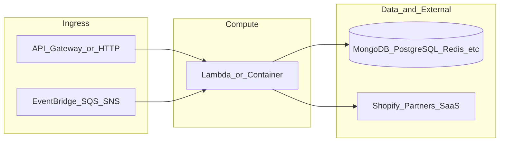

# botnot-lambda-order-validations

**Path:** `D:/botnot/botnot-lambda-order-validations`  
**Category:** lambdas-business  
**Primary language:** Python  
**Status:** present on disk

## 1. Purpose (2-3 lines)

- test merge
# Getting Started with Serverless Stack (SST)

This project was bootstrapped with [Create Serverless Stack](https://docs.serverless-stack.com/packages/create-serverless-stack).

Start by installing the dependencies.

```bash
$ npm install
```

## 2. Tech stack (from manifests and file-type mix)

- **Detected primary language:** Python
- **Top-level layout:** see listing below.

### `README.md`

```
- test merge
# Getting Started with Serverless Stack (SST)

This project was bootstrapped with [Create Serverless Stack](https://docs.serverless-stack.com/packages/create-serverless-stack).

Start by installing the dependencies.

```bash
$ npm install
```

## Commands

### `npm run start`

Starts the local Lambda development environment.

### `npm run build`

Build your app and synthesize your stacks.

Generates a `.build/` directory with the compiled files and a `.build/cdk.out/` directory with the synthesized CloudFormation stacks.

### `npm run deploy [stack]`

Deploy all your stacks to AWS. Or optionally deploy, a specific stack.

### `npm run remove [stack]`

Remove all your stacks and all of their resources from AWS. Or optionally removes, a specific stack.

### `npm run test`

Runs your tests using Jest. Takes all the [Jest CLI options](https://jestjs.io/docs/en/cli).

## Documentation

Learn more about the Serverless Stack.
- [Docs](https://docs.serverless-stack.com)
- [@serverless-stack/cli](https://docs.serverless-stack.com/packages/cli)
- [@serverless-stack/resources](https://docs.serverless-stack.com/packages/resources)

## Community

[Follow us on Twitter](https://twitter.com/ServerlessStack) or [post on our forums](https://discourse.serverless-stack.com).
```

### `readme.md`

```
- test merge
# Getting Started with Serverless Stack (SST)

This project was bootstrapped with [Create Serverless Stack](https://docs.serverless-stack.com/packages/create-serverless-stack).

Start by installing the dependencies.

```bash
$ npm install
```

## Commands

### `npm run start`

Starts the local Lambda development environment.

### `npm run build`

Build your app and synthesize your stacks.

Generates a `.build/` directory with the compiled files and a `.build/cdk.out/` directory with the synthesized CloudFormation stacks.

### `npm run deploy [stack]`

Deploy all your stacks to AWS. Or optionally deploy, a specific stack.

### `npm run remove [stack]`

Remove all your stacks and all of their resources from AWS. Or optionally removes, a specific stack.

### `npm run test`

Runs your tests using Jest. Takes all the [Jest CLI options](https://jestjs.io/docs/en/cli).

## Documentation

Learn more about the Serverless Stack.
- [Docs](https://docs.serverless-stack.com)
- [@serverless-stack/cli](https://docs.serverless-stack.com/packages/cli)
- [@serverless-stack/resources](https://docs.serverless-stack.com/packages/resources)

## Community

[Follow us on Twitter](https://twitter.com/ServerlessStack) or [post on our forums](https://discourse.serverless-stack.com).
```

### `Readme.md`

```
- test merge
# Getting Started with Serverless Stack (SST)

This project was bootstrapped with [Create Serverless Stack](https://docs.serverless-stack.com/packages/create-serverless-stack).

Start by installing the dependencies.

```bash
$ npm install
```

## Commands

### `npm run start`

Starts the local Lambda development environment.

### `npm run build`

Build your app and synthesize your stacks.

Generates a `.build/` directory with the compiled files and a `.build/cdk.out/` directory with the synthesized CloudFormation stacks.

### `npm run deploy [stack]`

Deploy all your stacks to AWS. Or optionally deploy, a specific stack.

### `npm run remove [stack]`

Remove all your stacks and all of their resources from AWS. Or optionally removes, a specific stack.

### `npm run test`

Runs your tests using Jest. Takes all the [Jest CLI options](https://jestjs.io/docs/en/cli).

## Documentation

Learn more about the Serverless Stack.
- [Docs](https://docs.serverless-stack.com)
- [@serverless-stack/cli](https://docs.serverless-stack.com/packages/cli)
- [@serverless-stack/resources](https://docs.serverless-stack.com/packages/resources)

## Community

[Follow us on Twitter](https://twitter.com/ServerlessStack) or [post on our forums](https://discourse.serverless-stack.com).
```

### `package.json`

```
{
  "name": "botnot-lambda-order-validations",
  "version": "0.1.0",
  "private": true,
  "scripts": {
    "test": "sst test",
    "start": "sst start",
    "build": "sst build",
    "deploy": "sst deploy",
    "remove": "sst remove",
    "diff": "sst diff"
  },
  "eslintConfig": {
    "extends": [
      "serverless-stack"
    ]
  },
  "dependencies": {
    "@serverless-stack/cli": "^1.2.30",
    "@serverless-stack/resources": "^1.2.30",
    "@aws-cdk/aws-lambda-python-alpha": "2.50.0-alpha.0",
    "aws-cdk-lib": "2.50.0",
    "ts-node": "^10.9.1",
    "async": ">=2.6.4",
    "jszip": ">=3.7.0"
  }
}
```

### `sst.json`

```
{
  "name": "botnot-backend-lambda-order-validations",
  "region": "us-east-1",
  "main": "stacks/index.js"
}
```

### `Makefile`

```
all:	stack-deploy
all-prod: stack-deploy-prod

install-deps:
	npm install

stack-build: install-deps
	npm run build -- --stage dev --region us-east-1

stack-test: stack-build
	echo npm run test

stack-deploy: stack-test
	npm run deploy -- --stage dev --region us-east-1

stack-build-prod: install-deps
	npm run build -- --stage prod --region us-east-1 --profile prod

stack-test-prod: stack-build-prod
	echo npm run test

stack-deploy-prod: stack-test-prod
	npm run deploy -- --stage prod --region us-east-1 --profile prod

clean:
	rm -rf .build build
	rm -rf .pytest_cache cdk.out
	rm -rf .sst node_modules
	rm -rf src/__pycache__
	rm -rf test/__pycache__
```


## 3. Architecture



- **Inbound:** HTTP (API Gateway / ALB), scheduled triggers, queues (SQS/SNS), EventBridge rules, or batch — infer from `stacks/`, `template.yaml`, `sst.config.ts`, or `src/` handlers.
- **Outbound:** databases and external HTTP APIs per layers and `package.json` / Python imports in handlers.
- **IaC pattern:** SST/CDK, SAM/CloudFormation, Pulumi, Helm, Terraform, or raw scripts — see manifests section.

## 4. Key files (auto-discovered)

- **Top-level entries:**

```
.env
.github
.gitignore
.idea
Makefile
README.md
get_pypi.sh
layer
package.json
seed.yml
src
sst.json
stacks
test
```

## 5. My contribution / role (evidence from git history — if available)

```text
1868a9a 2023-08-09 Tracing.DISABLED
e05cca1 2023-08-08 remove tracing
03da0e7 2023-06-18 Merge pull request #43 from BotNotOrg/remove-arango
ee18359 2023-06-18 remove arangodb orders validation
451ac73 2023-06-14 Merge pull request #42 from BotNotOrg/security
9664431 2023-06-13 change affected version of requests package to 2.31.0
dd3e72e 2023-06-13 change affected version of requests package to latest
40b502c 2023-06-12 Merge pull request #41 from BotNotOrg/arango-persist
```

_Use commit messages only as hints; corroborate in interviews._

## 6. Notable patterns / snippets


**`src/app.py`**

```python
import json
from datetime import datetime as dt

from validations.validation import (
    IntegratedValidationResult,
    high_level_validation_of_order,
    is_valid_order_for_processing,
)
from validations.address_validations import process_address_validation
from validations.customer_validations import verify_customer
from validations.email_validations import validate_email_address
from validations.ip_validations import validate_ip
from validations.phone_validations import validate_phone_numbers
from validations.ua_validations import validate_user_agent
from validations.bin_validations import validate_credit_card_bin
from validations.stream.neptune_topic import push_to_downstream
from validations.utils.default_logger import logger

from mongo import persist_to_mongo

def process_record(order):
    logger.info("order in process-> %s", json.dumps(order))
    if not order.get("_id"):
        logger.info(
            "[Caution] Temporarily we only accept order event from mongo-persist, and stop for rds event"
        )
        return

    if not is_valid_order_for_processing(order):
        logger.warn(
            "The order is not valid, now the whole pipeline will quit from processing it!"
        )
        return

    result = IntegratedValidationResult(order["id"])

    result.customer_result = verify_customer(order)
    order["customer"] = customer = result.customer_result.customer

    result.ip_result = validate_ip(order.get("browser_ip"))
    result.ua_result = validate_user_agent(
        order.get("client_details", {}).get("user_agent")
    )
    result.bin_result = validate_credit_card_bin(
        order.get("payment_details", {}).get("credit_card_bin")
    )
    result.email_result = validate_email_address(order)
    result.ship_addr_result = process_address_validation(order, "shipping_address")
    result.bill_addr_result = process_address_validation(order, "billing_address")
    result.bill_phone_result = validate_phone_numbers(result.bill_addr_result.phone)
    result.ship_phone_result = validate_phone_numbers(result.ship_addr_result.phone)
    result.customer_phone_result = va

…(truncated)…
```

**`stacks/index.js`**

```text
import MyStack from "./MyStack";
import { Tracing } from 'aws-cdk-lib/aws-lambda';

export default function main(app) {
    // Set default runtime for all functions
    app.setDefaultFunctionProps({
        srcPath: 'src',
        handler: 'lambda.handler',
        runtime: 'python3.9',
        tracing: Tracing.DISABLED,
        timeout: 30
    });

    new MyStack(app, "sst-stack", {prefix: "botnot-backend", name: "lambda-order-validations"});

    // Add more stacks
}
```


## 7. Metrics / SLO / scale (if available)

_Extract from Airflow DAG params, load tests, README, or CloudFormation `ReservedConcurrentExecutions` when present — not auto-inferred to avoid fabrication._

## 8. Resume bullets (ready-to-paste, English)

- Owned or extended **`botnot-lambda-order-validations`** capabilities aligned with **lambdas business** delivery.
- Applied **Python** stack patterns and repository-local IaC/config where present.
- Collaborated on production-grade defaults: structured logging, retries, and least-privilege IAM patterns where applicable.
- Integrated with **Yofi** platform services (data stores, queues, gateways) per dependency manifests in-repo.
- Documented operational expectations (deploy, test, local dev) via README and automation files when available.

## 9. Interview talking points

- What is the main entrypoint and trigger for `botnot-lambda-order-validations`?
- How are secrets and non-prod environments separated?
- What failure modes are handled (retries, DLQ, idempotency)?
- How would you observe this service in production (metrics, logs, traces)?
