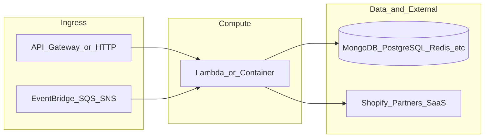

# botnot-lambda-order-webhook

**Path:** `D:/botnot/botnot-lambda-order-webhook`  
**Category:** lambdas-business  
**Primary language:** TypeScript  
**Status:** present on disk

## 1. Purpose (2-3 lines)

# Getting Started with Serverless Stack (SST)

This project was bootstrapped with [Create Serverless Stack](https://docs.serverless-stack.com/packages/create-serverless-stack).

Start by installing the dependencies.

```bash
$ npm install
```

## 2. Tech stack (from manifests and file-type mix)

- **Detected primary language:** TypeScript
- **Top-level layout:** see listing below.

### `README.md`

```
# Getting Started with Serverless Stack (SST)

This project was bootstrapped with [Create Serverless Stack](https://docs.serverless-stack.com/packages/create-serverless-stack).

Start by installing the dependencies.

```bash
$ npm install
```

## Commands

### `npm run start`

Starts the local Lambda development environment.

### `npm run build`

Build your app and synthesize your stacks.

Generates a `.build/` directory with the compiled files and a `.build/cdk.out/` directory with the synthesized CloudFormation stacks.

### `npm run deploy [stack]`

Deploy all your stacks to AWS. Or optionally deploy a specific stack.

### `npm run remove [stack]`

Remove all your stacks and all of their resources from AWS. Or optionally remove a specific stack.

### `npm run test`

Runs your tests using Jest. Takes all the [Jest CLI options](https://jestjs.io/docs/en/cli).

## Documentation

Learn more about the Serverless Stack.

- [Docs](https://docs.serverless-stack.com)
- [@serverless-stack/cli](https://docs.serverless-stack.com/packages/cli)
- [@serverless-stack/resources](https://docs.serverless-stack.com/packages/resources)

## Community

[Follow us on Twitter](https://twitter.com/ServerlessStack) or [post on our forums](https://discourse.serverless-stack.com).
```

### `readme.md`

```
# Getting Started with Serverless Stack (SST)

This project was bootstrapped with [Create Serverless Stack](https://docs.serverless-stack.com/packages/create-serverless-stack).

Start by installing the dependencies.

```bash
$ npm install
```

## Commands

### `npm run start`

Starts the local Lambda development environment.

### `npm run build`

Build your app and synthesize your stacks.

Generates a `.build/` directory with the compiled files and a `.build/cdk.out/` directory with the synthesized CloudFormation stacks.

### `npm run deploy [stack]`

Deploy all your stacks to AWS. Or optionally deploy a specific stack.

### `npm run remove [stack]`

Remove all your stacks and all of their resources from AWS. Or optionally remove a specific stack.

### `npm run test`

Runs your tests using Jest. Takes all the [Jest CLI options](https://jestjs.io/docs/en/cli).

## Documentation

Learn more about the Serverless Stack.

- [Docs](https://docs.serverless-stack.com)
- [@serverless-stack/cli](https://docs.serverless-stack.com/packages/cli)
- [@serverless-stack/resources](https://docs.serverless-stack.com/packages/resources)

## Community

[Follow us on Twitter](https://twitter.com/ServerlessStack) or [post on our forums](https://discourse.serverless-stack.com).
```

### `Readme.md`

```
# Getting Started with Serverless Stack (SST)

This project was bootstrapped with [Create Serverless Stack](https://docs.serverless-stack.com/packages/create-serverless-stack).

Start by installing the dependencies.

```bash
$ npm install
```

## Commands

### `npm run start`

Starts the local Lambda development environment.

### `npm run build`

Build your app and synthesize your stacks.

Generates a `.build/` directory with the compiled files and a `.build/cdk.out/` directory with the synthesized CloudFormation stacks.

### `npm run deploy [stack]`

Deploy all your stacks to AWS. Or optionally deploy a specific stack.

### `npm run remove [stack]`

Remove all your stacks and all of their resources from AWS. Or optionally remove a specific stack.

### `npm run test`

Runs your tests using Jest. Takes all the [Jest CLI options](https://jestjs.io/docs/en/cli).

## Documentation

Learn more about the Serverless Stack.

- [Docs](https://docs.serverless-stack.com)
- [@serverless-stack/cli](https://docs.serverless-stack.com/packages/cli)
- [@serverless-stack/resources](https://docs.serverless-stack.com/packages/resources)

## Community

[Follow us on Twitter](https://twitter.com/ServerlessStack) or [post on our forums](https://discourse.serverless-stack.com).
```

### `package.json`

```
{
  "name": "botnot-lambda-order-webhook",
  "version": "0.1.0",
  "private": true,
  "scripts": {
    "test": "sst test",
    "start": "sst start",
    "build": "sst build",
    "deploy": "sst deploy",
    "remove": "sst remove",
    "diff": "sst diff",
    "compile": "tsc"
  },
  "eslintConfig": {
    "extends": [
      "serverless-stack"
    ]
  },
  "dependencies": {
    "@aws-sdk/client-dynamodb": "^3.87.0",
    "@aws-sdk/client-sns": "^3.67.0",
    "@aws-sdk/lib-dynamodb": "^3.87.0",
    "@serverless-stack/cli": "0.69.7",
    "@serverless-stack/resources": "0.69.7",
    "async": ">=2.6.4",
    "aws-cdk-lib": "2.15.0",
    "aws-lambda": "^1.0.7",
    "aws-xray-sdk": "^3.3.5",
    "jszip": ">=3.7.0",
    "shopify-hmac-validation": "^1.1.1"
  },
  "devDependencies": {
    "@babel/core": "^7.15.0",
    "@babel/preset-env": "^7.15.0",
    "@babel/preset-typescript": "^7.15.0",
    "@tsconfig/node14": "^1.0.1",
    "@types/aws-lambda": "^8.10.51",
    "@types/jest": "^27.0.1",
    "@types/node": "<15.0.0",
    "aws-lambda": "^1.0.6",
    "aws-sdk": "^2.655.0",
    "babel-jest": "^27.1.0",
    "jest": "^27.1.0",
    "typescript": "^4.4.4"
  }
}
```

### `sst.json`

```
{
  "name": "botnot-lambda-order-webhook",
  "region": "us-east-1",
  "main": "stacks/index.ts"
}
```

### `Makefile`

```
all:	stack-deploy

install-deps:
	npm install

stack-build: install-deps
	npm run build -- --stage dev --region us-east-1

stack-test: stack-build
	echo npm run test

stack-deploy: stack-test
	npm run deploy -- --stage dev --region us-east-1

clean:
	rm -rf .build build
	rm -rf .pytest_cache cdk.out
	rm -rf .sst node_modules
	rm -rf src/__pycache__
	rm -rf test/__pycache__
```

### `tsconfig.json`

```
{
  "compilerOptions": {
    "module": "CommonJS",
    "target": "ES2017",
    "noImplicitAny": true,
    "preserveConstEnums": true,
    "outDir": "./built",
    "sourceMap": true
  },
  "extends": "@tsconfig/node14",
  "include": [
    "src-ts/**/*",
    "src/**/*",
    "../app.js"
  ],
  "exclude": [
    "node_modules",
    "**/*.spec.ts"
  ]
}
```


## 3. Architecture



- **Inbound:** HTTP (API Gateway / ALB), scheduled triggers, queues (SQS/SNS), EventBridge rules, or batch — infer from `stacks/`, `template.yaml`, `sst.config.ts`, or `src/` handlers.
- **Outbound:** databases and external HTTP APIs per layers and `package.json` / Python imports in handlers.
- **IaC pattern:** SST/CDK, SAM/CloudFormation, Pulumi, Helm, Terraform, or raw scripts — see manifests section.

## 4. Key files (auto-discovered)

- **Top-level entries:**

```
.env
.github
.gitignore
.idea
Makefile
README.md
package-lock.json
package.json
samconfig.toml
src
sst.json
stacks
test
tsconfig.json
webhook_layer
```

## 5. My contribution / role (evidence from git history — if available)

```text
ca3d4fd 2022-07-06 build(deps): bump parse-url from 6.0.0 to 6.0.2
5ef1b91 2022-05-13 fixed hmac validation
9e8cf2f 2022-05-13 minor change
1e59254 2022-05-13 Merge branch 'main' into develop
472fc4f 2022-05-13 Minor changes
3dcc931 2022-05-13 fix: update test data
87a8fd8 2022-05-13 fix: typo
0a56e6b 2022-05-13 fix: add debug code for dynamodb
```

_Use commit messages only as hints; corroborate in interviews._

## 6. Notable patterns / snippets


**`stacks/index.ts`**

```typescript
import MyStack from "./MyStack";
import {Runtime, Tracing} from 'aws-cdk-lib/aws-lambda';
import {Fn, Duration} from 'aws-cdk-lib';
import { App } from "@serverless-stack/resources";

export default function main(app: App) {
    app.setDefaultFunctionProps({
        srcPath: 'src',
        handler: 'app.lambdaHandler',
        runtime: Runtime.NODEJS_14_X,
        tracing: Tracing.ACTIVE,
        timeout: Duration.seconds(30),
        environment: {
            LOG_LEVEL: 'debug',
            REGION: 'us-east-1',
            SECRETS_DB_TABLE: Fn.importValue("store-credentials-simple-table-arn"),

            // Original names from shopify-event-processor repo
            // ORDER_CREATED_TOPIC: Fn.importValue('OrderStartProcessingEventsSnsTopic'),
            // UPDATE_TOPIC: Fn.importValue('OrderUpdatedEventsSnsTopic'),
            // RETURN_TOPIC: Fn.importValue('OrderReturnedProcessingEventsSnsTopic'),
            // CUSTOMER_TOPIC: Fn.importValue('ClientProcessingEventsSnsTopic'),
            // PRODUCT_TOPIC: Fn.importValue('SnsTopicProductStates'),
            // SHOP_REDACT_TOPIC: Fn.importValue('GDPRShopRedactTopic'),
            // CUSTOMER_REQUEST_TOPIC: Fn.importValue('GDPRCustomerRequestTopic'),
            // CUSTOMER_REDACT_TOPIC: Fn.importValue('GDPRCustomerRedactTopic'),

            // Find the most matched from base-resource-stack
            CHECK_BILLING_QUOTA_TOPIC: Fn.importValue('check-billing-quota-task-sns-topic-arn'),
            ORDER_CREATED_TOPIC: Fn.importValue('order-received-event-sns-topic-arn'),
            ORDER_UPDATED_TOPIC: Fn.importValue('order-updated-event-sns-topic-arn'),
            ORDER_REFUNDED_TOPIC: Fn.importValue('order-refunded-event-sns-topic-arn'),
            CUSTOMER_UPDATE_TOPIC: Fn.importValue('customer-updated-event-sns-topic-arn'),
            PRODUCT_UPDATE_TOPIC: Fn.importValue('product-updated-event-sns-topic-arn'),
            SHOP_REDACT_TOPIC: Fn.importValue('gdpr-shop-redact-task-sns-topic-arn'),
            CUSTOMER_REQUEST_TOPIC: Fn.importValue('gdpr-customer-data-share-task-sns-topic-arn'),
            CUSTOMER_REDACT_TOPIC: Fn.importValue(

…(truncated)…
```

**`stacks/MyStack.ts`**

```typescript
import * as sns from 'aws-cdk-lib/aws-sns';
import { Duration, Fn } from 'aws-cdk-lib';
import * as sst from "@serverless-stack/resources";
import { Code, Runtime, Tracing } from 'aws-cdk-lib/aws-lambda';
import { SnsAction } from 'aws-cdk-lib/aws-cloudwatch-actions';
import { TreatMissingData } from 'aws-cdk-lib/aws-cloudwatch';
import * as path from 'path';

export default class MyStack extends sst.Stack {
    constructor(scope: sst.App, id: string, props?: sst.StackProps) {
        super(scope, id, props);

        // Receiving all paid orders from webhook and validate quota
        const billingQuitaTopicName = 'check-billing-quota-task-sns-topic-arn';
        // AWS Cloudwatch alarm topics
        const errorTopicName = 'lambda-execution-error-event-sns-topic-arn';

        // Import existing values from base
        const sourceTopicArn = Fn.importValue(billingQuitaTopicName);
        const errorTopicArn = Fn.importValue(errorTopicName);

        // Lookup the existing SNS topics
        const sourceTopic = new sst.Topic(this, 'CheckBillingQuotaTopic', {
            snsTopic: sns.Topic.fromTopicArn(this, 'CheckBillingQuotaSNS', sourceTopicArn),
        });

        const errorsTopic = sns.Topic.fromTopicArn(this, 'LambdaExecutionErrorSNSTopicARN', errorTopicArn);

        const lambdaName = "botnot-backend-order-webhook-lambda"

        // Create a Lambda function subscribed to the topic
        const lambdaFunction = new sst.Function(this, lambdaName + '-function', {
            functionName: lambdaName + '-function',
            handler: 'app.lambdaHandler',
        });

        const api = new sst.Api(this, "Api", {
          routes: {
            "POST /webhook": lambdaFunction,
          },
        });

        // Add alarms
        lambdaFunction.metricErrors({
            period: Duration.minutes(1)
        }).createAlarm(this, lambdaName + '-errors-high-cw-alarm', {
            threshold: 1,
            actionsEnabled: true,
            treatMissingData: TreatMissingData.NOT_BREACHING,
            evaluationPeriods: 1,
            alarmDescription: 'Alarm if the SUM of Lambda err

…(truncated)…
```


## 7. Metrics / SLO / scale (if available)

_Extract from Airflow DAG params, load tests, README, or CloudFormation `ReservedConcurrentExecutions` when present — not auto-inferred to avoid fabrication._

## 8. Resume bullets (ready-to-paste, English)

- Owned or extended **`botnot-lambda-order-webhook`** capabilities aligned with **lambdas business** delivery.
- Applied **TypeScript** stack patterns and repository-local IaC/config where present.
- Collaborated on production-grade defaults: structured logging, retries, and least-privilege IAM patterns where applicable.
- Integrated with **Yofi** platform services (data stores, queues, gateways) per dependency manifests in-repo.
- Documented operational expectations (deploy, test, local dev) via README and automation files when available.

## 9. Interview talking points

- What is the main entrypoint and trigger for `botnot-lambda-order-webhook`?
- How are secrets and non-prod environments separated?
- What failure modes are handled (retries, DLQ, idempotency)?
- How would you observe this service in production (metrics, logs, traces)?
