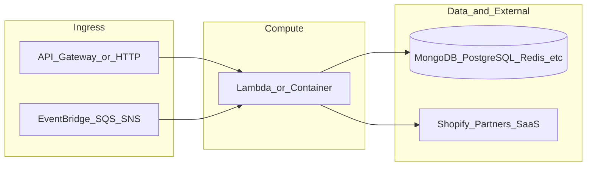

# botnot-lambda-products-ingestion

**Path:** `D:/botnot/botnot-lambda-products-ingestion`  
**Category:** lambdas-business  
**Primary language:** Python  
**Status:** present on disk

## 1. Purpose (2-3 lines)

# Lambda for products ingestion from existing shop (MongoDB)

### Data ingestion by SQS/SNS topic on AWS
1. Once shop installed - the lambda receives shop URL by `shop_url` parameter.
2. Make query to Shopify through API looking for existing products:
    - Getting Shopify's auth token from AWS DynamoDB (after shop setup is complete).
    - Fetching all products of the shop using Shopify API.
3. Save/update products payload as is in `product` collection (MongoDB).

## 2. Tech stack (from manifests and file-type mix)

- **Detected primary language:** Python
- **Top-level layout:** see listing below.

### `README.md`

```
# Lambda for products ingestion from existing shop (MongoDB)

### Data ingestion by SQS/SNS topic on AWS
1. Once shop installed - the lambda receives shop URL by `shop_url` parameter.
2. Make query to Shopify through API looking for existing products:
    - Getting Shopify's auth token from AWS DynamoDB (after shop setup is complete).
    - Fetching all products of the shop using Shopify API.
3. Save/update products payload as is in `product` collection (MongoDB).
```

### `readme.md`

```
# Lambda for products ingestion from existing shop (MongoDB)

### Data ingestion by SQS/SNS topic on AWS
1. Once shop installed - the lambda receives shop URL by `shop_url` parameter.
2. Make query to Shopify through API looking for existing products:
    - Getting Shopify's auth token from AWS DynamoDB (after shop setup is complete).
    - Fetching all products of the shop using Shopify API.
3. Save/update products payload as is in `product` collection (MongoDB).
```

### `Readme.md`

```
# Lambda for products ingestion from existing shop (MongoDB)

### Data ingestion by SQS/SNS topic on AWS
1. Once shop installed - the lambda receives shop URL by `shop_url` parameter.
2. Make query to Shopify through API looking for existing products:
    - Getting Shopify's auth token from AWS DynamoDB (after shop setup is complete).
    - Fetching all products of the shop using Shopify API.
3. Save/update products payload as is in `product` collection (MongoDB).
```

### `package.json`

```
{
  "name": "botnot-lambda-products-ingestion",
  "version": "1.4.2",
  "private": true,
  "scripts": {
    "test": "sst test",
    "start": "sst start",
    "build": "sst build",
    "deploy": "sst deploy",
    "remove": "sst remove"
  },
  "eslintConfig": {
    "extends": [
      "serverless-stack"
    ]
  },
  "dependencies": {
    "@serverless-stack/cli": "0.69.7",
    "@serverless-stack/resources": "0.69.7",
    "@aws-cdk/aws-lambda-python-alpha": "2.15.0-alpha.0",
    "aws-cdk-lib": "2.15.0",
    "ts-node": "^10.9.1",
    "async": ">=2.6.4",
    "jszip": ">=3.7.0"
  }
}
```

### `sst.json`

```
{
  "name": "botnot-lambda-products-ingestion",
  "type": "@serverless-stack/resources",
  "region": "us-east-1",
  "main": "stacks/index.js"
}
```


## 3. Architecture



- **Inbound:** HTTP (API Gateway / ALB), scheduled triggers, queues (SQS/SNS), EventBridge rules, or batch — infer from `stacks/`, `template.yaml`, `sst.config.ts`, or `src/` handlers.
- **Outbound:** databases and external HTTP APIs per layers and `package.json` / Python imports in handlers.
- **IaC pattern:** SST/CDK, SAM/CloudFormation, Pulumi, Helm, Terraform, or raw scripts — see manifests section.

## 4. Key files (auto-discovered)

- **Top-level entries:**

```
.gitignore
.idea
README.md
layer
package.json
seed.yml
src
sst.json
stacks
```

## 5. My contribution / role (evidence from git history — if available)

```text
fe5c1dd 2025-01-28 Merge pull request #13 from BotNotOrg/dev
3f9e0ed 2025-01-17 back hashlib
7622010 2025-01-17 remove old func
1c61ca3 2025-01-17 except exists product from product insert in mongo
536be66 2025-01-17 except exists product from product insert in mongo
d367e3c 2025-01-17 fix false for taxable as default
ee37d33 2025-01-16 fix none for inventory_management obj
a78ad77 2025-01-16 fix none for variant obj
```

_Use commit messages only as hints; corroborate in interviews._

## 6. Notable patterns / snippets


**`src/app.py`**

```python
##
# Copyright 2022 BotNot Inc., or its associates. All Rights Reserved.
#
# Description: Lambda for data persistence on MongoDB
# Autor: Eugenio Grytsenko
##

import hashlib
import json
import yofi_common_libs
from bson import json_util
from libs.filter import product_object_clean
from libs.persist_to_spanner import persist_product_to_spanner
from libs.shopify_graphql import shopify_get_all_products_graphql, format_datetime
import logging
import boto3
import os

logger = logging.getLogger()
logger.setLevel(logging.INFO)

MAX_RETRIES = 10

mongodb_client = yofi_common_libs.YofiMongoClient()

DYNAMODB = boto3.resource('dynamodb')


def get_shopify_api_version():
    client = boto3.client('ssm')
    response = client.get_parameter(Name='shopify_api_version', WithDecryption=False)
    return response.get('Parameter', {}).get('Value', '')


SHOPIFY_API_VERSION = get_shopify_api_version()


def dynamodb_get_shopify_credentials(shop_url):
    table = DYNAMODB.Table(os.environ['SECRETS_DYNAMODB_TABLE'])
    hasItem = table.get_item(Key={'id': shop_url})
    if 'Item' in hasItem:
        return hasItem['Item']
    else:
        return None


def mongoid_product_unique_id(partner_id, shop_url, product_id):
    # Hash formula here
    formula = f'{partner_id}{shop_url}{product_id}'

    # Return unique one way hash
    return hashlib.blake2b(key=formula.encode('utf8'), digest_size=18).hexdigest()


def map_variants(product):
    return json.dumps([
        {
            "admin_graphql_api_id": variant['node']['id'],
            "compare_at_price": variant['node'].get('compareAtPrice', "") or "",
            "created_at": variant['node']['createdAt'] or "",
            "fulfillment_service": variant['node'].get('deliveryProfile', {}).get('id') or "",  # Adjust as needed
            "id": variant['node']['id'].split('/')[-1],
            "inventory_management": variant['node']['inventoryItem'].get('id', "") or "",
            "inventory_policy": variant['node']['inventoryPolicy'] or "",
            "position": variant['node']['position'] or 0,
            "price": variant['node']['price'] o

…(truncated)…
```

**`stacks/index.js`**

```text
/**
 * Copyright 2022 BotNot Inc., or its associates. All Rights Reserved.
 *
 * Description: Lambda for data persistence on MongoDB
 * Autor: Eugenio Grytsenko
 **/

import Stack from './Stack';
import { Runtime, Tracing } from 'aws-cdk-lib/aws-lambda';
import { Duration } from 'aws-cdk-lib';

export default function main(app) {
    // Set default runtime for all functions
    app.setDefaultFunctionProps({
        srcPath: 'src',
        runtime: Runtime.PYTHON_3_9,
        tracing: Tracing.ACTIVE,
        timeout: Duration.seconds(180)
    });

    new Stack(app, 'sst-stack', {
        prefix: 'botnot-lambda',
        name: 'products-ingestion'
    });
}
```


## 7. Metrics / SLO / scale (if available)

_Extract from Airflow DAG params, load tests, README, or CloudFormation `ReservedConcurrentExecutions` when present — not auto-inferred to avoid fabrication._

## 8. Resume bullets (ready-to-paste, English)

- Owned or extended **`botnot-lambda-products-ingestion`** capabilities aligned with **lambdas business** delivery.
- Applied **Python** stack patterns and repository-local IaC/config where present.
- Collaborated on production-grade defaults: structured logging, retries, and least-privilege IAM patterns where applicable.
- Integrated with **Yofi** platform services (data stores, queues, gateways) per dependency manifests in-repo.
- Documented operational expectations (deploy, test, local dev) via README and automation files when available.

## 9. Interview talking points

- What is the main entrypoint and trigger for `botnot-lambda-products-ingestion`?
- How are secrets and non-prod environments separated?
- What failure modes are handled (retries, DLQ, idempotency)?
- How would you observe this service in production (metrics, logs, traces)?
