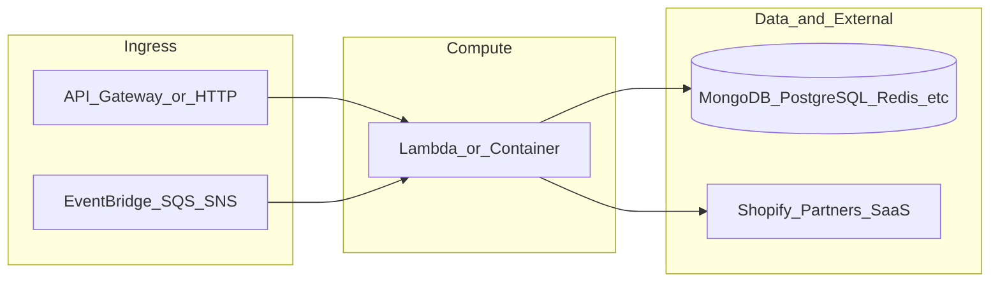

# botnot-lambda-products-processing

**Path:** `D:/botnot/botnot-lambda-products-processing`  
**Category:** lambdas-business  
**Primary language:** Python  
**Status:** present on disk

## 1. Purpose (2-3 lines)

# Lambda for products processing (Shopify webhooks)

### Shopify webhooks processing for product updates
1. Webhook for creation - `products/create`
2. Webhook for updating - `products/update`
3. Webhook for deletion - `products/delete`

## 2. Tech stack (from manifests and file-type mix)

- **Detected primary language:** Python
- **Top-level layout:** see listing below.

### `README.md`

```
# Lambda for products processing (Shopify webhooks)

### Shopify webhooks processing for product updates
1. Webhook for creation - `products/create`
2. Webhook for updating - `products/update`
3. Webhook for deletion - `products/delete`
```

### `readme.md`

```
# Lambda for products processing (Shopify webhooks)

### Shopify webhooks processing for product updates
1. Webhook for creation - `products/create`
2. Webhook for updating - `products/update`
3. Webhook for deletion - `products/delete`
```

### `Readme.md`

```
# Lambda for products processing (Shopify webhooks)

### Shopify webhooks processing for product updates
1. Webhook for creation - `products/create`
2. Webhook for updating - `products/update`
3. Webhook for deletion - `products/delete`
```

### `package.json`

```
{
  "name": "botnot-lambda-products-processing",
  "version": "1.4.2",
  "private": true,
  "scripts": {
    "test": "sst test",
    "start": "sst start",
    "build": "sst build",
    "deploy": "sst deploy",
    "remove": "sst remove"
  },
  "eslintConfig": {
    "extends": [
      "serverless-stack"
    ]
  },
  "dependencies": {
    "@serverless-stack/cli": "0.69.7",
    "@serverless-stack/resources": "0.69.7",
    "@aws-cdk/aws-lambda-python-alpha": "2.15.0-alpha.0",
    "ts-node": "^10.9.1",
    "aws-cdk-lib": "2.15.0",
    "async": ">=2.6.4",
    "jszip": ">=3.7.0"
  }
}
```

### `sst.json`

```
{
  "name": "botnot-lambda-products-processing",
  "type": "@serverless-stack/resources",
  "region": "us-east-1",
  "main": "stacks/index.js"
}
```


## 3. Architecture



- **Inbound:** HTTP (API Gateway / ALB), scheduled triggers, queues (SQS/SNS), EventBridge rules, or batch — infer from `stacks/`, `template.yaml`, `sst.config.ts`, or `src/` handlers.
- **Outbound:** databases and external HTTP APIs per layers and `package.json` / Python imports in handlers.
- **IaC pattern:** SST/CDK, SAM/CloudFormation, Pulumi, Helm, Terraform, or raw scripts — see manifests section.

## 4. Key files (auto-discovered)

- **Top-level entries:**

```
.gitignore
.idea
README.md
get_pypi.sh
layer
node_modules
package-lock.json
package.json
seed.yml
src
sst.json
stacks
```

## 5. My contribution / role (evidence from git history — if available)

```text
629e80a 2023-08-09 Tracing.DISABLED
b35229f 2023-05-12 Merge pull request #9 from BotNotOrg/dev
5821a19 2023-05-12 Fixing raise exception -> logger.error
85100ff 2023-02-22 Merge pull request #8 from BotNotOrg/dev
2931baf 2023-02-22 Added raise to fatal errors
07484fc 2023-02-17 Merge pull request #7 from BotNotOrg/dev
654fce8 2023-02-17 Fixed alert to Slack after error
a09876d 2023-02-17 Merge pull request #6 from BotNotOrg/dev
```

_Use commit messages only as hints; corroborate in interviews._

## 6. Notable patterns / snippets


**`src/app.py`**

```python
##
# Copyright 2022 BotNot Inc., or its associates. All Rights Reserved.
#
# Description: Lambda for data persistence on MongoDB
# Autor: Eugenio Grytsenko
##

import shopify
import boto3
import hashlib

import json
import os

import pymongo
from pymongo.mongo_client import MongoClient
from pymongo.server_api import ServerApi

from function_pattern_matching import case
from bson import json_util

from libs.filter import product_object_clean

import logging

logger = logging.getLogger()
logger.setLevel(logging.INFO)

MONGO_INSTANCE_URL_PRIVATE = os.environ['MONGO_INSTANCE_URL_PRIVATE']

mongodb_client = MongoClient(f'mongodb+srv://{MONGO_INSTANCE_URL_PRIVATE}/?authSource=%24external&authMechanism=MONGODB-AWS&retryWrites=true&w=majority', server_api=ServerApi('1'))
mongo_database = mongodb_client.ecommerce
collection_product = mongo_database['product']


def mongoid_product_unique_id(partner_id, shop_url, product_id):

    # Hash formula here
    formula = f'{partner_id}{shop_url}{product_id}'

    # Return unique one way hash
    return hashlib.blake2b(key=formula.encode('utf8'), digest_size=18).hexdigest()


@case
def process_product(object_id, product, event_type = 'products/create'):

        logger.info(f'PRODUCTS-EVENT: Creating a new product with unique key {object_id} ...')

        try:
            mobj = collection_product.insert_one(product)
            logger.info(f'PRODUCTS-EVENT: Product with unique key {object_id} processed: INSERTED: {mobj.inserted_id}')
        except Exception as e:
            logger.error(f'PRODUCTS-EVENT: Product with unique key {object_id} got error on CREATE: {e}')


@case
def process_product(object_id, product, event_type = 'products/update'):

        logger.info(f'PRODUCTS-EVENT: Updating product with unique key {object_id} ...')

        try:
            mobj = collection_product.replace_one({
                '_id': object_id
            }, product, upsert=True)
            logger.info(f'PRODUCTS-EVENT: Product with unique key {object_id} processed: UPDATED: {mobj.raw_result}')
        except Exception as e:
            logger.error(f'

…(truncated)…
```

**`stacks/index.js`**

```text
/**
 * Copyright 2022 BotNot Inc., or its associates. All Rights Reserved.
 *
 * Description: Lambda for data persistence on MongoDB
 * Autor: Eugenio Grytsenko
 **/

import Stack from './Stack';
import { Runtime, Tracing } from 'aws-cdk-lib/aws-lambda';
import { Duration } from 'aws-cdk-lib';

export default function main(app) {
    // Set default runtime for all functions
    app.setDefaultFunctionProps({
        srcPath: 'src',
        runtime: Runtime.PYTHON_3_9,
        tracing: Tracing.DISABLED,
        timeout: Duration.seconds(30)
    });

    new Stack(app, 'sst-stack', {
        prefix: 'botnot-lambda',
        name: 'products-processing'
    });
}
```


## 7. Metrics / SLO / scale (if available)

_Extract from Airflow DAG params, load tests, README, or CloudFormation `ReservedConcurrentExecutions` when present — not auto-inferred to avoid fabrication._

## 8. Resume bullets (ready-to-paste, English)

- Owned or extended **`botnot-lambda-products-processing`** capabilities aligned with **lambdas business** delivery.
- Applied **Python** stack patterns and repository-local IaC/config where present.
- Collaborated on production-grade defaults: structured logging, retries, and least-privilege IAM patterns where applicable.
- Integrated with **Yofi** platform services (data stores, queues, gateways) per dependency manifests in-repo.
- Documented operational expectations (deploy, test, local dev) via README and automation files when available.

## 9. Interview talking points

- What is the main entrypoint and trigger for `botnot-lambda-products-processing`?
- How are secrets and non-prod environments separated?
- What failure modes are handled (retries, DLQ, idempotency)?
- How would you observe this service in production (metrics, logs, traces)?
