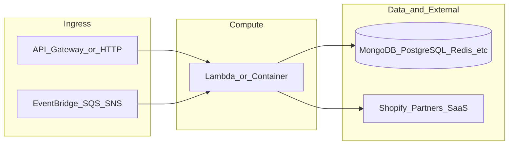

# botnot-lambda-raffles-processing

**Path:** `D:/botnot/botnot-lambda-raffles-processing`  
**Category:** lambdas-business  
**Primary language:** Python  
**Status:** present on disk

## 1. Purpose (2-3 lines)

# Lambda for raffles processing from SeedCMS and similar

### Raffles Processing
1. Read the list of the shops from `ecommerce.raffle_providers` collection.
2. Call SeedCMS API for every one of available shops:
    - API call example: https://us-central1-launches-by-seed.cloudfunctions.net/shopCampaignList?shop=[SHOP_URL]&partner=botnot
    - Fetch all campaigns of the shop and store it in `ecommerce.raffle_providers` collection (example for stashedsf.myshopify.com):
      `{"campaigns":{"data":[{"id":"fVQNeTiRpQcoo9Ot7yH6","campaign_name":"Air Jordan 7 Retro Grade School Retro \"Cardinal\"","start_date":"2022-12-13T16:00:00.000Z","end_date":"2022-12-16T08:01:00.000Z"},{"id":"Ikn56qS7W0QvD8PDQZh4","campaign_name":"Grade School Air Jordan 2 Retro OG \"Chicago\"","

…(truncated)…

## 2. Tech stack (from manifests and file-type mix)

- **Detected primary language:** Python
- **Top-level layout:** see listing below.

### `README.md`

```
# Lambda for raffles processing from SeedCMS and similar

### Raffles Processing
1. Read the list of the shops from `ecommerce.raffle_providers` collection.
2. Call SeedCMS API for every one of available shops:
    - API call example: https://us-central1-launches-by-seed.cloudfunctions.net/shopCampaignList?shop=[SHOP_URL]&partner=botnot
    - Fetch all campaigns of the shop and store it in `ecommerce.raffle_providers` collection (example for stashedsf.myshopify.com):
      `{"campaigns":{"data":[{"id":"fVQNeTiRpQcoo9Ot7yH6","campaign_name":"Air Jordan 7 Retro Grade School Retro \"Cardinal\"","start_date":"2022-12-13T16:00:00.000Z","end_date":"2022-12-16T08:01:00.000Z"},{"id":"Ikn56qS7W0QvD8PDQZh4","campaign_name":"Grade School Air Jordan 2 Retro OG \"Chicago\"","start_date":"2022-12-23T15:00:00.000Z","end_date":"2022-12-29T08:01:00.000Z"},{"id":"jMswnonV3AHmdFd7XAg3","campaign_name":"Air Jordan 2 Retro OG \"Chicago\"","start_date":"2022-12-23T15:00:00.000Z","end_date":"2022-12-29T08:01:00.000Z"}]}}`
3. Update `ecommerce.raffles` collection with details from above. Match `campaign_name` from SeedCMS payload with `product_name` in our MongoDB (fuzzywuzzy).
```

### `readme.md`

```
# Lambda for raffles processing from SeedCMS and similar

### Raffles Processing
1. Read the list of the shops from `ecommerce.raffle_providers` collection.
2. Call SeedCMS API for every one of available shops:
    - API call example: https://us-central1-launches-by-seed.cloudfunctions.net/shopCampaignList?shop=[SHOP_URL]&partner=botnot
    - Fetch all campaigns of the shop and store it in `ecommerce.raffle_providers` collection (example for stashedsf.myshopify.com):
      `{"campaigns":{"data":[{"id":"fVQNeTiRpQcoo9Ot7yH6","campaign_name":"Air Jordan 7 Retro Grade School Retro \"Cardinal\"","start_date":"2022-12-13T16:00:00.000Z","end_date":"2022-12-16T08:01:00.000Z"},{"id":"Ikn56qS7W0QvD8PDQZh4","campaign_name":"Grade School Air Jordan 2 Retro OG \"Chicago\"","start_date":"2022-12-23T15:00:00.000Z","end_date":"2022-12-29T08:01:00.000Z"},{"id":"jMswnonV3AHmdFd7XAg3","campaign_name":"Air Jordan 2 Retro OG \"Chicago\"","start_date":"2022-12-23T15:00:00.000Z","end_date":"2022-12-29T08:01:00.000Z"}]}}`
3. Update `ecommerce.raffles` collection with details from above. Match `campaign_name` from SeedCMS payload with `product_name` in our MongoDB (fuzzywuzzy).
```

### `Readme.md`

```
# Lambda for raffles processing from SeedCMS and similar

### Raffles Processing
1. Read the list of the shops from `ecommerce.raffle_providers` collection.
2. Call SeedCMS API for every one of available shops:
    - API call example: https://us-central1-launches-by-seed.cloudfunctions.net/shopCampaignList?shop=[SHOP_URL]&partner=botnot
    - Fetch all campaigns of the shop and store it in `ecommerce.raffle_providers` collection (example for stashedsf.myshopify.com):
      `{"campaigns":{"data":[{"id":"fVQNeTiRpQcoo9Ot7yH6","campaign_name":"Air Jordan 7 Retro Grade School Retro \"Cardinal\"","start_date":"2022-12-13T16:00:00.000Z","end_date":"2022-12-16T08:01:00.000Z"},{"id":"Ikn56qS7W0QvD8PDQZh4","campaign_name":"Grade School Air Jordan 2 Retro OG \"Chicago\"","start_date":"2022-12-23T15:00:00.000Z","end_date":"2022-12-29T08:01:00.000Z"},{"id":"jMswnonV3AHmdFd7XAg3","campaign_name":"Air Jordan 2 Retro OG \"Chicago\"","start_date":"2022-12-23T15:00:00.000Z","end_date":"2022-12-29T08:01:00.000Z"}]}}`
3. Update `ecommerce.raffles` collection with details from above. Match `campaign_name` from SeedCMS payload with `product_name` in our MongoDB (fuzzywuzzy).
```

### `package.json`

```
{
  "name": "botnot-lambda-raffles-processing",
  "version": "1.4.2",
  "private": true,
  "scripts": {
    "test": "sst test",
    "start": "sst start",
    "build": "sst build",
    "deploy": "sst deploy",
    "remove": "sst remove"
  },
  "eslintConfig": {
    "extends": [
      "serverless-stack"
    ]
  },
  "dependencies": {
    "@serverless-stack/cli": "0.69.7",
    "@serverless-stack/resources": "0.69.7",
    "@aws-cdk/aws-lambda-python-alpha": "2.15.0-alpha.0",
    "aws-cdk-lib": "2.15.0",
    "async": ">=2.6.4",
    "jszip": ">=3.7.0",
    "ts-node": "^7.0.1"
  }
}
```

### `sst.json`

```
{
  "name": "botnot-lambda-raffles-processing",
  "type": "@serverless-stack/resources",
  "region": "us-east-1",
  "main": "stacks/index.js"
}
```


## 3. Architecture



- **Inbound:** HTTP (API Gateway / ALB), scheduled triggers, queues (SQS/SNS), EventBridge rules, or batch — infer from `stacks/`, `template.yaml`, `sst.config.ts`, or `src/` handlers.
- **Outbound:** databases and external HTTP APIs per layers and `package.json` / Python imports in handlers.
- **IaC pattern:** SST/CDK, SAM/CloudFormation, Pulumi, Helm, Terraform, or raw scripts — see manifests section.

## 4. Key files (auto-discovered)

- **Top-level entries:**

```
.gitignore
.idea
README.md
layer
node_modules
package-lock.json
package.json
seed.yml
src
sst.json
stacks
```

## 5. My contribution / role (evidence from git history — if available)

```text
9b1ba05 2024-08-01 feat: use yofi new mongo
bded0e8 2024-05-31 add detection DocID options for get campaign_id from seed
bd8b914 2023-12-10 fix date format in is_active
b4609ad 2023-12-08 add request into requirements
4ae829a 2023-12-08 change convert data string - datetime to parsing
89328d4 2023-12-06 removed timezone from start date
5045965 2023-12-05 fix do not mach format %Y-%m-%dT%H:%M:%S.%fZ for end date
db3eaea 2023-09-05 Merge pull request #22 from BotNotOrg/remove-unused-code
```

_Use commit messages only as hints; corroborate in interviews._

## 6. Notable patterns / snippets


**`src/app.py`**

```python
##
# Copyright 2023 BotNot Inc., or its associates. All Rights Reserved.
#
# Description: Lambda for data persistence on MongoDB
# Autor: Eugenio Grytsenko
##
# Refactoring: Vitaly 01/2023
import requests
import os
from typing import Union, Dict
import hashlib
import yofi_common_libs
from pymongo import UpdateOne, InsertOne
import logging
from helper_utils import retry_url_call
import datetime
from dateutil import parser

logger = logging.getLogger()
logger.setLevel(logging.INFO)

mongodb_client = yofi_common_libs.YofiMongoClient()
MONGO_ECOMMERCE = mongodb_client.ecommerce
SEED = "seed"
DEFAULT_PIC_URL = "https://d1nhio0ox7pgb.cloudfront.net/_img/v_collection_png/512x512/shadow/box_white_surprise.png"


def mongoid_raffles_unique_id(data: Union[Dict]):
    if 'partner_id' not in data or 'shop_url' not in data or \
            'campaign_id' not in data or 'provider_id' not in data:
        return None
    partner_id = str(data['partner_id'])
    shop_url = str(data['shop_url'])
    campaign_id = str(data['campaign_id'])
    provider_id = str(data['provider_id'])
    # Hash formula here
    formula = f'{partner_id}{shop_url}{campaign_id}{provider_id}'
    # Return unique one way hash
    return hashlib.blake2b(key=formula.encode('utf8'), digest_size=18).hexdigest()


@retry_url_call(10, 1)
def get_campaigns_data(url: str):
    response = requests.get(url)
    return response


def collect_src_values(obj, src_values):
    """
    Recursively collect all values of the "src" keys in a JSON object.
    """
    if isinstance(obj, dict):
        for key, value in obj.items():
            if key == "src":
                src_values.append(value)
            elif isinstance(value, (dict, list)):
                collect_src_values(value, src_values)
    elif isinstance(obj, list):
        for item in obj:
            collect_src_values(item, src_values)
    return src_values


def url_search(product: dict) -> tuple:
    is_unknown_product = True
    raffle_image_url = DEFAULT_PIC_URL
    src_values = collect_src_values(product, [])
    for url in src_values:
        response = requests

…(truncated)…
```

**`stacks/index.js`**

```text
/**
 * Copyright 2023 BotNot Inc., or its associates. All Rights Reserved.
 *
 * Description: Lambda for data persistence on MongoDB
 * Autor: Eugenio Grytsenko
 **/

import Stack from './Stack';
import { Runtime, Tracing } from 'aws-cdk-lib/aws-lambda';
import { Duration } from 'aws-cdk-lib';

export default function main(app) {
    // Set default runtime for all functions
    app.setDefaultFunctionProps({
        srcPath: 'src',
        runtime: Runtime.PYTHON_3_9,
        tracing: Tracing.DISABLED,
        timeout: Duration.seconds(180)
    });

    new Stack(app, 'sst-stack', {
        prefix: 'botnot-lambda',
        name: 'raffles-processing'
    });
}
```


## 7. Metrics / SLO / scale (if available)

_Extract from Airflow DAG params, load tests, README, or CloudFormation `ReservedConcurrentExecutions` when present — not auto-inferred to avoid fabrication._

## 8. Resume bullets (ready-to-paste, English)

- Owned or extended **`botnot-lambda-raffles-processing`** capabilities aligned with **lambdas business** delivery.
- Applied **Python** stack patterns and repository-local IaC/config where present.
- Collaborated on production-grade defaults: structured logging, retries, and least-privilege IAM patterns where applicable.
- Integrated with **Yofi** platform services (data stores, queues, gateways) per dependency manifests in-repo.
- Documented operational expectations (deploy, test, local dev) via README and automation files when available.

## 9. Interview talking points

- What is the main entrypoint and trigger for `botnot-lambda-raffles-processing`?
- How are secrets and non-prod environments separated?
- What failure modes are handled (retries, DLQ, idempotency)?
- How would you observe this service in production (metrics, logs, traces)?
