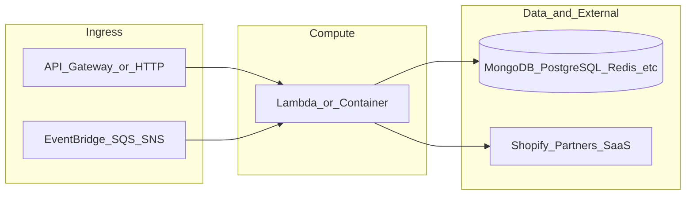

# botnot-lambda-recursive-order-ingestion

**Path:** `D:/botnot/botnot-lambda-recursive-order-ingestion`  
**Category:** lambdas-business  
**Primary language:** Python  
**Status:** present on disk

## 1. Purpose (2-3 lines)

# Shopify Interaction Service

Works with SNS to push to pipeline and export to Shopify

## 2. Tech stack (from manifests and file-type mix)

- **Detected primary language:** Python
- **Top-level layout:** see listing below.

### `README.md`

```
# Shopify Interaction Service

Works with SNS to push to pipeline and export to Shopify
```

### `readme.md`

```
# Shopify Interaction Service

Works with SNS to push to pipeline and export to Shopify
```

### `Readme.md`

```
# Shopify Interaction Service

Works with SNS to push to pipeline and export to Shopify
```

### `package.json`

```
{
  "engines": {
    "node": ">=18.0.0",
    "npm": "9.5.0"
  },
  "name": "yofi-shopify-interaction-service",
  "version": "0.1.0",
  "private": true,
  "scripts": {
    "test": "sst test",
    "start": "sst start",
    "build": "sst build",
    "deploy": "sst deploy",
    "remove": "sst remove",
    "diff": "sst diff"
  },
  "eslintConfig": {
    "extends": [
      "serverless-stack"
    ]
  },
  "devDependencies": {
    "@tsconfig/node16": "1.0.3",
    "typescript": "^4.8.4",
    "sst": "2.48.5",
    "constructs": "10.3.0",
    "@aws-cdk/aws-lambda-python-alpha": "2.132.1-alpha.0",
    "aws-cdk-lib": "2.177.0",
    "ts-node": "^10.9.1",
    "async": ">=2.6.4",
    "jszip": ">=3.8.0"
  }
}
```

### `sst.config.ts`

```
import type { SSTConfig } from "sst"
import { Tracing } from 'aws-cdk-lib/aws-lambda';
// @ts-ignore
import {ShopifyInteractionServiceStack} from "./stacks/ManagerStack.ts"

export default {
  config(input) {
    return {
      name: "yofi-backend-lambda-shopify-interaction-service",
      region: "us-east-1",
      profile: input.stage === "prod" ? "prod" : "dev",
    }
  },
  stacks(app) {
    app.setDefaultFunctionProps({
        // handler: 'src/lambda.handler',
        runtime: 'python3.9',
        tracing: "disabled",
        timeout: 30
    })

    app
        .stack(ShopifyInteractionServiceStack, {id: "sst-stack"})
  },
} satisfies SSTConfig
```

### `Makefile`

```
all:	stack-deploy
all-prod: stack-deploy-prod

install-deps:
	npm install

stack-build: install-deps
	npm run build -- --stage dev --region us-east-1 --profile dev

stack-test: stack-build
	echo npm run test

stack-deploy: stack-test
	npm run deploy -- --stage dev --region us-east-1 --profile dev

stack-build-prod: install-deps
	npm run build -- --stage prod --region us-east-1 --profile prod

stack-test-prod: stack-build-prod
	echo npm run test

stack-deploy-prod: stack-test-prod
	npm run deploy -- --stage prod --region us-east-1 --profile prod

clean:
	rm -rf .build build
	rm -rf .pytest_cache cdk.out
	rm -rf .sst node_modules
	rm -rf src/__pycache__
	rm -rf test/__pycache__
```


## 3. Architecture



- **Inbound:** HTTP (API Gateway / ALB), scheduled triggers, queues (SQS/SNS), EventBridge rules, or batch — infer from `stacks/`, `template.yaml`, `sst.config.ts`, or `src/` handlers.
- **Outbound:** databases and external HTTP APIs per layers and `package.json` / Python imports in handlers.
- **IaC pattern:** SST/CDK, SAM/CloudFormation, Pulumi, Helm, Terraform, or raw scripts — see manifests section.

## 4. Key files (auto-discovered)

- **Top-level entries:**

```
.env
.github
.gitignore
.idea
Makefile
README.md
get_pypi.sh
init-dev-tools.sh
layer
package.json
pytest.ini
seed.yml
src
sst.config.ts
stacks
test
```

## 5. My contribution / role (evidence from git history — if available)

```text
22be024 2025-07-28 fix title
5122f96 2025-07-28 fix code
e6480b6 2025-07-28 sst: 2.48.5,
47457e2 2025-07-28 Merge pull request #69 from BotNotOrg/features/discount_allocation
93585aa 2025-07-28 sst 2.49.3
5cee394 2025-07-28 Merge pull request #68 from BotNotOrg/features/discount_allocation
4a739d1 2025-07-28 add code
cef9ac4 2025-05-13 add line_items to fulfilment same in rest
```

_Use commit messages only as hints; corroborate in interviews._

## 6. Notable patterns / snippets

_No snippet candidates matched (handler.py / stack.ts / template.yaml etc.). Expand manually after opening the repo._

## 7. Metrics / SLO / scale (if available)

_Extract from Airflow DAG params, load tests, README, or CloudFormation `ReservedConcurrentExecutions` when present — not auto-inferred to avoid fabrication._

## 8. Resume bullets (ready-to-paste, English)

- Owned or extended **`botnot-lambda-recursive-order-ingestion`** capabilities aligned with **lambdas business** delivery.
- Applied **Python** stack patterns and repository-local IaC/config where present.
- Collaborated on production-grade defaults: structured logging, retries, and least-privilege IAM patterns where applicable.
- Integrated with **Yofi** platform services (data stores, queues, gateways) per dependency manifests in-repo.
- Documented operational expectations (deploy, test, local dev) via README and automation files when available.

## 9. Interview talking points

- What is the main entrypoint and trigger for `botnot-lambda-recursive-order-ingestion`?
- How are secrets and non-prod environments separated?
- What failure modes are handled (retries, DLQ, idempotency)?
- How would you observe this service in production (metrics, logs, traces)?
