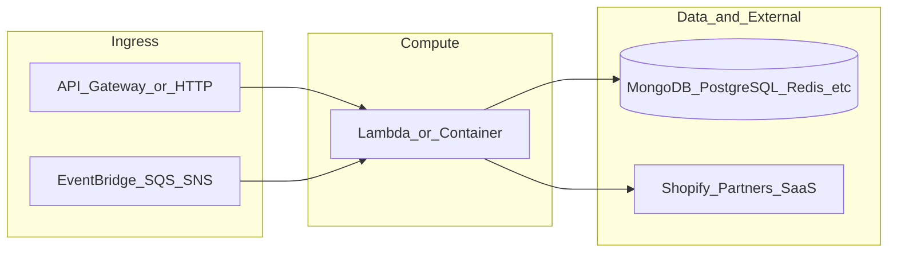

# botnot-lambda-update-processing

**Path:** `D:/botnot/botnot-lambda-update-processing`  
**Category:** lambdas-business  
**Primary language:** Python  
**Status:** present on disk

## 1. Purpose (2-3 lines)

# Getting Started with Serverless Stack (SST)

This project was bootstrapped with [Create Serverless Stack](https://docs.serverless-stack.com/packages/create-serverless-stack).

Start by installing the dependencies.

```bash
$ npm install
```

## 2. Tech stack (from manifests and file-type mix)

- **Detected primary language:** Python
- **Top-level layout:** see listing below.

### `README.md`

```
# Getting Started with Serverless Stack (SST)

This project was bootstrapped with [Create Serverless Stack](https://docs.serverless-stack.com/packages/create-serverless-stack).

Start by installing the dependencies.

```bash
$ npm install
```

## Commands

### `npm run start`

Starts the local Lambda development environment.

### `npm run build`

Build your app and synthesize your stacks.

Generates a `.build/` directory with the compiled files and a `.build/cdk.out/` directory with the synthesized CloudFormation stacks.

### `npm run deploy [stack]`

Deploy all your stacks to AWS. Or optionally deploy, a specific stack.

### `npm run remove [stack]`

Remove all your stacks and all of their resources from AWS. Or optionally removes, a specific stack.

### `npm run test`

Runs your tests using Jest. Takes all the [Jest CLI options](https://jestjs.io/docs/en/cli).

## Documentation

Learn more about the Serverless Stack.
- [Docs](https://docs.serverless-stack.com)
- [@serverless-stack/cli](https://docs.serverless-stack.com/packages/cli)
- [@serverless-stack/resources](https://docs.serverless-stack.com/packages/resources)

## Community

[Follow us on Twitter](https://twitter.com/ServerlessStack) or [post on our forums](https://discourse.serverless-stack.com).
```

### `readme.md`

```
# Getting Started with Serverless Stack (SST)

This project was bootstrapped with [Create Serverless Stack](https://docs.serverless-stack.com/packages/create-serverless-stack).

Start by installing the dependencies.

```bash
$ npm install
```

## Commands

### `npm run start`

Starts the local Lambda development environment.

### `npm run build`

Build your app and synthesize your stacks.

Generates a `.build/` directory with the compiled files and a `.build/cdk.out/` directory with the synthesized CloudFormation stacks.

### `npm run deploy [stack]`

Deploy all your stacks to AWS. Or optionally deploy, a specific stack.

### `npm run remove [stack]`

Remove all your stacks and all of their resources from AWS. Or optionally removes, a specific stack.

### `npm run test`

Runs your tests using Jest. Takes all the [Jest CLI options](https://jestjs.io/docs/en/cli).

## Documentation

Learn more about the Serverless Stack.
- [Docs](https://docs.serverless-stack.com)
- [@serverless-stack/cli](https://docs.serverless-stack.com/packages/cli)
- [@serverless-stack/resources](https://docs.serverless-stack.com/packages/resources)

## Community

[Follow us on Twitter](https://twitter.com/ServerlessStack) or [post on our forums](https://discourse.serverless-stack.com).
```

### `Readme.md`

```
# Getting Started with Serverless Stack (SST)

This project was bootstrapped with [Create Serverless Stack](https://docs.serverless-stack.com/packages/create-serverless-stack).

Start by installing the dependencies.

```bash
$ npm install
```

## Commands

### `npm run start`

Starts the local Lambda development environment.

### `npm run build`

Build your app and synthesize your stacks.

Generates a `.build/` directory with the compiled files and a `.build/cdk.out/` directory with the synthesized CloudFormation stacks.

### `npm run deploy [stack]`

Deploy all your stacks to AWS. Or optionally deploy, a specific stack.

### `npm run remove [stack]`

Remove all your stacks and all of their resources from AWS. Or optionally removes, a specific stack.

### `npm run test`

Runs your tests using Jest. Takes all the [Jest CLI options](https://jestjs.io/docs/en/cli).

## Documentation

Learn more about the Serverless Stack.
- [Docs](https://docs.serverless-stack.com)
- [@serverless-stack/cli](https://docs.serverless-stack.com/packages/cli)
- [@serverless-stack/resources](https://docs.serverless-stack.com/packages/resources)

## Community

[Follow us on Twitter](https://twitter.com/ServerlessStack) or [post on our forums](https://discourse.serverless-stack.com).
```

### `package.json`

```
{
  "name": "billing-update-processing",
  "version": "0.1.0",
  "private": true,
  "scripts": {
    "test": "sst test",
    "start": "sst start",
    "build": "sst build",
    "deploy": "sst deploy",
    "remove": "sst remove"
  },
  "eslintConfig": {
    "extends": [
      "serverless-stack"
    ]
  },
  "dependencies": {
    "@serverless-stack/cli": "0.69.5",
    "@serverless-stack/resources": "0.69.5",
    "@aws-cdk/aws-lambda-python-alpha": "2.15.0-alpha.0",
    "aws-cdk-lib": "2.15.0",
    "async": ">=2.6.4",
    "jszip": ">=3.7.0"
  }
}
```

### `sst.json`

```
{
  "name": "botnot-lambda-update-processing",
  "type": "@serverless-stack/resources",
  "region": "us-east-1",
  "main": "stacks/index.js"
}
```


## 3. Architecture



- **Inbound:** HTTP (API Gateway / ALB), scheduled triggers, queues (SQS/SNS), EventBridge rules, or batch — infer from `stacks/`, `template.yaml`, `sst.config.ts`, or `src/` handlers.
- **Outbound:** databases and external HTTP APIs per layers and `package.json` / Python imports in handlers.
- **IaC pattern:** SST/CDK, SAM/CloudFormation, Pulumi, Helm, Terraform, or raw scripts — see manifests section.

## 4. Key files (auto-discovered)

- **Top-level entries:**

```
.env
.github
.gitignore
.idea
README.md
cdk.context.json
events
layer
package-lock.json
package.json
rds_layer
src
sst.json
stacks
test
```

## 5. My contribution / role (evidence from git history — if available)

```text
d6d6727 2022-05-19 ensure things are actually saved; weird database issue
6add6fa 2022-05-19 ensure things are actually saved; weird database issue
753283b 2022-05-19 ensure things are actually saved; weird database issue
39c24d3 2022-05-19 ensure things are actually saved; weird database issue
4b89b69 2022-05-19 ensure things are actually saved
dae9846 2022-05-19 ensure things are actually saved
a3a46a2 2022-05-19 ensure things are actually saved
f3835fe 2022-05-19 ugh
```

_Use commit messages only as hints; corroborate in interviews._

## 6. Notable patterns / snippets


**`src/app.py`**

```python
import json
from libs.aurora import AuroraDB
from db_models.all import Order
from stream.neptune_topic import push_to_downstream
from utils.default_logging import logger
from aws_xray_sdk.core import patch_all
from aws_xray_sdk.core import xray_recorder
from typing import Dict
from decimal import Decimal
from datetime import datetime as dt

from elastic_search.update_es import update_order, save_refund_es, save_order_rds


patch_all()


def primary_function(order):
  #  Connecting to aurora db
  #push_to_downstream(order)
  db = AuroraDB("shopify")
  #a comment for the fuckedityness of aws bullshits
  save_order_rds(db, order)
  db.close()


@xray_recorder.capture('error_message')
def lambda_handler(event, context):
  #make loop
  logger.info('processing event -> %s', json.dumps(event))
  if 'Records' not in event and 'body' not in event['Records']:
    logger.error("No record found in event")
    return {
      "statusCode": 500,
      "body": json.dumps({"message": "No record found in event"})
    }
  for bodys in event['Records']:
    try:
      body = json.loads(bodys["body"])
      # todo: try removing newlines (don't understand why they are part of message...)
      #body = body["Message"] if "Message" in body else body
      #body = body["data"] if "data" in body else body
      body = body["Message"] if "Message" in body else body
      if isinstance(body, str):
        body = json.loads(body)
      body = body["data"] if "data" in body else body
      if isinstance(body, str):
        body = json.loads(body)
      primary_function(order=body)
    except Exception as e:
      logger.exception(e)
      logger.error("failed to process for reasons?")
      return {
        "statusCode": 500,
        "body": json.dumps({"message": "Error processing"})
      }
  return {
      "statusCode": 200,
      "body": json.dumps(
          {
              "message": "Order processed successfully",
          }
      ),
  }


def lambda_handler_mend(event, _):
  logger.warning(f'Update Event: {event}')
  updated_order_ids = []

  for record in event['Records']:
    message = json.

…(truncated)…
```

**`stacks/index.js`**

```text
import MyStack from "./MyStack";

export default function main(app) {
  // Set default runtime for all functions
  app.setDefaultFunctionProps({
    runtime: "python3.8"
  });

  new MyStack(app, "sst-stack");

  // Add more stacks
}
```


## 7. Metrics / SLO / scale (if available)

_Extract from Airflow DAG params, load tests, README, or CloudFormation `ReservedConcurrentExecutions` when present — not auto-inferred to avoid fabrication._

## 8. Resume bullets (ready-to-paste, English)

- Owned or extended **`botnot-lambda-update-processing`** capabilities aligned with **lambdas business** delivery.
- Applied **Python** stack patterns and repository-local IaC/config where present.
- Collaborated on production-grade defaults: structured logging, retries, and least-privilege IAM patterns where applicable.
- Integrated with **Yofi** platform services (data stores, queues, gateways) per dependency manifests in-repo.
- Documented operational expectations (deploy, test, local dev) via README and automation files when available.

## 9. Interview talking points

- What is the main entrypoint and trigger for `botnot-lambda-update-processing`?
- How are secrets and non-prod environments separated?
- What failure modes are handled (retries, DLQ, idempotency)?
- How would you observe this service in production (metrics, logs, traces)?
