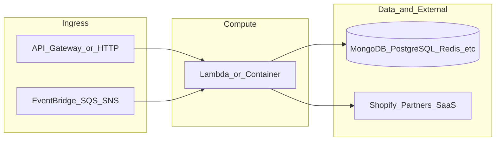

# botnot-lambda-ml-bot-detection

**Path:** `D:/botnot/botnot-lambda-ml-bot-detection`  
**Category:** ml-bot-detection  
**Primary language:** Python  
**Status:** present on disk

## 1. Purpose (2-3 lines)

# AWS Lambda for billing quota validation
[](https://console.seed.run/andrii-stetsenko/botnot-lambda-ml-bot-detection)
[](https://console.seed.run/andrii-stetsenko/botnot-lambda-ml-bot-detection)

Autor: Abror, Andrew, Michael
Last updated: 2022-04-26
How To...: Please, just use Makefile, ok?

## 2. Tech stack (from manifests and file-type mix)

- **Detected primary language:** Python
- **Top-level layout:** see listing below.

### `README.md`

```
# AWS Lambda for billing quota validation
[](https://console.seed.run/andrii-stetsenko/botnot-lambda-ml-bot-detection)
[](https://console.seed.run/andrii-stetsenko/botnot-lambda-ml-bot-detection)

Autor: Abror, Andrew, Michael
Last updated: 2022-04-26
How To...: Please, just use Makefile, ok?
```

### `readme.md`

```
# AWS Lambda for billing quota validation
[](https://console.seed.run/andrii-stetsenko/botnot-lambda-ml-bot-detection)
[](https://console.seed.run/andrii-stetsenko/botnot-lambda-ml-bot-detection)

Autor: Abror, Andrew, Michael
Last updated: 2022-04-26
How To...: Please, just use Makefile, ok?
```

### `Readme.md`

```
# AWS Lambda for billing quota validation
[](https://console.seed.run/andrii-stetsenko/botnot-lambda-ml-bot-detection)
[](https://console.seed.run/andrii-stetsenko/botnot-lambda-ml-bot-detection)

Autor: Abror, Andrew, Michael
Last updated: 2022-04-26
How To...: Please, just use Makefile, ok?
```

### `package.json`

```
{
  "name": "ml-bot-detection",
  "version": "2.0.1",
  "private": true,
  "scripts": {
    "test": "sst test",
    "start": "sst start",
    "build": "sst build",
    "deploy": "sst deploy",
    "remove": "sst remove"
  },
  "eslintConfig": {
    "extends": [
      "serverless-stack"
    ]
  },
  "dependencies": {
    "@aws-cdk/aws-lambda-python-alpha": "2.15.0-alpha.0",
    "@serverless-stack/cli": "0.69.7",
    "@serverless-stack/resources": "0.69.7",
    "ts-node": "^10.9.1",
    "async": ">=2.6.4",
    "aws-cdk-lib": "2.15.0",
    "jszip": ">=3.7.0"
  }
}
```

### `sst.json`

```
{
  "name": "botnot-lambda-ml-bot-detection",
  "type": "@serverless-stack/resources",
  "region": "us-east-1",
  "main": "stacks/index.js"
}
```

### `Makefile`

```
all:	stack-deploy
all-prod: stack-deploy-prod

install-deps:
	npm install

stack-build: install-deps
	npm run build -- --stage dev --region us-east-1

stack-test: stack-build
	echo npm run test

stack-deploy: stack-test
	npm run deploy -- --stage dev --region us-east-1

stack-build-prod: install-deps
	npm run build -- --stage prod --region us-east-1 --profile prod

stack-test-prod: stack-build-prod
	echo npm run test

stack-deploy-prod: stack-test-prod
	npm run deploy -- --stage prod --region us-east-1 --profile prod

clean:
	rm -rf .build build
	rm -rf .pytest_cache cdk.out
	rm -rf .sst node_modules
	rm -rf src/__pycache__
	rm -rf test/__pycache__
```


## 3. Architecture



- **Inbound:** HTTP (API Gateway / ALB), scheduled triggers, queues (SQS/SNS), EventBridge rules, or batch — infer from `stacks/`, `template.yaml`, `sst.config.ts`, or `src/` handlers.
- **Outbound:** databases and external HTTP APIs per layers and `package.json` / Python imports in handlers.
- **IaC pattern:** SST/CDK, SAM/CloudFormation, Pulumi, Helm, Terraform, or raw scripts — see manifests section.

## 4. Key files (auto-discovered)

- **Top-level entries:**

```
.gitattributes
.gitignore
.idea
Makefile
README.md
docs
get_pypi.sh
layer
package.json
pytest.ini
seed.yml
src
sst.json
stacks
test
```

## 5. My contribution / role (evidence from git history — if available)

```text
5e3547b 2023-08-09 Tracing.DISABLED
c01cb3f 2023-08-08 remove Tracing
c27ba72 2023-05-11 add SP to conservative
8a9c39c 2023-05-11 revert conservative list
ad50ccc 2023-05-11 Add conservative new shops
66e9530 2023-05-08 Merge pull request #122 from BotNotOrg/test-only
a2e8166 2023-05-08 add yofiscakes back in
cacccc0 2023-05-08 Merge pull request #121 from BotNotOrg/test-only
```

_Use commit messages only as hints; corroborate in interviews._

## 6. Notable patterns / snippets


**`src/app.py`**

```python
import os
import json
import boto3
from util import (
    fetch_order_from_mongo,
    derive_features,
    EnhancedJSONEncoder,
    get_discount_abuse_score,
    is_blacklisted,
    is_whitelisted,
    is_bad_actor,
    # get_shadow_discount_abuse_score,
    mongodb_client
)
import order_cluster
from log import logger
from trust_and_risk_messages import (
    messages as trust_and_risk_messages,
    get_valid_trusts_and_risks_for_validations,
)

risk_messages = trust_and_risk_messages["risks"]
risk_message_mapping = {x["field"]: x["message"] for x in risk_messages}
trust_messages = trust_and_risk_messages["trusts"]
trust_message_mapping = {x["field"]: x["message"] for x in trust_messages}

ENDPOINT_NAME = os.environ["ENDPOINT_NAME"]
# CONSERVATIVE_ENDPOINT_NAME = os.environ["CONSERVATIVE_ENDPOINT_NAME"]
SHADOW_ENDPOINT_NAME = "botnot-botdetection-v2-endpoint"
SHADOW_DISCOUNT_ABUSE = os.environ["ENDPOINT_DISCOUNT_ABUSE"]
SHADOW_REFUND = os.environ["ENDPOINT_REFUND_MODEL"]

runtime = boto3.client("runtime.sagemaker")

with open("./conservative_users.json", "r") as f:
    conservative_list = json.loads(f.read())


def lambda_handler(event, context):
    logger.info("event: {}".format(json.dumps(event)))

    prediction_results = []

    for rec in event["Records"]:
        msg = json.loads(rec["body"])
        prediction = predict_for_order(msg)
        prediction_results.append(prediction)

    return prediction_results


def push_to_sns(
    order_id,
    bot_status,
    shadow_bot_status,
    discount_abuse,
    # shadow_discount_abuse,
    # shadow_refund_probability,
    msg,
) -> dict:
    client = boto3.client("sns")
    sns = {
        "order_id": order_id,
        "ml_model_id": 1,
        "bot_status": bot_status["is_bot_score"],
        "risks": bot_status["risks"],
        "trusts": bot_status["trusts"],
        "shadow_bot_status": shadow_bot_status["is_bot_score"] if shadow_bot_status else None,
        # "shadow_discount_abuse": shadow_discount_abuse,
        # "shadow_refund_probability": shadow_refund_probability,
        "discount_abuse": discount_abuse,
   

…(truncated)…
```

**`stacks/index.js`**

```text
import {MyStack} from './MyStack';
import {Tracing} from 'aws-cdk-lib/aws-lambda';

export default function main(app) {
    // Set default runtime for all functions
    app.setDefaultFunctionProps({
        tracing: Tracing.DISABLED
    });

    new MyStack(app, 'sst-stack', {functionName: "botnot-backend-ml-bot-detection-lambda"});
}
```


## 7. Metrics / SLO / scale (if available)

_Extract from Airflow DAG params, load tests, README, or CloudFormation `ReservedConcurrentExecutions` when present — not auto-inferred to avoid fabrication._

## 8. Resume bullets (ready-to-paste, English)

- Owned or extended **`botnot-lambda-ml-bot-detection`** capabilities aligned with **ml bot detection** delivery.
- Applied **Python** stack patterns and repository-local IaC/config where present.
- Collaborated on production-grade defaults: structured logging, retries, and least-privilege IAM patterns where applicable.
- Integrated with **Yofi** platform services (data stores, queues, gateways) per dependency manifests in-repo.
- Documented operational expectations (deploy, test, local dev) via README and automation files when available.

## 9. Interview talking points

- What is the main entrypoint and trigger for `botnot-lambda-ml-bot-detection`?
- How are secrets and non-prod environments separated?
- What failure modes are handled (retries, DLQ, idempotency)?
- How would you observe this service in production (metrics, logs, traces)?
