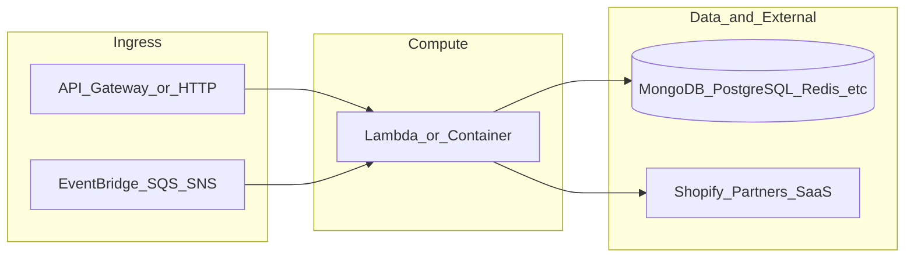

# yofi-lambda-analytics-pipeline-trigger

**Path:** `D:/botnot/yofi-lambda-analytics-pipeline-trigger`  
**Category:** ml-bot-detection  
**Primary language:** Python  
**Status:** present on disk

## 1. Purpose (2-3 lines)

# yofi-lambda-analytics-pipeline-trigger

Yofi lambda function for instantiating a Dataproc Workflow template that calculates LTV and Customer Segmentation.

## 2. Tech stack (from manifests and file-type mix)

- **Detected primary language:** Python
- **Top-level layout:** see listing below.

### `README.md`

```
# yofi-lambda-analytics-pipeline-trigger

Yofi lambda function for instantiating a Dataproc Workflow template that calculates LTV and Customer Segmentation.
```

### `readme.md`

```
# yofi-lambda-analytics-pipeline-trigger

Yofi lambda function for instantiating a Dataproc Workflow template that calculates LTV and Customer Segmentation.
```

### `Readme.md`

```
# yofi-lambda-analytics-pipeline-trigger

Yofi lambda function for instantiating a Dataproc Workflow template that calculates LTV and Customer Segmentation.
```

### `package.json`

```
{
  "name": "yofi-lambda-ml-gateway",
  "version": "1.4.2",
  "private": true,
  "scripts": {
    "test": "sst test",
    "start": "sst start",
    "build": "sst build",
    "deploy": "sst deploy",
    "remove": "sst remove"
  },
  "eslintConfig": {
    "extends": [
      "serverless-stack"
    ]
  },
  "dependencies": {
    "@serverless-stack/cli": "0.69.7",
    "@serverless-stack/resources": "0.69.7",
    "@aws-cdk/aws-lambda-python-alpha": "2.15.0-alpha.0",
    "aws-cdk-lib": "2.15.0",
    "ts-node": "^10.9.1",
    "async": ">=2.6.4",
    "jszip": ">=3.7.0"
  }
}
```

### `sst.json`

```
{
  "name": "yofi-lambda-analytics-pipeline-trigger",
  "type": "@serverless-stack/resources",
  "region": "us-east-1",
  "main": "stacks/index.js"
}
```


## 3. Architecture



- **Inbound:** HTTP (API Gateway / ALB), scheduled triggers, queues (SQS/SNS), EventBridge rules, or batch — infer from `stacks/`, `template.yaml`, `sst.config.ts`, or `src/` handlers.
- **Outbound:** databases and external HTTP APIs per layers and `package.json` / Python imports in handlers.
- **IaC pattern:** SST/CDK, SAM/CloudFormation, Pulumi, Helm, Terraform, or raw scripts — see manifests section.

## 4. Key files (auto-discovered)

- **Top-level entries:**

```
.gitignore
.idea
README.md
get_pypi.sh
layer-common
package.json
seed.yml
src
sst.json
stacks
```

## 5. My contribution / role (evidence from git history — if available)

```text
289679f 2023-08-09 Merge remote-tracking branch 'origin/dev' into dev
7b57683 2023-08-08 fix: try with open vpc subnet
2498272 2023-08-08 remove tracing
e546b26 2023-08-08 remove tracing
300017a 2023-06-09 fix: try increasing timeout for lambda function
7047ddb 2023-06-06 feat: promote to prod
2642c7b 2023-05-31 fix: set partner id as 1 when its not passed in event
dc68b38 2023-05-31 fix: message parsing
```

_Use commit messages only as hints; corroborate in interviews._

## 6. Notable patterns / snippets


**`src/main.py`**

```python
from datetime import datetime
from mongo import MongoDB
from google.cloud import dataproc_v1
from common.helper import gcp_credentials
import os
import traceback
import json
import logging


SNS = 'sns'
SCHEDULE = 'schedule'
MANUAL = 'manual'
UPDATE_STATUS_STARTED = 'pipeline_started'
UPDATE_STATUS_FAILED = 'pipeline_failed'
UPDATE_STATUS_DATA_NOT_READY = 'data_not_ready'
UPDATE_STATUS_SHOP_NOT_FOUND = 'shop_not_found'
RUN_SUCCESS = 200
RUN_FAILED = 500
RUN_INCOMPLETE = 503
STATUS_CODE_CONTINUED = 100
TIMEOUT_SECONDS = 10

MESSAGES = {
    RUN_SUCCESS: "Workflow template instantiated successfully",
    RUN_FAILED: "There was an unexpected error instantiating the workflow template",
    RUN_INCOMPLETE: "Data isn't ready for the workflow to be instantiated, please try again later"
}

logger = logging.getLogger()

def lambda_handler(event, context):
    logger.warning("Processing Event -> " + json.dumps(event))
    
    #TODO find out which sns topic is the right one

    today = datetime.now().strftime('%Y-%m-%d')

    print(f"Today: {today}")

    dispatch_type = resolve_dispatch_type(event)

    db = MongoDB(
        host=f"mongodb+srv://{os.environ['MONGO_INSTANCE_URL_PRIVATE']}/?authSource=%24external&authMechanism=MONGODB-AWS&retryWrites=true&w=majority",
        today=today,
    )
    
    if dispatch_type == SNS:
        message = json.loads(event['Records'][0]['Sns']['Message'])
        shop_url = message.get("shop_url", None) # sync for everyone if no shop url found
        #TODO also consider partner id when running analytics pipeline
        partner_id = message.get("partner_id", "1") 

    elif dispatch_type in (SCHEDULE, MANUAL):
        # run on all shops
        shop_url = None
        partner_id = None

    status_code = try_run(db, shop_url, partner_id)

    return {
        "statusCode": status_code,
        "message": MESSAGES[status_code]
    }


def resolve_dispatch_type(event):
    if 'Records' in event:
        return SNS
    elif 'body' in event:
        return MANUAL
    else:
        return SCHEDULE


def try_run(db, shop_url, partner_id):
    

…(truncated)…
```

**`stacks/index.js`**

```text
/**
 * Copyright 2023 YoFi Inc., or its associates. All Rights Reserved.
 *
 * Description: Lambda for ML models gateway
 * Author: Eugenio Grytsenko
 **/

import Stack from './Stack';
import { Runtime} from 'aws-cdk-lib/aws-lambda';
import { Duration } from 'aws-cdk-lib';

export default function main(app) {
    // Set default runtime for all functions
    app.setDefaultFunctionProps({
        srcPath: 'src',
        runtime: Runtime.PYTHON_3_9,
        timeout: Duration.seconds(180)
    });

    new Stack(app, 'sst-stack', {
        prefix: 'yofi-lambda',
        name: 'analytics-pipeline'
    });
}
```


## 7. Metrics / SLO / scale (if available)

_Extract from Airflow DAG params, load tests, README, or CloudFormation `ReservedConcurrentExecutions` when present — not auto-inferred to avoid fabrication._

## 8. Resume bullets (ready-to-paste, English)

- Owned or extended **`yofi-lambda-analytics-pipeline-trigger`** capabilities aligned with **ml bot detection** delivery.
- Applied **Python** stack patterns and repository-local IaC/config where present.
- Collaborated on production-grade defaults: structured logging, retries, and least-privilege IAM patterns where applicable.
- Integrated with **Yofi** platform services (data stores, queues, gateways) per dependency manifests in-repo.
- Documented operational expectations (deploy, test, local dev) via README and automation files when available.

## 9. Interview talking points

- What is the main entrypoint and trigger for `yofi-lambda-analytics-pipeline-trigger`?
- How are secrets and non-prod environments separated?
- What failure modes are handled (retries, DLQ, idempotency)?
- How would you observe this service in production (metrics, logs, traces)?
