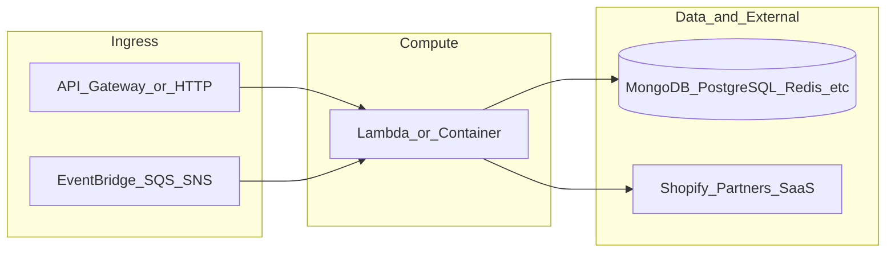

# yofi-lambda-feature-analytics

**Path:** `D:/botnot/yofi-lambda-feature-analytics`  
**Category:** ml-bot-detection  
**Primary language:** Python  
**Status:** present on disk

## 1. Purpose (2-3 lines)

# yofi-lambda-feature-analytics

## 2. Tech stack (from manifests and file-type mix)

- **Detected primary language:** Python
- **Top-level layout:** see listing below.

### `README.md`

```
# yofi-lambda-feature-analytics


## Setup up pytest

Please install below packages to enable pytest


```
pip install pytest setuptools python-dotenv pytest-env pytest-cov
```
```

### `readme.md`

```
# yofi-lambda-feature-analytics


## Setup up pytest

Please install below packages to enable pytest


```
pip install pytest setuptools python-dotenv pytest-env pytest-cov
```
```

### `Readme.md`

```
# yofi-lambda-feature-analytics


## Setup up pytest

Please install below packages to enable pytest


```
pip install pytest setuptools python-dotenv pytest-env pytest-cov
```
```

### `package.json`

```
{
  "engines": {
    "node": ">=18.0.0",
    "npm": "9.5.0"
  },
  "name": "botnot-lambda-feature-analytics",
  "version": "0.1.0",
  "private": true,
  "scripts": {
    "test": "sst test",
    "start": "sst start",
    "build": "sst build",
    "deploy": "sst deploy",
    "remove": "sst remove"
  },
  "eslintConfig": {
    "extends": [
      "serverless-stack"
    ]
  },
  "devDependencies": {
    "@aws-cdk/aws-lambda-python-alpha": "2.132.1-alpha.0",
    "@tsconfig/node16": "1.0.3",
    "async": ">=2.6.4",
    "aws-cdk-lib": "2.132.1",
    "constructs": "10.3.0",
    "jszip": ">=3.8.0",
    "sst": "2.48.5",
    "ts-node": "^10.9.1",
    "typescript": "^4.8.4"
  }
}
```

### `sst.config.ts`

```
import type {SSTConfig} from "sst"

// @ts-ignore
import {FeatureAnalyticsLambdaStack} from "./stacks/MainStack.ts"

export default {
    config(input) {
        return {
            name: "feature-analytics-lambda",
            region: "us-east-1",
            profile: input.stage === "prod" ? "prod" : "dev",
        }
    },
    stacks(app) {
        app.setDefaultFunctionProps({
            // handler: 'src/lambda.handler',
            runtime: 'python3.12',
            tracing: "disabled",
            timeout: 30
        })

        app.stack(FeatureAnalyticsLambdaStack, {id: "sst-stack"})
    },
} satisfies SSTConfig
```

### `Makefile`

```
all:	stack-deploy
all-prod: stack-deploy-prod

install-deps:
	npm install

stack-build: install-deps
	npm run build -- --stage dev --region us-east-1

stack-test: stack-build
	echo npm run test

stack-deploy: stack-test
	npm run deploy -- --stage dev --region us-east-1

stack-build-prod: install-deps
	npm run build -- --stage prod --region us-east-1 --profile prod

stack-test-prod: stack-build-prod
	echo npm run test

stack-deploy-prod: stack-test-prod
	npm run deploy -- --stage prod --region us-east-1 --profile prod

clean:
	rm -rf .build build
	rm -rf .pytest_cache cdk.out
	rm -rf .sst node_modules
	rm -rf src/__pycache__
	rm -rf test/__pycache__
```


## 3. Architecture



- **Inbound:** HTTP (API Gateway / ALB), scheduled triggers, queues (SQS/SNS), EventBridge rules, or batch — infer from `stacks/`, `template.yaml`, `sst.config.ts`, or `src/` handlers.
- **Outbound:** databases and external HTTP APIs per layers and `package.json` / Python imports in handlers.
- **IaC pattern:** SST/CDK, SAM/CloudFormation, Pulumi, Helm, Terraform, or raw scripts — see manifests section.

## 4. Key files (auto-discovered)

- **Top-level entries:**

```
.bandit
.github
.gitignore
.idea
.pre-commit-config.yaml
.vscode
Makefile
README.md
layer
package.json
pytest.ini
seed.yml
src
sst.config.ts
stacks
tests
```

## 5. My contribution / role (evidence from git history — if available)

```text
1eb38a7 2025-09-12 Merge pull request #57 from BotNotOrg/dev
8e03c00 2025-09-11 feat: optimize spanner persist (#56)
78a4249 2025-09-11 Feat/optimize persist spanner (#55)
00094c5 2025-09-04 Feat/fix return analytics (#54)
d61365e 2025-09-02 Feat/return analytics (#53)
95fabc2 2025-08-26 get refund_line_items as primary data (#52)
319cf05 2025-08-26 New return rate calculations (#51)
7849639 2025-08-21 [YOFI-812] add new return analytics feature (#49)
```

_Use commit messages only as hints; corroborate in interviews._

## 6. Notable patterns / snippets


**`src/main.py`**

```python
from typing import List
from features import *
from analytics import *
from helper import logger, get_shop_entity_from_mongo
import os
from datetime import datetime
from spanner_util import (SPANNER, get_products_from_spanner_once,
                          insert_fuzzy_patterns, persist_customer_info,
                          persist_ecommerce_customer_analytics)
from yofi_common_libs.order_event import retrieve_payload, push_to_downstream

from yofi_common_libs.processor import ProcessorFactory 
from yofi_common_libs.universal_event_message import UniversalEventMessage
from processors.return_processor import ReturnAnalyticsProcessor

ProcessorFactory.register_processor(ReturnAnalyticsProcessor)

secretsManager = boto3.client('secretsmanager')
sns = boto3.client('sns')


def convert_object_to_json(data):
    if isinstance(data, dict):
        for key, value in data.items():
            if isinstance(value, datetime):
                data[key] = value.isoformat()
            elif key in ["latitude", "longitude"]:
                data[key] = str(value) if value else ""
            elif isinstance(value, float):
                data[key] = int(value * 1000) * 1.0 / 1000
            elif isinstance(value, (dict, list)):
                data[key] = convert_object_to_json(value)
    elif isinstance(data, list):
        for index, item in enumerate(data):
            data[index] = convert_object_to_json(item)
    return data


def process_universal_event_message(msg: UniversalEventMessage):
    processor = ProcessorFactory.get_processor(msg)
    if processor:
        processor.process(msg)
    else:
        logger.warning(f"No processor found for universal event message: {msg}")


def handler(event, context):
    logger.debug(f"Processing Event -> {json.dumps(event)}")

    try:
        for item in event["Records"]:
            order_event = json.loads(item["body"])
            
            universal_event_message = UniversalEventMessage.from_dict(order_event)
            if universal_event_message:
                process_universal_event_message(universal_event_message)
                conti

…(truncated)…
```


## 7. Metrics / SLO / scale (if available)

_Extract from Airflow DAG params, load tests, README, or CloudFormation `ReservedConcurrentExecutions` when present — not auto-inferred to avoid fabrication._

## 8. Resume bullets (ready-to-paste, English)

- Owned or extended **`yofi-lambda-feature-analytics`** capabilities aligned with **ml bot detection** delivery.
- Applied **Python** stack patterns and repository-local IaC/config where present.
- Collaborated on production-grade defaults: structured logging, retries, and least-privilege IAM patterns where applicable.
- Integrated with **Yofi** platform services (data stores, queues, gateways) per dependency manifests in-repo.
- Documented operational expectations (deploy, test, local dev) via README and automation files when available.

## 9. Interview talking points

- What is the main entrypoint and trigger for `yofi-lambda-feature-analytics`?
- How are secrets and non-prod environments separated?
- What failure modes are handled (retries, DLQ, idempotency)?
- How would you observe this service in production (metrics, logs, traces)?
