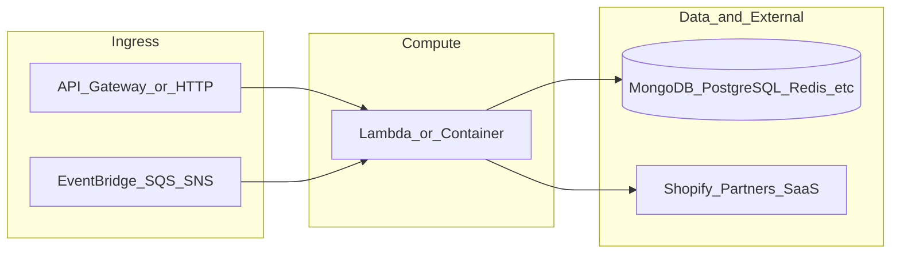

# yofi-lambda-interaction-service

**Path:** `D:/botnot/yofi-lambda-interaction-service`  
**Category:** ml-bot-detection  
**Primary language:** Python  
**Status:** present on disk

## 1. Purpose (2-3 lines)

# Shopify Interaction Service

Works with SNS to push to pipeline and do export risks/trusts to Shopify

## 2. Tech stack (from manifests and file-type mix)

- **Detected primary language:** Python
- **Top-level layout:** see listing below.

### `README.md`

```
# Shopify Interaction Service

Works with SNS to push to pipeline and do export risks/trusts to Shopify
```

### `readme.md`

```
# Shopify Interaction Service

Works with SNS to push to pipeline and do export risks/trusts to Shopify
```

### `Readme.md`

```
# Shopify Interaction Service

Works with SNS to push to pipeline and do export risks/trusts to Shopify
```

### `package.json`

```
{
  "name": "yofi-lambda-interaction-service",
  "version": "1.0.2",
  "private": true,
  "scripts": {
    "test": "sst test",
    "start": "sst start",
    "build": "sst build",
    "deploy": "sst deploy",
    "remove": "sst remove",
    "diff": "sst diff"
  },
  "eslintConfig": {
    "extends": [
      "serverless-stack"
    ]
  },
  "devDependencies": {
    "@aws-cdk/aws-lambda-python-alpha": "2.39.1-alpha.0",
    "@serverless-stack/cli": "1.16.1",
    "@serverless-stack/resources": "1.16.1",
    "@tsconfig/node16": "1.0.3",
    "aws-cdk-lib": "^2.39.1",
    "typescript": "^4.8.4",
    "vitest": "^0.24.5"
  }
}
```

### `sst.json`

```
{
  "name": "yofi-lambda-interaction-service",
  "type": "@serverless-stack/resources",
  "region": "us-east-1",
  "main": "stacks/index.js"
}
```


## 3. Architecture



- **Inbound:** HTTP (API Gateway / ALB), scheduled triggers, queues (SQS/SNS), EventBridge rules, or batch — infer from `stacks/`, `template.yaml`, `sst.config.ts`, or `src/` handlers.
- **Outbound:** databases and external HTTP APIs per layers and `package.json` / Python imports in handlers.
- **IaC pattern:** SST/CDK, SAM/CloudFormation, Pulumi, Helm, Terraform, or raw scripts — see manifests section.

## 4. Key files (auto-discovered)

- **Top-level entries:**

```
.gitignore
.idea
README.md
get_pypi.sh
layer
package.json
scripts
seed.yml
src
sst.json
stacks
test
```

## 5. My contribution / role (evidence from git history — if available)

```text
4f55070 2023-09-05 Merge pull request #2 from BotNotOrg/get-shopify-version-by-ssm
0b2353f 2023-09-04 get shopify version by ssm
ed06696 2023-08-11 add yofi to message
d22406c 2023-08-11 fix risk and trusts messages temporarily
0a496bd 2023-08-02 Removed comments
df4e9c7 2023-08-02 Added comments
e111733 2023-08-02 Added 3rd-party Interaction Service lambdas
```

_Use commit messages only as hints; corroborate in interviews._

## 6. Notable patterns / snippets


**`src/main.py`**

```python
import json
import os
import boto3
import logging
from decimal import Decimal
from boto3.dynamodb.types import TypeSerializer

serializer = TypeSerializer()

logger = logging.getLogger()
logger.setLevel(logging.INFO)
logger = logging.LoggerAdapter(logger, {})

dynamodb = boto3.client('dynamodb')


def add_order_import_record(shop_url, order_id, _):
    logger.warning(f'Trying to create processing record for shop_url={shop_url} order_id={order_id}')

    data_order_to_process = {
        'shop_url': {'S': str(shop_url)},
        'order_id': {'S': str(order_id)}
    }

    logger.warning(f'Put_item to DynamoDb {data_order_to_process}')
    return_items = dynamodb.put_item(
        TableName=os.environ['DYNAMODB_TABLE_IMPORT_ORDERS'],
        Item=data_order_to_process,
        ReturnValues="ALL_OLD")
    if 'Items' in return_items:
        logger.error(f'Put_item replaced data: {return_items}')


def add_order_risk_export(shop_url, order_id, payload):
    try:
        shopify_order_id = payload['shopify_order_id']
        risks = payload['risks']
        scores = payload['scores']
    except Exception as e:
        logger.error(f'Required parameter missing in message (shopify_order_id, risks, scores): {e}')
        raise

    logger.info(f'Creating item for risk export for shop_url={shop_url} order_id={order_id}')

    event_payload = {
        'shop_url': str(shop_url),
        'order_id': str(order_id),
        'shopify_order_id': shopify_order_id,
        'risks': json.dumps(risks),
        'scores': {'bot_status': Decimal(str(scores['is_bot_score'])),
                   'likelihood_of_cancellation': Decimal(str(scores['refund_probability'])),  # FIXME what feature is?
                   'likelihood_of_return': Decimal(str(scores['refund_probability']))}  # FIXME what feature is?
    }
    data_orders_to_process = {k: serializer.serialize(v) for k, v in event_payload.items()}

    dynamodb.put_item(
        TableName=os.environ['DYNAMODB_TABLE_EXPORT_RISKS'],
        Item=data_orders_to_process)

    logger.warning(f'Done risk processing item creation for shop_url={shop_url} order_id

…(truncated)…
```

**`stacks/index.js`**

```text
import MyStack from "./MyStack";
import { Fn, Duration } from 'aws-cdk-lib';

export default function main(app) {
  // Set default runtime for all functions
  app.setDefaultFunctionProps({
    srcPath: 'src',
    runtime: "python3.8",
    tracing: "pass_through",
    timeout: 90,
    environment: {
        API_VERSION: Fn.importValue('shopify-api-version')
    }
  });

  // Define sst-stack
  new MyStack(app, "sst-stack", {
        prefix: 'yofi-lambda',
        name: 'interaction-service'
  });
}
```


## 7. Metrics / SLO / scale (if available)

_Extract from Airflow DAG params, load tests, README, or CloudFormation `ReservedConcurrentExecutions` when present — not auto-inferred to avoid fabrication._

## 8. Resume bullets (ready-to-paste, English)

- Owned or extended **`yofi-lambda-interaction-service`** capabilities aligned with **ml bot detection** delivery.
- Applied **Python** stack patterns and repository-local IaC/config where present.
- Collaborated on production-grade defaults: structured logging, retries, and least-privilege IAM patterns where applicable.
- Integrated with **Yofi** platform services (data stores, queues, gateways) per dependency manifests in-repo.
- Documented operational expectations (deploy, test, local dev) via README and automation files when available.

## 9. Interview talking points

- What is the main entrypoint and trigger for `yofi-lambda-interaction-service`?
- How are secrets and non-prod environments separated?
- What failure modes are handled (retries, DLQ, idempotency)?
- How would you observe this service in production (metrics, logs, traces)?
